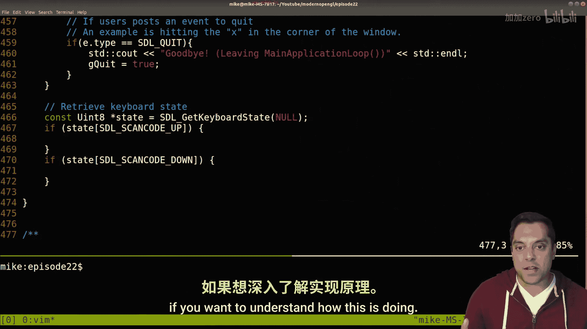
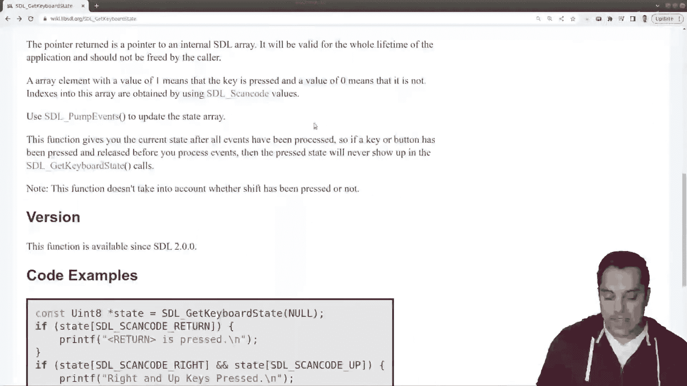
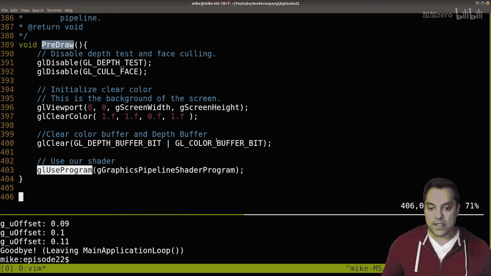
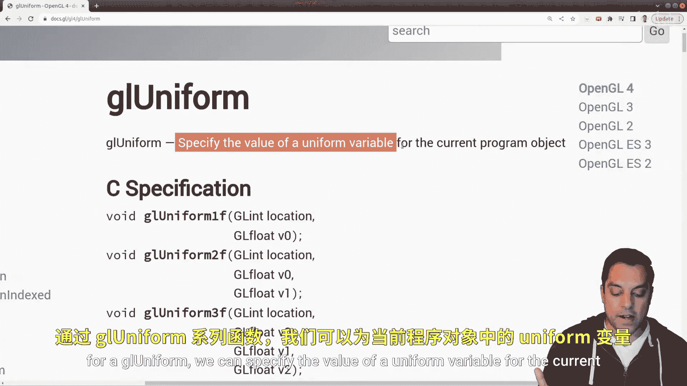
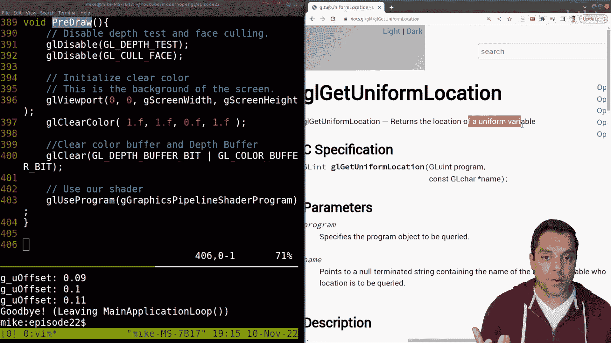
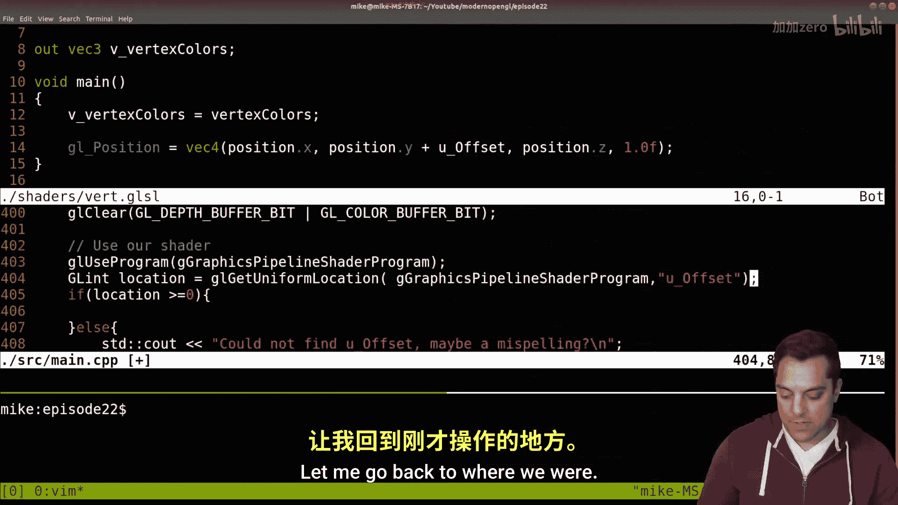
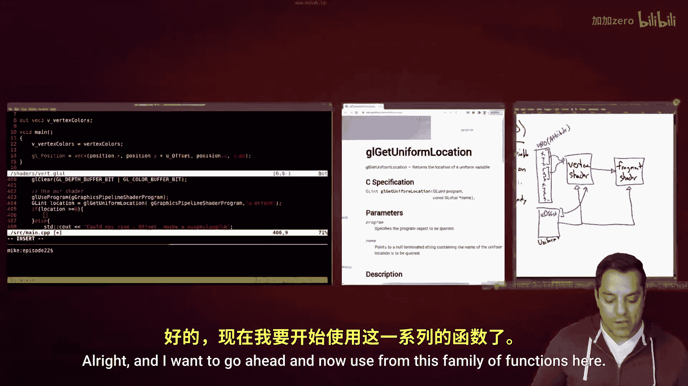
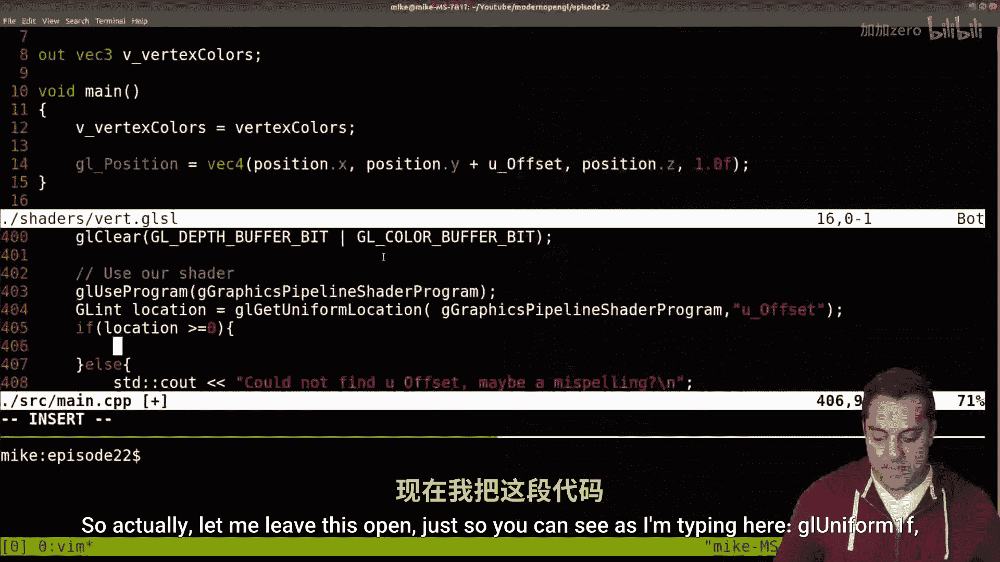
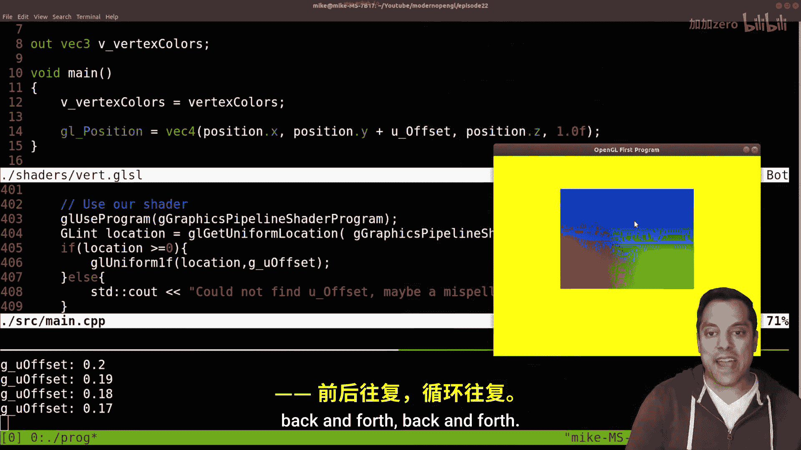
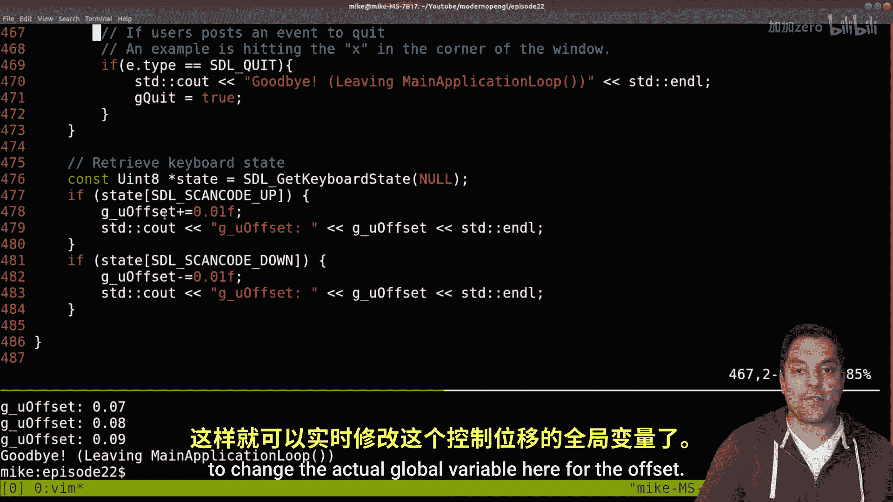

# Mike Shah【中英⚡OpenGL导论｜Introduction to OpenGL】 p22 P22 -Episode 22- OpenGL - glsl uniform variables (Second mechanism to send data -BV1pTvFz3Eqh_p22-

Hey， let's go on， folks。 This is Mike here and welcome to the next lesson in our modern open GL series。

 In this lesson， we're going be taking a look at something known as a uniform variable。

 A uniform is essentially just a global variable on a shader。

 So it's a global variable available in all of our graphics pipeline。

 We'll go ahead and revisit that。 and I'll go ahead and draw it out。

 So it makes a little bit more sense in a moment。 But what I want to go ahead and do is do a quick review of what we've done so far。

 And then we're going to talk about this idea of a uniform。

 what it is and what it allows us to do in our graphics program。 So with that said。

 let's go ahead and look at this idea one more time in review or rat。

 Now we've talked about vertex buffer objects previously。

 And that was essentially a way for us to pack a bunch of information here like X。

 Y and Z information or R G and B。 And then the next set of X， Y and Z， etc， etc。😊。

And then be able to appropriately retrieve the vertices and the colors for these individual vertices。

 Now， I'm just sort of highlighting here the first six of these values here， these first six floats。

 which we sort of divided up into two chunks， the colors and then the red， green and blue values。

 So in our vertex buffer object here that we sent in previously。

 in order to render this rectangle we had various locations where we could find this data。

 And in fact， let's just go ahead and look at the shader here。 And here's our code set up thus far。

 and let's just go ahead and look at what that was in our shader folder。😊，In the vertex shader。

 And again， this was the location。0 or the first set of data that we sent in， and then location。

Number one was our colors here。And then as we repeat this again for the next vertex in our shader。

 So again， this is for vertex 1 here， I'm highlighting vertex1。 And this is our second vertex。

 and I'm actually just going to label these as we count in computer science， vertex 0 and vertex 1。

 Okay， Now the whole point of this， again， is this is how we're able to send in information。

 And in our shaders in our graphics pipeline， we had specific locations of these values。 Now。

 what if I have information that I want to send in， that's not vertex information。

 Like maybe I just want to send in a value in here to offset the position by some value。

 And that's what we're actually going to do in this lesson。 So in order to do this。

 we need to learn about something known as a uniform variable。 So uniform。😊，Variable。

And what a uniform is is a global。Variable。On the GPU。Okay， and it's shared。

 I'll write some of the attributes here， it's shared。In our vertex shader and the fragment shader。

 And if we have other shaders like our geometry shader， et cetera， et cetera， et cetera。

 And it's a value that's cons。That means we can't change it。

In the vertex shader and the fragment shader。 Okay。

 so the idea is that we're passing when we want to update this value， we pass value。From。Our CPU。

To our GPU。 Okay， and that's the idea。 And Ive run out of room here。

 So let's go ahead and take a look at what this actually is and how we use a uniform variable。

 Allright， so what I'm gonna go ahead and do is get rid of my whiteboard for a moment。

 And let's just go ahead and look at our code here。 Now。

 if I want a uniform variable in my vertex shader or my fragment shader。

 So let's make sure that we open up our other fragment shader here so that we have both them available。

 So I just need to create a uniform somewhere。 Now again， it's gonna to be shared here。

 so we need to create it in both of our files here。

 So let's just go ahead in our vertex shader so that's down here at the bottom。

 I'm going to go ahead and just create a uniform variable。 It's gonna have a tight float。

 And I'm just gonna call it offset。😊。

Now offsets a reserve name， So we need to do something with it and so change the name。

 but stylistically for my uniform variables， I do like to put you in front of them just so I know。

 So I'm just going to call it you offset or some folks might do you underscore offset。

 Now the names actually very important。 So I want to go ahead and keep track of this but this is a uniform variable。

 now uniform variables， we don't initialize on the GPU。 sometimes you can depending on your system。

 but in general， we don't initialize them because again。

 the point of a uniform variable is we're going to pass the value from our CPU onto our GPU。

 So sort of like what we did with our vertex buffer object when we did Gl buffer data and sent information into this big buffer onto our GP。

 The difference with our uniforms is that we're gonna to be doing this constantly to update the actual values。

 Now stylistically something folks also do is they'll copy this and place it in。😊，Both shaders。

 you can do this， but you don't have to and we can go around and play with this a little bit if we want to。

 okay， but I'll go ahead and for this lesson， go ahead and copy this here。Now。

 what am I going to want to do with offset here。 Well， for the purpose of this example。

 I'm just going to work in the vertex shader。 So again。

 let's get rid of our fragment shaders so we don't have that distraction。

 And I'm just going to use it to offset the Y positions here。 So I'm just going to do plus U offset。

And I'll go ahead and compile and let's go ahead and just compile this program。 So again。

 from our previous lesson， if you didn't see how we did this。

 recall that we're also adding in our GLM mathematics library。 that's the compilation line。

 so let's go ahead and just hit enter make sure that everything's compiling。Run our program。

 and I'll go ahead and bring in our window here。 and nothing's changed here。 Okay。

 so it looks like this U offset was luckily initialized to0。 You can't count on that always。

 but that's what we've got here。 So let's actually see how would we update this offset value。 Well。

 in order to do that， what we're going to need to do is open up our C plus bus code here。Okay。

 so let's go ahead and take a look at this。 and I'm just going to go ahead and make this window a little bit bigger so we can see a little bit more。

😊，And scrolling through the code here， what I want to do for my uniform。

Is I need to create some value on my CPU code again， my C plus plus code for this uniform。 Okay。

 so let's go ahead and scroll down here a little bit。 And in fact。

 let me just go ahead and get rid of the shader here just I can see the code a little bit better。

 And this is a good recap of what we've done here So again。

 we're just following our graphics pipeline where we initialize open gel。

 we set up our vertex specification， which is just saying， hey， what's our geometry。

 while it's positions and colors。 And then we want to go ahead and set up our graphics pipeline that is compiling our vertex shader in our fragment shader。

 Now our vertex shader and fragment shader have one uniform variable so we can communicate with it。

 And then we have our main loop。 And so since I want to be updating this uniform variable。

 let's go ahead into our main loop here。😊，And we have some options here for input。

 pre draw and draw where we can start to affect things， so I'm going to go ahead into our input here。

And I've gone ahead and updated some code here for SDL。

 and I have a video of this on my SDL playlist。 so make sure you subscribe and otherwise check out that playlist if you want to understand how this is doing。

 but basically just looking at our keyboard here。 I'll even bring in the SDL help page if it's useful for you using SDL keyboard state and then you can look up any scan codes if you want and just use this table here。

 but basically I'm just checking for the up key and the down key so with that I want to go ahead and just update some variable here。

 Now let's go ahead and go to the top of our code。😊。

And let's go ahead and do this and let's create a uniform variable here。😊。

And that's going to represent our offset here Okay， and again， you know。

 folks might criticize me for globals， but we're just learning here。

 we can organize this in some other manner。 and at some point in this series we will have abstraction but I want to go ahead and do is just create a float。

 I'm going to call it you offset and I'm going to go ahead and initialize this to zero。😊。

And this is a global variable， so I'll do G underscore for it。 Okay。

 so it's sort of matching what we did previously。 Okay。

 so let's go ahead back to our code here and let's just go ahead and say G you offset plus equal 0。

01 here。😊，And if I hit the down key， let's just go ahead and say minus equal 0。01 here， Okay。

 so I'm just changing this value here。😊，And actually， every time that we update。

 let's go ahead and just print off G underscore U offset。

Just so that we can go ahead and see what happens here。

And sort of keep track of what our variable is doing。And we'll go ahead and output'll put there。Okay。

 so let's just go ahead and test this much out here， so I'll compile here。

 whoops looks like I added an extra I here。 let get rid of that here。

 So always good to work on making one small update at a time and then updating our program。😊。

And here's our program here， and I'm hitting the up key and the down key。

And it looks like it's updating， although I get rid of the minus here。 So it's more like a reset。

 Let's do that there。 Alright， there we are。 So a few wrong key presses。And now we should be able to。

 if I bring in my window here on my other screen。Just hit up and down and we can see the values updating perfect。

 Okay， so now we've got something actually interactive in our graphics application。

 but how do I send that value here so that it updates what's on the CPU code because again。

 that's the goal of our uniform。 Okay so in order to do this。

 when I'm gonna to go ahead and do here is let's go ahead and see what we're doing in predraw here。

 So in our predraw routine。 This is where we're setting up what's gonna happen and which shader to use here。

 Okay， so this again， is selecting my graphics pipeline here saying， hey。

 use this vertex shader and fragment shader that's been compiled together to form this graphics pipeline。

 Okay so we've got that much here。 now I actually want to again。

 use some uniform variable or access something in that pipeline。

 Okay so let me go ahead and bring you to doc do Gl。 one of our other helpful pages here。

 And I'm just going search Gl uniform here， because this is what we're gonna be working with。

 And there's different types。😊。

Different ways we can work with GL uniform， but let's go ahead and look at the version four。

And basically， what these sets or this family of functions does is it says， hey， for a GL uniform。

 we can specify the value of a uniform variable for the current program object。 Okay。

 what's our current program object， That's this here， G graphics pipeline shader program。

 That's the program object we're using， That's our graphics pipeline。

And so what I'm going to go ahead and do here， then to set this value。😊。

Is set a particular location and a floating point value。 Okay， why a floating point value。 Well。

 that's what U offset was。 But we're not quite done here because we don't know where this location is coming from。

 So we need another function here。 that's going to be useful for us。

 and it's going to be a GL git uniform。Location， okay， and I'll go ahead to the web page here。

 So we can see it says returns the location of a uniform variable。 Okay。

 so we have to know where in memory we're actually modifying some uniform variable。

 I know this is a little bit weird， but it sort of makes sense if we try to draw this out。

 So let me give you a picture and then we'll use these functions here。

So basically what I have here。And I'm going to go ahead and give us more room here is in my graphics pipeline。

 I have my vertex。 and let me go ahead and draw this out here， my vertex。😊，Shader。

I have my fragment shader。Fragment shader。And let's go ahead and put boxes here。And essentially。

 you know， for the purpose of our pipeline， right， we have this arrow that I'm going to draw here and let's actually open up our vertex shader here。

 and then we'll revisit our code。 So shaders， I'll open up the fragment shader first and then let's split this window。

Okay， so we got the。The vertex shader on the top here。Okay。

 I've got my things that are coming into the shader， right， That's my vertex buffer object。

 which I'll just draw here。 VB O。 Okay， that's got X， Y， Z， RGB， X， Y， Z， R GB， etctera， etc。 Okay。

 and that's the stuff that's being passed into our vertex shader here。 Okay， and again。

 notice there's location0 here。 So that's where the first set of data is coming in for our vertex。

 We've got location1， which is R G and B。 that's the next thing coming in。

 And then we might have another location for this offset here。

 But we're actually just gonna query that because I might have multiple of these offsets。

 And then I'll show you that we can sort of explicitly look this up。😊。

And I hope this makes a little bit of sense to you that in our GPU program。

 our vertex shader here we're just allocating some memory here now we're grabbing it from the GPU or whether you know specifically saying。

 hey， take this in please from our you know vertex buffer layout and then hey。

 take this you know uniform variable or create this reserve this space here and then we're going to send some information from our CPU here okay。

So that's our vertex buffer object or sort of our attributes。

 Okay that we that we're sending in that are the attributes of a vertex。

 things like position and color。 Okay， but then we've also got our uniforms Okay。

 so I'm just going to go ahead and draw another box here and I'll label it uniforms。

And that's this thing here， you offset。That I've labeled here or you underscore offset。

 let me be specific。 and again， that's shared in our vertex shader。And our fragment shader， Okay。

 vertex shader and fragment shader has access to this offset here。 Okay。

 so that's really important to keep in mind that it's sort of this global variable。

 I can't change it。 It's a constant value， but I'm passing in from my CPU a value here that this takes on Okay。

 and then I'll be able to use that here and here in our vertex shader and our fragment shader。Okay。

 so now that we sort of have an understanding of that， then we need to understand。

 you know what location is this at Okay so that I know where or what am I accessing in memory here so that when I change it that's that values being changed in memory and on our GPU right this is all GPU memory here our vertex buffer object just a chunk of data that we copied over there and our uniforms okay so that's the idea here Okay so I hope that gives some intuition。

 let's actually do it in the program and then I think that'll also help you just understand what's going on here。

😊，Now， super important here。 So let me go ahead and open up our source here that we make sure we name things 100% correct。

 Okay， because we're going to be using this function here。 GL get uniform location。

 and it's going to return us a number。 In fact， I'm going to print it out for you so we can go ahead and see what it is。

 So let's just go ahead and copy this here。 I'm going to go down to our predraw routine。

Okay，And right after I use our shader， let's just go ahead and use this function here。And again。

 here's where I'm going to say exactly the spelling you underscore offset。 And again。

 all this functions is doing is it's looking inside of our shader code and saying hm。

 where's that symbol Here it is and then we'll figure out where the location is Maybe it's well it looks like0 and1 are taken up here。

 but here it is Okay and let's go ahead and specify which graphics program object are we doing。 Well。

 that's our graphics pipeline that we just set up here oops Gs pipeline shader program。😊。

And then this is a location here。 So it is just a GL in here。

 I'm just going to call it location and set to equal here。

 And let's just go ahead and print out the location of U offset。 Okay。

 so it's just going to be some integer， this is just some sort of handle into memory saying， hey。

 at this location somewhere on our you know graphics chip in memory in this table。

 we have this location。 and that's a cheaper thing to do just have an integer lookup versus actually doing a string lookup。

 if you're wondering why we do this。 So you underscore offset。😊。

And let's just go ahead and do a print line。And since we're modifying our CPU code。

 I need to compile this。Oops， and this is going to be a location。 sorry， what I'm printing out here。

 That's the location in our memory。And let's go ahead and run this。

 And you could go ahead and see that this location here is0。 Okay， it's the first one here。 So it's。

 it's different than our。Vertex buffer object which has location zero you might notice this and say。

 hey this is confusing here but again this is what's being taken in that's how we know it's from my vertex buffer because we're reading this in here Okay so let me go ahead and just show you a few things here so you know let's go ahead and see。

😊，You know， the first thing that I like to do here is just maybe even a little bit of air checking。

 say if location is greater than or equal to 0， then we'll go ahead and just print this off and say we found it。

 And this is how you can do a little bit of air checking。 Otherwise， you'll say， you know。

Could not find you underscore offset。Maybe a misspelling， okay， something like that。Okay。

 so let me just demonstrate a common error that folks will have。 So I'll compile it again。

 works fine。 Here's our program。 And again， let's let's try to query this time for something。 you。

 even if I just misspeelt like by a little bit。 So maybe capital U here。

 So compiles fine and I run it。 and now you're gonna to see， hey。

 can't find that actual thing right It's not in our shader。

 it's you underscore capital O lowercase offset。 okays super important for folks to understand that。

 Okay， so let me undo that change here， So we actually find our variable。

 And now we actually want to set it to some sort of value here。 Okay， so how do I set the value。

 Well， if I found it， okay， so I'll get rid of this here。😊。

But I'll leave in our error checking just in case here。 Now what do I want to do here？Well， again。

 what I'm trying to do in this program here， Let me go ahead and show you up here is just change the y position here。

 Okay， so what were we doing in our。Draw code here or or sorry our input。

 So let me search for input right， we were updating the G underscore you offset。 Okay。

 so we want to put this value into this in our shader program。 Okay。

 so let's go ahead and just copy this here。Let me go back to where we were。

Alright， and I want to go ahead and now use from this family of functions here。 Let me go to GL。

 not get uniform， but just GL uniform。

GL uniform here。 and we're just working with one floating point value here。 Okay。

 if we are working with two floats like a V 2， we could use this， three floats， etc cetera。

 etc cetera。 And there's lots of different iterations of these types of things that you have here。

If I'm working with a three float like a V3， I might use this， or if I'm working with an array。

 you have a count parameter so you can specify if you have an array of things。

 how many are you actually working with so there's different ways you can play around with a uniform and find examples but for now just one floating point value here that I need to set here。

So actually， let me leave this open just so you can see， as I'm typing in here， G L uniform 1 F。

 the location that we found that variable and then the value that we want to put in here。

 which is going to be G。😊。

You offset。And a semi colon to terminate this Okay so now let's go ahead and compile this Okay and I have to recompile again because I'm changing my C plus plus code here。

 shader code hasn't changed。 but let's go ahead and run our program and I've got it here。

 and now I'm just gonna go ahead and hit up and just like that hit down we can see our actual rectangle here。

 our quadrilateral is moving。 should be a square and we'll talk about that when we talk about perspective later。

 but that's kind of cool。 So again， up and down up and down， you can have all sorts of fun with this。

 And you know， hopefully this is evidence again， that we are， in fact。

 setting a new offset here back and forth back and forth。 Al right， so with that said。

 that's what I want to achieve for this lesson。😊。

I'll go ahead and leave up our diagrams here again just so you understand clearly。

 you know we've talked about vertex buffer objects in this series。

 make sure you go check out those previous lessons if you're not comfortable with how we got this colored rectangle here and then go ahead and make sure you understand this idea of a uniform being a global variable again。

 So you know if you want to have a little bit of fun with this and we should have a little bit of fun here on this series let me go ahead and just do a v split again here。

😊，And let's open up our fragment shader。 Let's use that same offset for the actual color too。

 Maybe let's subtract from the red， whatever the G， Let's see or sorry， you underscore offset is。

Okay， and since I just recompiled the shader， I don't need to recompile my program here。

 so let's go ahead and push this up here and up and down and you can see that this is's actually changing here as I move up that corner is getting darker so it can start to have some fun here let I make it negative again and that's just to prove to again that you know this variable is shared amongst both shader。

 So even if I got rid of G offset。 So let's again， let's just go ahead and do that here。😊。

Let's get rid of it here。In our shader。 so don't need to recompile。 Now， oops， actually。

 it looks like since we're using it here， we do need to copy it here。

 So so it is shared in terms of memory， but I do need to state here So the compiler doesn't complain that it is there。

 So even though I'm I'm duplicating these。 It's the same location and all that sort of stuff here。

 Okay， so hopefully we get the idea there。 I guess and get things taken care of there。 Alright。

 allright， so go ahead and end the lesson there。😊，Again， what we did in this code here。

 we added a uniform to our fragment shader， we added that uniform into our vertex shader so that we could access it。

And then we queried for that location in our specific graphics program using Git uniform location。

 and then we picked a GL uniform function that allowed us to modify one floating value which is exactly what we have on the shader。

 again the same type here and then we added just a little bit of interaction here in our input here to change the actual global variable here for the offset All right folks so that was a bit of a monster lesson。

 but I hope itll help you understand all the pieces that are needed to add in things in a uniform and there's lots of different tricks that you can do too as well to improve your code。

 for instance， I'm querying for the location of the uniform every frame。

 you could actually cache that you really only need to look it up once and then as you're changing things and you're good to go here and then you can also add different sort of querying mechanisms for example to list out all the uniforms in your shader which is a nice way to detect for instance。

 if you misspelled something for instance， in our airhand load code to just print everything out I think。

😊。

That's a nice idea that you could do but you know maybe those will be things in future lessons if you want to see those types of videos。

 please comment below give this a like if you enjoyed this video if it's the one that finally helped you understand uniforms you know your support is appreciated a big shout out to those of you who've joined as members and have been following this series thank you for your support thank you for subscribing and with that said thank you for your time and attention I'll look forward to seeing you in the next lesson。

