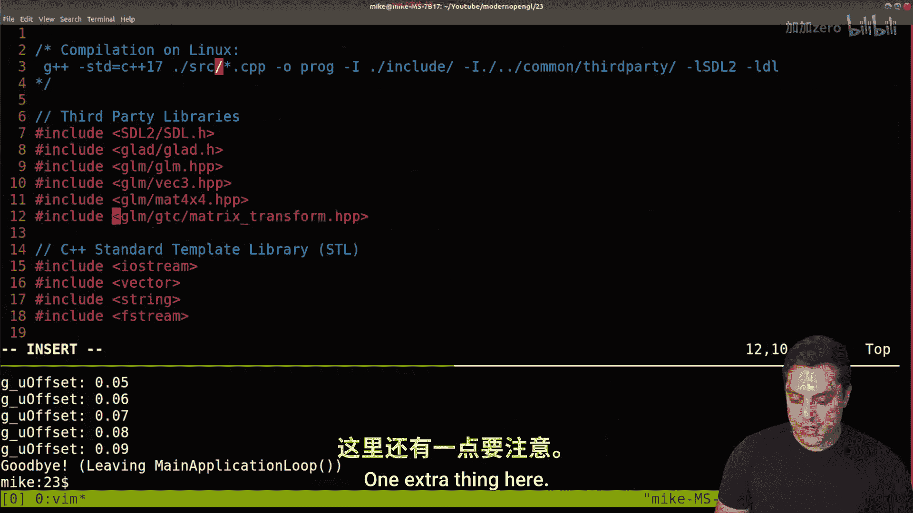
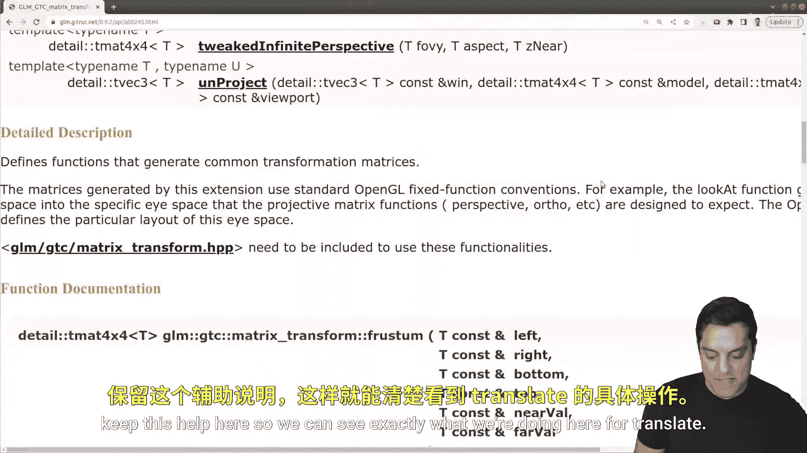
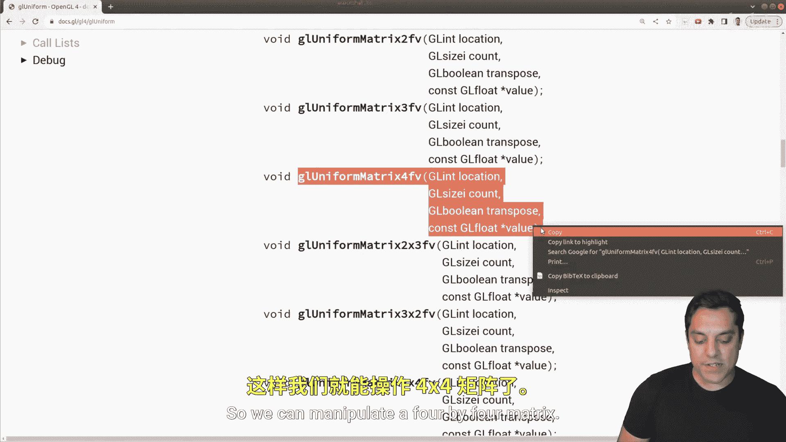

# Mike Shah【中英⚡OpenGL导论｜Introduction to OpenGL】 p23 P23 -Episode 23- From Local to World Space (Model Matrix Transformation) -BV1pTvFz3Eqh_p23-

Hey， what's going on， folks。 It's Mike here。 and welcome to the next lesson in our modern open GL series In this lesson。

 we're gonna to be looking at something known as a world transformation。

 So we're going use something known as a model transform matrix that takes our shapes and transforms them so that we can translate。

 rotate， scale， shear， etc， move around objects。 So let's go ahead and take a look at exactly what this is。

 So just to give you a little bit of reminder where we left off last time here I'm going go ahead and open up our main source file here。

 So if you're following along here， we have our graphics pipeline where we initialize our program。

 Spec the vertices， create the pipeline with our vertex and fragment shader and then run our main loop。

 which is responsible for any sort of input that we're handling any predrawing routines which we learned about uniforms last time and we're going use again this time and then any cleanup that we have to do So where I want to go ahead and bring us first in this lesson is the vertex specification So I'm going go ahead and start here。

 again， this is where we're setting up our geometry or vertex data。 Now again， just to go ahead and。

😊，Compile this program and you can see the Linux compilation line here or check out the other videos in the playlist if you want to see how to do this on Linux and Mac。

 let's just go ahead and compile this and see where we left off here。

So compiling this program and running it， it gave us this rectangleist shape here。

 We'll have to talk about this a little bit more why it's a rectangle when we actually look at this data in our next lesson。

 But for now， if you hit up or down， you'll see that we're offsetting the Y position of these vertices here in our actual shader。

 That's what we left off with last time here。 So I'll leave this on top here and we'll go ahead and open up our vertex shader here。

😊，And we can again see that all we're doing is saying， hey。

 set our position to these vertices that we're reading in from our vertex specification on our window on the right hand side here。

 from our vertex data， So the actual left vertex， I'm just offsetting its y position here with the uniform value that I'm passing in。

 Okay， so if that was too much for you， make sure that you back up a lesson here。

 But what I'm going to go ahead and say here is I want to give a name to this vertex data here。😊。

And this way of sort of just saying， hey， let's update every single vertex by just pushing it up one unit or whatever the offset is。

 it's not very efficient because we don't necessarily want to move our whole scene in this way。

 What if we have different objects， for instance， So let me go ahead and introduce some terminology for what we're exactly going do here。

 So let me go ahead and close this program down here。😊。

And what I'm going to do is actually not use this offsetet here。

 so I'm going to go ahead and remove it here from our program。

 and that means I'm actually going to remove our uniform here from our vertex shader and we also had it in our fragment shader so I'll go ahead and remove that as well so we don't have any uniform variables at this point here。

 Okay so let's just go ahead and close that down for now。

 And let's just look at this vertex data here。😊，Now， if I go ahead here in my drawing board。

 if I think about our coordinate system in our world in OpenGL， it's something like this。

 It ranges from negative1 to one in the X direction and1 to one in the Y direction here。

 so I'll label my axes here。And the basic idea is we can kind of see where we've plotted these vertices at about negative five in each direction here。

Okay， and that gives us our square。 and we use these as a triangle using an index buffer。

 as we've talked about in this series。 Now， this is what we call our local coordinate space。 Okay。

 local coordinates。And what we want to be able to do is translate these or move these in our greater world。

 So that involves multiplying in some other matrix here。😊，Each of our local coordinates。

 I'll just put a multiplication sign in here by some four by four matrix that we've learned about previously here。

 and that puts us into what is known as world space here。

 So generally speaking what I'm going to do to just represent this is just draw our world space here and then we'll still have our rectangle here and I'll go ahead and just draw it and it still has its sort of you know local coordinate space here relative。

 but it's just translated up in our world here and these different spaces here。

 allow us to kind of navigate the graphics pipeline。

 we're going to talk about another sort of viewing space and perspective in another lesson after this one but for now I just want to talk about how per object we could have a special matrix here。

 which we call the model matrix。😊，And we could manipulate an object， okay， by moving it。

So let's go ahead and see how we can do this using a little bit of what we've learned before with the uniforms and passing in a model matrix per object to manipulate our actual geometry。

 Okay， so what I'm going to go ahead and do is search for our uniform here。

 Let's go ahead and find it。 I think it's around line 400 or so。😊，And this is in our predrwl routine。

 so this is where we're handling our uniforms。And instead of using an offset this time。

 what I want to actually do is create a transformation matrix。

 So what we're going to go ahead and do here， I'm going to actually get rid of all of our offset anywhere where we used it。

 I think we had a global variable G U offset something like that。 Let's go ahead and get rid of that。

😊，Let's go back to our。About line 400。 let's go ahead and call this model matrix。 Okay。

 so that's what's going to be in our shader。 And what we're going to pass into it is some sort of transformation here。

 Okay， so let's go ahead and let's go ahead and just create a transformation matrix。

 Now what we're going to need here is GLM and translate。

 So what I'm going to go ahead and do is just in another Google window search GLM translate。

And we're going to need to to bring in translate。 we're going to need to bring in this header file here for matrix transformations。

 So go ahead and copy this。 Let me make this a little bit bigger just so you can see what I'm copying There it is。

And then we'll be able to create a transformation matrix for our object here。

 so let's just go ahead and call this translate。And again， let's jump to the top of our code here。

Let's go ahead and include。GLM matrix transformations， oops， one extra thing here， jump back here。

And let's go ahead and keep this help here so we can see exactly what we're doing here for Translate。

And the basic idea here is that we're taking in the actual object。

 or rather a matrix that we want to translate here。

 So it's going build a 4 by4 translation matrix representing how we want to move something。 Okay。

 so translate， it's going equal GLM translate。 We're going build this off of a。

Mat4 here。Just the identity matrix and then how we want to move something。

 Let's just go ahead and do。The the actual vector that we want to pass in here。 let's just do 0。0 f1。

0 f in the y direction， and that's going to be our translation matrix。 Okay。

 so that's going to be our translate。 And now what are we going to use in our shaders here。 Well。

 we want to be able to pass in this  four by four matrix now。

 So what are we going to have to do here is modify just a little bit our code here。

 so the actual retrieval。 So retrieve our location of our model matrix。😊。

AndLet's just call this again， u underscore model matrix location just to give it a little bit better of a name here。

 and then we'll see if we actually find this u underscore model matrix location here。

And this is actually a matrix。 So we're not going to use one floating point value。

 If you recall from one of our previous lessons， when we search for Gl uniform here。

 and we'll go to open Gl 4 here。 There's actually lots of different uniform variables that we have here。

 So here's the single floating point value here。 But if we scroll down here。

 we'll actually see that there is one specifically four4 by4 matrixess。 Okay。

 so'll go ahead and copy this in here。 So we can manipulate a 4 by4 matrix。

 So let's go ahead and copy that。😊。

And let's paste that in here and we can see the different parameters here。

The first parameter that we need is the location， so that's going to be our U underscore model matrix location。

 the count， how many are we working with， One， are we transposing， We are not。

 We are not manipulating that matrix here。Oops， so I'll come back in the screen here and then the actual value here Now there's a couple ways we can do this。

 we can do GLM a value pointer， I'm just going to show you the sort of raw way to do it。😊。

But what we want is the address of this translation matrix。

 which I'm just calling translate and from the zeroth location here。 Okay。

 so those are the parameters that we're actually using here。 Okay， for our matrix。 Now。

 let's actually make use of this in our shader here。 So what I'm going to go ahead and do here。

 let's just go ahead and compile。 make sure I haven't made any compilation errors。

Oh looks like I am using that offset value Let me actually keep that in here because what I'll actually do let's put that back here and let's use that as our y value for translating Okay just so you can see that we're going to get the same effect as before so I need to put that global variable in here wherever we had it here。

😊，Yeah， let's just go ahead and put it back here， float G U offset， and it was equal to zero here。

All right， there we are。Okay， so we've got it all set up here now let's go ahead and try to compile again in our program Let's see looks like we made a few other mistakes here。

 let's just go ahead and scroll up here says translatelate is not a mat oh just looks like a spelling mistake。

 my favorite GLM translatelate and maybe some of you folks caught that。

 So just going one air at a time here let's see looks like a couple more。😊。

And I'll just scroll up through this again。And it looks like， oh， this needs to be。

 we need to specify the dimensions of our matrix， and we want our4 by four matrix here by default。

 So GLM mat 4 and there we go here Now I'll actually run this here and now I'm going to get a bunch of errors because I removed the offset。

 So I need to put that back in our。Coat here， Or rather I'm using offset in our shaders。

 So anytime you see black here， we don't want to be too scared。

 Let's go ahead and look at our shader for a moment here。 So let's go ahead and open up shaders。

 Let's see where I'm using that offset。 I believe I'm using it in the fragment shader still。 Yes。

 so let's get rid of it here。um。So let's go ahead and get rid of it。😊。

And then if I go ahead and rerun this because I just made changes in my shader here。 Good to go here。

 Now， I've got to update my error message as well here。 So one more correction here in our main。😊。

Line 405 here， we don't have U model matrix yet。 so let's go ahead and update that。

 So we have the correct message here。In our shader here。 Okay， so just to rerun that， whoops。

 recompile。Rerun and again， you know， so our， you know， our program is still showing up。

 which is kind of cool。 and we can use up and down。

 but it doesn't really do anything yet because we need to create this model matrix in our shader here。

 So let's go ahead and go into our shaders， our vertex shader。😊，And this is a uniform mat 4。

 and we've got to spell it exactly as it is model matrix here。All right。

 and now we should be able to find it， oops， I didn't need to recompile， but now I can run here。😊。

And you're still saying Mike， well you're pretty sure I spelled this right。

 right It's matching our error message That's why as being careful。

 But it turns out GLsl is so good sometimes that it's actually。

 if we're not using this uniform in our actual shader code So you can see the whole shader here。

 It's oftentime going to still report an error because it'll optimize out and essentially a race line 6 here。

 Now depending on your stance on this kind of things， you might say wow。

 that's really kind of bogus But the reality is it's just trying to be very efficient right the open GL shader compiler has that option to get rid of this。

 So we need to use this。 Okay， so how do we actually use this model matrix。 Well。

 what I like to do here is usually create a new V4 and I'll call it new position。😊。

And what I'm going to do this time is I want to take our position that we had。

 and I want to multiply it by this model matrix that we have here。 Okay。

 so let me just go ahead and try this and see what happens here。 So again， I'll just run。

 I only made changes in our compiler here。😊，And you'll notice I quit it pretty quickly and maybe some of you are able to spot the air。

 but there actually wasn't anything showing up here。

 We actually got a compiler error before getting our error message here that's saying GL vertex shader compilation failed here because we can't multiply which is this is what's complaining about this four by four matrix that's this type time something that's a one by three vector。

 So sometimes you'll see this and sometimes you have to be careful if you're logging or printing out lots of error messages So I probably only want to do this one time and then in my error messages。

 I want to actually quit just so I don't miss this So let's actually make that amendment then we'll fix the actual program here。

😊，So what I'm actually going to do if we can't find our uniform is we're just going to exit one and we could do like exit failure。

 I think is the air code， let's go ahead and just try that so we need to recompile now and rerun it and now you know we'll get our error at the end because we don't want our program to proceed if our shader is broken at least in this particular as we're learning openGL Okay。

 so let's go ahead and fix the actual shader here our vertex shader。😊，And again。

 this is just the pure math multiplying a 4 by four times a 1 by three thing we can't do。

 So what we have to do is cast this to a V4 and GLSl is really great because what we can do is if we provide a V3 in the first parameter。

 then we could just populate the fourth dimension here。

 So this one we're just going to populate with 1。0 F。 that's the W component here。

And then let's go ahead and try this one more time。 So go ahead and compile。 I'll run and you'll see。

 hey， it quit。 no GL SL errors。 But again， this thing that I told you， just moments ago。

 we're not using our model matrix。 So it's saying， hey， we didn't find this because you know。

 the open G Shadr compiler just optimize this away。 So went away here。

 So now let's actually use new position here。 Okay， so now what I got to do is replace。😊。

New position here， new position X， new position Y and new position Z here。 Okay。

 so now we're actually using our thing here。 So let's try to run it now。

 And now I can actually see my program here okay so let's test it out now if I hit up key our rectangles moving up and down and now it's moving down。

 Okay， so now we're actually translating this object here。 Okay， so it's said to be in world space。

 So let's kind of recap things as we finish up here。

 I'll leave our program here and let's bring up our diagram。 So again。

 what I've done here is I've taken our original data here。 the local coordinates where we said， hey。

 just position this in the middle of our screen。 And then I've multiplied it by a model matrix。

 and that's said to move things into world space。 Okay， for this object as I'm translating it。

 Okay and the cool thing that you can do。 again， if you know just a little bit about math is if I take the inverse。

😊。

Of whatever this transformation is， however much I've moved it up or down that transformation matrix that gets me back into local coordinates。

 Okay， so we'll see some of those tricks， some of those tricks will be important for us。

 but that's the idea。 That's why it's just convenient for us as programmers to think in these different spaces。

 Okay so the next transformation we'll look at then is to think about our camera and we're actually projecting this shape。

 So it doesn't actually show up as a rectangle here， which again。

 if you look at the local coordinates very carefully and some of you might have you'll notice it's actually a square should be as I've plotted out here。

 It's a little bit stretched out and we'll talk about why in the next lesson。😊。

So I hope that was an interesting lesson for you folks。

 I hope you enjoyed that I hope you learned some open GL and a little bit more about uniforms this time passing in a actual4 by4 matrix as a uniform Now this is where things are starting to get very exciting in openGL I hope you're enjoying it I hope you subscribe so you don't miss the other lessons comment below if you have questions on the way I've written my code or know anything about the series and with that said thanks for your time and attention I'll look forward to seeing in the next one。

😊。