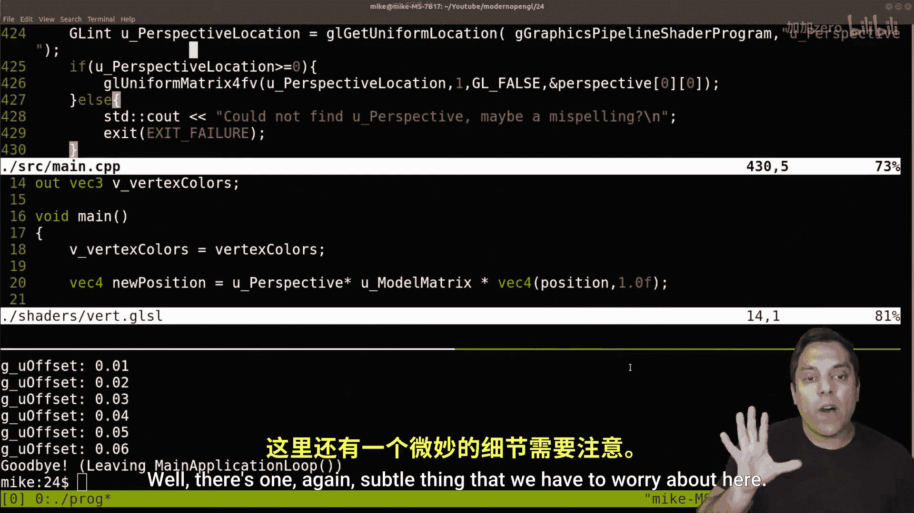
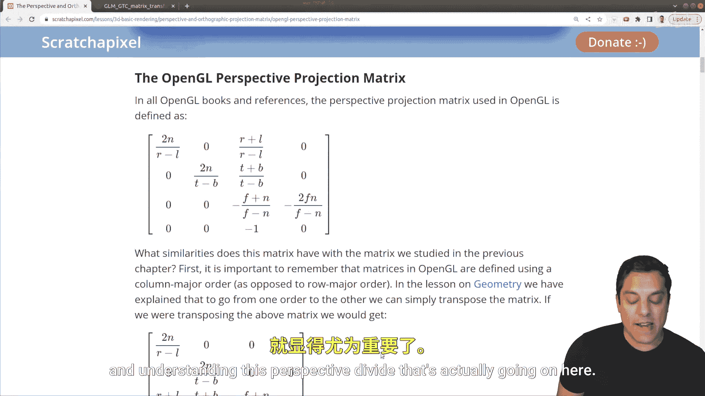

# Mike Shah【中英⚡OpenGL导论｜Introduction to OpenGL】 p24 P24 -Episode 24- Projection Matrix and glm：：perspective -BV1pTvFz3Eqh_p24-

Hey， what's going on folks It's Mike here and welcome to the next lesson in our modern openGL series In this lesson。

 we're going be talking about the projection matrix and how to actually make what's been appearing as a rectangle actually a square on our screen as it truly should be。

 Now there's many different types of projections we're going to talk about perspective in this lesson to get you started and this is most commonly what's used in various realtime applications。

 So with that said， let's go ahead and hop in and see exactly what the problem is here。😊，Now， again。

 if we take a careful look at this program that we've been running from our previous lessons。

 which make sure you check out in the description if you haven't seen here。

 it's a very rectangular rendering when if we actually look at our vertex specification where we're passing in the data。

 well， if we look carefully at our positions， we are setting up a square here， so what's going on。

And the reality is we just don't have perspective and perspective is the general idea of how we see things。

 So I'll go ahead and give a few different ideas here。

 Now there's many different types of perspective that we have。

 but in general here in Ber if I open this up here and if you pay attention to the little grid lines here。

 you'll see that they're getting smaller as they go further away。

 That's sort of a perspective projection。 Now again， there's many different types here。😊，For example。

 if I hit five here， this gives us an orthographic projection。

 and it doesn't matter how far away each of these grid lines are or the edges of this cube。

 You still see them as the same distance。 So the ratios are sort of preserved and that can be very useful for you designing something in architecture。

 for instance， so that you're preserving the ratio， right， if you're an architect。

 meaning building a building， you just want to know that the room is 10 feet by 12 feet。

 and that's how it is。 you don't really care how it looks， in a sense。

 you want the structural stability or maybe value other attributes。 But for us。

 when we're trying to render things realistically， we want perspective。 And another example of this。

 if I go ahead and close out， blender here and just open up the drawing pad。

Is that if you have something in your screen here？Like looking down a railroad track。

 you would expect that over time the rails and again， be careful if you're doing this experiment。

 you know， would converge and get smaller。 So things are sort of squish together。

 and they converge towards the center of the screen as they get further away。

 So another way to think about this is。😊，The X， Y and z positions of each of the individual points here。

 I'm dividing x by Z， the y coordinate by Z。 And well Z divided by Z。

 this is sort of the perspective divide part that， you know， essentially is one。

 But this is basically just the idea that as stuff gets further away， it gets smaller。

 right That's how we want to represent those points。 So they converge。 that basic intuition。

 And I'll go ahead and share one more thing with you here。

 is this idea of the perspective matrix and open G。

 Now we've learned a little bit about different transformation matrices， Trans， scaling and rotation。

 for instance， But now we have different types of projection matrices。 And again。

 the one that we care about today is perspective。😊。

Now the Scratch Pixel website which you know give them a big shout out to take a look at they have a nice readup here if you want to read more and derive this yourself。

 but just intuitively looking at this down the diagonal here you can see that's kind of like the special transformation matrix that we had for scaling so we're kind of scaling our X and our Y points in a certain way based off of how far away they are and you can see we're kind of doing something with the interesting Z part here。

😊，So that's just kind of the intuition behind how this is working here。 Now， again。

 the good news for us is that we're actually going to have built in a prospective matrix。

 if you want an orthographic。 So again， if you're an architect or want to preserve ratios。

 We have that built in a GLM。 but we have perspective already built for us。

 And this is part of the actual I'll scroll down here matrix transform library。

 which I've already included in our code， but just to point out where to actually find this。

 So with that said， let's go ahead and get started here。

 and I'm going to go ahead and just copy this perspective matrix here。

 and I'm going to click on it just so we can see the different fields here。

 So we can go ahead and start coding this。 All right so what this is gonna to allow us to do is two things。

 So let me go ahead and show you one of the things that it's going allow us to do。

 And in order to do this， I'm going to need to go into our code here。😊。

And I'll just show you that we don't have perspective right now。 So if I go ahead and run our code。

 So this is in the translate part。 I'm going to actually modify the Z portion of our translation。

 Okay， so this is our model matrix from last time。 we were saying， hey。

 we want to move our object up and down。 But now we want to move it back and forth。

 So along the Z coordinates。 Since we're looking just straight on here。

 So that's what I'm going to modify this time。 So I made a modification of my code。

 Let me go ahead and compile this。 let's go ahead and run it。

 And if I go ahead and run this and I hold up and down。

 You'll notice that our object is not moving at all。 because we don't have any perspective。

 It doesn't matter how far away we are or how far away we push this object away into the screen here。

 it's the perspectives not there。 So that's what we need to fix。 We need a perspective matrix。

 So what we're going to go ahead and do here。😊，Is in our shader， create the perspective matrix。

 So let's go ahead in our shader here。 Let's actually let's split this window here and in our vertex shader at the top here。

 we're gonna to add another uniform variable here， a matrix 4。 and I'll call this U perspective。

 and as we learned last time we need to actually use this matrix here。

 So I'm going actually put this here。 U perspective and multiply that by our model matrix here。

 so let's go ahead and work with that here。 So I've got our model matrix and our perspective matrix。

 Okay， and that should be it。 let's go ahead and close that off。 and then let's go ahead and set up。

😊，Our perspective here。 So this is our model transformation by translating our object into world space。

And then the next thing that we want to set up here is our projection matrix。

So let's go ahead and set that up here。 This is going to be our projection。Mattrix in perspective。

And let's go ahead and call this， you know， something reasonable here perspective。

 let me sure I spellelt right perspective， and again this is going to be GLM。Perspective。

And let's go ahead and look at those arguments here。 So the field of view here。

 That's how wide we see in our screen。 Okay， so our field of view is humans， you can kind of you。

 put your hands by your side and see how wide can you see in owl or a fish might be able to see almost behind itself and have a wider field of view。

 Or if you take a picture with your iPhone， for example， or Android phone with a wider field of view。

 you have a greater vision， you can see more stuff。 but there's a little bit of distortion。

 So you want something sort of realistic in 45 radiance is usually reasonable。

 So keep in mind that this field of view is expressed in radiance。

 So I'll just highlight that and I'll show you how to do that in code GLM radiance。😊。

Here， 45。0 F， the aspect ratio， so this is going to be the screen width。

Which we have defined here in our screen here， divided by the screen height。

 and notice that I am casting to floats here because I do want a actual decimal number here。 Okay。

 let's kind of separate these onto separate lines。 And then the last things that we need are the near and the far clipping plane。

Okay， so let's go ahead and add those in。 And what that is is basically how far we can see into the world。

 Okay， so 0。1 is reasonable。 That's how close we can see things。 Anything closer than 0。

1 units we can't see。 that's sort of like a blind spot and anything further away than 10 units we can't see as well。

 and that's， you know， we don't want to see millions of units。 You know。

 a lot of folks will just make these， you know，0。000001 to you know， million or something。

 We lose some numerical precision by doing that by you know， having this huge range。

 So we try to make this a good range， but not so far that objects will disappear。 Okay。

 and we could talk about this or feel free to comment below if this is a little bit confusing。

 So this is how close we can see things nothing closer than 。1 and nothing further than 10 units。

 Okay， so that'll set up the code for us here。😊，And then let's go ahead and set up our perspective if we want to grab the location here。

The perspective location。So we're retrieving the location of our perspective。Mattrix uniform。Okay。

 and this has to be spelled exactly as we did it， so perspective。

And we want to check to make sure that we actually retrieve our perspective location here。

And set up accordingly。Our perspective location here， and this is a 4 by four matrix。

 So let's make sure we get the perspective matrix here。

And let's make sure that we give ourselves the right error message in case I've broken something。

 so let's see if that works here。And now go ahead and recompile a few errors here。 Okay。

 that to be expected here。 Let me go ahead and scroll up here。 Let's see what we messed up here Air。

 no matching function to perspective float float。 Let's see。

 probably some missing commas or something。😊，Let's just go ahead and take a look at this here。 Oh。

 yeah， one missing。parententheses， it looks like， or rather an extra one here at the end。

 let's get rid of that。And let's see one error not too bad。

 actually compiles can't find U perspective location。 oops， Let's see if I misspelled something here。

 U perspective。Let's go ahead and open up our shader here。

And maybe you folks caught this before I did。 That's always a challenge。 You underscore perspective。

 Let's see， looks like I spelled it。 oops， I didn't give myself a good error message here。

 Let's go ahead and let's split our window here， go into main about 400。

Let's see here what we did here。If I scroll down here， here is perspective。

 we're looking for the location of perspective perspective location。

So I did add auto completele hurt me here。 there we are。

 and let's make sure that we give ourselves the correct。 Yeah， that looks good to me。

 so let's go ahead and try to recompile this。Rewrite it and now it looks like it is running here on our screen here。

 So now if I hit up here and down， let's see if that's actually adjusting anything。

 doesn't look like it's moving quite yet here。 So let's think about what we did here。

So is it actually moving or translating our object， Well。

 let's double check in our code to see if we are actually using our perspective matrix and we are because we're multiplying it through here。

 And we do have to think a little bit about the order here。

 I'm going to talk about this at the end here， just to sort of put things together here。

 So here's our position。 Here's our model matrix。 Here's our perspective。😊。

So that all looks okay to me here。All right， so let's go ahead and just run this again here and let's see here。

I'll compile it， I'll save everything and let's go ahead and look at our code here and again up down it's not changing anything。

 so what's going on here。And you're saying， well， Mike， you know。

 we're back to basically where we were with our perspective before not being applied。

 even though we went through all this trouble of adding in this perspective matrix。 Well。

 there's one again， subtle thing that we have to worry about here。

 So let me bring us back to the drawing board here。 Our diagram。😊。

And this is where it's a little bit important to actually go through the process of you know。

 going through one of these matrices and understanding this perspective divide that's actually going on here。

 so you know the actual Z component。😊。

Or sorry， I should say that the W component here and that's exactly what we have here。

If I pop into our shader here， you'll notice here I'm using 1。

0 here so it doesn't matter what our transformation is so what we really want to do here is just say we can either get rid of all this and just put new position or I could put this back here just to show explicitly what the problem was and do dot W here Okay so we have to be a little bit careful there they're openge I'm just going leave this as new position you know just to make sure that we have everything we're actually in our our code let me just leave it as is and put a comment here don't forget W here okay。

And if you are gonna forget it， you know， you know， just put GL position equals new position here。

 So now if I actually compile our code， let's actually run it here and I've translated our object back a little bit。

 Let me hold down here for a little bit。 Now we can actually move our cube out into the world and back into the world。

 Let's go ahead and change our cube。😊，I change it to negative 5 or something。 Oh， no。

 I had it just the offset。 So it's， it's actually 0 by default here。 So it's sort of in the screen。

 We could sort of say， So I would want to modify this a little bit。 Okay。

 now before I move forward here。 let me go ahead and just leave this。

 leave some of this code on here so you can。Take a peek if you want。

 I want to just go ahead and revisit our little diagram here where we're talking about in the previous video moving from local coordinates to world space。

 and after we move to world space， what we actually want to do is do something called view space。😊。

Which this is our camera。 and I'm just going to kind of leave this as an empty question mark here。

 and then we go to our projection， okay。And then we you do some other transformations。

 but this is where we actually get the perspective or sort of a railroad track diagram that we've learned about today。

 So that's that's the idea here let let me move out of the way and redraw that so you can actually see me putting in the projection here but going from view space to our projection space with the railroad tracks there that's the idea。

 So we got to talk about what this view space is in another lesson and I might do this next or I'll move it a little bit but this is basically our camera Okay in our world because again we could be able to move our camera around。

😊，And then what our projection is， what we talked about。

 You can imagine that's the lens that we put on our camera。 Okay， so we can see a wide field of view。

 get a panoramic shot or whatever。 So that's the idea in this lesson。

 So let me go ahead and just do a quick code review here， because we've added a lot of code here。

 again， just starting with our shader， we've got two uniform variables here now for our model matrix。

 which moves us into world space and we're gonna to see how we change this into a model view later on。

 again， talk about that camera where we're perceiving the world。 But now we've got our perspective。

 And actually， you know， just to make this a little bit more correct。

 I want to just call projection because we can have different types of projections。

 The one that we're using is perspective。 Okay we'll use a perspective projection。

 just so we're clear on our terminology here。 Okay， so now I got to go back into my。😊，Main here。

 let's go into our perspective。And so this's just to be clear here， we willll be modifying you。

Projection here。 Okay， and I can still call this。 let's call this。Projection， location。All right。

 just so we're clear on that。Again， I tried to be as it's good to name things correctly as we're learning them。

 Okay， but this is still a perspective projections。 So I'm gonna to leave that as is here。 Okay。

 so let me go ahead and just compile this， make sure it didn't blow anything up here。 No errors。

 We don't see anything until I start hitting the back arrow。

 which is pushing our object into the screen。 remember your coordinate system。

 if you use your right hand rule。 your your third finger middle finger。

 That's the positive Z direction。 We have a right-handed system in open GL。

 So the negative direction is gonna push stuff out to where we see it。

 So that's why you see the offset going negative again here。 anyway。

 a little bit of a code review of all of our code quickly before we wrap up here。 again。

 we'll start from main here， again following the graphics pipeline。

 we initialize our STL program specify our vertices。

 create our graphics pipeline and then in our main loop here。😊，Where we are。

 we handle any user input of pressing the up and down key in these demos， our predraw。

 where we are sending in our uniform variables in our shader， and then we issue our draw call。

 which starts our shader our graphics pipeline， our vertex shader in our fragment shader。

 and then we refresh our window here。 so that's the idea for this lesson I'll go ahead and cut it off here。

 And I hope you now understand a little bit more about perspective in the role that this plays。

 a lot of tutorials will sort of show you using GL and perspective， which is great。

 That's what I've done。 But you do want to take a look at sometime the projection matrix。

 how to derive it in particular that perspective matrix。

 as that's what most games V our reality apps and stuff are going to use。 All right folks。

 I hope you enjoy this go ahead and comment below if you have questions。

 subscribe So you don't miss any of my lessons here in this open GL series And as always。

 thank you for your time and attention。😊。

