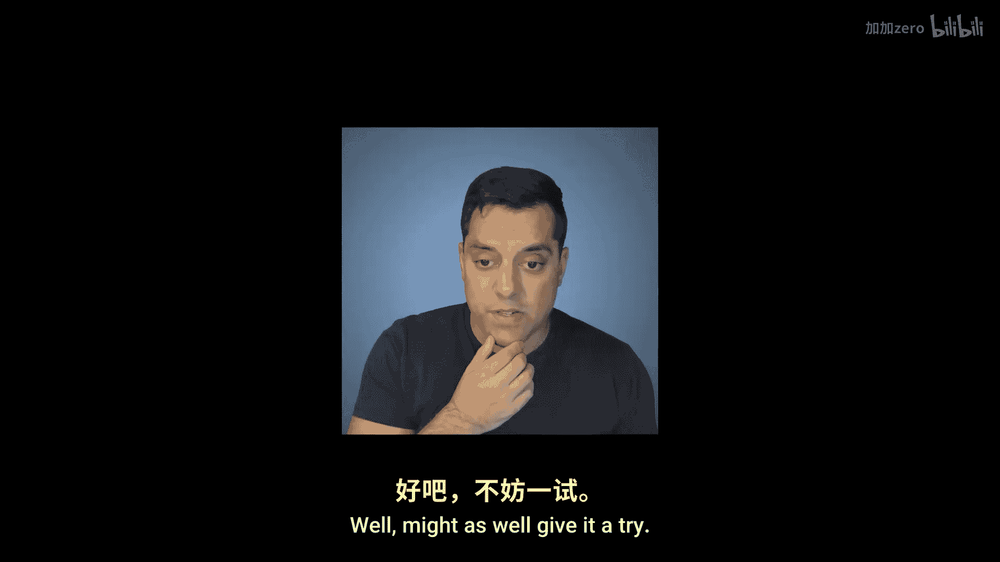
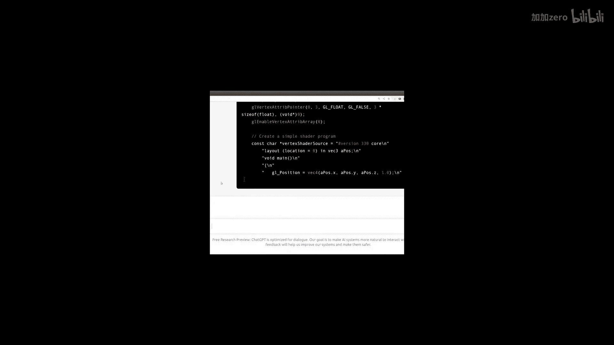

# Mike Shah【中英⚡OpenGL导论｜Introduction to OpenGL】 p25 P25 -Intermission- OpenGL and ChatGPT #shorts -BV1pTvFz3Eqh_p25-

🎼。

🎼Well。Might as well give it a try。

う。🎼Yeah。

🎼Yeah。🎼，Okay， Thrs moldul up and yell at me， I raise you this。

Well， I am impressed， but we better continue on with our series on modernern OpenGL with C++。

Looking forward to seeing you in the next lesson， folks。

