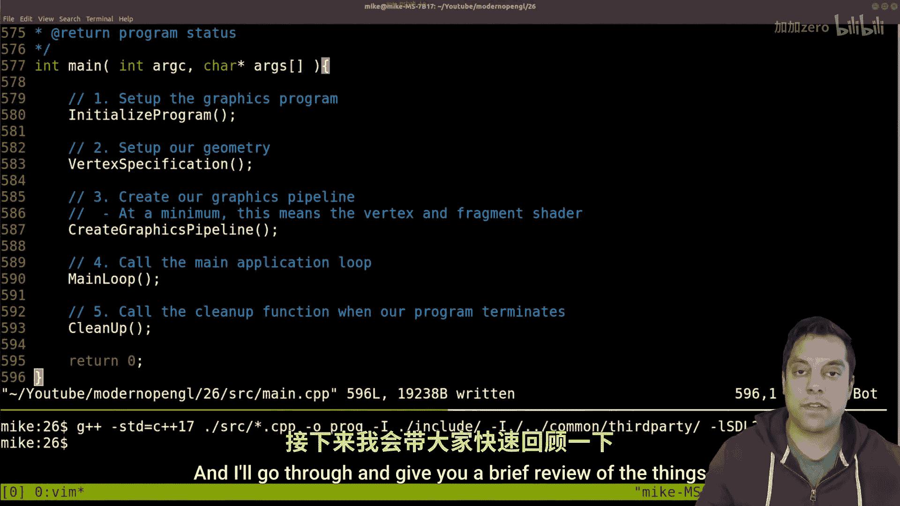
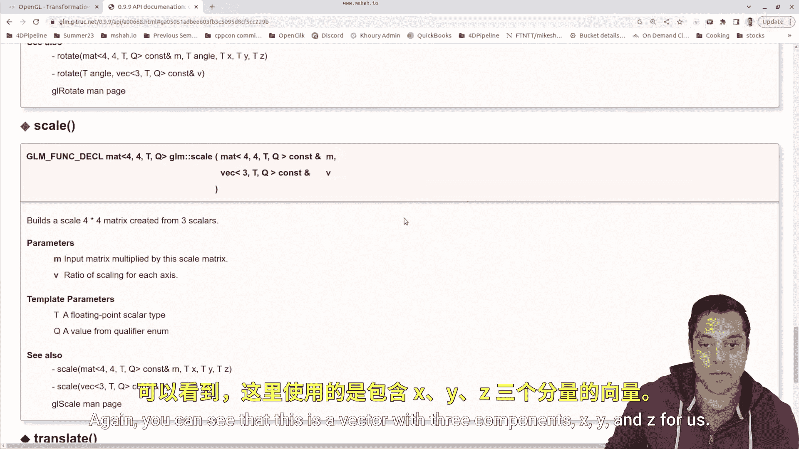

# Mike Shah【中英⚡OpenGL导论｜Introduction to OpenGL】 p27 P27 -OpenGL Episode 26- Scaling Matrices (glm：：scale) -BV1pTvFz3Eqh_p27-

Hey， what's going on folks is Mike here and welcome to our Open GL series in which we are learning modern open GL in this series。

 So previously we've been talking about transformations in the previous video we learned about rotation matrices if you haven't checked that out。

 make sure you go back and check that。 So in this particular video we're gonna be looking at the scale matrix。

 So we've looked at translation， we've looked at rotation now we want to learn how to scale or make things larger or smaller with that said。

 let's go ahead and dive in。😊，So soon we'll be updating the code here and I'll go through and give you a brief review of the things that we've done since last time。

 but where I want to go ahead and start this lesson is just learning a little bit about transformations so if you can Google something like OpenGL rotation matrices。

 special matrices etc you'll probably get some help page here but I want to go ahead and again look at OpenGL scale transformations which I happen know in this article and actually look at what scaling means so scaling is one of the special transformations that we perform to each of the vertices in our。

😊。

Program in the vertex Shar。And as I showed before， where we have each individual vertex。

 for instance， we specify those in a vertex buffer object， they're sent off to the GPU。

 and then we transform them。So the default orientation or the sort of default that we have here is an identity matrix right this is just where they are by default。

 we've placed those vertices exactly as we said they are in the vertex buffer object。

 but we might want to actually scale our object so it's not so meaningful when I look at the points here。

 but instead let me go ahead and just draw a three dimensional cube here。😊。

And again we want to think of the individual points here now they are all individual points and how the points are connected。

 the vertices is defined in things like our index element buffer， the actual connectivity。

 and that's how we know to raize or fill this in and make it look like a cube。

But if you can leave that for a moment and just think about this cube here。

 if I draw a coordinate access here， I'm drawing it in yellow so you can kind of see through it。

 hopefully that works for you， but the basic idea is if I look at each of these points individually。

And then I look at this special matrix here on the right， which is or excuse me， your left here。

Whi is going to be the scaling matrix here or actually let me keep you here。

 just look at the diagonal of this matrix here。 In fact， let's rewind for a second here。

 Let me get you to the identity， which is just on this side here Okay。

 so you'll see ones across the diagonal。 So I'm effectively multiplying。😊。

And let's go ahead and label this as our identity。Here。With ones across the diagonal。

And as I showed last time， just for a brief moment here。

Each of these columns here represents how we're transforming the x points。

 the Y point and the z point Okay， so we're multiplying the X Y in z point of each of these individual vertices by0 or excuse me by 1。

 which is our diectal here。Then we're not changing where this point is。

 right I'm effectively saying what's the position， multiply the x by one。

 the y by one and the Z by one。But if I come down here to our scaling matrix here。

You'll see that this matrix is set up to multiply across the diagonal here， okay。

 so that's the actual transformation that we're performing。So if I want to make all these values。

 and let's go ahead and draw our scale matrix over here。

RightThis is the scale along the x scale against the y scale it against the z and then one down here this is how I'm scaling here。

 So if I pass in two for each of these values that will make each of these points effectively scale outwards2 in the direction that they are oriented effectively enlarging our object if I make them multiply by 0。

5 it'll shrink our object or I don't have to do a uniform scale。

 I might choose to do something like 1。5 in the x dimension 0。

5 in the y to kind of squish it down and then to lengthen it across in the z maybe 2。

0 okay so that's our scale。 So let's go ahead and look at this in code and go ahead through the open the GLM docs here I'm just gonna go ahead and type out scale。

😊，Let's see this page sometimes gets me a walkky result， let me refresh， go to the API documentation。

 let's type in scale， let's see if we can get something more meaningful here， there we go。😊。

Get to the scale。And basically this just takes in an input and then the ratio for scaling along each of the axes again you can see that this is a vector with three components。

 X， Y and z for us， okay， so let's go ahead and keep that open and let's go ahead and figure out how to scale here。

So from our program here， this is going to take place in the main loop。And in the predraw here。

 where we're doing all of our update transformations Now last time again。

 we did this transform on our model matrix here to translate from the identity by some offset and then we rotate it Okay。

 so that was the idea so let's go ahead and update our model matrix this time to do a GLM scale。

And again， just looking at the help page here， this is our input matrix， the model matrix。

 and then the ratio here， So model。And then the vector that I'm going to apply。 Now。

 just to make sure this is working， I'm just going to put in ones for each of these。

 So it's the identity。 we shouldn't see any change in our program。

 Let's go ahead and get a baseline here。 And again， here's how I'm compiling on Linux。

 You can look up my other videos to figure out on your platform how to do this。

And let's see here what we got here up looks like one missing。Right parentheses。

And let's go ahead and see it looks like we need to make sure that this is a V3。

Just to be super specific。All right， there we go， the DlM API is pretty regular， but on occasion。

Fick some errors。Alright， and let's go ahead and bring in this program here and again。

 this is the sort of base here I hold down arrow to translate us back and let's actually capture this value。

 I'll just initialize it to negative2 here and then the left and the right arrow can rotate Okay。

 so let's go ahead and get a update on our offset。😊，And that's at the top of our program。

Let's go ahead down here， let's just make this negative too so we don't have to keep scrolling backwards and save you a little bit of time。

And we'll go ahead and run it again or recompile and run since we made a change on the CPU side and this is our default and left and right arrow changes the angle up and down pushes us back Now let's go ahead and just scale this in half here okay and I'll go ahead and create a variable here but G underscore u scale。

And if I pass in zero again， this is going to shrink everything to the origin because I'm multiplying all the points by zero。

 so they're just going to close in here， so let's do something a little bit more reasonable here。

And let's just set this to 0。5。And then let's come into our scale here in predraw。

And let's come down here a little bit。And here we are。

And let's set up R vector G underscore U scale G underscore U scale G underscore U scale three times because I I want to scale this uniformly。

 So across the X in the Y and the Z。 You don't have to do this。 But again。

 I'm just going do it for our demonstration， let's go ahead and run it。And well。

 this looks smaller to me Okay， so looks like it's working。

 And that's really all there is to this actual scale operation。 Okay， so that's the basic idea here。

 So we're first translating our object backwards rotating it by half many degrees in this case none initially so zero。

 and then we scale or shrink down our object after that transformation。 Okay。

 so that is the order in which these operations are applied。

 So we're sort of just building up this matrix。😊，That we eventually send into our program again through this uniform variable。

 you underscore model matrix。And。We then multiply that model matrix by our projection to get our program。

All right so that's the basic idea that's all there is to scaling。

 I don't think we need to make this any longer here。

 I'll go ahead and just run this program one more time so you can see it。And here it is。

 and you can enjoy。 All right， folks。 So that' all there is to scaling。 Hope you enjoyed this one。

 Hope you've been enjoying this series and learning how to do some of these basic operations。

 soon enough， we'll talk about again why the order matters and how we have to be a little bit careful with rotation matrices。

 So again， make sure you subscribe so you don't miss those lessons。 But hope you've been enjoying it。

 And as I always say， once you can draw one triangle or two in this case。

 a square and start moving them around。 You've pretty much got the basics of a 2D game engine here。

 Now you just need to draw lots of these。 And maybe figure out how to work with some transparency and a few other things。

 but that's really it。 We have the basics here。 And I think that's very exciting。 Anyways。

 folks with that said， thank you as always， for your time and attention。

 And I'll look forward to seeing you in the next one。😊。

