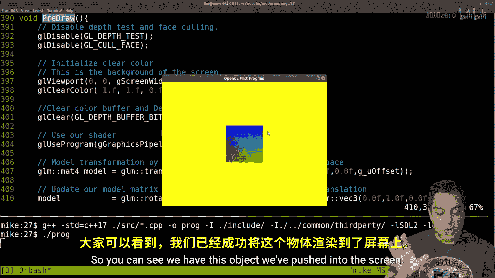

# Mike Shah【中英⚡OpenGL导论｜Introduction to OpenGL】 p28 P28 -OpenGL Episode 27- Matrix Transformation Order Matters (Think Concatenation -BV1pTvFz3Eqh_p28-

Hey， what's going on， folks It' Mike here and welcome to next lesson in the modern Open GL series。

 Now， today's lesson I'm going to go ahead and just talk about a few things regarding order of matrix transformations。

 which we've been talking about because order matters for instance。

 you can read the text on my t-shirt here when I have this video transform in any specific way。

 whereas normally I record like this。 So text on a t-shirt usually a no no。

 Sometimes I do it and today you can understand why this might be a no no。😊，But with that said。

 let me go ahead and give you a different example to talk about why order matters I'll go ahead and illustrate this with a drawing pad here。

 so let's go ahead and dive into this lesson here。Now again， before I get into the code。

 let's go ahead and draw here Now again， we've been talking about in the previous lessons how we specify vertices and they have a particular position where they start And all I mean by that is in some vertex buffer object you specified the positions here。

 whatever the X， Y and ZR， but over time you're going to apply different transformations to get each of those vertices and and the end some object to move。

 rotate， translate scale， the different types of operations we've been talking about。

 but let's again consider two different scenarios。 I'll go ahead and draw this out in 2D here on two different axes。

And you can actually try this experiment if you've got enough space in your room or wherever you're watching this。

So go ahead and in experiment one here， let's call experiment。Wan。Here。

 and then we'll have experiment2。Experiment number two。And again， we'll start you here。

So the experiment that I want you to do in experiment number one is to go ahead and walk。😊。

5ive steps。Forward。Okay。And then turn left。Okay， so go ahead and do that experiment and forward in this particular case。

 we're going to go ahead and just say is along the y axis in this example。 So to go one。

Let's move up here one。Two， three， four， five。And then we turn left here， okay。

And we'll walk five steps walk。5 steps。 Okay， so we end up somewhere here if you want to actually put a coordinate。

 negative 5 and5 here。Okay， and again， you can do that experiment in real life。

 orient yourself in a particular direction， whatever default orientation is， walk five steps。

 turn left， walk five more steps。All right， now let's go ahead and repeat that same experiment。

 so orient yourself in the same direction， get back to your starting position here。

And we're going to flip the instructions， so this is going to be a turn left。And again。

 we're turning left 90 degrees。5ive steps， you walk forward and then will'll again， continue to walk。

5ive steps forward。Okay， five steps。Forward。And I'll move out of the way here I know my hand writing is getting a little bit wonky。

 but hopefully you follow along in this demo so what are we going to do turn left here so we're facing left here and going five steps so we're going to go ahead say one two。

 three，4， five。Okay， and then we step forward again， five more steps， one，2， three，4。

5 okay so in this case we end up at negative 10，0 so you can see the actual coordinate has changed even though we've got the two same steps here。

 but the difference was the order that we did these steps。Now， again。

 that might seem relatively obvious the order that were running these experiments in。

Or the steps in each of the experiments lands us in a different position。

 especially if you've taken place in this and actually walked forward as I mentioned here。All right。

 so with that said， let's go ahead and see what that means for our actual transformations。

So what we've been doing so far， we've set up our program， we've got some vertices。

 we've got our pipeline and now in our main loop。In our drawing stage。Or right before we draw。

 I should say where we're sort of updating our positions， we've done a few transformations。

 so let me go ahead and run this in case you haven't been watching the previous videos。

 but make sure you do so you understand the different transformations that we are taking。😊。

So we've compile piled and I'll go ahead and run this and bring it into the screen so you can see we have this object we've pushed into the screen。

And let me go ahead and make our code just a little bit smaller so I can demonstrate this for you。

What we've done here is we have some offset so we've pushed into the screen two units that's what this first translation is and then we rotate if there's any rotation。

 let me go ahead and add a little bit of rotation here， say negative 65 degrees converted to radians。

 that's what this step's doing here， and then we scaled our model in half okay。

 so that was the different operations that we've been doing。😊。

Now let's go ahead and change these operations a little bit here Okay。

 so what I'm going to go ahead and do and I'll go ahead and recompile this is let's go ahead and switch our rotation which with our translation Okay。

 so let's go ahead and just switch these around and of course， when this comes to programming。

 I've got to make sure that I declare our model matrix here，4 by four matrix。😊。

And this means we're going to rotate our shape first。 Okay。

 so that's like doing that left turn first and then pushing our shape back two units or two units into our screen again。

 based off of our right hand rule， the middle finger being the Z axis positive is toward you。

 So that's why we're pushing back into the screen， negative two units。

 that's the initial value for you underscore offset。UmLet's go ahead and see where we land now， Okay。

 so go go ahead and compile。And I'll go ahead and run this program。

Now if I run it in its default state with no rotation， nothing's changed， okay。

 so let's go ahead and kind of fit this in the screen here。

Just so we can see。

Again， keeping eye on rotate， translate and scale okay。

But as soon as I add a little bit of rotation here。

 I'm just going to press the right arrow a few times to give us a few different degrees here。

Let's see how our program changes， okay？And well， it looks like I need to make one more update here。

 not changing it all here against I switch the order here。Our translate。Well。

 that's not going to change at all because it's working off of that identity matrix， so as always。

 we got to check our code here。So let's go ahead and feed in our model matrix here。

 So again our model matrix here， which is initialized here with rotation。

 let's go ahead and see what happens here， let me recompile it。

 rewrite it and now let's see what we get here Okay。

 now this is kind of interesting I don't see anything here。

So if I rotate a little bit or maybe move our offset back or forward， h。

 its like we're not getting much here again， we might have to debug a little bit。

And this is actually a classic thing in graphics， it's where's my object and we have to play this game a little bit here and try to figure out or to bugg what's going on。

Well， usually what's happening is if I'm initializing my model matrix here。For the rotation。

 let's go ahead and do this like we had before。For our translate。

And make sure that we have the identity matrix here。 Okay。

 so just sort of step by step debugging this。 and now it looks like we're in a good or reasonable stage here。

 Okay， so we have an identity matrix there。 so again， I like to。😊，You know。

 leave some of these mistakes in because it's， well。

 it's the most often thing that I do when I'm working with Open Gs， where's my object。

 but that aside we've got our object here。Now it's not rotated at all。 it's your degrees。

 so I can use up and down to move our object forward and back because essentially what we're doing at line 409 is not really making any changes。

 right， the rotation is the same。But again， let's go ahead and orient our object back at negative2。

 its's default state。And then what we'm gonna to do is press the right arrow a little bit here and wow。

 look how it's turning now it's actually sort of rotating around this pivot here。

 it's almost like it's an arm extending out negative two units and then twisting around okay which is very different than if I move my object forward here if that's my fist here and just turning it a little bit okay like it was doing on its own axis So that's an exact example of where the order matters of our transformations。

 So we're rotating first and then pushing back well however many units our translation is。😊。

So let's go ahead and just play around with this a little bit more so if I bring this object a little bit closer。

And let's bring it really close to zero and then rotate it。 Well， again。

 it's still rotating about that arm so we can see how it's changed here and I'm going to make it push it back into the screen very far here。

And we'll see we're sort of extending our lever out if you want to think about this as you know an arm here。

 and if I rotate a little bit， it's increased the orbit that this object is moving about。

 which is you know the origin。So that's just a demonstration of how order matters the same thing applies with our scale here okay。

 so if we wanted to scale our object first or whatever。

 that can create a different ordering of our transformations。😊。

So folks usually think about this in the sense of maybe memorizing rotate translate scale RtS if you want that sort of orbiting behavior。

 one object around the other or translate rotate scale。

 but I just find it easier to think about or just orient yourself in the world somewhere。

 actually walk or do the experiment or use your arm in your fist is an example to try to figure out where you are in space as your first learning graphics。

 so anyways folks that's just a demonstration about order mattering。Now。

 another way you can kind of think about this and that I like to tell folks when I'm teaching graphics。

 and let's make this just a little bit bigger here。

Is to think about the order of your transformations as concatenation。

 meaning if you're doing a rotate then a translate in a scale。

 think about that like a string RtS and that would be different than again doing the translation first then the rotation than the scale etc okay so TRS would be a different string than whatever starts with RTS okay so if you think about it that way again it's just another way to remember as you're learning computers at the order of these operations matter because at the end of this day again what we're doing here is creating matrices here and multiplying them okay it's a four by four matrix multiplication。

All right folks， so with that said， I hope you enjoyed this lesson。

 hope you had a fun one playing around with this demo。

 hope you're keeping up to date with your code and able to follow along with some of the examples and are enjoying the series as always if you have questions feel free to engage in the comment section below and make sure you give this a subscribe so you don't miss the other openGL lessons that are coming here All right folks thanks for your time and attention and I'll look forward to seeing you in the next one。

