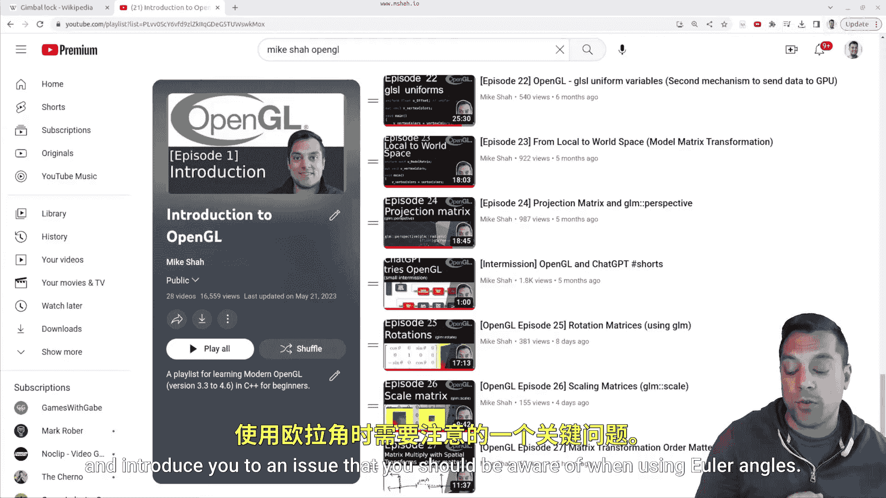

# Mike Shah【中英⚡OpenGL导论｜Introduction to OpenGL】 p29 P29 -OpenGL Episode 28- -Theory- Gimbal Lock -BV1pTvFz3Eqh_p29-

Hey， what's going on， folks， It's Mike cure and welcome to the moderndern Open GL series in this lesson I want to continue talking about transformations。

 but just something more that you should be aware of。

 So let me go ahead and explain here by viewing our playlist。

So you'll notice that these last recent videos have been talking a lot about transformation again。

 the order matters that we do our matrix multiplications again。

 we want to think about these as concatenations of how we perform our translation， rotation， scaling。

 shearing any sort of matrix multiply that you're doing so that's very important but where things can sometimes get interesting is especially with rotations。

 So let me go ahead and introduce you to an issue that you should be aware of when using oer angles。

So this is an issue of what's known as gimbal lock。

 I'll take you to the Wikipedia page so you can read through it。

 but it's basically this idea that if I try to rotate simultaneously on the X Y and z axis。

 So three different axes， you'll lose a degree of freedom。

 So we can observe this spinning what's called a gimbal tool here。

 and it represents each of the axis here with the outer ring on each of the innermost rings on the degree of freedom that you can rotate。

 So what happens is when these axes line up they end up moving sort of well with one less degree of freedom。

 because the axes are actually lined up。 So by adjusting， say the x and the y axises。

 you might actually be performing the same rotation。

 And this can lead to sort of interesting behaviors when it comes to 3D graphics。

 So let's go ahead and take a look at some of the other animations here。

 just to get some other illustrations here of this gimbal tool here。

 So here's just another example here。😊，WithThree gimbals moving around here。

And you'll notice here that when the two gimbals。Aign， you'll lose a degree of freedom。

 you'll have to stare at this or sort of slow down a little bit。

 you'll notice sort of towards the end of this rotation where they line up。

 that's where the behavior gets kind of interesting。

And this has caused some famous problems when it comes to the actual history and so on that you can read about on the Wikipedia page when it comes to using rotations in real life on vehicles and so on。

So how do we solve this issue of gimbal lock Well， sometimes we just don't worry about it when it comes to games。

 maybe we're only moving around one particular axis in the game so we can just use our oiler angles。

But something that folks will also do is they'll add a sort of fourth gimbal or a fourth dimension which you can rotate around。

 And this is getting into the idea of different types of mathematics like using quaernians for those of you who might have some experience using a game engine and not building all this stuff from scratch that helps you avoid this problem。

 You're still losing a degree of freedom。 And the sense if you have two axes line up。

 but you always have at least three axes to rotate about。 So that's the sort of idea。

 So in this lesson today， I just wanted you to be aware of this issue and know there are ways to mitigate it when it comes to3D graphics。

 We can still rotate around the X Y and Z。 In fact， I'd encourage that as an example here。

 but you should know about this term gimbal lock， it comes up in interviews and it's something that you just have to know that sometimes there's a limitation to some of the mathematics we use and we might have to use different systems。

 So eventually in this playlist or maybe another， I'll talk more about quarterernian so we can learn about them。

 But for now， know that that's one of the tools you can use to fix this issue and now the term。😊。

All right， folks， So with that said， this was just a little bit of a explainer or theory video here。

 Hopefully it was useful。 Again， there's lots of great resources demonstrating this。

 And you can demonstrate this yourself in say， blender 3D by trying to rotate along all three axes at once and see the sort of issue that happens。

 All right， with that said， folks， we'll get back to coding soon。 and I'll see you in the next one。😊。

