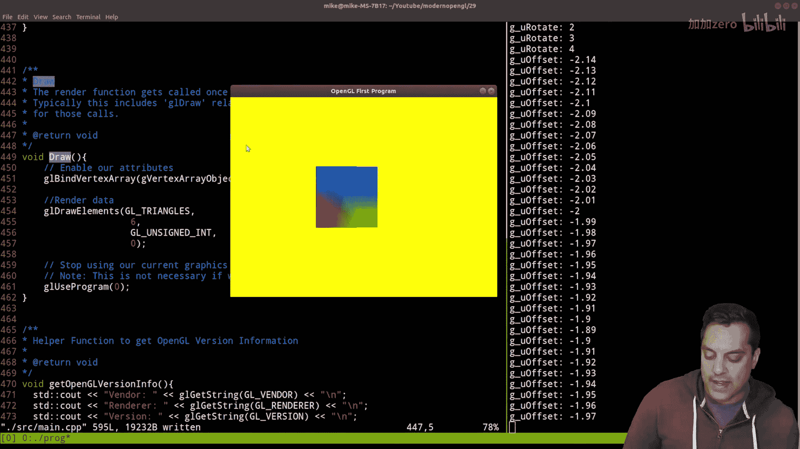
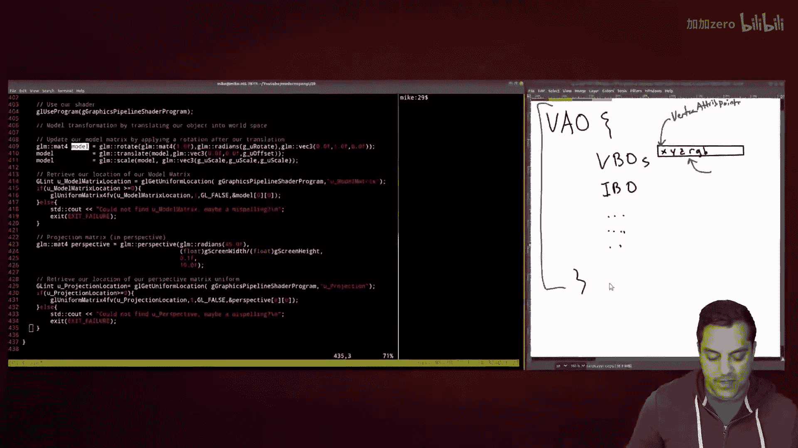

# Mike Shah【中英⚡OpenGL导论｜Introduction to OpenGL】 p30 P30 -OpenGL Episode 29- Quick Fix and Quick Recap -BV1pTvFz3Eqh_p30-

Hey， what's going on， folks， It's Mike here。 And welcome to the next lesson in our modern open GL series。

 In this lesson， I'm gonna be doing a little bit of a code review from where we left off。

 I want to fix a little mistake before we move on and then we'll go ahead and pick up where we left off。

 Now it's been a little while since we last talk。 So I think it's worth doing a little recap before we left off Here I am almost exactly on top of where it was previously。

 the idea being that previously， we are talking about the actual matrix transformations and remembering that order matters。

 Okay so maybe you've watched this video recently or watching it now， regardless。

 we had in mind these things like the local coordinates drawing your attention to the top here and thinking about how we transform an object by applying a special matrix transformation。

 So make that something like a translation scale， a rotate all these different types of transformations that we can apply to our objects to effectively make them move。

 Now， the important thing to remember from that previous lesson was that the order matters。

 whether I do a rotation， translation or a scale。😊，And then along with that。

 I also give you a little bit of a warning with our current sort of。Mathematics for rotation。

 we can run into this problem with gimbal lock。 So again， that was in the previous video。

 So with that said let's just go ahead and run this program and see where we left off here。

 And then I'm going to fix up just one small little mistake。

 I realize I've been making our open GL code。 It's not really going to cause any problems in our samples here。

 but later on it's something we'll want to clean up。 So anyways， here's our project so far。

 if you've been falling along。 we've got one shader here or rather one program graphics pipeline consistly vertex shader and a fragment shader。

 We've got our main dot cP here。 and let's go ahead and just take a look at that in source。😊。

And I'll make this a little bit larger for you。And I might start compiling these videos with C+ plus 20。

 so that's one adjustment I'll make。 it's not really gonna to matter。 In fact。

 I'm pretty much programming this just like we're using C because again that way if you're following this series。

 you can follow along and Python d Lang， Java， C++ rust。

 whatever language you want just so long as you can understand how to call the appropriate open Ge functions and then use the windowing library of your choice So anyways。

 bringing it down to our main here， which was again。

 the idea of emulating the graphics pipeline and the idea is we need to initialize our program here which is basically setting up our window here and communicating with version of Open Ge that we're using。

😊，And setting up for us the SDL library here Now it is important that you set up SDL as well as openGL。

 which we're using GlaD to load our openGL functions before doing anything in openGL this is something I've just seen over time watching some folks program where they get some air or a crash for instance and sometimes it's because they're calling into some function where they haven't set up SDL our windowdling library or openGL from Glad here okay so that is our initialization of our program and then we set up some vertices here with our vertex data and at this point we have a quad that we're drawing here which consists of for vertices and then the colors for each of those vertices again this is a little bit of a recap you can watch the series to see how we built up to this if you need。

Now what we have here is this vertex array object which is really a nice thing since OpenGL。

 I think 3。2 I believe， where these became sort of mandatory and these are the sort of overarching structure for or handle into drawing some specific object so what do I mean by that here Well what I mean by that is again I like to think of the VO as sort of almost the scope for any VBOs that we bind any IBOs that we bind the index element buffer and anything else that we might have state for here。

And alongside our vertex buffer objects， whether we have one or multiple。

 and we've learned how to draw these multiple different ways here， so we could have again， one here。

Which has positions like X， Y and Z， also part of this VAO is our vertex attribute pointers here。

 vertex。Hattriib。Let's go ahead and see exactly how they're called in the function here。

Just I point you the right place GL vertex a Tri pointer here always a little bit of a mouthful to remember。

 but that way， again， if we have like X， Y and Z and R， G and B， again。

 these are effectively pointers that tell us how do I get to the next set of data as I'm moving along Okay。

 so those are all things encapsulated in the VAO So that's where I want to go ahead and show you the little mistake that I've been making here。

😊，As we're doing our little recap here， let's go ahead to our create graphics pipeline。

 which sets up the shaders。 again， another common mistake。 if you see a black screen。

 you might not have your shaders or the right pipeline synced up so this creates the graphics pipeline object but let's go into the main loop here in which we do input any pre-drawing which might set up our objects and then the actual draw here Now where I want to actually go is the draw here again to show you the little mistake they made we actually don't have to rebd this vertex buffer object that's not really doing anything because as soon as we bind to the vertex array we're all set here So I'm actually just going delete this and recompile it just to show you that in this video。

😊，We are all set In fact， I mean， you'll notice I'm not doing any binding of the element array buffer and maybe you just get lucky because you just have one of them。

 but again， the reality is we don't need to do that。

 So let's go ahead and compile this C plus plus 20 little air correction there And then if I run this program here just to see where we left off I have a program where I can move forward and backward and then I can also look left and right here。

 Now what am I doing when I'm pressing left and right and forward and back。

 let's go ahead and recap So I'm going to need to look at the rest of my loop here and look at the input function。

😊。

And let's see here I am updating offset and G underscore rotate。 now again。

 I've been prefixing my global variables with G's or G underscore here。😊，And if it begins with a U。

 that's a uniform value。 So something that I'm passing into the shader here。 Okay。

 so let's just go ahead and take a look at where I am using these values here。 And from my main loop。

 I'm going to be setting these up in predraw。 So let's go ahead to this function here。😊。

And in predraw， let's go ahead and see a little review of our transformations here that we have first and foremost selected our graphics pipeline that we're going to be using。

 again， this is important because for that pipeline meaning the vertex in the fragment shader。

 I need to make sure that that's selected first before I start setting up these uniform variables。

 again just something to keep in mind there。 So usually I create our model matrix。 and again。

 this is the thing that we're going to multiply our object。 So again。

 a little bit of a review from what we're doing previously， let's just create a little box here。😊。

Which was to take our vertices here and we've got a quads so I'll draw you know。

 roughly something that looks like that， and they have their local coordinates。

And we apply the model matrix to it。And then we move them into world space， so maybe it's rotated。

 translated， scaled or something here， and then we have world coordinates here。Okay。

 or we say we are in world space here。 All right， so that's the idea。

 So in our particular example here， and we do have a scale as well looks like I'm let's go ahead and see where I was using that G underscore U scale。

😊，Let's see if I've used it here and I've just have it， I guess we'd make it interactive or anything。

 but you can assign another like key and SDL or something to change that。

 but we've just divided it into two again， that's a uniform scale there and then as far as actually setting things up in our program here here is where I'm connecting to our shader the different variables here So you underscore model matrix here and let's go ahead and split our window look at our shaders and again these transformations are happening in the vertex shader。

😊，Because that's the responsibility of the vertex shader to position things right。

 that's why we've got a GL underscore position here and we can see exactly let's go ahead and highlight our underscore model matrix here。

😊，And let me scroll up here a little bit just so we can see where that connection is here here is our uniform variable again。

 matching here Now again， important that the type matches here。

 the mat4 here and that we're passing in a matrix here。😊，And let's highlight it here。

 a matrix for F and taking in the values here again highlighting that because that is our type here again and we're matching that with what we've got in GLM。

 which closely matches what we've got in our GLSL shader here Okay。

 so that's the idea there Now again， something that I've seen some folks run into。😊。

Well writing this is sometimes they'll say well they have this variable here and then they link it into their shader and then somehow it can't find it。

 make sure you're actually using your variables here。

 you underscore model matrix because GLSl is smart enough to optimize out these uniforms if you just aren't using them and then it'll show up as a compiler error and you'll say well it seems strange but you have to kind of think about it from the shader or the GPU perspective of well if I'm going to be potentially running these programs hundreds。

 thousands maybe millions of times in the case of the fragment shader per frame。

 then I need to be as efficient as possible so we don't want unused variables hanging around in our shaders so that's something that you might see with our uniforms okay so that's why in this code down here。

 I'm effectively again checking to see that we have this location found you underscore model matrix again spellelt exactly as this one is and then you try to print out some helpful message and again I consider it an error right away so you should exit。

And fail if it's not found， okay？So that was the idea and then we also wanted to be able to put things into perspective if you remember a few videos ago if we don't have perspective that our actual objects not gonna change because by default will have this sort of orthographic projecture that means regardless of how far away something is we will not see that change versus in our real lives objects that are further away appear smaller if you see really tall person but they're1 thousand feet away they look really tiny versus when they're standing right next to you just as an example so that's where we need our perspective projections usually that's what we're wanting in say a video gaming or virtual reality environment of course you can play around with this for various artistic effects but that's something that we need so very shortly we are going add the next piece though however which is to have a camera here and we'll actually call that a view matrix and have something else here so just want to kind of prime you for that and again give you a little recap of the code since it might have been a while for some of you who have seen these videos and to fix that little。

😊，I to stay here because I didn't want to go forward putting in too many extra draw calls again if I go into our。

Let's see geo bind vertex array while where we initially do it and then oops let's go ahead and find in our draw call here again we can just bind to the array that we have because that holds on to all of our vertex by for objects with the appropriate pointers to them and so forth okay so that's the idea here and with that said just want to give you a little bit of a recap of that program and then we're gonna to go ahead and add our camera or a view matrix in the next video so I'll look forward to seeing you there if you have any questions feel free to comment below and I'll look forward to seeing you in the next one。

😊。

