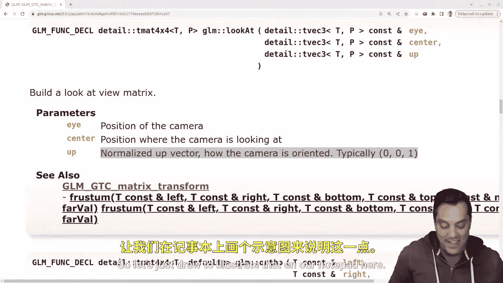

# Mike Shah【中英⚡OpenGL导论｜Introduction to OpenGL】 p31 P31 OpenGL -Episode 30- -Theory- The View Matrix -BV1pTvFz3Eqh_p31-

Hey， what's going on folks thiss Mike here and look to the next lesson in our modern OpenGL series in this lesson I want to go ahead and just start with a demo of the program that we've got so far because there's something sort of peculiar and again we're going to want to fix this and add a real camera into our scenes。

So of course， here is our project on the left side。

 I'll make this just a little bit bigger so you can see how our source code looks again。

 basically everything in the main here， and then we've got our graphics pipeline here in the shaders Now interesting。

 when I go ahead and run this program， I'll go ahead and compile it here and switch to C++ 20。

 but it shouldn't really matter that much for the stuff that we're doing in this series。😊。

And if I run this program here and I move forward and back well again。

 remember that we're actually moving the object， I'm transforming the vertices in our vertex shader In fact。

 let's go ahead and open up our vertex shader here just so we have some evidence that that is in fact what's going on here because again that's the job of our vertex shader to transform the vertices。

 In fact， that's all that's going on， but when I move the object forward。

 it's almost we can sort of think of like moving towards the object like we're walking towards it like in a game or something or if I press the down key like we're walking away from our object and of course it's appearing smaller because the distance is getting further away and that's why we have multiplied in our projection matrix which is also shown in the shader remember the order is important working from right to left here and that is what we've been doing so far and in fact even if I do transformation like a rotation by pressing the left key or the right key to rotate it in either direction。

😊，And however we want to think of as left or right as positive again。

 well want to use our right hand rule for that but the idea is this kind of feels like a camera。

 although it's not quite a camera right we are actually transforming the vertices on this object but what if we want to be able to actually move through the space here okay and that's gonna to be important and that's what we're gonna actually do now is implement the view space or the camera transform it goes by a few different names So if you're googling around for more resources。

 view space， camera space those are usually the common ones that you'll hear at least in the open GL world so that's what we can work with So again conceptually let's just go ahead and take a look at what this means in terms of our pipeline。

😊。

And again， it's going to be good to draw this out。 So let's give ourselves a full screen here。

 where we've got some vertices here。 and those are in the local space。😊。

We apply a model matrix to it。 and let's just go ahead and label it out here。

 and then they're in worldspace somewhere。 Now I'm gonna to go ahead and just draw these here。

 But again， when I have things in the local space here。

 right these are like the origin here so let's draw an actual you know axes let's actually draw right in the center here。

 just to indicate that that's our again， X Y in our Z coordinates here again。

 following our right hand rule here。 But when we're in world space here。

 we might have rotated this object and our actual origin is here。

 right we've maybe done a rotation and translation or something， but our object has been transformed。

 right， So it's no longer at just the origin here。😊。

And then the next thing that we're going to want to do here。Is multiply in the view matrix。

 which is what we're going to be learning about today。 And again， that's sort of like having。

 again our object here， it hasn't really moved relative to our coordinates here so let's just draw again a coordinate system but we do have a camera here that is viewing or looking at this scene from a particular direction so you can kind of think of that as like moving the coordinate system to where the camera is or maybe moving our points relative to the camera。

 it doesn't really matter， but this is gonna to be just another sort of transformation just like we did in this first stage to get us into world space from local space okay so this brings us into camera space or again view space here。

😊，Okay， and these are usually the same sort of things here， but this will be。

 I'm going refer to this as our view matrix that we're going to multip。 Okay， so how do we do this。

 Well， I use sort of a key term here that we're sort of thinking about our camera here。

 this let's make this a little bit more like a camera and usually we draw these as like old school cameras。

 I don't know why。😊，With the projector real， maybe you've seen one of those。

 but you can really think about that like your phone here。

 this camera that I've got here on my Android phone and well。

 let's think about things here just like you're a photographer here。So you have your scene。

 I've got my camera here where I'm positioning it。 And if you just move your camera left to right。

 right， actually turn your camera on and do this experiment， your scene is moving， right。

 So the position of this camera matters。 and then maybe how I turn the camera here。 Okay。

 how am I looking at this scene from this angle or maybe from this angle over here。 Okay。

 so that's the view direction in my world here。😊，And then finally， you know。

 how do I sort of tilt my camera， where is up， you know， is it pointing sort of up or down。

 so these are some different factors that influence our camera here。

And if you happen to be an airline pilot， maybe you've also heard some of these terms like pitch。

 yaw and roll， which are other ways to think about how you model a camera。

 But I'm actually going to give us a tool here to make this a little bit simple。

 So you can think about where a camera is in the world， where it's oriented。

 maybe where it's turned and where is up in the world because effectively what we're doing with this camera here。

 Let me just circle it So it's clear is building a matrix。 Okay， that is again， just like our。😊。

Coordinate system we can think of as a matrix with these basis vectors here for our X， Y and Z。

 I'm just picking， you know this arbitrary  one。 We're effectively going to build a matrix for our camera。

 So let's just draw a little one in here。Where our camera is。

And that's what will multiply in here again， to take us from worldspace into cameraspace。 Okay。

 and we've got a really nice tool here for us to do this in。

 So let's go ahead and close this out here。 and you can already see my Google search and you can do the same thing to find it。

 is the look at function in GLM here。 I'm actually going to go to the GLM source code here。

 and we will start building this up here。 Okay， this idea here。😊，So here's the look at function。

 Again， GLM's are pretty templated library。 So sometimes these things look a lot scarier than they are and we'll dive into the function in a moment。

 But， you know， just starting from the name here and then let's look at the different。😊。

The parameters for building this matrix。 That's what is's going to return to us。

 It's got something called the I， the center and then the up here。 Okay。

 so let's go ahead and click on this。 And this actually gives us a little bit more a description here of our parameters so let's make that a little bit bigger。

 now this handy function， look at this is something that maybe if you've used old open GL version 1 or two or something。

 You might remember the GL look at function。 the GL utility library， look at function。

 This is effectively giving us the same thing。 It's building this matrix for us。

 This is probably a good thing to look at or study a little bit more in depth。

 how to drive this matrix。 But what I can tell you in what GLM makes this relatively trivial is again that we need the I center and up position here。

 I being where our camera is and think about your phone or whatever if you have an actual camera in front of you。

😊，The center here， I'm just going to call this probably the view direction or you know。

 that's another name for this。 But where you' are looking。

 And then where is up And that helps you orient how your matrix is。 And usually for us by default。

 right， if I'm flat here on a plane and I do my right hand rule and my thumb being the X axis。

 my pointer finger being the y axis in my middle finger or third finger being the z axis。

 usually up is where our index finger is pointing。 Now， of course， as I tilt this matrix。

 that changes or updates。 and why that's gonna be important。

 you'll see as we implement some different features of this camera because what that means is。😊。

If I want to actually rotate about some vector， let's think about what we're rotating about。 though。

 for instance， if I have my index finger here representing the y axis again。

 so we rotate around an axis sort of like this here。

 and let's go ahead and make myself a little bit bigger。

 So it's a little less handwaving and then I'll draw it。 Well， when I'm rotating that this way。

 that is sort of just turning my camera you know on the y axis。 But again， if I tilt backwards， well。

 I need to make sure that I'm rotating about this y axis。

 so let's just kind of draw it illustrate that on our notepad here， and again。

 I'm going draw it nice and big know this could be our axes and then usually again。

 we think about rotating about the y axis in this manner here。

 But if I tilt this axis and I'll do my best to sort of draw it， maybe just to the side here。😊。

So again， this is a separate example here。 Let's think about if my x axis is now here。

 my Y is pointing up and my z' is kind of coming out here。

 Well that rotation about the y axis still occurs here。

 but we're tilted right and this is where we think up is in the world。

And you can kind of imagine this if you've been on an airplane recently when you're taking off or maybe in flight or going up or down a little bit。

 Well where up is for you is still sort of right， you're still you know relatively speaking parallel to the floor here。

 but you're leaning back a little bit here。 so as you make a left or right turn to get to your seats and airplane。

 you're moving about or rotating about a little bit of a different axis right as you're not perfectly level And if you're not much of a flyer。

 maybe you can think about that same example on a boat， for instance。

 as it's rocking up and down and so on， you still want to be able to figure out how to turn left and right and you're sort of rotating about a vector。

 So to recap， but we've been talking about here is we've got this look at function。😊。

That we're going to populate here。Okay， with the I for where we are， the center。

 or I'm just going to call it the view。Direction。And then where up is in the world。

 and that builds this matrix here for us， meaning that I've got sort of these three vectors that are going to be useful here。

And the look at function takes care of providing this or returning the four by four matrix that we can ultimately multiply after we've done our worldbased transformation to then view are scene from any location wherever we've moved some objects around so that's gonna be the idea will dive into some code in the next lesson。

 But hopefully that just gives you a little bit of a conceptual idea of what's actually going on here alreadyy folks So with that said。

 I hope that makes sense， take out your phones and actually do this as an example。

 And that's a great thing about computer graphics since it's applying to what we're doing in the real world we can kind of understand or visualize this with objects that we've got and think about what would it actually take And then as an exercise if you'd like。

 I think it is useful to write your own look at function and actually again。

 think about the eye position and where does that really fall in the matrix driving some of these things yourself。

 even if it's just one time can be very useful alreadyy folks with that said。

 I hope you enjoyed this lesson。 I'll look forward to your comments below if you have any questions。

😊，That said，I'll look forward to seeing you in the next video。

