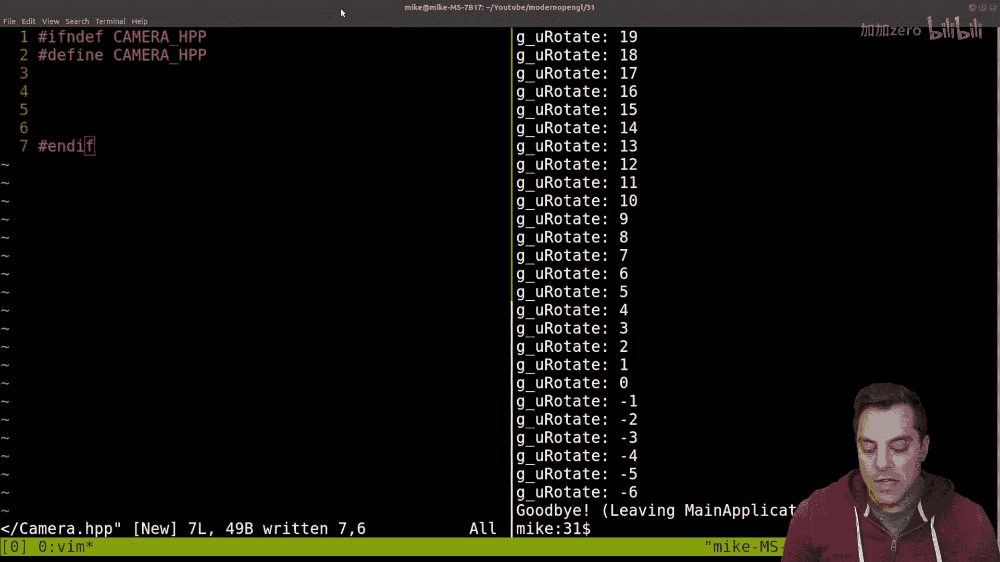
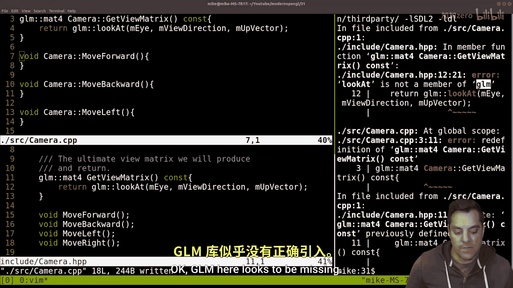
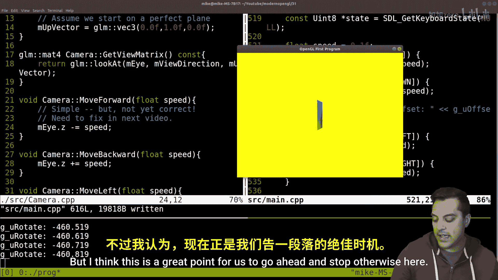

# Mike Shah【中英⚡OpenGL导论｜Introduction to OpenGL】 p32 P32 OpenGL -Episode 31- Building The View Matrix with glm：：lookat (and moving fo -BV1pTvFz3Eqh_p32-

Hey， let's go on， folks， It's Mike here and we'll on our next lesson in our modern open GL series In this lesson。

 we're gonna continue where we left off from and go ahead and start building our actual camera in the codes。

 with that said， let's go ahead and just take a look at this brief recap here from the previous lesson。

 if you haven't watched。 I think it'll be useful。 But the basic idea is we're gonna take advantage of this function here。

 look at here in the GLM library to build our camera。 we're gonna need a little bit of abstraction。

 I think it's time to start breaking our ss file into just a few other pieces of important components and then we'll go ahead and be able to use our camera in our current scene here Al so with that said。

 let's go ahead and dive into our code a little bit here and when we go ahead and do is just make sure that we have a clean build here of our program and I'll bring in this window here that we've got And again。

 we're sort of moving with the arrow keys。 but again we're transforming the actual vertices in this object。

 we're sort of moving it around in the world space here and then left and right is rotating our actual object here It's performing a rotation around。

😊，Where we've sort of pushed it so this gives it this sort of orbit around our scene here。

 but we will actually want to create a camera here。

So I'm going to start this off here is let's just go ahead and create a camera class here。

And let's go ahead and do this from the scratch here。And let's see。

 let's go ahead and create this header file。Or our camera。And there we go。 and if here， okay。

So again， if you recall from our previous video。

嗯。From this look at matrix we know we're going to need at the very least in I a center and up。

 and that's going to make up this view direction here in our actual scene here。 Or rather。

 the actual matrix， I should say， is made up of the I view direction and up vector。

And GLM will produce us a 4 by four matrix that we could just multiply through。 Okay。

 so that's what we're going to have here。So at the very least here， if we create a class here。

 and I'll create it as a class here， although I think I'm probably going to end up making everything public anyways。

 we're going to need to have a few vectors here， so let's go ahead and include our GLM library。

Which is in the GLM HPP。And then we're going to need a few of our GLM V3s here for the I。

And let's go ahead and replicate that a few times here。

And let's just call member I member I like view direction a little bit better。

 It's a little bit clearer than center and then up vector。 Okay， so at the minimum。

 that's what we need for our camera here。Now。I think for this particular lesson we'll probably just mess around with the eye here。

 So let's just go ahead and write a few functions here and what I'm going to need here is the important function that returns a 4 by4 matrix Okay。

 because that's we're going to multiply through again looking in this diagram here if we go ahead and grab this here' to go from our world space to our camera space and so on。

 Okay， so that's going to be the idea there。So I'll need some sort of matrix here and let's just call this。

Let's see here what I want to do this。 and I don't necessarily need to expose this。

 So this is going be private itself as well。 My've got the main view matrix。

And then I'll need some function here that returns， let's indent this properly here。Our view matrix。

 let's going to turn a match4 here。And let's call get the matrix。

And it's not going to modify it so we could be con， although， you know。

 as you're just learning these things， good habit to get into。

 but let's make sure that we have it here。 Then we're going to call that GLM look at function。

And let's make sure it is all lowercase here， lowercase and uppercase。

And let's get it made up of the eye， the。View direction。New direction。

And the up vector here。 Okay， let's make this a little bit bigger here up vector。All right。Okay。

 so this at the minimum is what we're going to actually need to get our camera moving around。 Now。

 again， I'm going to probably opt for。 Let's make all of these privates here。

And let's go ahead and give ourselves some comment here， the ultimate view matrix we will produce。

And return， okay？So I guess there's a few thoughts here just on the design as I'm doing this。

 maybe we don't need to store this， I actually need to think about this if we'd want to store or cache this。

 it's probably enough to just return and calculate this so let's let's get rid of this here。

And then let's put this as our comment here for this Giter function。

 which is just going to construct it from these three members here。And then for now。

 I think in this video what I want to do here just to make sure that we get things working。

It is let's just create some functions like moving forward and backward。

 which just update the eye position， let's say。And then we'll kind of iteratively build on these as we understand a little bit more of the math here。

So I'm just going to say move forward。For now， and actually。

 let me make sure I do these properly here， move forward。

 we're going to implement these in the C++ file。Move backward。And let's go ahead and say move left。

And move right here， okay。So let's go ahead and start with that much。

And see if we can set up the framework for how this works here。 Okay。

 so this is going to be our camera file。 Let's go ahead and split this and create a new source file here。

 camera CPP。😊，Include lowercase our camera。It's PP。Okay， and let's see here。

 how do I usually do this， but we need these few functions here。So we just copy and paste them。

And we've got to make sure that we have the class scope here。

 These are all part of the camera class scope here。Something like this。Okay。And let's see。

 let's see if we just select our whole file here and just do equals， it'll indent it nicely。

 here we go。😊，And let's get our。Pthe see or brackets in order so that we can actually update these here。

Okay， so that's looking pretty good to me so far。 Now let's update how we're going to actually compile this see if we're good to go。

😊，HitEnter， let's see if I made any mistakes here。😊，Looks like a few silly ones here， okay， GLM here。

Looks to be missing， so we got to figure out where that is。 so again。

 let's practice reading our documentation here， GL I'm look at and I get a little clue here。

 but let's scroll to the top here。😊。

And this is part of the matrix transform here so we can see that this is the the header file that we need to include here Okay。

 so you could just go ahead and。😊，Copy and paste these， but let me actually be sure here。

 let me go to look at here。Let's see here， look at。

 see if there's anything else that needs to be brought in， yeah。

 I think it's just that matrix transform will do the trick。😊，Okay。

 now we we have the actual source files so。

Let's just give this a try here。My GM。 alright， oh。

 and I've got a little ahead of myself in my header file here。 Some of you are probably， you know。

 yelling at me We putting the code in there。 talking about what it does。 Now。

 let's actually make sure that's just here。😊，Os， okay， I gotta just。Sharm in the right mode here。

Okay， let's go ahead and include this。Let's see if that makes us a little bit happier here。

And in fact， it does， Okay， so we've got things set up here。😊。

To have a camera view matrix that we can retrieve and it'll move us somewhere here now I am actually going to want to set up a constructor as well。

 so let's go ahead and set up a camera constructor just to set up some good defaults for us。😊。

Let's go ahead and call this the default constructor for our camera。

And set that up again appropriately as well。Okay， and we have the I， which should be some GLM V 3。

 let's position us at the orbit or excuse me， the origin。And let's see here。Importantly。

 then we have our up vector。Which again， I'm just going to use， I'm going to assume this。 I mean。

 we have to sort of pick， I suppose that up in our world just going to be in the y axis that we always start off on a plane here that may or may not be true。

 but again， this will be useful for us。 So assume。We start on a perfect plane here， okay？um。

And then we're going to need for our view direction。

And we need to think a little bit about this here， again using my right hand rule here。

 well remember if I'm my positive Z is pointing towards me my quad that I was actually drawing and let's actually run our program here。

😊，Well， it's sort of bit pushed out into the scene， right， some negative direction。 In fact。

 let's go ahead and see that just as a recap here， let's open up our source code in source main and I'm going to look for our model matrix here。

😊，let's see if we actually pushed， did we translate our object well we set it to some G underscore offset here。

Okay， now let's go ahead and see if that is true。Yeah， we pushed it negative two units。 so again。

 do your right hand rule and negative2 is sort of pushing out in the screen positive would be behind us。

 Okay， so our camera， we want to be looking sort of in the negative direction Okay。

 if that makes sense here it's a little bit unintuitive sometimes but that's you know sort of the idea here。

😊，嗯。And， you know， usually it doesn't really matter if it's like negative 100 or 100。

 I would just choose negative one。 It's a nice normalized value。 And again。

 that ensures that we're just looking， you know。Out towards our object here。 Okay。

 assume we are looking out into the world， okay。Note， this is a long。Negative Z。because otherwise。

 we'd be looking。Behind us。 Okay， that's the idea。And otherwise。

 we'll assume we are placed at the origin okay， and again。

 if you're modeling this for a game or something， right。

 your actual eye position might be like a little bit elevated right because your character has height or something。

 but again， for practical purposes here， we could just assume that we're at the origin。Okay。

 so we've got our camera here and then if I call this lookout function。

 I should be able to actually get a view matrix back here， okay？

So let's start playing around with this just a little bit here。

 and we're going to need to go back to our source file and our main。

Let's go ahead and include our camera。So let's go ahead and say our libraries now。

And let's include camera。H， PP。And I'm just going to create a global camera。 Okay。

 I know we don't like the global as we can fix this or wrap them in astruct or something。

 But for now， this is fine。😊，And let's。It's a global， a single。Bable camera。

 and you could have multiple cameras。 that's how you could get multiple views， for instance。

 or if you've thought about split screen and gaming and so on。

 there's some different tricks that you can use for this。

 but just one camera for us will be fine here。Alrighty。

 so now let's actually do something with the camera here and where I'm going to go ahead and start playing around with this is in the predraw function。

😊，Okay， because this is where we're handling all our uniform variables here。 Okay。

 so we've got our model matrix， and we've got our perspective matrix。 well。

 the perspective sounds like it should actually be something that's part of our camera。 Okay。

 so maybe in a later video， I'll adjust that。 Okay， I'll make things a little bit cleaner。

 but for now， all I want to do here is just create a mat4 here， I'm just going call it a view。😊。

And I'm just going to from our camera， G camera call get view matrix。

 which should return us our view matrix that's looking out across the scene here。

Now let's do a little bit of copy and paste here for our uniform variables。 And again， you know。

 at some point， you know， when you copy and paste something like three times or more。

 then it's probably time to start thinking about abstraction。

 So we might want to start thinking about this， but again。It's good practice。

 at least while we're starting here to just go ahead and write these out here。

 let's just call ahead and call this view。And make sure that we found our actual location。And again。

 this is a4 by four matrix here。So the v location。And make sure it is view here。

 which is a 4 by four matrix here。Okay， let's make sure that we provide the appropriate error message could not find you of view。

 And again， this is going to be a uniform that I pass in because again。

 our camera is going to be something that updates over time and is changing。 right。

 We might move the eye position。 In fact， that's where we're heading in this particular lesson here。

 okay。Alrighty， so let's go ahead and compile this see if I have any a silly mistakes。

No silly mistakes here。 And if I run it， it shouldn't work because I haven't updated my vertex shader here。

 which is supposed to translate vertices based off of this view matrix right we're going multiply this in here。

 Okay， so yeah， could not find the view here。So let's go into our shaders， our vertex shader。

We need to create this as the view。Let's， let's name it review matrix。 I like it。

 That's just a little bit cleaner。Let's see here， so view。Matrix here。

And let's update our error message as well。Here， you view matrix。Okay。

 so let's give that another compile。😊，Okay， so the compiles。

And then let's actually use it here now again， a little bit of a trick question or， you know。

 pop question here or for you， let's see here。Here， let's get rid of this window。 You know。

 think about this， but where do you multiply in the view matrix here。 Okay， now remember， you know。

 here's our point。 we go right to left。 Here's our model matrix。 Here's our projection。

And then again， on our pipeline， I said that we're going from our local space。 we multiply in model。

 then we're in world space， we multiply in view， and that takes us into this camera space。

 and then let's draw another arrow here， roughly speaking。I'm going to draw it as like a squiakly。

 we eventually multiply in our projection。Because there are a few other spaces like screenspace and so on after this。

Um， but uh， you know， and that squishes effectively this scene or our triangle into， you know。

 something that has perspective and depth here， okay？So。With that in mind， if you guessed。

 let me multiply it in here。Right then you are correct。 Okay， so let's put an RV matrix。

And this makes up something that's known as the MVP matrix。

 which we've talked about a little bit in some previous videos。

 but again you just got to remember to multiply your actual point here and it is a point that's why W is1 point as0 there。

 but by MV and P here okay。So let's go ahead and compile that。les， our shader has found it。

 we're still looking sort of down towards our object and we're still able to offset our object here and now let's see if I'm holding up I'm still moving towards it and left and right is rotating。

Okay， now let's actually。Add something in for our camera here。

 right rather than moving the actual object here。And how are we going to do this， Okay。

 let's think about this just a little bit here。Let's open up our main source file here。

And what I'm actually going to do here， let's get our object rotating。

 let's see where we have rotate here。I think what I'm actually going to want to do for rotating is get rid of this here and let's actually just have our object always rotating here。

Okay， so let's get rid of this here。Actually。Let's keep this here。For now， and for our object offset。

 let's hold on to this， but we basically want to make sure that our arrow keys are just moving our camera。

 okay。So let me clean this up just a little bit here。 Actually， let's get rid of the offset。

 We don't really。well， maybe we'll just， let's just hold on to it here。

 we might need it for something else heres。Let's get rid of it here。

And I'm just going to put a little to do here。You know to do。Use some other key to move R。Object。

 okay， we might want to do something more interesting later on with it moving it about。

 But what I actually want to do here， though， is move our rotate and probably the right place to do it is in pred。

 Okay， so， you know， before we draw things， let's。😊，Modify our object here。

Let's go ahead and just put it here。😊，And let's， I'm doing it by negative one。 I don't really care。

 I just want to do it by a small enough value so that our objects moving around here。 Okay。

 so let's go ahead and compile， make sure I to break anything here。

And let's see here's our object here， so it is rotating。😊，Now， interestingly here， though。

 it's leaving our screen here why Well again， remember that the order of transformations matters。

 So if I rotate my object first and then translate it。

 well then we're effectively rotating and then pushing our object out in some direction and that's how we create an orbit。

 this is actually important here。😊，So let's change our order of operations here just a little bit here。

Where I'm going to instead。Let's go ahead and do this here。Do our translation first。

 which we're not really translating anywhere。 I think our default value was to push it back negative2。

 So push it back negative2 and then rotate it。 Okay。

 so we should see a rotating quad on our screen here。 if I rerun this。And let's see if that's true。

Ohpe， I'm getting an empty screen here。 So let's let's debu。

 So you should have get an empty screen too。 Let's see what can we do here。

 Maybe our let's see what is G。 Let's see what our offset is here。Okay， okay。

Oops we've got to go to negative 2。 so push it out into our scene and then rotate。 Okay。

 let's see where did we leave off here。 Let's check it out here。s no highlight， okay。

this is going to be a classic copy and paste error here I need to start off with a。ああ。

Matrix that's not the identity， I bet this is the issue here。Mat 4 and specify 1。0 and then rotate。

Around my model matrix， which is the thing that's been updated there。 Okay。

 let's see if that does the trick here。Well let's see how my graphics knowledge is okay。

 still working still falling along here Okay， so we've got a rotating quad here Okay so something similar enough that we've seen here and we can smooth it out or you can play around with it here but now what I want to be able to do is update my eye position here okay。

😊，So let's go ahead and look at our input here。In this time。

 what we're actually going to be doing is when I press the up key。Let's do our G camera。Should be。

 what did we call this move forward， something like that， move forward。

And let's go ahead and go into our camera。Let's go ahead and split the window here。

And we've got to move forward and so on。 Now might also be nice to specify a speed for these。诶。

And again， this is where my like folks are coming from like unity or unreal or some game engine where you want to multiply in like a Delta time or something have a little bit of a control over this。

 And if somebody doesn't specify， you know， we could pass in a default parameter here or something。

 I'm gonna say that we have to do it。 So we also need to now update our header file。😊。

So just a few quick changes here and then we'll actually get to adjusting things。

 and then we'll move to another video to handle things properly。

 but let's just see if we can get some feedback here。Okay， that looks good to me。All right。

 now here's the question here。And hot， let's。Let's update this。嗯。Put in a new line there。

 There we go。And what I want to do here is， okay， if I hit the back key， then let's move backward。

And appropriately， if I hit the left key， let's go ahead and G camera left and I know for my gamers out there。

 me included WA and D is fine。 You could also be using that that's fine， I might change it later。

 which just does it a little bit more natural， but I think this is very clear what we are intending to actually happen here。

So okay， if I want to move forward， what's the cheapest simplest way you can think about just moving forward。

 let's not even worry about， you know what happens when you turn left or right。

 I want to solve that in another video because I think it's interesting。

But let's just do something simple， simple。But not yet。Correct， okay， need to fix in next video。

So I'll have to stay tuned or maybe as an exercise for you if you want to fix it at this point。

 I think that can be useful， but let's just suggest our eye position， okay？And where is Ford。

 if I think about this in terms of X， Y and z Xs， well。

 that's probably something to do with our Z position here okay and what does Ford mean probably means we're moving in the negative direction from which we are currently looking here。

Okay， and we just want to adjust that by that speed here， okay。And then backwards must be， well。

 minus equal speed here。 Okay， and we have to determine what speed is here for these。

 I'm just going to go ahead and create some float speed here。

I don't know if that's a good value or bad value yet。 let's just go ahead and run it。 And again。

 you'd want to do this by Delta time。 Maybe we'll add that in here。

 and I talk about that a little bit in my SDL series， but let's go ahead and give this a try here。

So our application is running and let's see if I press forward， well。

 I'm moving backwards and backwards， okay， so I reverse those。Yeah， For。

 I want to be moving along the negative axis， let's go ahead and fix that。

 but we do have a working camera in some sense here， okay？Plus SQL speed and minus SQL。

And let's update our move speed， something like negative01 here， okay？So that's pretty cool here。

Let's go ahead and just do it if I tap and moving forward。 And back of course。

 if I move through the object， then it's gone but I can move back until we hit our far plane。

 which effectively is clipping or getting rid of our object right if we move too far away So there we have it。

 That's a simple camera here I think I'll go ahead and leave it at this point here because I'm quite happy with this camera that we have But as I alluded to and you're gonna have to check this in the next video here。

 it's not yet correct right just be moving us forward and backward by adjusting the eye position。

 Now again， it depends on what types of graphics applications you're doing， maybe if it's a 2D game。

 for instance， it's enough to sort of have some sort of like zoom in or zoom out and that's effectively what we're doing but what if I want to sort of turn and move based off of like a first person perspective So those are some questions that willll have to answer a little bit in the next video here but I think this is a great point for us to go ahead and stop otherwise here。

😊。

All right folks， so with that said， I hope you enjoyed this lesson。

 hope you're having fun in the open GL series。 I know we had a while between some videos here。

 but this is cool stuff， know again， having a camera that we can move around in and change the perspectives here I just think it gives a whole new field to our graphics applications Now again the little bit of a mindbender when it comes to the camera is it's effectively doing something similar to what we're doing when we are moving and translating the object but now we're just viewing it from a particular perspective or I shouldn't say。

 well， it's a combination of a perspective and that special look at matrix which gives us the view matrix or the camera matrix which we multiply in which when we multiply matrix by a verticie it's taking all those vertices。

 multiplying them and adjusting their positions based off of where we are So the camera again driving that look at matrixes kind of interesting because it's kind of however you want to think about it as pushing away all the objects or bringing them towards the camera depending on how moving is。

😊，esting to think about Anyways， folks with that said， thank you for your time and attention。

 Hope you're enjoying this series。 Let me know in the comments below or in the discussions。

 what your thoughts are， or if you've already figured out how to create the first person perspective and the camera without actually。

😊，Looking ahead， if there's already been videos released。

 then you know let us know what cool stuff you've done anyways folks with that said。

 I'll look forward to seeing you in the next one。😊。

