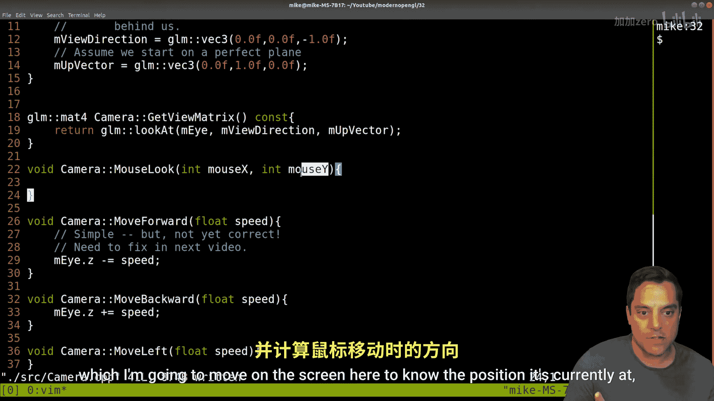
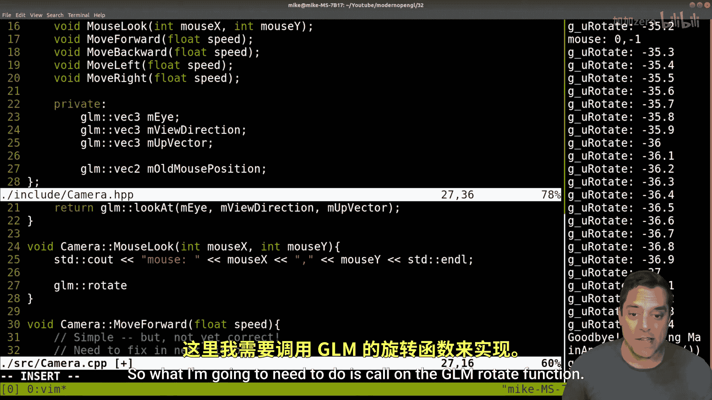
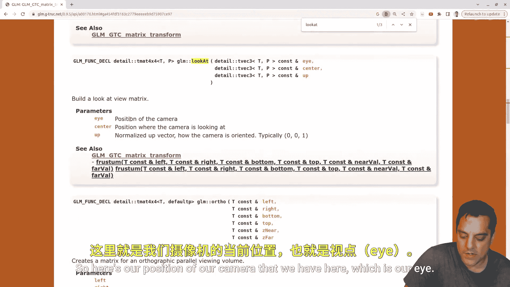

# Mike Shah【中英⚡OpenGL导论｜Introduction to OpenGL】 p33 P33 OpenGL -Episode 32- Camera -- first person mouse look -BV1pTvFz3Eqh_p33-

Hey， what's going on folks It Mike here and welcome the next lesson in our modern Open GL series In this lesson。

 we're going to go ahead and continue working on our camera。

 So if you didn't see the previous lessons， make sure you go ahead and check those out。

 but let's go ahead and do a review and then we're going to go ahead and implement a first person like camera in modern Open GL。

 So let's go ahead and just do a brief recap of what we did。

 I'm going to go ahead and rerun our program here and we'll do a brief code review of what we've added since the last video but basically what we've added this time with our program here。

😊，Is well， we've got our rotating quad， and I can now use the forward and backward arrow keys or up and down arrow keys to move forward and backward in our scene。

 And basically， what we've done here is adjusted our eye position to move forward and backward。

 But if we're going to want to do a sort of first person like camera。

 we're going to need to use just a little bit of math to rotate about a vector。

 which is what we're going to cover today。 But first。

 let's go ahead and do a little bit of a recap here。😊，And again。

 here's what our project's looking like。 We've now added a camera abstraction here and an associated camera header file here。

 So with that said， let's go ahead and just do a brief code review here of our project in case you're just jumping in here。

 but in the source directory and in our main directory here。

 let's go ahead and zoom in a little bit here。😊，And again we've been following basically the graphics pipeline。

 we've initialized our program which sets up SDL， our vertex specification for setting up our quads。

 created our graphics pipeline， and then we're in our main loop now what's different in this sort of last few lessons here is in our main loop we've added a camera here。

So I've got our input， our pred and our draw。 So let's go ahead and take a look at both the input here。

Where we're going to be handling events like pressing keys for instance。

 to move our1 global camera and for now we're going to assume just one camera。

 although it's totally realistic in a graphics application that you could have multiple so you don't necessarily want to make this a singleton or those type of things and a real abstraction so some things to keep in mind but anyways we can see how we're just going to use the arrow keys or if you like you can use WAS and D for moving forward。

Backward and then left and right， and we have our associated camera functions doing each of those motions for us。

Now， with that said， let's go ahead back to our。Main loop here and go into the predraw and within our predraw。

 what we're working with here is essentially setting up our camera here。

 So a few of the interesting pieces here。 let's go ahead and see more of our work here。

 We've again for our object got the model matrix。 So that's going to be the quad that's spinning around here。

 but we are now setting up our camera here。 So from our camera we're getting the view matrix。

 So briefly I'll go ahead and recap on the camera class what we're doing here。

 But again the view matrix here。 and that's a U underscore view matrix again using U in front of our variables to indicate that these are uniforms that we're communicating with we are again getting that essentially from GLM。

 we're using a look at function to retrieve the matrix which consists of the I position our view direction and where up is to construct that matrix。

 and then of course， we have our perspective。 and I think I'll actually go ahead and maybe。😊。

I suppose I could fix it in this video。 maybe we'll do a smaller video later actually to clean things up。

 but our perspective is gonna to be per camera for our actual transformations。 So again。

 this could move into our camera class。 So anyways， speaking of that。

 let's go ahead and look at our camera abstraction in the include folder here。😊。

And we've got a way to get back our matrix， as mentioned， a few helper functions for moving around。

 and then again， the components that make up our look at matrix。

 which ultimately is what we're multiplying in。As our final sort of transformation。

 Now what do I mean by final sort of transformation， Well， again， what we're doing here。

When we have some vertices， again in local space。They get transformed by some model matrix。 So again。

 let's just sort of draw this in local space， maybe our coordinate system， something like that。

 right， and I'll draw the Z axis as well。 And then we effectively position our object somewhere in the world by perhaps translating it or rotating it。

😊，And then， we have。Now our application of so this is the application of the model matrix and then the application of our view matrix is how we perceive this triangle。

 So the triangle hasn't moved。 but our camera has。 where our eye or camera is again。

 viewing this sort of scene here。 So that's the basic idea here。

 I'll draw an eye or actually sometimes folks just draw like a little camera here with a lens that's the idea here。

 Okay， so that transformation up here in the corner is where we're perceiving our scene from。

 and that's what we're implementing。 and this is the view or the camera space。😊，Okay。

 so with that said， let's go ahead and see what we did on our source and we'll go ahead and make a few corrections so that we can finish off this camera。

So we've assumed that our camera and our constructor is just going to be placed at the origin and again。

 it was important for us to do our right hand rule again with the X Y and the middle finger as our z axis。

 such that we understand we're right at the origin here。

 positive direction is coming out towards me and our coordinate system and negative outwards。

 so that's why our view direction， this next vector is set to negative1 because we're looking out into the scene。

And then finally， up， we've going to pick a default up orientation is aligned with our Y axis。

Now what we're going to find today is that as I turn and again。

 you can think of your camera as your eyes for the purpose of this that you're actually sort of moving or rotating some vector Now again。

 I was rotating there back and forth but again you know use your right hand rule here and pretend it's aligned with the camera well we're actually sort of turning this matrix here that we have for our camera or maybe tilting it and you can see that our up vectors maybe changing a little bit so these are some of the things that we're going to have to calculate in order to implement our movement forward backward left and right here。

😊，So where I'm going to start here for today is to actually。Add to our abstraction a little bit。

 And we're going want to add a little mouse look function here。 So let's go ahead and add it。

To both our header here。 Let's see。 So let's go ahead and do our include。And camera， whoops。

 let's see which director am I in？Let's go ahead and split。And include。And in our camera header。

Lets go ahead and add this mouse look function here。And mouse look for now。

 I'm just going to worry about rotating on one axes。

 I'll leave it as an exercise for you to do on other axes。

 but let's just go ahead and take a mouse X position and a mouse Y position here。

And the purpose of this function， again， is going to be to update our view direction based off of if I'm moving the mouse to the left or to the right here of my screen here。

So let's go ahead and set that up here。😊，And I'll kind of keep things in order here。And。

For our camera， let's go ahead and do a mouse look。

And we said we took a mouse X in a mouse Y position here。 Okay， so in order to do this。

 I'm going to need basically my mouse， which I'm going to move on the screen here to know the position it's currently at in then the change in the direction of my mouse here。

 So again， let's go ahead and highlight this idea。

Here for a mouse look。And basically if I've got my mouse cursor here in the center of my screen。

 I want to know sort of the delta if I move， you know to left here over one frame。

 now it's possible for me to move my mouse really quick and you know measure this change in the exposition here and that's going to tell me how much I want to sort of move or look in one direction here or how we're going to rotate okay so that's the basic idea。

So in order to capture this， we're going to have to work with our SDL program a little bit here。

 so let's go down to our input here。And what I'm actually going to do here is I'm going to want to capture this event here。

 Okay， so let's actually。Let's do an Alice if here。

 And then this is something that I have some SDL videos on， but you can actually just see。

The event that we want to capture is mouse motion。 So that's any time that we move our mouse。 Okay。

 and let's see that's not motion motion， but。Mouse motion， I believe， is correct there。

And what I'm going to do here is I'm going to go ahead and just create some variables to capture this。

 Now， let's go ahead and just put them。I'll go ahead and put them。At the start of our input here。

 I think this is a reasonable place to put mouse X and mouse Y。Store the current mouse position。

Again， I probably don't really need to store these in variables， though let me think about this。

 let's just feed these into our for the sake of keeping things clean here。

Because all we're actually going to end up doing is from our G camera here and it's calling mouse look。

 oh， let's see a certain telein isn't finding it quite yet。

And what I want to capture for this event here that we have here is the motion and the X relative and the。

Why relative motion。Okay， and that'll tell us how much our mouse or where our mouse is moving。 Okay。

 so let's go ahead and just start with that， make sure that I haven't made any silly mistakes and maybe within our mouse look function for now。

 let's just go ahead and print out the mouse X。And I'll go ahead and put a comma here and the mouse Y。

And it's always a good idea when we're printing stuff out to go ahead and print out。

what this is our sort of mouse。😊，And let's go ahead and make this a little bit larger。

 Let's see if we made any piling mistakes， up a couple here。嗯。

So let's go ahead and first and foremost， let's give ourselves a little bit of debugging power in our camera。

Again， we might not necessarily always need the IO stream here。

 but it's a good idea to have it available here。And let's see what today I do here。

 it looks like I just made somepellings here。So， capital M。And let's rebuild this here。No mistakes。

 so let's go ahead and do a run here。And now when I'm over my window and moving my mouse here， well。

 we can see that it's updating things here。 Now I program just running really fast here。

 So it's hard to， I suppose see what these actual values are because we're printing out all the rotation values as well。

 but it does look like we're moving things。 Now I should actually put a comma between those values here。

😊，Let's see here。Oh， maybe that comma wasn't getting printed out here， that's kind of interesting。

And actually， I don't think this is actually being printed out。 I don't see anything。

 Let's just capture this one event here。 I wonder if this is an error in my logic here。嗯。

And let's see here， Let's actually。Let's just capture these in variabless here。 I take that back。

 I will， I will break this out a little bit here。 It's a little bit easier to debug this way passing in the mouse X。

 the mouse Y。嗯。And let's go ahead， and。I do want to。

Since I'm capturing the relative motion here for my mouse X and my mouse y here。

 that is going to be sort of an accumulation， I suppose， of where my mouse was before and after okay。

So I might have to engineer things a little bit here。

 but let's go ahead and see if this starts printing out our mouse position。

Let's go ahead and give this a try here。 And I've got my window here。 And I'm moving it around。 Okay。

 and there we can go ahead and stop。 so you can see that the mouse is moving right。

 either one pixel left or right or up or down here。 right， very small movements here。

Let's go ahead and scroll up a little bit here。It looks like I wasn't moving my x too much， but yeah。

 it's moving per frame， you know， one or two pixels at a time， which is reasonable here。Okay。

 so what am I going to do with this information here with my mouse motion？Is well。

 I need to sort of be able to tell where I was previously and how much I've moved。

 so a couple of ways to do this here。What I'm going to do here for this particular program is I'll actually want to store our old mouse position somewhere。

So what I'll actually do is let's go ahead and。Go into our camera class again。

And I'm going to actually want to store。The old mouse position。

 I'll do it as part of this class here， and that's a V2 because it's just the x and the y position。

Old mouse position here， okay？And basicallyically every time when I enter the mouse look function。

 I'll want to compare where my current mouse x is against the old mouse x position okay。

 and that difference。Or Delta is what' tell us how many pixels that we've actually shifted here。Now。

 let me think about this for a moment。 I might actually be able to get away with this with just the X relative position。

 so let's try it， let's explore a little bit。 otherwise I'll use this old position here。

But let's get to the main idea here of updating our view direction based off of the mouse looking left or right here。

So what I'm going to need to do is call on the GLM rotate function。

 So let's go ahead and bring this in here you just Google GLM rotate。 I want to be looking in here。

And looking through a few of these functions。Effectively what I want to be able to do is rotate about a vector so what does that mean here well again use your right hand rule。

 take your index finger which is your Y axis because we're just worried about looking left or right for a mouse look right now。

So the change in our exposition。And I'm going to kind of want to rotate about this vector here。

 right， just like when you turn your head， it's turning on the Y axis essentially here。

 just standing upright here。So if I look through these rotate functions here， let's see。

 looks like we have some that give us4 by four matrix here。

 let's see these might be what we want here， but really we want to just rotate about a vector right So these are all returning four by four matrices。

 I don't think this is exactly what we want here。 Let's see if we can find I'm going to try to do it through the the documentation。

 I actually know what function I want。 but let's see if I could just try to find it here。😊，嗯。

And I did see it's here。 Yeah， we have a rotate vector here。Okay。

 and this is something closer for what we want， right， something that's giving us a V3， let's see。

 there's a couple of these that do this specifically on like the x Y or z axis， but again。

 the sort of vector that we're rotating about here。嗯。We want something， yeah。

 I think I want this exact one here， let me look at it here。So we've got a vector here。

 some angle that we're changing here， so this is going to be like the number of radians between our x and our our delta x essentially。

 and then this is the normal， the thing we want to rotate about because our vector is not necessarily always going to be pointed up it might happen to be in this case it is for this demo but we still just want to rotate about our up vector which happens to line with the y axis here。

So again。This is what we want here， the vector， the angle and the normal。 Okay。

 so we're going to have to add this header file into our code here， rotate vector。

 Let's make sure that we copy that。

Into our source code here。Which we did not have include。GLM rotate vector， perfect。And in our mouse。

 look， okay， and this one is just again， called rotate。Now again。

 what vector are we updating or looking at here？Well， our view direction。

The difference or the change in our pixels here。 and let's see if we could just get away with the mouse X。

 which was just a relative change right， That's what SDL was giving us here。 I was saying， hey。

 what was the relative mouse motion between moves here now I do want to be careful I want this to be radiance Okay。

 when we're doing rotations。😊，And we're rotating about our up vector here。Okay， a vector。

Now what's being returned here is the new view direction Okay， for this vector here， right。

 here's our angle that we're looking。 and then or one vector。

 and we want to rotate that about some number of degrees， this up vector Okay。

 if that makes sense here to give us a new vector here updating our view direction。 Allright。

 so let's see if it's as simple as that， let's go ahead and give a run here。😊。

I' go ahead and compile whoa， we get a bunch of errors here。

 I'm going to have to eventually check this out here。 Let's see it's complain about GLM radance。

 Let's see if I did that right。Probably only wants a floating point input， okay， fair enough。

I could cast this， let's see， float MX equals mouse x。Let's go ahead and cheat。

 and then I'll do a proper。Cast here。Okay， let's just go ahead and see if it's just that simple here。

Okay， let's go ahead and get our program here。 go ahead and pop in our window， move our mouse around。

Yeah， look at that。 It Looks like it's， it's doing some sort of rotation here。

 maybe in the wrong direction here， but I can sort of move forward and back。

 And let's see move my mouse to the left mouse to the right。Okay， whoa。

 it's doing something kind of interesting here。 We're getting a weird， like rotation here。

 interesting， interesting。 Okay， so it looks like we're gonna have to do a little bit more work here and actually keep track of the deltas between where our mouse was and and and previously where it was So I'm going to do just a little bit more work here。

 We do want this old mouse position here。 So let's actually create a。😊，AVec2 here。

 And what I'm actually going to do is just store that as the。Herurned mouse， okay。

 and that's going to be whatever's coming in here。And and why I'm doing it this way is because if you eventually want to do this with the。

X in the Y axis so that you can look up and to the left and to the right and have a full start of mouse look。

 you'll be able to just get a delta very easily here。So that's the idea here。Okay。

 and then we have our old mouse position here Okay， so at the very end of this code。

 and I'll comment this and go through it again here。😊，Our M old position is going to be equal to。

 Well， whatever our current mouse position is going to be。 Okay。

 and we want to take the delta between them here。 So I'm gonna to need another vector here。

 I'm gonna to call this the Delta。Mouse or something or mouse Dlta。That it's probably a better one。

And I want to take the old mouse position okay， and subtract the current mouse position。

 Okay that gives me a vector or the relative change here。Okay。

 so that means we're going to need to update our SDL code a little bit here。

And really what I want here is probably just the current position here。

 So a few different ways I can do that。 I can keep track of the mouse。

 This is how I've done it in the past here， where I just set the mouse to sort of lock into the。

Center of the screen and then I can still do the relative mouse coordinates。 that's one way to do it。

 and I think that'll actually work nicely because that way you won't be able to move outside of the window。

 So just a little bit of setup here that I need to do and let me take you down to the main loop that's usually where I set this up。

 So before our actual loop runs here。😊，These functions are to warp mouse in window。

And then this is our。Graphics A window。And then whatever our screen with is divided by  two in the screen height divided by  two。

 Okay， so I basically just want our our mouse to be in the middle here。

 And then there's another one here， set relative。Mouse mode。To true here。Okay。

 so let's go ahead and just compile this see if I've done any mistakes here， I gotta get rid of that。

Okay， and then let's see here。For our mouse positions here。Again。I'm just going to align these。

 This might be a little bit overkill here。嗯。But again。

 I just want to make sure that these are set to the middle of our screen here。Okay。

 because that's what we've effectively done。 just locked our mouse to the middle of the screen here。

 And then when I'm updating these， I'll just do like plus equals here。 Okay。

 and that way we'll have the current position plus equal， you know。

 if I move my mouse to left a little bit or to the right a little bit。 Okay。

 so that's the idea there。 and now I should be able to come back here。

And let's take the radance here。With the mouse Delta now and just the X component。Okay。

 so let's go ahead and just compile this， see if it's working。

 let's get a little progress snapshot here。Bring in my window。And then I'm moving my mouse around。a。

 it's got a little bit wild still。 So what's going on here。

 Well there's still one more issue I feel that we need to sort of take care of here。

 And that's sort of this initial like mouse location。 See how it's just kind of getting stuck here。

 So I'm actually gonna have to alt tab out of this program here Let's see if I can I can move back and forth。

 again， the mouse is responding here。 But let's see I got to kill it here。😊，With alt tab。And yeah。

 let's get to our terminal and kill it。And fix up a few more things here。

And if you'd run into this issue， I think part of it is。In our actual camera class here。

NowIf I scroll down here。You know， what's the initial value for this？ Well。

 I could probably set this to well， what I just did in our SDL program here。

 So there's a few ways to deal with that。 What some folks do and I again。

 I'm just going kind of hack this in here is just say static first look。Equals。True。

And then what I'm going to actually do is capture。Our old mouse position here。I'll say， if first。

 look。And there's other you know， more elegant ways that you can do this。

 meaning there's like a C+ plus a call once type of function here where we could initialize these things here。

 but basically I just want some flag that calls this ones here and sets our old mouse position equal to the current mouse just for this first iteration here。

So that there is something when I take the mouse delta， this first time it's just going be zero。

 So it's not really going to rotate our vector in any meaningful way here。

 but then it will after this subsequently be able to take a deelta here。 Okay。

 so now let's go ahead and compile this。😊，Oopps， I need to declare this as a bull。

In writing too much D language where it'll implicitly set the type here and let's see here。A okay。

 let's go ahead and move this up here。And let's go ahead。And compile that。Let's give that a run。

And let's see what's going on here if I bring my window in here。 Okay。

 move my mask to the right to the left。 Still a little bit shaky。 So what's going on here。

 We've gotta make some other fixes here。Let's go ahead and alt tab out of that。

And since we're getting that sort of shaky movement， that tells me。

My mouse X and my mouse Y and just kind of looking through these。

 I know they're locked somewhere in the center of my window， which is 640 by 480 or so。

 It doesn't look like they're really updating right it kind of stay locked。

 So it's shaking back and forth here。 So that gives me a little bit of a hint here。

If I go into my input function， which is being called that oops， I make these again。

 I'm going kind of cheat here static variable so that they're initialized once。

 but they'll actually preserve and accumulate again this this value here。

 And this is where you might want to use like SDL git mouse state here and maybe just figure out the position。

 Maybe that was the better way to do this。😊，But， you know。

 you can choose and play around with it probably a little bit cleaner to have less static variables。

 but now let's bring this window in here。And now I can move my mouse to the right。

 there's not too much of my scene here and to the left， but looks pretty good here。Now。

 interestingly， though， I'm going to go ahead and press the down arrow key and the up arrow key。

But if I'm looking to the left here， and let's see， where am I， It's kind of moving weird here。

Let's see here。 if I'm moving up and back in my view direction。 I'm kind of backwards。

 this is kind of weird here。 Now， why use this here。 Now。

 let's go ahead and update our our camera here。Well， now we've actually got a， we're almost done。

 almost got our camera fixed here。So if I go back into our camera。😊。

Let's look at how we're updating our position here。

 And this is where I left you off in the previous video saying， well。

 it's not enough to move our Z position forward and backwards here。

 Would we actually want to move forward in backwards or update。Well。

 our Z position we actually want to update so where our camera is or our eyes based off of the view direction。

 Okay， that's where we want to increment forward or backward。 And again。

 negative Z is sort of going into the screen。 so we kind of think of that as forward。😊，So really。

 what we want to do here is do something like the view direction times the speed because we'll actually scale this。

😊，And that's where we'll update our entire eye position right because it's not enough to move。

 you know， if I turn a little bit to left and walk forward。

 I don't want to just update my Z position， I want to update my X， Y and Z。

 So the x and the Y and Z position where I'm looking on。

I'm going to go ahead and repeat this change here， except for're moving backward。

 we're going to go positive here。And let's go ahead and see what this does toward our scene here。

Okay， if I recompile。And now let's bring our window in here。 and I'm going to rotate here。

For arrow key hoop looks like I'm going backwards here。 So maybe that's not quite right here。

 I'm being still off just a little bit here。 I shallll have to figure out here。

 but this is getting us closer to where we want to be。 Let's see here。

 Now I've just got to make sure we're rotating about the right angle here。

And if you start getting this weird behavior， there is something that's not quite correct here。

 this might have bit of a mistake from the last video， but let's look at our look at function here。

So I've got my eye here， my eye position。 and let's go ahead to the open up the documentation here。

 Let's see if we can search here functions Now we want。Fileles。

 let's see if we can find our look at here， that might be faster to just search it。诶。

Let's just search it in Google here。look at。And let's take a look here。

So here's our position of our camera that we have here， which is our eye。 I agree with that。

 the center position of where our camera is looking at and up here。 Okay。

 so's a little subtle mistake here。

But if my view direction is always changing and I always want to sort of be looking like forward。

 right， that's what I'm updating and rotating about。

 But if my center is where my view direction is well。

 that's right initially right to always be looking forward。 But as I'm updating it。

 I actually want to be where my camera is and then forward where that is So this is actually gonna to be the eye position。

😊。

Plus view direction here。Okay， I'm not sure to give us the correct result here。

 Maybe that was giving us some more interesting behavior before。

 But let's go ahead and see what we got。And let's bring in our window here。 Okay。

 that's looking more promising。 I can move around here。

 and then I can move forward and backward with my arrow keys。

Well the mine are still a little bit backwards here。

 so maybe I didn't subtract or something properly here。But this is looking much better here。

 I've effectively got a first person camera where you can， you know， rotate backwards and forwards。

 Okay， so one little last bug here， let's see if I subtracted my vectors in the wrong order or something。

😊，And I suspect I just need to reverse my forward and backward。 Yep， yeah， forward。 let's add。

There we go， and let's subtract here。Okay， and let's get this。Work in here。Recompilling。

And I think this will be for the last time。And yeah， that's looking good here。 Well。

 wanna crate maybe be a plane or something， but now I can actually look around。 you know。

 with just this here， this mouse look and be able to move forward and backwards。

 I can now look anywhere in my scene here。😊，Okay， so I think what I'm going to go ahead and do here since this video is long enough is give it a little pause here。

 and then I'll leave it as a challenge for folks if you want to go ahead and now that we fixed this think about how you want to implement move left and move right and the tricky or interesting part about that is actually being able to move forward maybe turn a little bit and then your left is now you know to your left where it is。

 I mean that's easy for us to understand as a human but think about it from a coordinate system here where I'm actually rotating or updating this sort of camera matrix and then moving it in some other direction versus always just moving it forward and backwards or left and right right after I've turned left and right has changed a little bit。

 just do that little experiment with your hands there and I think it'll make sense here。😊，Okay。

 folks， so with that said， thanks for joining me on this lesson here。

This is quite exciting here to actually get this camera working and being able to move forward and backward here as I play around with this。

 but you can see that we have a functioning mouse look I mean if you're building like a space game or something where you're moving around。

 I mean this is effectively all you need you can now control things with your mouse The other challenge that I'll give you is when you do the sort of pitch up and down by moving your mouse up and down。

😊，And you may want to constrain this， for instance。

 for how character can move their head up and down a certain amount of degrees， again。

 have fun with it， experiment and keep playing with it。 That's the idea。 Anyways， folks。

 thanks for your time and attention on this lesson。 Hope you enjoyed it。

 and I look forward to seeing you in the next one。😊。

