# Mike Shah【中英⚡OpenGL导论｜Introduction to OpenGL】 p35 P35 OpenGL -Episode 34- GL_FLOAT enum vs GLfloat type bug fix -BV1pTvFz3Eqh_p35-

Hey， let's go on folks。 It's Mike here and welcome back to the modern OpenGL series Today。

 we're gonna go ahead and make a few little corrections and improvements to our codeb just some quality of life things before we keep adding features。

 but with that said， I want to make sure you know of this announcement that this course playlist is now on courses msha Io so you can sign up for free the same lessons that you're watching on say YouTube and a distractionfr environment and again hopefully that'll be useful for you for just tracking your progress and there's discussions and so on that you can participate in。

 but anyways with that said， let's go ahead and get into our openGL code here and make just a few small improvements。

 this will be a short video here。 but as far as doing this I always like to do code review here again looking at our program again from the main here where we initialize our program set up openG our vertex specification where we're setting up all of our geometry getting things ready for our pipeline。

 creating our pipeline and then ultimately running in our main loop。😊。

The little corrections I want to make here first and foremost are to go into our let's look at our vertex specification here。

 Now there's this a little tiny error that I made， but it's something very subtle。

 Some pointed out in the comments that I wanted to fix here。 So we've got our vector of floats here。

 This is gonna be our data for making our rectangles or any geometric data that we have。

 We generate our vertex array here。😊，Bd to it and then our bind for our buffer object that we create here。

 Now all of this is looking pretty good here， except there are a few places where I've messed up and I've used G underscore capital F for float here and that's in aum that's not an actual size here so let's actually look at buffer data here Now we might get lucky in this value it might be 4 bys the same as a float on this particular architecture。

 but those things could change。 So if we go to open GL the types here basically what we want here is this guy here G float and there is a common aum for this and the nuome is something that's supplied inside of open G when it's like asking for a type here or maybe select answer。

 but really this is what we want this float that's a 32 B or4 byte thing because these are the sort of guaranteed whatever platform you're running on open Gl has a type death or an alias。

😊。

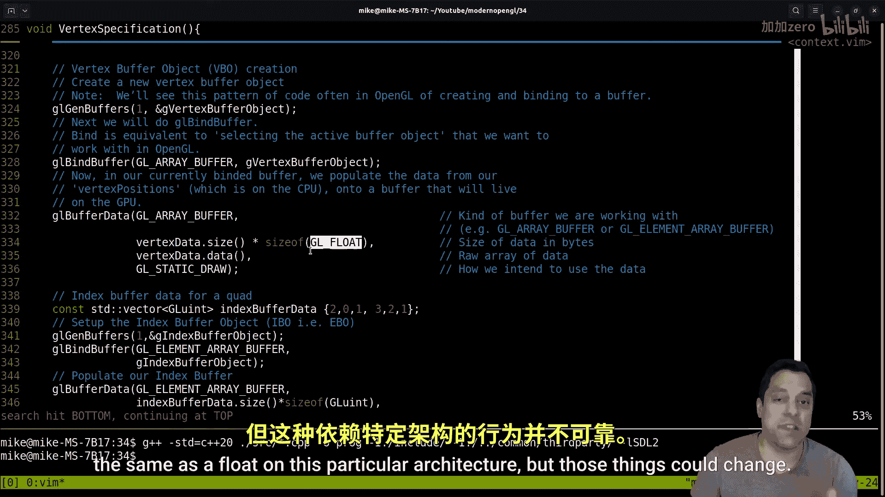

That GL float will make sure it's a 32 bit version of a float。

 so you know maybe later on in you know， history we'll get floats that are by default， you know。

 64 bits and then have to use a half floatat or whatever on some architecture that's 32 bits。

 It doesn't matter All you need to know is that we have this GL float here。Now。

 if you look at just a little bit of hint here on how to try to avoid this thing like GL vertex a Tri pointer。

 Okay， it's asking for GL size。 let's do GL， what were we GL buffer data here。 Okay。

 so it's also looking for a size here， GL size I pointer here。

Let's see what I provided here for the pointer here。 Yeah。

 I gave it a size of something GL floated here。 but again。

 if I look at this little chart on the open GL types from the open GL wiki you'll notice that Gl size I point It's on this left side of this column It's not asking for aum let's see if we could try to find a function that has aumm I think I had one up here。

 right like Gl bind buffer has a GL a num type here So again。

 you're looking for things that are all capitals。 theums that open GL tend to be all capitals。

 it's a little mistake that I made here。 So basically in this video。

 I just want to get our code a little bit more correct and use GL float like is specified over here。

 So GL and then float and we're gonna try to find as many of those as we can here I think I did it a few times I did it correctly here on our buffer data I don't know。

 I just got lucky that those were four bytes。 So again。

 there's some of these little subtle things here。😊。

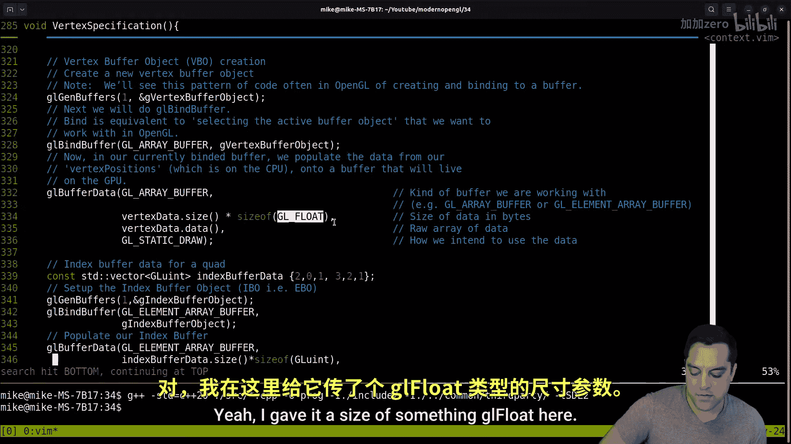

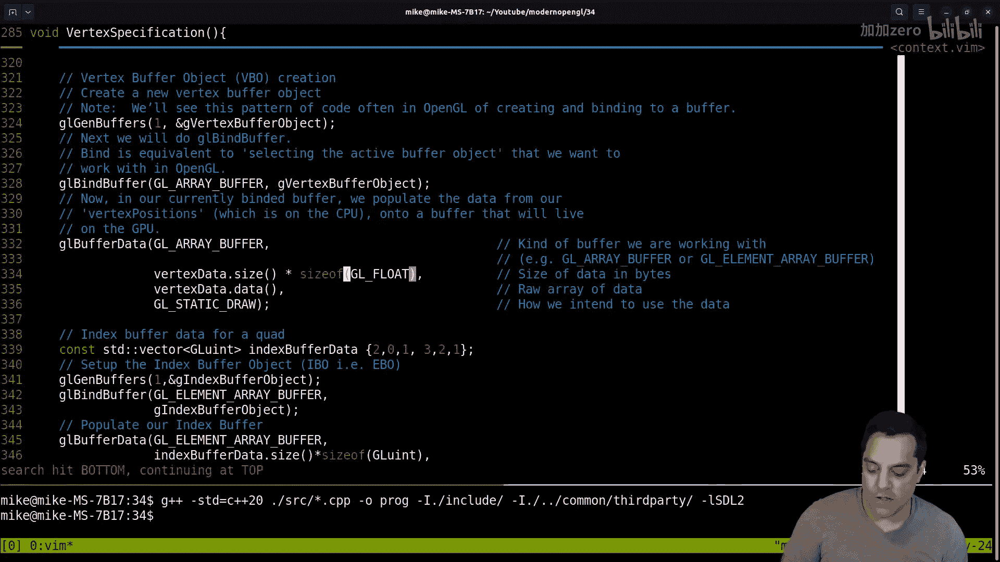

But I want to make sure we have as good of code as possible so again GL vertex a Tri pointer。

 let's make sure that I did that correctly as well as it's looking for a size I thing which shows up over here as a size I thing。

 so something just to keep in mind。😊。

Now these are。You know， little things that I would say are just important for reading code in general。

 Let's see， is the data normalized。 Okay， is that in a num or and here's an example。

 let's see G L vertex a trip pointer where it is taken in a num。

 So that's something that's all capital。 And I wonder if GL and num should have been all capitals here just to help me remember that。

 And then let's see G L Boolean for normalized， let's see。 Now I put G false here again。

 that might be incorrect。 Let's see what the documentation says if I go here for Boolean。

 I think it should just be a type here。 Let's see here。 I guess I're just putting in false here。

 interesting。 I wonder if they've Yeah， I guess false works there。 So let's let's do that here。

 I wonder。😊。

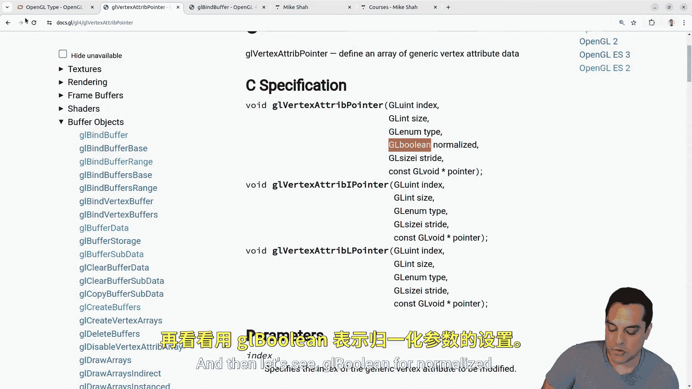

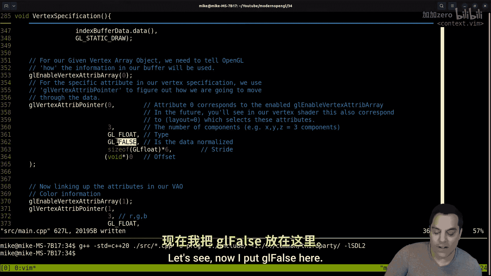

That was causing any issues here， say false， and let's go ahead and do false here and make sure that our size is of the actual。

Type here， same thing for our offset， right， We want to actually offset by the correct amount of bytes there。

 Okay， so that's looking a little bit better here。 I'm going search in a second here。

 let's see if I did any other weird mistakes here。 Another example of where you have G clear。

 and these are anums here。 Let's see here。 if we look at a documentation。😊。

G out there。Well just make sure that we're not doing something weird。 Oh。

 I guess these are bit fields。 I mean it's telling me explicitly what to choose here。 Yeah。

 they wouldn't be a nuoms bitfield。 Okay， so again。

 just a little bit more on how to read the documentation。 So hopefully that's useful。

 And then let's just do some other searches here again。

 looks like I've made this mistake a few times GL uniform matrix for F G L uniform matrix。😊。

Well， these are all going to be pretty much the same here for。F， let's use the open GL ones。

 let's see normalized， normalized。

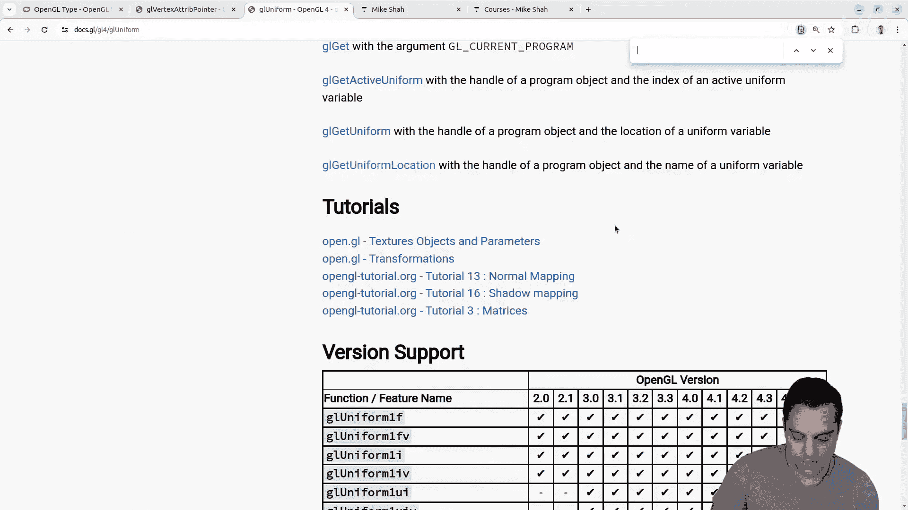

Let's see what parameter was that？Let's see。 Oh， actually， that's for， let's see GL uniform matrix。

 the third parameter。 Let's see。 is that for doing the transpose， Yeah。

 GL Boolean I could just supply false there is probably okay， but let's。Set these here。Bs。

And false that's quite a subtle thing， I wonder if it was making any difference I mean we're going to rerun our code and see if we get the same thing that we did in the last video here。

In a moment here。Here's another GL false。Alright。And again。

 this probably didn't make a difference at all to anything that we are doing in our code。

 but just want to make sure that we're super， super precise and we always want the best because I'm building up every single line of code that you watch in these videos for what we have here。

 So let's see if we find actually。😊，What I want to do here， yeah。

 I can just do GL false do I have that anywhere now interestingly。

 I do have the result here that I'm checking if it's equal to GL false here， Inter。

 interesting that's all' need to think about here for our compile shader here。😊，Well， let's see here。

 let's see GL git Shar IV， okay。

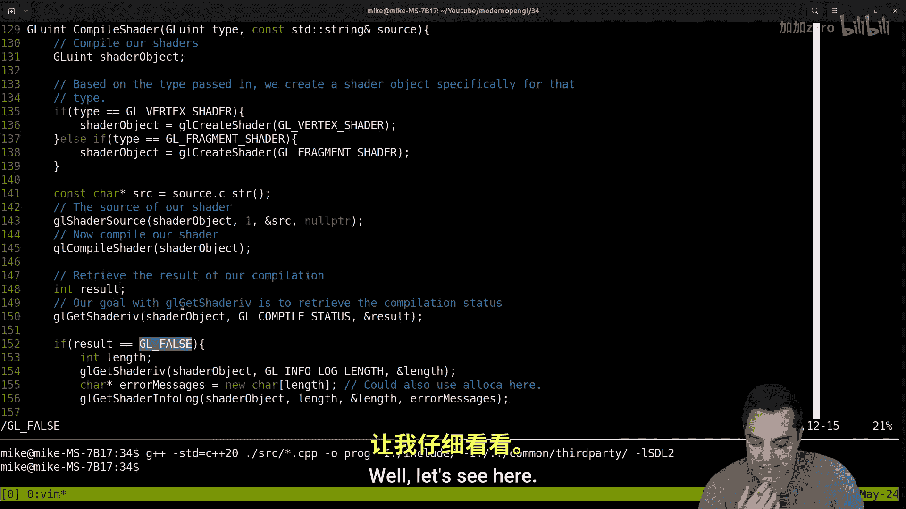

Let's go ahead here。To illustrate IV， let's see what the type is。

Let's see it's getting the parametersms here。

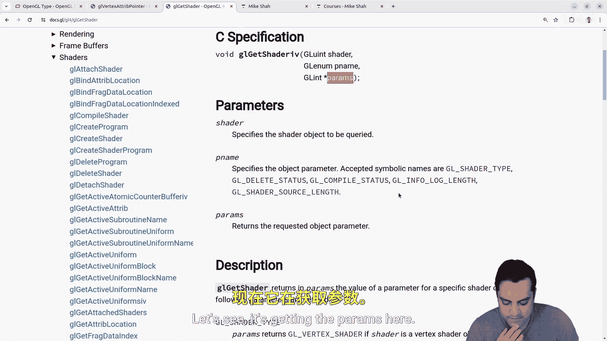

Returns are requested。 let's see here。GL shader IV， that's what we're writing in。The results here。

 And then I'm just checking if the result is false。

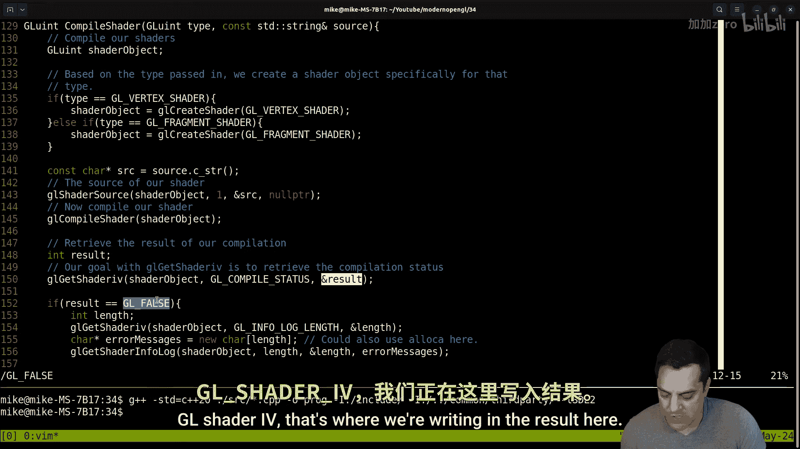

Let's see， Ge。Get shader I V。 That's kind of an interesting。

 I wonder if I'm doing something with like an open GL 3。Interesting。GL get。er。IV。Let's see。

 Maybe I clicked on the wrong thing here。I wonder why I've got， oh， sorry。

 I'm just looking at the wrong thing。 that is with three parameters。 Let's look it up here and say。

 why is that four parameters。 Okay， result parameterss。This is giving me a GL in。

 so int result is okay here。GL false， I suspect， is just zero。

 that's what's going to give me as a result。U。That's okay。 the aum there。 I think that's right。

 Let's see if there's any code here。 And again， sometimes you just have to look for and and see if there's an example。

 Yeah， they're using like。Gl underscore  true。 They are using the nus here to test against 0 and 1。

 Okay， so I'm okay with that against the actual type here。 Okay， so anyways。

 let's see if we find anywhere else where we're looking at the size or something。 because remember。

 a nus in C code or just integers。 So those will tend to be 4 bys。 And that was the whole issue。

 So let's look at G float。 now we did see this for a type。 that is okay。 Okay。

 so that is for the a num here。

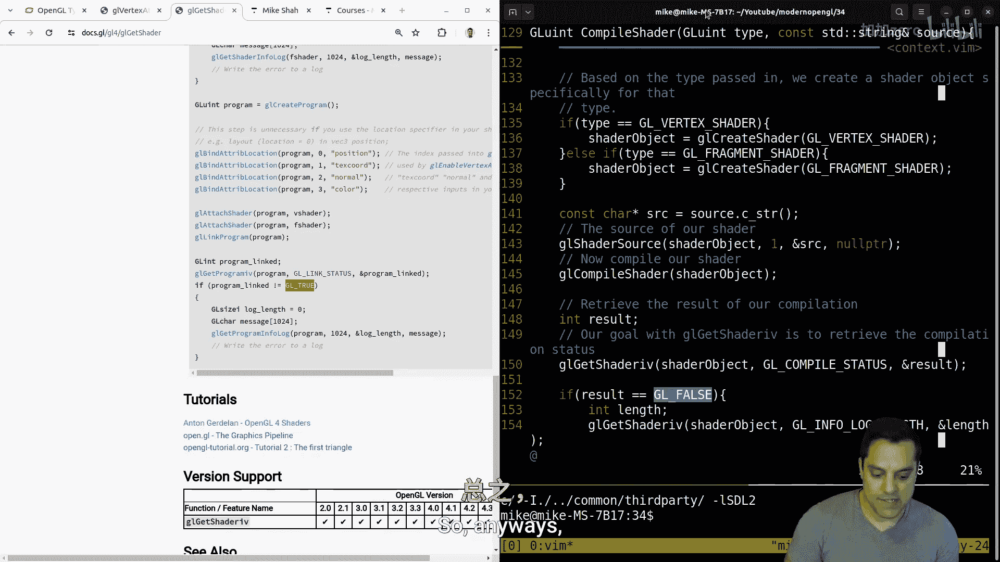

Okay， so that looks okay。 So we've made some code corrections。

 we can go ahead and move forward with these videos。

 Now the other thing that I wanted to go ahead and do though。😊。

Is I want to look in our main loop and just one little quality of life thing that I want to do here。

 Let's go to our input。 I want to add a way to escape or quit our program。

 So basically I want to check check for the I could do it here in the event type So we have for a quit event here。

😊，I could also just。I tend to like to use an SDL that gi keyboard state。

 Let's just do that here and basically what I'm going to do is and I'll bring in from the SDL documentation just you can see everything just looking at the scan codes。

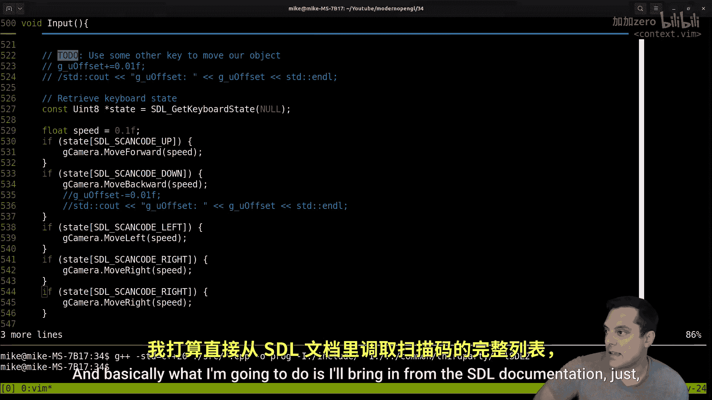

I want to look up SDL， scan code， escape， and that looks like the one that I'm going to want to bring in here。

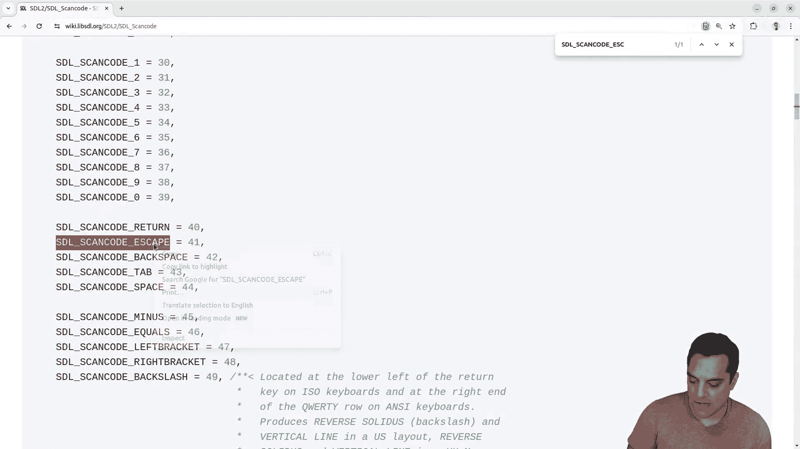

And let's go ahead and just swap that in here。And what I'm doing is I think it's G quit。

Equals false here。Okay， and that's what's going to terminate me Oh， actually true， Okay。

 so kind a little error here。True okay so that's that's the state we do want to quit。

 And if I go to our main loop here。 that's just a global variable for Qui here。

 Okay so if we go to the top of our application again I know we've got a lot of globals here。

 that's for learning purposes。 That's fine。 That's go tell us if we quit or not So with that said。

 let's go ahead and compile this using this command on Linux to bring our source files。

 bring in the GLM library， bring in Glad and so on and let's see did we mess anything up nope。

 not yet， let's see we should see the same result of our program as previous Another trick is I'm just going to have to bring this window to you there we go。

 Okay， let's go back in here。

And if I use my arrow keys let's see here now the windows in focus。

 we're still rotating everything's looking good。 our shapes moving slowly and surely and I should be able to hit the escape key capture the escape event and there we go Now now again our windows locked because I did that for the mouse look that might be something that you want again to like hit enter and disable and enable or something again you can decide if that's like annoying just to again like release your keyboard so you can do your SDL development but that's the basic idea So anyways folks with that said。

 hopefully enjoyed this lesson and we made a few little corrections here。

 learn a little bit more about reading the documentation which is always useful and as mentioned you could track your progress here feel free to discuss anything if you ran into any errors but otherwise I know we took a little bit of a break from the OpenGL series we'll go ahead and get some more videos throughout the summer of 24 and beyond and as always folks look forward to your discussions and thank you again for your time。

😊。

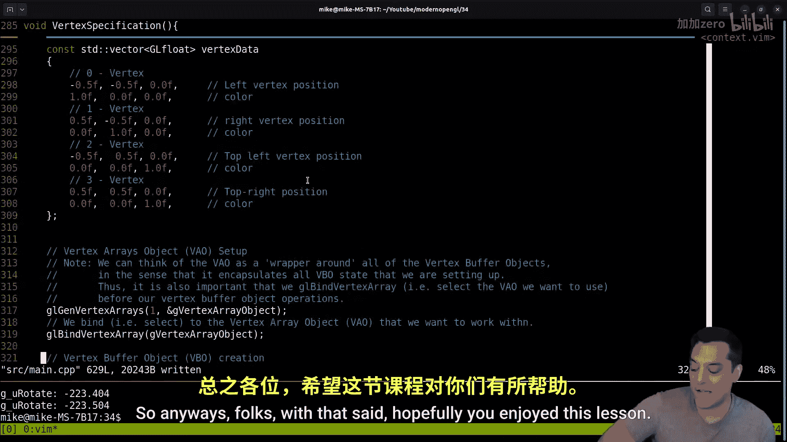

And attention。

