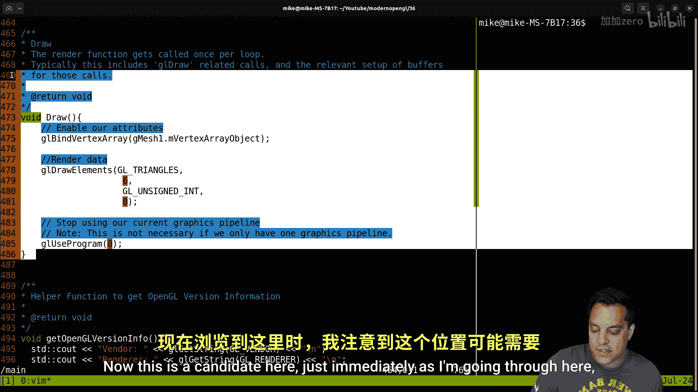

# Mike Shah【中英⚡OpenGL导论｜Introduction to OpenGL】 p37 P37 OpenGL -Episode 36-  Mesh Abstraction Refactor Continued -- two quads -BV1pTvFz3Eqh_p37-

Hey， what's going on folks It's Mike Karen and welcome back to my modern openGL series and today's lesson we're going continue our refactoring of our graphics code or our little graphics framework that we've been creating and ultimately our goal is going to be able to understand how to render not one but two meshes。

 So with that said let's go ahead and dive in here and basically what we've got here let's go ahead and resume from what we have last time here I'll go ahead and just show our window here and。

😊，Let's go ahead and give this a run。And let's see if I can just tab over to my window here。

 I bring it in here and this is basically our graphics application that we have here。

 I'm moving the mouse around， I can move forward and backwards and perform some transformations。

And we'll go ahead and take a look at this code here。

 So if you haven't been following along with the series。

 you probably need to follow along at this point， but we'll do a little code review as we always do。

 and I can escape to exit here。 Now here's the structure of our project again we've kept things pretty clean。

 I know I'm putting a lot of things in the main do c。 that's fine。 We can refactor them later。

 but it is nice to just kind of overview everything in one file for now。

 Now what we are gonna do though today is let's go ahead and take a look at our source in our main here。

😊，And figure out how we can get actually two objects rendering today。 So from the last lesson。

 we basically did a refactoring where we have all of our important stuff。

 all of our globals in this app class here。 or this structure here。 So everything's just public。

 And this is holding stuff that's generally sort of global data。

 but you can still have an instance of it， For instance， one camera per application。

 you've got one shader pipeline here。 Again， we could go ahead and have multiple eventually or have some sort of managing class for that。

 That's the type of abstractions we can add later。 But basically。

 this is just holding the state of our app。 Is it running or not， What's the size， What's the window。

 the open GL context and so on。 And then last time we also worked on。😊。

A mesh 3D class here Now the important part of the mesh 3D class was again to get rid of some of our global variables and just have the vertex array object。

 which holds a sort of state， the vertex buffer object and the index buffer object if we so choose now again with our mesh 3D class。

 we might have some considerations like for instance。

 is it gonna to be something that's just a bunch of data so we can just do Gl draw arrays。

 or is it gonna to be index again， those are decisions we can make later on once we get this working and then we have some important uniforms here for controlling things like offset。

 rotate and scale right now， which are the values that are changing when I， for instance。

 move with the arrow keys or otherwise rotate the shape here So we're gonna want to improve on this abstraction a little bit here thinking about how we create more meshes and how we place them with the actual transformations because right now we have these offset values but maybe we can think of some different ways to transform things so anyways。

 let's go ahead down to our main here。😊，And just do a brief code review so again we've got some code to initialize the program again that's just going to be a C function。

 We pass app in vertex specification right now is for our one mesh here we're probably going want to rename this and then have some way to create meshes now we could do this as part of thestruct as part of a constructor or we could just have C functions for instance which we pass resources in the choices really your for how you want to do that I'm going to do more of a C style approach here just because it's a little bit more portable across languages and there might be other reasons why you like to just have that sort of abstraction。

 I mean this is just sort of an object oriented C style here then we'll create our graphics pipeline or any shaders or resources that we need and then of course execute our main loop which is going to draw well half many meshes that we have here right so let's go ahead and get into it here So again our cleanup functions here's our main loop which is input pre-draw draw and then executing the swap operation from our front and back。

😊，Buts。And let's see here， then we've got some input here。

Some helper functions here， a draw function。 Now this is a candidate here just immediately as I'm going through here that we probably want to do something with our mesh。

 for instance， pass in a particular mesh here。 so let's just go ahead and kind of refactor these as we go here and collect some of these functions。

 Let's do a mesh 3D here。

And I can either pass in a pointer or I could pass in a reference to this mesh again。

 the C style is going to be to pass in a pointer here。

 so let's just go ahead and just call that mesh here。

And then I could just do mesh the vertex array object。

 I can do some null checks here if mesh not equal to you know， null pointer。

 something like that here。And then I could just return， for instance。

You know we might want to have some safety checks for these types of things here。

 but that's the idea here。 So this will just basically set active R mesh by binding to the vertex array object and that's just going do GL draw elements。

 So we are gonna want to maybe have some control over this meaning getting like the mesh data is to say GL draw arrays or GL draw elements。

 but again let's let's assume we're just drawing quads for now。😊。

And we might also want to change the。Particular pipeline that we're drawing。

 so again we could just make our draw mesh very generically take the mesh and then the pipeline that we're going to use to draw with it。

Let's go ahead and。Kind of move this up here， let's see here， and I'm going to update our comments。

 draw mesh。And think about that little design decision here again。

 that's kind of the nice thing about just having functions here。

 I mean Opengeal already is just a C based API， so we always have to remember that so we don't want to you know overcomplicate things sometimes adding too many layers of abstraction Anyways。

 let me see I'm just scrolling up here let's find our。😊。

I guess it's just going to be in the vertex specification。 I just kind of want to。Mash 3D。

 let's see where is ourstruct here for that。There it is line 42。

So let's go ahead and put some of these。Helper functions below here。And then I've got my global。

 So again， maybe this will be the lesson where we。Refactoror things just a little bit here anyways。

 we'll think about doing that。嗯。So one of the design decisions again that we could say is per mesh。

We call GLU's program and it'll take in a pipeline that we want here。

 so let's go ahead and just do that。Let's go ahead and。Yeah， let's just call it up here set our。

Pipeline。Set up which graphics pipeline we are going to use。And I'll do a GLUs program。

And let's just go ahead and call。AGOUin。The pipeline。And that's it here。

So basically this is the idea here， I'm going to add a few notes here， note。

We per mesh choose the graphics pipeline that we want to use。Generally。This is not very efficient。

To change state。And that means the pipelines。😊，Very frequently， okay， but you know。For learning。

 purposes or flexibility。This is interesting or useful。 This is let's just say useful。

 This is where we're learning this stuff here。 So again， all I'm saying is， you know， ideally。

 you'd have a bunch of mes that you wanted to draw and you just call you know。

 use this pipeline with this vertex shader and fragmentma shade or whatever and then just draw all them you're not switching every time and turning on and off。

 I'm just gonna do this for simplicity because I think it works well。 but again。

 that's why I have this note here。😊，Just to make things kind of work nicely here Okay now there might be other things that we want to do with the mesh like have control over the elements。

 but again， maybe we'll revisit that in the later part here Okay now let's go ahead and keep exploring our code。

 we want to refactor a few more things here so we can ultimately draw multiple meshes here and again just think about our software architecture a little bit as we go here let's see we've got our initialization aha this vertex specification。

😊，So I'm going to call this something else here， so setting up your geometry during the vertex specification step per mesh here。

 okay？And we should just probably call this like mesh data or something like setup mesh data。

Maybe mesh data。Pertex。Spation here， I don't mind long names arere a little bit annoying。

 I sort of want to start everything out with mesh just so we can see them here， but again。

 the idea will be that we just pass in a mesh and we're able to specify what sort of data that we have here Now again for this lesson here I don't know if I want to start passing in different types of data here we'll think about that that could be another lesson here because ultimately I just want to draw two things here。

But again， you can see that we have this flexibility of per mesh it's setting up the individual vertex array and the buffers and so on and again these are the types of things if you want to get super super efficient you would try to pack maybe multiple objects in the same buffer object but again。

 don't care about that for this type of lesson but just want to mention those things if you want to know how the pros might think about some of this stuff So this otherwise looks good to me。

 it is doing a lot of work， but that's okay so let's just go ahead and move it up。

Let's go ahead and highlight this。And let's move it with the rest of our mesh functions here。

Or our one other mesh function。Let's see here。All right。

 so we will have mesh data vertex specification。I'm just going to call it mesh data。Mesh data。

Or maybe just mesh crates is better。 mesh crate is probably more meaningful term here。

 drawaw a mesh and mesh crate。 and I'm actually going to list these out in sort of the order that you had use them。

😊，Let's see how we think about that here because you're going to want to createate the mesh first and then draw the mesh again。

 this is just me being a little bit precise with how I'm setting up these things here。Okay。

 and now let's see where else we' we doing interesting stuff with our meshes。

Beyond drawing them okay so here's some air checking code here。

 the shader compilation again we'll have to move some of this stuff into different files so we're not scrolling forever。

 but again it's a good overview of our program predraw is kind of interesting Now predraws where we are setting up what we want to do with our meshes here basically updating the transform。

 So let's think about this here again， this is something where I could pass in a mesh here。😊。

And let's just go ahead and call this mesh update I'm going to pass in a mesh 3D。诶。

Let make sure I did that right yet。I'm going to pass it into as a pointer and just call it mesh and let's begin refactoring a little bit here。

So now I'll be able to create multiple objects here。

And we can see that we're accessing the appropriate members here。

Let's see here I'm going to do these one at a time here just so we can kind of recap what we've been doing so that looks good here。

Now this is kind of interesting here because this is part of our meS update。

And we're using some shader here。 Actually， maybe this was the right spot for me to pass in what pipeline we're actually going to use here。

 Yeah， let's think about that。 I might need to refactor that a little bit here。 Okay， that's okay。

 I'll come back and revisit this in a moment here。Let's just get all of our values updated here。

Let's try to get everything sort of fit on one screen there we go。Um，Let's see here， okay。

 all of our global mesh stuff here。呃，Msh。You scale。

 I guess I just put uniform scale here just so it was nicer to write here。

Let's go ahead and get rid of that we don't need that anymore。Mash and you scale。

And let's repeat that here。U， let's do a。Dot here and。Another one。And let's delete until。There。

it didn't work。Al righty， anyways。Let's see if we type that out correctly， one，2。3， I think so。

 Al right， there we go。 Get rid of a。temporaryemp there。 that's fine。 I mean。

 the compiler would optimize that， but again， that was just to make my life easy。 I guess。 all right。

 let's see what else we got here。😊，So even with these values that we have here。

 things like the model matrix。These are probably going to be things that we want to actually have as part of our mesh class。

 So again， this could be something that we move in here to our mesh class， this model attribute。

 In fact， let's go ahead and do that。Well， let's finish our little mesh transformation here。

 let me make sure it just like got G mesh almost everywhere。Let's see here。Mesh。

And let's go ahead and continue here。Mesh offset。There we go。I might miss one of these。

 but as you're doing your refactoring， you'll make sure to get all of them， I'm sure。Let's see here。

 okay， so if I go ahead and scroll down now the rest of this stuff is basically to do。

With like the perspective transformation and to be honest。

 this is gonna to belong in our camera class。 so we'll move that in there later on here， but again。

 these are gonna to be things that we're gonna want to retrieve and ultimately set up in our shader here Okay so we got a little bit of refactoring it together there's gonna be a few refactoring videos here as you're watching this let's go ahead and give this a compile。

 let's see if I've messed up anything here there should be a couple errors because I've renamed things Yeah。

 like predraw to mesh update。But。Let's go ahead and call this mesh update。

 Now I do want to think a little bit about what to do with this state here。

 So again there's a few design decisions that we have to make about。Again。

 just controlling how we want to draw this and if we want to do this on a per mesh state。

 usually we don't want to， you know。I'd be doing this per mesh， but again， as I noted。

 that's something that we can optimize away later on here。 Okay。

 so let's go ahead and fix a few of these bugs here。 let's see if we could get something compiling。

Here， let's see。Let's go ahead and just copy。This function。Oop。Msh update。

Let me make sure I got all that here。Let's see here。BAnd then percent selects。There， okay。

And we'll go towards the top of our screen here。And mesh Cate， okay。

Mesh update would be the next thing that we'd want to call。

And let me make sure that the comments are relatively consistent here。

Typically we use this note okay。嗯。Sort of state for our mesh。And we can get rid of this now。

These comments here。I'm going to I am going to refactor this to。

I need to think about this a little bit because we want to be binded to the。

Pipline that we're actually going to be using when we use GLU's program pipeline before we do our update and then we'll just call draw I think that's fair we might again want to think a little bit about this。

Meaning that。I don't know。I guess we could pass it in twice for now now would there that could cause some problems here where I guess we could kind of want to attach a mesh to a specific pipeline I mean that's another way to do it here anytime I'm getting this this duplication here we could just have like a specific function here and then store in our mesh class what sort of pipeline that we're using here。

We could do that。 I think that' that's fair enough。 So let's actually just on the shader side here。

UmGLU int。Hイバイ。Equals0， so this is going to be， this is the graphics pipeline。Use with this mesh。

 okay。Let's just do that that way we don't have to worry about passing in in the update function and the draw like different pipelines and so on that'll just make our life a little bit easier here so then I could just use pipeline。

And pipeline。All right， and then we draw our mesh。We will go ahead， and。Get rid of that。Don't need。

 well， I'll just leave this in here for safety。I'll put a note here， might be redundant。呃。W。

 that's okay， yeah， set up the graphics pipeline we're going to use here。

 we could go ahead and eliminate any duplicate state that we have later on that's that's not a problem here。

Okay， so I'm a little bit more happy with that， that's good here。嗯。

And then I guess when we create our mesh， we could go ahead and set the pipeline here， mesh create。

And the pipeline。呃，3。Pipeline， okay， set up your geometry， set up which shader pipeline。

You'll use with your mesh and you could have some different functions， for instance。

 for you know changing the pipeline or these types of things in various game engines you'll see things like the shader。

 other different state things maybe be like different resources that you can attach to meshes again。

 this is just one way of doing it here。Graphics， pipeline setup。Um， you know。

 and let me go ahead and just say that this。This。Is effectively our constructor。All right。

So I'm just going to say pipeline to pipeline。There we go。All right， let's see what else we got here。

 so we got mesh update， mesh draw and draw mesh， which is going to be named mesh Dr here because I want it to be more consistent。

In my naming。And it makes it easier when I use my Intelence here to have everything。

Just begin with capital M here。Okay， let's get that replaced in our game loop here。Again。

 we're going to have to keep scrolling down here， all right， we initialize our program。嗯。

Let's see here in our inputs， we don't really need to do anything。 I don't think。

Because we just have state within our mesh， let's go ahead and see here。Moving our camera。Let's see。

 where was I updating anything， oh yeah， okay， I got rid of the global values for offsets for moving our objects。

Yeah， and we've had its to do message here for a little while if you've been following this series so we can get rid of that at some point here。

Okay， let's just go ahead and do our mesh。诶。Uッデ。And that's going to be G。It was it Gmech1？G me1。

 so that's the importance of naming things so。嗯。Andtel a sense that our searching is easy so update our meshes prior。

Keep drawing。Um， and let's go ahead and do our draw， our mesh draw。It's got go be a G me 1。

 And I think I'm passing in the address here because we have a pointer here。 so make sure that we。

Do that as well。Let's see here。Okay。Let's go ahead and get this a good pilot。

 lets see how we're doing on our airs。Okay， doing a little bit better here。Let's go ahead and。

Scroll around a little bit， so 646。Okay， this is going to be mesh create。Okay， so I fix up that one。

 I'm going to do these one at a time here。Mesh create not declared here at line， what is the 77？

啊 okay。6，4，6 here， mesh Cate and well what is our crate graphics pipeline here。

 We can actually do these out of order here。I guess because we're going to need to attach a pipeline to our mesh。

I don't know let's let's think about that here create graphics pipeline here now what does this return us here nothing I guess we have our GAP M graphics pipeline shader program All right。

 that's what we could use here Okay， let's see here。😊，Line 6，4，6。We could just pass that in here。

 That's fine。That's not going to draw anything until we actually draw anyway， so。Let's see 26，4。Ah。

 this is going to be mesh and pipeline。I suspect we're going to have that issue a couple times here。

To， still not finding it here。And pipeline here has no member。And。Pippeline why， but it does here。

 Then I spell with the capital L。 let's see。M pipeline。Now that is part of。Mesh 3D。

 so that looks okay to me。嗯。Two， six， four here， maybe we need to go up to 210 here。

This could be an issue of a missing。Right， parentheses， that's messing up things。Alright。Lion 79。

What do we got here？That's what I was complaining about this。I playing here。Okay， let's see here， GL。

You a't。Please just missing a capital L。Okayay。I wonder if that's the same thing to I do that same thing in my mesh here。

 yep， that's why。Theplaining about the type， now we should have it there。

Let's get rid of a bunch of errors。Line 194。G app dot M。Green heights here。

Let's see G app was not declared into the scope。 Did you mean app。

 let's see where we are here or in mesh update。Um oh， I see， I don't have GAP yet。

 where are my globals。嗯。Here it is。That's。Yeah we're going to have to do something about these global variables here it's probably fine to have the the G be something that we just look into。

😊，I might have to separate these out here。I can move a back up， that's fine for now， let's see here。

This's got to move them over all my mesh functions， but not my str， I guess。

Because again we'll get a little bit more organized with the code once we split things into files。

 but I do like to refactor things and not necessarily have a whole ton of different files here and then let's see here at line 207。

This is going to be our。Mesh pipeline。Okay， I think this is called in mesh update， yep。

It's like compiles， it should compile， all right。And should run and let's see what happens here。

 Let's see I got an old tab over here。And nothing here， okay， so something has disappeared。

 what have we done wrong here？It's probably just that issue with the pipeline being set incorrectly I mean anytime you can't see anything that's obviously a problem let's go down to our main here。

 I think this is the issue here where I've got this mesh crate I'm attaching it to this pipeline trader program which is initialized says zero then I create it and it you know sets it to whatever the handle is for this but we never updated here so that's probably the issue I guess these are going to have to be like。

You know， functions that you set up in one stage at a time here。 I mean。

 a good function should really have one job here。 mesh createate really has to do with just the geometry creation。

 So that's probably a better API for us here。 So okay， again， we'll just。😊。

We'll just have to have a function here called set Pi， as I mentioned here， mesh set pipeline。Okay。

 and let's think about this here， mesh update， I'll put it under here。

Whatt need you think about if we like this API or not？呃。Ppeline。

And our API is Ne to set the graphics。呃。Pipeline before we draw。Okay。

That's all this function's going to be here。Bid mash that pipeline。

And I'll take a G capital L Uint pipeline。And it's the center function。Take in our mesh 3D layer。

Or our mesh here， Okay， let's see if that's the fix or if I mess something else up。诶。

So we're going to have like this step three and a half here for each。Of our meshes。

Set them to a pipeline。All right。Ms pipeline。And this is Gm1 and。

I guess it's going to be GAP what is a graphics pipeline。Program here。Let's go to the very top here。

M graphics， no。MGphs pipeline Shar program， okay？I I remember that here。呃。

Graphics or just type2 keys， there we go。Al right， let's see if that yields us a better result。

 it is compiling。It is running。And not showing up here。 Okay， let's see what else we've done。

 our changes here。 And this is a classic， you know， going through the refactoring。

 nothing shows up on our screen。 So no problem there。

 Let me make sure I'm calling the mesh update here。 Okay， so we got our cleanup functions again。

 we're gonna have to have like a mesh delete here。😊，Let's go ahead and do it。Let's grab these two。呃。

What I want is mesh。Delete， and then this is going to be G mesh 1。The address。

And then I need to write a little delete function。Let's go to the top here。And under mesh Cate。

I willll call what did I call mess delete。In here。And let's call mesh。oh boy。

 I really spelled that wrong。Let's see。Oraces。A mesh and GP memory。 Okay。

 that's what it's doing here。On the GPA mesh delete here。3D。And let's see here， whileow。

 I really messed that up here， that's okay， there we go。So let's go ahead and compile that here。

 just another little cleanup one at a time here。Let's see here， I doesn't like this。Invalid。

M vertex buffer object。InVed conversion from GLU int on sign int to cons GLU int oh interesting here。

嗯。I didn't know these delete functions took in cont here， that's kind of interesting。嗯嗯。

I guess I could。Cast them to Cont， that's one thing that we can do in seat bus bus。

Let's see if we couldn't do that here。Conscast， and we want to do this to a cons GL。You a't。

Pointer Oh interesting。 Well， let's see here。It wants the address of this value。This handle here。

Interesting， okay。I think that's okay here。 That's going to retrieve the value。Yeah。

 I guess that's okay， that's a little bit weird， I guess。

Because this is like an array that it's actually deleting from。

Maybe it's dereencing inside of that function here to actually figure out the values subway just passing in one integer。

 that's okay， an array of size one for the integer。Um，All right， anyways。

 it's still not going to u show anything we still haven't fixed our bug yet even if I move the mouse around here。

Let's see， let's figure out why nothing is showing up here so let's see first and foremost do we do our mesh create。

 we'll check that out because that's our new process of populating things we do need to call mesh set pipeline which I believe we do and we do need to call mesh update in our update loop here and let's see if we did that here and I do have mesh draw it's using the right pipeline so that should be okay let's go ahead and keep scrolling down here。

And scrolling down。Let's see input， Okay， we handle that here and our main loop。

 we got a mesh update， so that looks okay。 we do have our mesh draw here for the same mesh。

 which is okay。So this looks okay here。Let's see if we've just done something else wonky here。

 so I think we've set this up okay。嗯。So let's go ahead and start from the top here。

And let's clear this out here and have a look。And I took a quick pause here。

Let me get a mesh draw here。 I think this is the issue here。

 mesh not equal to null pointer that's not right here。 yeah， ya， okay。

 let's go that in make sure we say that。 let's go ahead and get this a run here。😊。

And let's go ahead and compile this one。 That's looking better here。 So now we've got our。Well。

 our one quad back up and running here we can move around here on our screen。

 let's go ahead and see if we can change these values here just a little bit here。

And get a second mesh drawing here， So how are we going to do this here？Well。

 I'm going to save this for another video where we have a separate transform。Um。

 but I think what I want to do is just for the mesh for now， have like a。Well。

 let's go ahead and just create a little transform here。And we can we can adjust this later on here。

Let's just call transform。And it's just going to be a GLM V3 here。

And I'll just call it a position here， composition translation。Let's just call translation here。

There we go。And let's go ahead and give this a。Meber here。Transform。And transform。

And basically I'm going to get rid of offset here， and then I'll just set you manually for the matchsh the transform for the XY and the Z here and then we should be able to see two different meshes here。

Now let's go ahead into our mesh update function here。Mash update。And make the modifications here。

Approply for our mesh offset。Which is now mesh transform， mesh M transform。Dot X here。The X， Y and Z。

Be the same thing， mesh。Tranform dot y。And mesh。M transformform。z。Okay， so no more you offset here。

So we also have to think about maybe if we just want to move this model matrix into actual mesh again。

 you know we can get into that later here， I guess， but let's just go ahead and try this for now。

Let me go ahead and。I think what we probably want to do here， let's just go ahead and。

Scroll down here。 And when we create our mesh， let's just go ahead and set the。Gmesh1。m transform。的X。

Y and Z。Just to be explicit， we'll improve this API later on。And this was what negative2。

0 something like that， so let's go ahead and see if that changed the trick that we want here。Hopes。

 let's see here， what do we do here， M transformform do X O yes。

 because I called it translate all right。Let's actually think about that API just a little bit here。

You know what， why don't we just go ahead and just call x y and z for the purpose of this tutorial here before we move our model matrix into the transform？

I think that'll make our lives a little bit easier here there we go。Okay， so yeah。

 that should give us the same looking thing here all right。

 that looks pretty reasonable go forward it back。And then let's go ahead and do it let's go ahead and find G mesh1 wherever if we created it let's create G mesh2 again。

 I'm just making these as globals for now so that we can you know just have something to play with and then we're just going to basically repeat this code here。

Okay。So this is going to be 4 G mesh2。Let's see if that goes， there we go。其入。

And let's just go ahead and push this one a little bit to the left here， about two units here。

And then we will go ahead and set our pipeline for the same thing。

And then we are going to have to do our mesh update and our mesh draw twice here。

 so I mean you can see where this is going as far as the different patterns that we're going to want to have to take care of。

That's fine wherever we do this， there we go， but we could basically just have a collection that we iterate through and do our mesh draw and updates here。

There we are。Two separate objects， let's see if this just works here。Let's see what happened here。

Let's bring in our window。 Let's see。 did we get two different objects offset。Nope， I have one here。

 let's see if I made a mistake somewhere in our code while I was doing that super fast because again。

 this' has been a pretty long video so we want to go ahead and wrap things up eventually here。

 So it looks like this is okay。 I have my different transforms。That's fine。Okay。

 let's make it a little easier。 should see one behind the other， and that is G mesh 2， okay。

 and it's been constructed。 We only need to create our graphics pipeline once because it's going to be shared amongst these two meshes here。

So no problem there。Okay， let's see what do they do in Mesh update？Let's see here。Update mesh 2。

And then draw mesh to。 So that should be okay。 Now， let me make sure in update。

 I wasn't clearing because there might be some hidden state in there。 That could be the issue。

 Let's see here。Udate， I think we got too much hidden state going on in here。 Yeah we got a。

Let let's move some of this stuff here。 Yeah because I'm doing the clear here。

 all this obvious stuff。 this， none of this stuff has to do with meshes here。

 So let's go ahead and get rid of this stuff here。 And then， this was the predr function。

But that's essentially the same thing as you'd have in your game loop where you're doing input update and then draw so yeah。

 let's get rid of all that stuff here there we go。😊，Now we should have a proper。

 let's see in our main loop。嗯。And let's go ahead and handle。Before our drawing。

All the drawing state or rather after our update， do all of our draw calls。

We've made this a little bit bigger， but that's okay。That's fine with me。Let's see here。

Now let's see here。Let's bring in our window， let's see if that did the trick for us。

Now let's see if only still got one object here。So I wonder if that little offset。

Thing is not working here， what's going on？Let's see here， mesh2， mesh 2。

So let's go ahead and our mean loop again。Because I suspect that's maybe where we're having some issues。

Okay， I'm doing the update， which should just be setting the position up。

This could actually be the issue here。嗯。Let me see here， let me think about this here。Okay。

 let's go ahead and。This is going to be the top of our loop here。And。

Let's think about what's going on in update and draw。 So this is another kind of tricky spot here。

 Let's go to our update function。It to use this program。

Set these uniforms with our particular mesh here， so sort of preparing things and we're getting the uniform locations and all this sort of stuff that's very。

 very nice here。But then we go into another update for our object and that we're trying to figure out。

Well， we haven't drawn anything right， so this is kind of the tricky thing here。Let's go to our main。

Oop。What if I did an update？And then I draw。And I need another update。And then I drew okay。

and this isn't the typical way that we want to do things in our game engine。

 we want to update all the data that's not going to be on the GP right those uniforms that are shared here。

 and then we want to do our draw here。Okay so again。

 we might need to do a little bit of refactoring where I mean update in practice is actually closer to yeah what we wanted to do with the predraw like we change something in our input that updates the position and then we sort of like get the predraw already so we might again refactor that back to pre-daw because I actually kind of like that and I should say it's like instead of calling it predraw it's more like set uniform values what we want to actually do here so this I think should fix most of our issues and if we bring this in here it looks like it does here now doesnt fix everything we've got some weird like overlapping issue here and that has to do with our depth test and stuff but we do have two objects here and they are slowly rotating because like I I just set them that way but we finally have two objects rotating which is excellent here so anyways folks with that said thanks for hanging with me。

lesson here we did a bunch of live coding， live refactoring and we're getting closer to a nice sort of API with these sort of C functions here。

 Now again， if you prefer this in C++ you can do this and of course you can still use these functions here and wrapped them yet in another class that'll call mesh createate in your constructor and mesh delete in your deor if you like so anyways folks with that said let me remind you that this series is available on courses if you want to follow along with every lesson this is kind of a series that keeps building on itself so that's not a bad idea if you're struggling with any of the programming stuff that I'm doing I do have C++ courses here and course my other language series as well So anyways folks I had a lot of fun here creating this little program here we now have two objects in open G and hopefully we stumbled upon enough of the different pitfalls like keeping track of when your uniforms are updated or making sure that you've set your pipeline before drawing it and that pipeline when it was created you actually had a value A。

😊。

L you int to actually reference here when you're actually doing your draw。

 So you know that should be hopefully interesting enough， I think again。

 we'll probably start working on next either the transform class to kind of improve that a little bit and then we'll probably have to refactor our code finally when we're getting about to a0 lines of code that's about when we have to start maybe combat backing some of our code into different files just so we're not scrolling all over the place。

 but again， hopefully want to keep that mental model of look we've gotten this program and anyways here it's kind of cool to see two rotating shapes here maybe we'll start creating a small little world here soon enough anyways folks with that said thanks as always for your time attention and patients hopefully enjoyed this lesson and I'll look forward to seeing you in the next。

😊。

