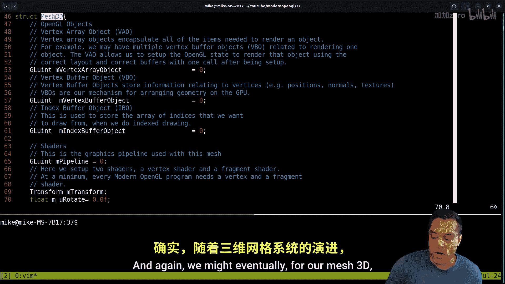
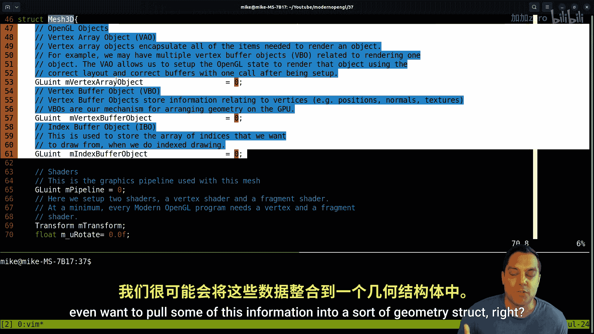
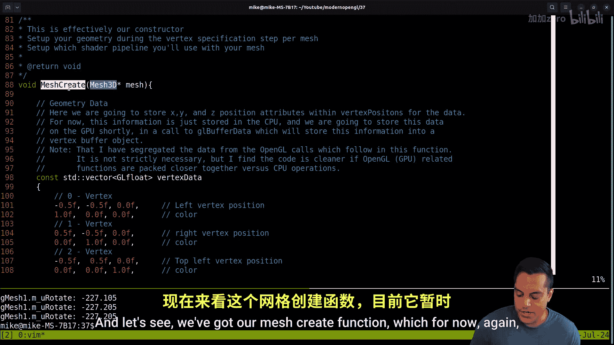
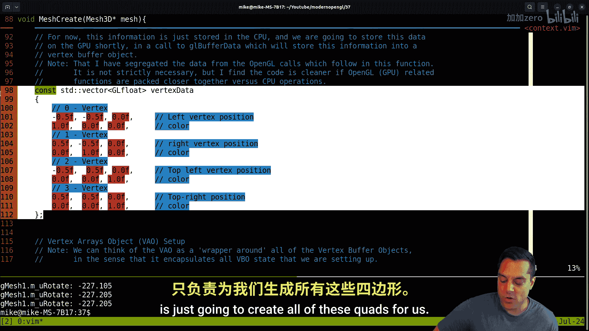
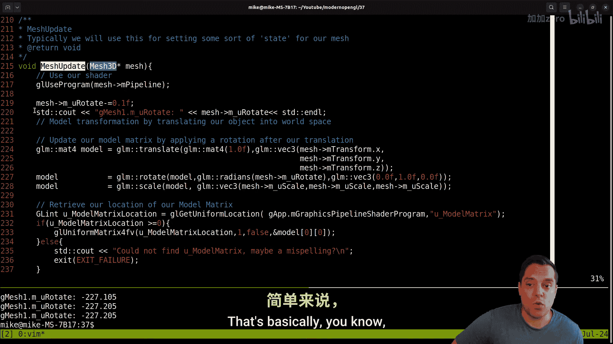
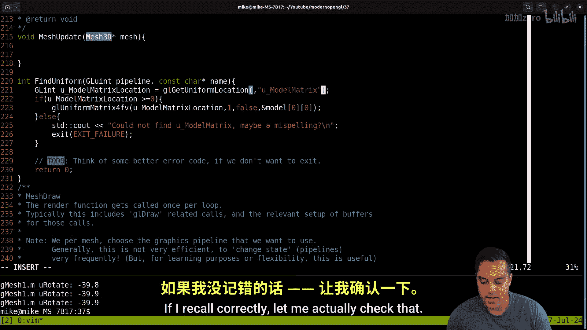
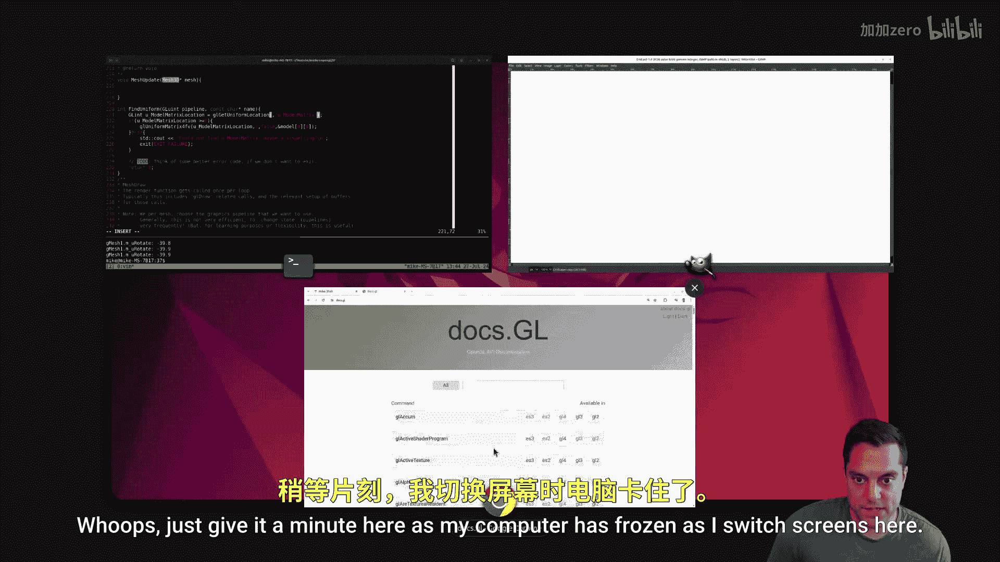
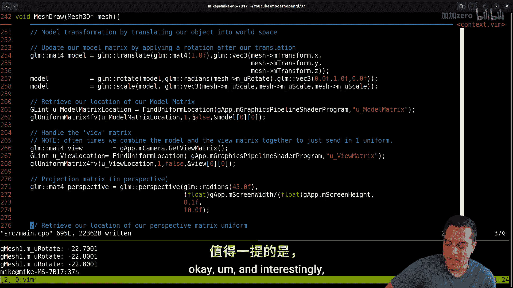
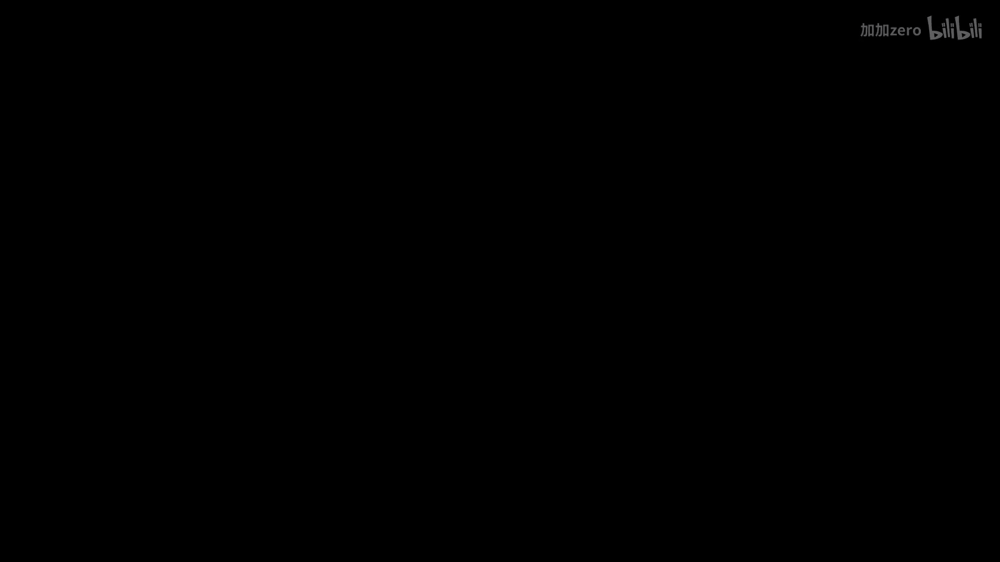

# Mike Shah【中英⚡OpenGL导论｜Introduction to OpenGL】 p38 P38 OpenGL -Episode 37- Refactoring MeshUpdate and Finding Uniforms -BV1pTvFz3Eqh_p38-

Hey， what's going on folks， this iss Mike here and look back to my modern openGL series。

 this we're gonna continue breaking down our abstraction。

 Now last time we were working on our mesh class and sort of refactoring out in this sort of Ctyle API where we basically had astruct and some free functions that we were working on to do a little bit of refactoring to well basically have two meshes So with that said let's go ahead and do a little bit of a recap of our source code and as always before we get into this source if you want to follow along with every line of code that's been written you can follow this series on courses m we've got my opengL series here and there's other courses here that might be of interest if you need to sharpen up your c++ skills or whatever But that said do fall along in the opengL series or this playlist it's the same thing that's on YouTube here but in a distraction freight environment。

 So anyways with that said let's go ahead and look at the little tree here And again。

 I've basically got everything in the main dotc and while'm very much itching to if we use the word count the lines here of our main file here in source。

😊。

You know， it is starting to grow to be quite a large file。 And again， I'm very， very。

 very much itching to start pulling stuff out of that， but it's not time yet。 It will be time soon。

 but we got to figure out some of these abstracts and just our system overall。

 So we will get to it and ultimately build out more features。

 But we've still get a lot to do on our graphics journey as well anyways。 So anyways。

 today where I want to focus is in the main file here。😊。

And basically on the mesh 3Dstruct that we have here， Okay。

 so let's go ahead and let's reduce this a little bit here。

And let's go ahead and do a little bit of a recap here of our mesh 3D code。

 which again I'm basically just keeping as a flat structure here at least as long as I can here。

 but every mesh 3D has the vertex array object it's associated with it'll have its own vertex buffer object again advanced openGL systems might try to pack in lots of geometry into one vertex buffer object we touched on this briefly as a sort of optimization to avoid state changes not going to worry about that for now and then of course we have an index buffer if we're drawing indexbased meshes。

And again， we might eventually for our mesh 3D even want to pull some of this information into a sort of geometry struct right we shouldn't really have to care that we're using an index structure or a you know just a series of floats to represent the data。

 none of that should really matter when it comes down to just using our mesh so again there can be another layer of abstraction here if we need here and that also makes things kind of easy if you want to reuse the mesh data you know across multiple meshes for intancing these types of things so again we're going to try to think carefully about our design Now our mesh is also going to hold onto the graphics pipeline。

That is being used to render and draw our mesh and then last time we started getting into this idea of having a transform class here。

 which would hold on to things like the model matrix here okay so we want to think a little bit about that here for now I like this idea of just having a transform right we could just have a model matrix and put that directly here into the mesh that would probably also be fine So we'll need to think about that a little bit but I think a transformstruct eventually might be something that we want to build on top of and have different ways to do transformations。

 maybe've been using different mathematical systems before I commit us to that strategy let's just we will have a layer of abstraction there。

We will factor out this rotate and scale again that should be part of the transform most likely so anyways that's the idea here and then of course we had not one but two meshes here now let's go ahead and just run our program really quick so again you can watch the previous videos or build however you've been building I've just been doing it on the command line something like this we'll do the trick here let's go ahead and run our program here and let's see I gotta try to find my software here let's see。

Sorry with multiple monitors， that means it's going to make this just a little tricky here。

 Give me one second to find my window here it is。 And if we look around we can see we have not one。

 but two rectangles。 Now we are getting this really weird artifact here and again once we finish our abstraction a little bit here we'll talk about what's going on here with the depth test okay we've had it disabled so anyways。

 we're going to get some weird behavior here that's actually kind of cool and I want to talk about that but anyways。

 let's continue with our refactoring here。All right。

 so let's go ahead and scroll down just a little bit here。And let's see。

 we've got our mesh create function， which for now again is just going to create all of these quads for us。

 So again， we've got that fixed。 again， we might want to modify this and be able to pass in different data or again。

 you might want to have some geometry structure that you can pass in here。 So again。

 we're just thinking about some of these things now and this is handling you know the open GL stuff。

😊。

So anyways， then we've got a way to delete our mesh here， set the pipeline。

For our particular mesh and then update now this update function here was basically what was in our predraw function if you're following the previous lessons here。

 that's basically you know what are the things that we need to do to our mesh before we actually draw and that's to you update these uniform values here。

So I want to think a little bit about what's the purpose of this actual update function and if we can just you know get rid of it。

 I mean， in theory， I could actually just pull all of this here。

And basically put it in my mesh draw function right because you know I'm doing the same thing。

 checking the pipeline， binding， and then before I draw I want to set up off my uniform value so for my current pipeline it'll have all those uniforms set up here okay so that's certainly something that we can do and I've been thinking about。

And it's probably the right way to approach things for now again until we add you know different ways to draw and so on because I mean。

 ultimately I might want to do things like have a mesh draw instance function。

 which is a different way to draw meshes with the same geometry and I might have different you uniforms a way of iterating through that data so ultimately what I am going to do here is today date we want to refactor the mesh update here so let's basically grab all of this here。

And let's just move it into our draw here， okay， and there's going to be a few things that we want to settle on here。

And typically I do my uniforms after I select the program that I've set up here， okay。

 so I've just pasted that in and I've made this function a little bit messy here。And then of course。

 anytime we do these things， we should recompile and redraw。And again。

 I got a wrestle with my window just a little bit here。

 but let's bring this in here and there you go Now we can see。Same program doing the same stuff here。

 Okay， now a few different things that I want to refactor here。And consider。

Ultimately when I'm doing the draw， I basically just want to set up my uniform， right。

 I basically just want to find the location of U model matrix and then set the you know meshe's model matrix in here okay。

I might even and we could do some air checking here。 In fact， let's see if we could cr。

I suppose we could create a little abstraction here just to see like fine symbol or something。

And we could actually just do like a check here， let's let's clean up this air handling code because again。

 I mean， this was a copy paste here of you know the actual symbol that we're looking for the location。

😊，And then actually do the thing if we want， but if we don't， you know。

 we have some like air handler here， let's see if we can clean up that code here and again。

 just keep refactoring this little by little here。So I'm going to go ahead to do here let's just yank that out here and just for now let's go ahead and just paste this in a little function here I guess I could return a boolean for true or false I could just also return an integer here again I'm doing things that sort of a Ct way so if your languages have booleans we could know do something more interesting but let's just go ahead and say this call this find uniform。

And it will return some value here。Let's just go ahead and say return zero to do。Thank of。

Better air code。If we don't want to exit， okay， I actually like exiting failure here。

 I don't want to run code if I can't find my uniform because that's a mistake here。

 at least when I'm learning this framework， maybe later on I want to be a little bit more resilient。

 but anyways that's that's the basic idea here。So let's see what else were we doing when we were finding our uniform。

 we're grabbing this here。So let's go ahead and paste that in here。

So we're always finding some location here okay， so and we're always looking in some graphics program here。

 so that means we need the GL， youent the pipeline that we're looking at here。

That's going to be this here。And then we need the symbol， which is going to be a con cha star。呃。

Let's just call it symbol。 I think in open GL， they call it the name。If I recall correctly。

 let me actually check that。 So let's pop over to docs do GL here。 Whoop。

's just give it a minute here is my。

Computer has frozen as I switch screens here， there we go， GL uniform。

Let's see GL。And I believe it's either name or location okay， program location， prams。

 let's see what was it， GL get uniform， oh location， yeah。Get uniform location。

Just when I use I think just for the consistency。 Yeah， they do use name and they're using GL。 Okay。

 yeah， let's use the exact cha here。 Okay， because we're already open GL land now again if we want。

You know。To sort of be consistent。Right， if you're going to have maybe different APIs or something like direct excellence using something else or。

Metal or something that maybe you can consider having your own abstractions。

 but we're sort of tying ourselves to open Gant here， which is fine。Okay。

 and that's going to be the name。And then this was the pipeline here， Okay。

 let's just call this the location。Because that's what that's returning。

This is going to say if the location is greater than zero， that means we found it。诶。Okay。

 which is fine。 and we don't know what we want to do here。

 maybe actually not fine uniform is a great thing， but check uniform。Well。

 I guess let's think about this， actually the interface here。

Find uniform location would fit because then I can return those value。Um，Okay， I could do that。

What's。Check is like a test， true or false， find uniform。Location， I like that here。

 that's a little bit better here。And then basically， we're just going to have this。If location。Is。

Less than zero。We will air， otherwise we will return the location。

And let's give ourselves a little bit of documentation here。It turns the。Location of a。Beauniform。

Variable based on its name。Okay， I don't know why we didn't have that earlier here。

 but this is just a nice function to have here so again this is part of the abstraction giving ourselves some helper functions here and I know you can kind of compress things but I like to have this you know。

 we can even do a little bit better here。For those of you following like C++ series， right。

 we should be using C air here。And let's actually， since we've abstracted this。

Let's go ahead and put in the name of the thing that we're looking for。Okay。

 and let's go ahead and start using that now， okay。Okay， so let's go ahead and see here。Let's see。

 So we're going to go ahead and do these one at a time here and we can get rid of some of our。

Air handling code， find uniform location。And this is going to be in our G app M。Fix program。

You underscore model matrix。Okay。U。And let's see here。Let's see， so I'll get the location。

And actually， let me make this really simple， kind of working backwards here I can get rid of all my air handling code because that's going to be in that function here。

And I don't need Gni this logic here actually， let's go ahead and do that。

So find the uniform location。And then use it。I can actually just wrap this into one。

These one liners here。Do I want to do that， is that going to make things really nasty to read。

 that's what I'm trying to think about here。Let's do it in two lines， that's okay。Let's do here。

The compiler， if it's being good， is going to basically just take。This code here。

And pop it into this variable here。 I don't want to make any promises that's going to happen。

 So sometimes again， if we're going to optimize our code， we do want to just again。

 pop things in here， which is you know sort of a good idea。But anyway， that's the idea。

 I think I'm happy enough with that。 let's go ahead and give that a compile。

 see if I did anything strange or wrong， let's give it a run here， oops。

 maybe I did misspell something probably uniform matrix Okay。

 so it works at some point we wanted to have an error here， so let's go ahead and compile。😊。

And now let's go ahead and run here， okay， that's looking better。

Here's our program if I move my mouse around with our mouse look， yep， doing the same thing here。

 so cleaned up our code got a little error here， which is fine here。

Let's kind of do this same refactoring here。So instead of doing all this。

 I'm just going to do fine uniform location。We're going to get rid of our error handling code here。

And then basically。Just do our set here okay。Its a handle。The view matrix here。Okay。

 now maybe this will be another video here， again， we could combine the model in the view matrix and then just send in one uniform。

Sometimes it's nice to have these as safe art matrices。

 but crop purposes right it's better to avoid so many matrix multiplications。

 so again let me just make a note here note oftentimes we combine the model and the view matrix。Okay。

 to just send。In one uniform。 So that would be one uniform per draw call。

 we'd pay one multiplication。 But remember， on our graphics card， the vertex shader is running。 well。

 forever many vertices that we have roughly speaking。 So again。

 that's that's probably a win to do things in that way。

And let's go ahead and clean this one up as well。Okay。

 so we're just going to call find uniform location。Here。And then we'll just actually。

Put things where they belong here。All right， okay， so we've cleaned up our code a little bit。

 we move some of our air handling outward， which is good。

Let's go ahead and continue cleaning things up a little bit here。

And let's compile first one more time here， just to make sure we don't get ahead of ourselves。Great。

 okay， so there we go here， there we are。嗯。So now for the rest of this lesson here， actually。

 this might be a good place to stop the lesson here。

 and then I'll go ahead and start refactoring this out just so it's clear。I mean。

 the lesson right here is just abstraction， right， I mean， pretty simple。 And again。

 you can do these things without。You know， having too， too much levels of abstraction。

 but basically putting my error handling code in here， right， The don't repeat yourself rule。

 which is really the。You know， a useful foundation。

 and usually folks say if you've repeated yourself more than three times。

 it's probably time to start looking at， could there be some sort of refactoring that makes your code a little bit safer here。

 Okay， and interestingly， the other lesson that I want you to have a takeaway from this video is。

 I mean， look how much less code we have， but as soon as we did that refactoring。

You sometimes can see your code a little bit more clear and then you say， well oh yeah。

 we have this other insight here where maybe I can combine my model of view matrix。 Now again。

 those are things that maybe you know or read in a book or have written a book but I mean it becomes very。

 very clear here that why not just have the model in the view matrix as one thing Now sometimes it's nice to have them as separate matrices for various operations but again。

 you know it always feels pretty good to clean up our code here so last thing we should do here is I'm going go ahead and move this somewhere and add a little bit of documentation。

😊，Where to move it， I think I want to move it around。

My open GL air handling stuff down here and our shader code eventually we're probably going to want to have some sort of like utility library or something of that nature here。

嗯。And that'll be， probably what we want to do to handle these different errors here。

Obsolute down here。Now。Actually， I might have to move this Yeah。

 the trick with having everything in the same file is we're going to have to move it up at the top here somewhere。

Maybe over our mesh function。 So we're just going to call this a utility function here and I know there are software engineers screaming at me。

You know， for having。Too many functions in a file。 It's actually fine， you know。

 especially as we're just refactoring this。 up， this isn't globals。 This is like utility。😊。

Functions for open G。Okay and I like labeling these things while everything's in one file。

 we're going to go ahead and do that。Utility。Jo。All right， so something like that here。Aly folks。

 so we will go ahead and close it there。 We just did a little bit of refactoring， put everything。

 I've been waiting to do that for a long time now into one little function here。

 We also refactored out of our mesh update， which is effectively well， what is it doing right now。

 It's not really doing anything。 We are going preserve this function here。 again。

 there could be important state that we have right now， we don't have purpose for it。

 so we could delete it I'll think about if we want to otherwise update some other state here as parameters for now。

 leave it but it's not really doing anything。😊，Actually， you know what。

 code that's not doing anything， the best code that we write here。

It's code that we can get rid of here。Let's get rid of this here。

And I don't have to worry about this year。With our order of how we were doing things。Let's see here。

Just get rid of mesh update and mesh update。And now we don't have to worry about this here。

 so as we're making our updates here。嗯。You know， I didn't have to worry about getting things in order anymore because we ran into that little。

 I last time all of our uniforms are set up properly。 All right， so one last little run here。

And then we will see you in the next video here。Okay， so there we go here。

 let's try to offset that just a little bit。Alright， and with that said folks。

 thanks as always for your time and attention， hopefully enjoyed that little refactor。

 we're gonna be doing a little bit more refactoring here just to clean up our code And again。

 I want to be able to start adding some features like textures and so on but we've got a few more videos of refactoring left so that we can then focus more on the graphic stuff。

 So anyways folks thanks for your time and attention。

 hopefully even enjoying this series and I'll look forward to seeing you in the next。😊。

