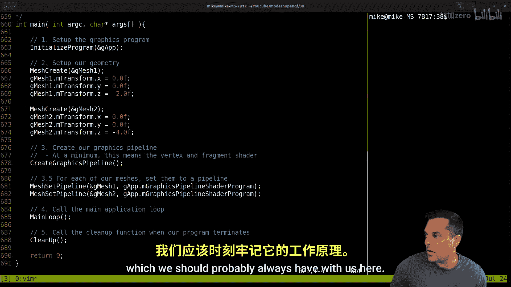
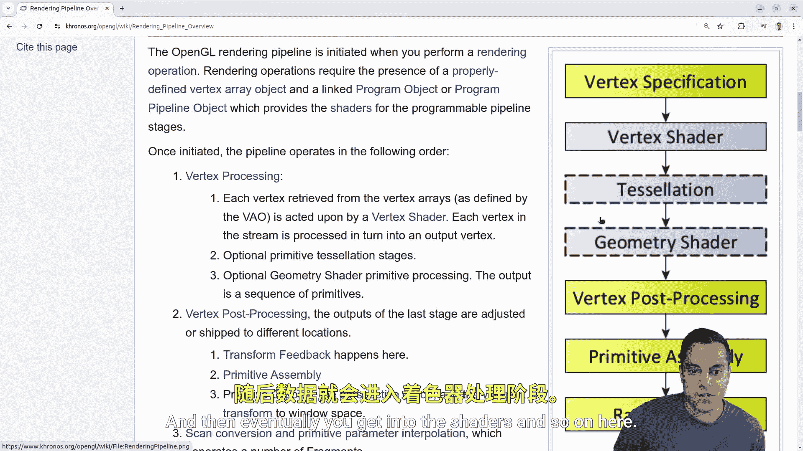
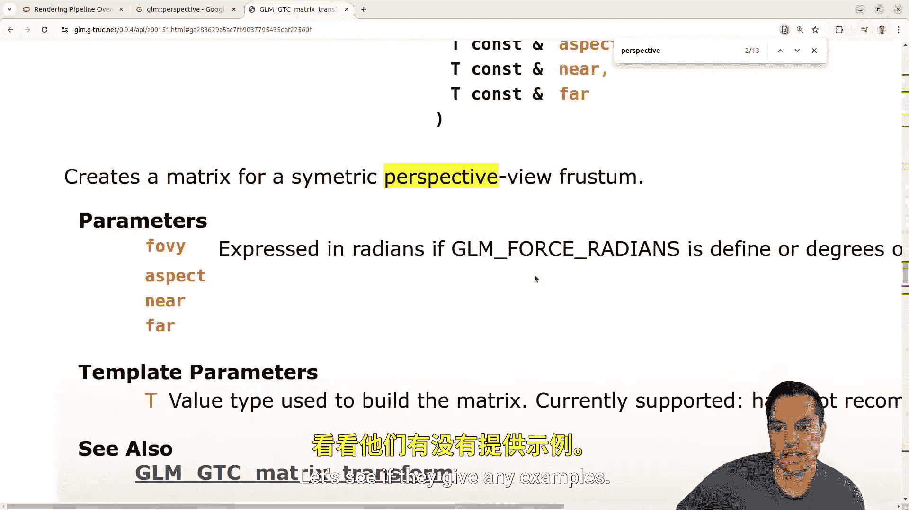

# Mike Shah【中英⚡OpenGL导论｜Introduction to OpenGL】 p39 P39 OpenGL Episode 38 Refactoring MeshDraw and our Camera -BV1pTvFz3Eqh_p39-

Hey， what's going on folks， It's Mike here and we'll back to my modern OpenGL series in this lesson we're going to continue our refactoring of our codebase again trying to build a nice little game framework here and that involves today working with the mesh3D class here so we want to go ahead and make sure that we clean up our abstraction let's go ahead and take a look at this and if you haven't seen the previous lessons visit courses msha Io here and make sure that you're following along you can do that on YouTube or a distractionfr environment like this website here so anyways enough with that let's go ahead and check out our maincP here again this is our structure here for our project here and let's go ahead and see what we've done here so let's go ahead and do a brief recap of the codebase again if you're not as familiar here and what we've done here in our main here is we now have this mesh class which is setting up our geometry so again thinking about our graphics pipeline which we should probably always have with us here let's go ahead and open up the rendering pipeline here that's the vertexspecation spot。

If you've been following along in this series here。

 right that's what's on your CPU setting up your buffers and so on when we're creating our mesh here okay and then eventually you get into the shaders and so on here。

 but anyways that's what's going on here， we're giving a sort of default transform location just to move our meshes somewhere。

And and I've done those one behind the other。 I've done that on purpose because we've still yet to talk about the depth test once we finish some of our refactorings here and then we create our graphics pipeline and once we've had a graphics pipeline set up then we can set up our meshes Now you might be wondering we could actually create our mesh and set up the pipeline in one step here so we could start reorganizing these steps that we want maybe we'll do that later if you've chosen to do that that's likely what we'll want to do maybe set up all of our or compile all of our graphics pipelines at runtime before our program starts and then associate a pipeline with our mesh。

 but again right now this is a twostage process every function has one job some people like that sort of software methodology so that's reasonable and then anyways we get into our main loop so let's go ahead and take a look at that here。

And basically what we're doing here is well just drawing our mesh in a loop here of course we're handling input and stuff like that for moving around keys。

 but that's our basic idea here Okay， so let's go ahead and you know right now we don't have any updates for our mesh here but let's go ahead and have our draw calls labeled there appropriately we're just drawing one mesh after the other here Okay that's the basic idea here。

😊，Okay， so let's go ahead and look at that mesh 3D class here。

And start thinking about what to do here and today I want to go ahead and clean up continue cleaning up some of the mesh 3D class here again we've got to think a little bit more about this transformstruct that I've been talking about here and we almost got to it but last lesson I started doing this fine uniform location because I needed to do a little bit of cleanup here in our mesh draw function here so if we go down here。

 our mesh draw was looking pretty messy here let's go ahead and。

You get everything together here where we have all of our uniforms being set up here now there are still some things here that I want to take care of basically。

Like how to deal with this perspective camera that we keep creating for mesh right this this should probably just like in our camera belong there。

 so I think's it's finally time to you know get rid of that and just make this a two stepper here so we want to be able to do something pretty similar here where this is just a let's go ahead and just do like Gf。

mcaa。git projection matrix。😊，Again I'm calling a projection because we don't know if it's going to be perspective or not。

 but that's the basic idea here， so let's go ahead and just take care of that once and for all。

And then let's see here， u let's see here， u do I have projection now I guess I was just passing in perspective here。

 but I call U projection in the shader， so that's reasonable enough here。Okay。

 so let's go ahead and do a， let's open up in a new tab actually in our source our。Camera CPP。

And similar， just like we have a git view matrix。Let's create a。Camera get oh。

 I guess we don't have it。Projection。Matrix， there we go。We get cons function。嗯。

And we could have something like this here。Let's see here。Now。

 I guess this is something that we'll have to think a little bit about here。嗯。

Let's also split this window here。To have our camera。

And let's see here now view matrix we were creating from the u I I plus direction in the up vector here。

So I could just in our camera， store a projection matrix here。嗯。Let's think about that here。

And when I construct my camera， maybe I want to actually construct it with a。

Default projection matrix， that's something that I could do。Let's think about that here。嗯。Again。

 it's kind of hiding a detail and maybe we want to actually change this。

 but really all I want to do here。Is。Let's go ahead and just。Copy this well。

 that's just going to be a matrix for here。 let's let's have as part of the private here， GLM， mat4。

Um and。Projection matrix。And the reason that I'm thinking about this。

 why we might want to do this in our constructor。Here is because。

I do need some way to communicate when I'm figuring out for the window， the aspect ratio。

 so with by height here。If I want to just be able to do that or if my window size changes。

 how I want to be able to handle that so I could just leave myself a little to do now here if I want。

 but let's let's think about that here anyways。 So anyways。😊，We will have the。

Function that returns a matrix 4 here called get projection matrix。be a con function。

 so I'm happy with that and that function should just basically just return whatever this projection matrix is。

 Okay， so that's going to be a simple one just return。Rejection matrix。And then the question is。

 where do I set it here？Well， again， I can do it， I guess I have some defaults here。Yeah， assume。

 but let's put a little to do note here。Assumue we want this projection matrix。嗯。

And then I do need to pass in like the aspect ratio and so on。

 Let's see where I'm creating my camera。 I think I'm just creating it。An app here。

 which is just going to call or create by default that matrix here。Let's actually。

Let's make it a two step process here。Let's write a function called Cate projection matrix。

And we want to actually pass in the values here， so we got to look up whatever our GLM perspective is。

嗯。Or or even let's just here let's just do better set projection matrix because that's likely what we're gonna want to do here right to be able to reset these values here Yeah I don't like having in the constructor this constructor is great for default but I don't want hidden algorithms and that sort of stuff in here so let' let's get rid of this anytime you're adding little to do messages which is fine right this isn't gonna be a huge project but it is you know。

😊，Getting to be a big enough or interesting enough project。

 I want to show some good abstractions here。So anyways， let's go ahead and just set this up here。

And the best thing to do is going to be to look at the GLM perspective matrix， which hey。

 look at that。One of my videos is there， so check that out if you haven't already。

 but let's get to the help page perspective。Yeah， when you search for the help and it's your page。

 what do you do if you need more help on that？All right， so let's see here here are our。Fields here。

Let's see if we have better types here， these types are going to be like float。

 I think these are all floats here。So it's going to return a matrix 4 by4。 Now。

 the T is just the sort of type here， like if it's a float to whatever。

Let's see if they give any examples， guess they don't give any examples here。

 it's a highly templated library that's one of the tricky things with GLM that's， you know。

 if you don't like reading C++ code， it's not going to be fun here。😊。

Here let's paste that in here just so I can keep eye on we want to float for the field of view。

But for the aspect。Float for the near and they float for the E far。There we go。

Let's copy that over here。Let's do the same thing。Let's see here。

And this is not going to be a constant function，Now the other thing that I'm a little bit。

 I like my functions to show up in the same order that they are in the header file。

 so let me make sure I've done that here。Again， we could。Come up with some houristic。

But that's good enough here。Okay， let's make sure this is compiling。Let me go back here， there we go。

Yeah， of course， GAP and all that stuff isn't here。

 but let me hold on to this for a second here because I'm going to want that。Fction here。Okay。

 so what we're going to do。Our M projection matrix。That's this guy here， this member function。嗯。

Of our camera class here，ops。Let's see here。And projection matrix equals。

And why was this looking weird here？It's not tap everywhere， here we go。GLM perspective。

 and then this's going to be a simple call to F of VY aspect near。Okay， that's it。

 it's just going to set that， okay， so that's the simple function here。嗯。Okay。

 so let me open up in a tab。Just so you can see in one view here right these are some functions for setting our projection matrix So we've added one little step here。

 I guess in our class and again， maybe I'll come back and I'll refactor out right so we've been doing our mesh 3D in a very Ct API Maybe I'll do the same for the camera we'll see here know that's just how we sort of landed on things but anyways that's what this guy looks like。

😊，So let we go ahead and close that one out here and then just so you can see the function here。

 yeah， this is just setting values here， okay， so again， should compile if without any problems。

 that's good。And now let's go ahead and。Go back to our main file。And。Probably in our main here。

After we initialize our program。Set up。Our camera。Okay。And I want to do the G app。m camera。

Set projection matrix。Oops， here， let's see here。I lost my perspective。Camera here， let's undo there。

 This is the  one I want。Go back here。I just don't want to lose that function。

Let's see you here in this file。Okay， that's all I need from it。Okay。

 I just want to be able to have these values。 So after we initialize our app willll have things like the screen with and so on。

 So then this just becomes our G app and camera。😊，And then we're able to call set projection matrix on it。

And pass in these values here。Okay。And let's kind of indent it。In a reasonable way， I don't know。

 the jury sort of out on what the best way to do this is， but you get some of these long parameters。

Actually， the right thing to probably do is。Here。呃。

Create a variable or something and just toss it in here for that I'll just leave it as is that's okay。

So anyways， let's compile that see if we did anything silly， not yet。

 which is good news and now we can go to our mesh。Draw function。And let's see here。

We just have perspective。Here it is。And we should just be able to。Retieve our location of our。

Projection matrix。Okay and again I'm being specific because you might want orthogonal or whatever domain you're working in so that's now a problem there we should be able to retrieve the projection matrix here in perspective and pop that in here Okay so no problem with that here Okay so let's go ahead and give that a run well I say no problem until we run this let's go ahead and see if it does the same thing as it used to and if I go ahead and bring in our window here。

Okay， I've got my two quads here， all right。So a nice little refactoring there again。

 steadily improving our code one lesson here at a time here， so with that said， less room for error。

 less you know weird stuff happening and we've again abstracted things a little bit here now again。

 you know if you want again we might have a way to ask again。

 you can sort of abstract this however you want again we can get rid of this sort of C+ plus abstraction。

 if you don't want the object oriented stuff or if you're following along these series in a different language here and have the camera be sort of a C styled API where。

Maybe we have a way to call function that GAP returns the camera and then from our camera we have a function called set projection matrix which takes a camera as the first parameter retrieving that camera from GAP and then getting the projection matrix so again you can do these things in a C style way if you like or choose that so again maybe we'll refactor that out here。

 but I'm happy with this I'm happy with where we're going here again our functions are looking cleaner and cleaner here。

But there are still a few little things here that weve got to deal with。

 So our transformations are still being handled in draw。 So that's still too much here。 And again。

 this was fine when we were just drawing our regular quad but this is too much work for draw right and we want to be able to have control over like translating。

 rotating and scaling our mesh So that's where we're gonna be heading in our next lesson here。

 Okay so stay tuned for that folks， hopefully enjoy that lesson and we'll continue adding on and refactoring here just a little bit。

 and then again， as I mentioned， we'll dive into more like introductory graphic stuff here once we have some meshes and stuff that we can play around with。

 Anyways， folks thanks for your time and attention， hopefully enjoyed that lesson。

 hopefully you're enjoying a lot of live coding here。

 I'll look forward to your discussions below and I'll see you in the next one。😊。

