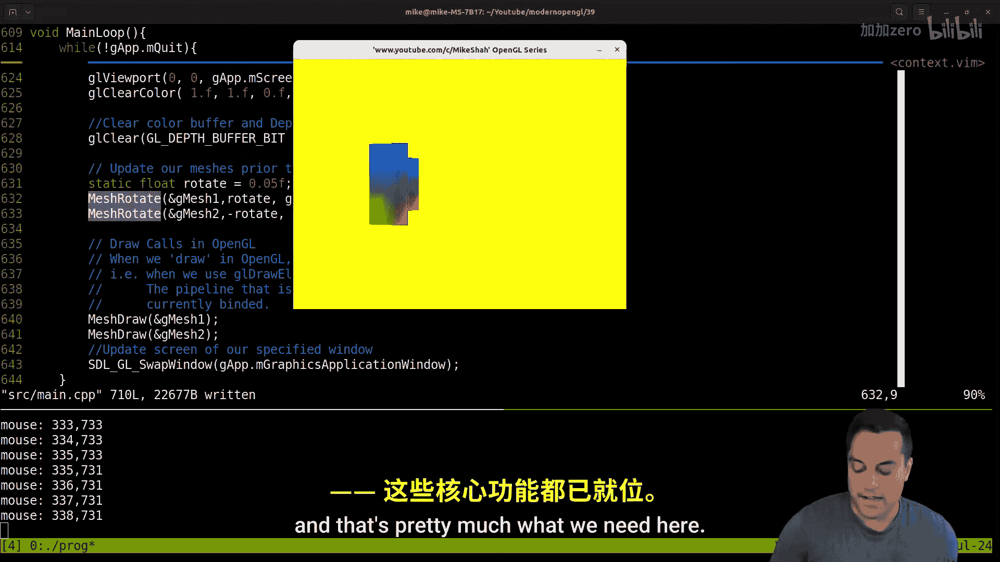
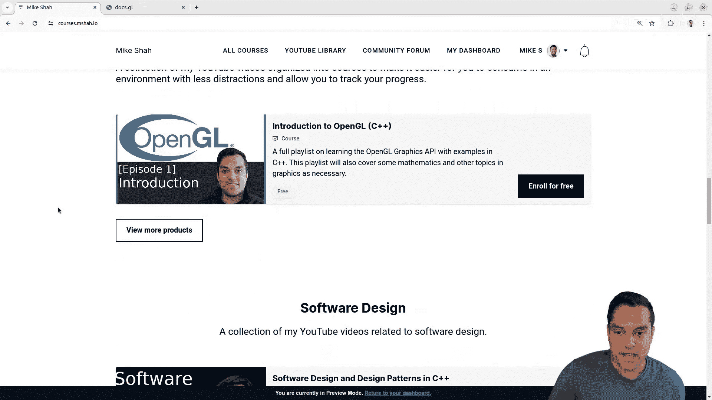

# Mike Shah【中英⚡OpenGL导论｜Introduction to OpenGL】 p40 P40 OpenGL -Episode 39- Adding MeshTranslate, MeshRotate, and MeshScale -BV1pTvFz3Eqh_p40-

Hey， what's going on folks， It's Mike here and we' back to my modern openGL series In this lesson we're gonna finally take on our transform rotate and scale operations and abstract those out a little bit for our mesh3D class。

 So with that said， let's go ahead and take a look at this lesson So just go ahead and give a brief recap of our code let's go ahead and take a look at the tree here we are in our main function today and well to be honest most of the time So the main highlights here is that we have this mesh 3D class here it's got some of the geometry information that we want here。

 we've got our graphics pipeline， meaning the shader programs。

 the vertex and the fragment shader that have been combined that we're gonna to use every time that we render our data that sits in this vertex buffer object using an index draw strategy and today we're gonna want to tackle this how to handle our transform。

 basically what I'm going want to do here is create similarly to how we've created our let me scroll slowly mesh create functions which take in a mesh3D we've got our if I scroll down again mesh delete functions mesh set pipeline。

😊，We're going to want some sort of like mesh translate mesh rotate functions here and again I'm doing it in sort of a Ct API so if you're following along in another language you can do that or you can just again think about if you want to take a more object oriented approach if you find that helpful but anyways。

 if we look at our mesh draw function here。We've got， well。

 basically a bunch of stuff here that has to deal with like rotating and translating a model that has nothing to do with the mesh at all so typically we want to keep this to mesh draw related stuff。

 which means setting up our uniforms that we want to pass into our pipeline and then what mesh we want to actually draw just trying to keep a little bit of a clear abstraction。

 Maybe there's other ways to break this down that will run into later but that's the idea here so again。

 how we got here， why this is a way in case you're just diving into this series。

 well because we started from like a hello world triangle right and we want to be able to figure out how do we break down hello world and scale that up which you know is less founded maybe tutorials or that type of thing So that's the journey that we're on right now that's why we've had a few lessons of abstraction and so on。

So anyways， this is the code that we're basically going to want to cut out here now there's a couple of things that we could do to make this easy。

 we had a mesh update function。😊，I'll bring that back later on once I can show you what the sort of purpose of that is for but basically what I want to do is create some function so that we don't have to call know GLM Trans and then like do all of this here I just want to be able to basically say what my mesh is and where I want to translate it the XY in the Z position because right now if we go down to our main you can see that I basically just set these transforms as they are now again people will have different opinions about if this should be like some getter function or some set function we're basically going to create a little set function here for setting our transform so anyways let's go back to mesh draw here let's go ahead and grab this stuff here that I want to move out here and then I'm pretty happy with this function again。

 we set up our pipeline well first we check if our mesh is valid Always important we set up our pipeline and then we set up how we're gonna to draw it and then we can un things。

Not necessary， but you it's useful。So anyways， let's go ahead and let's figure out where we want to put this these types of functions here。

I guess there's a variety of places that we could put them。Under create， and again。

 once we structure our header files and so on。We'll figure out。

You know how we want to structure things more， but let's just go ahead and write some of these functions here。

I'm going to call this mesh translate， it's going to have to take in a mesh 3D。

APointer or the mesh that we want to translate。And then simply the X， the y。

 and the z position that we want to translate to our mesh， okay。

Now there's a couple of ways to think about this here。Mean， and let's go ahead and grab。

This model transform here。You know， this translate function is basically going to update the model matrix that belongs to the mesh。

 so I'll get to that in a moment here。And。We'll just have to think a little bit about the structure here right because in this example。

 basically what we're doing is that we're saying perform a translation from wherever this model matrix is。

 which if I put in 1。0， that's the identity matrix right so or vertex or wherever it is as in wherever its initial location is and then I'm translating it here by X Y and Z so let's kind of break this down。

 this is just going to end up being X。W？And Z， right， these are the values that I have here。Right。

 so I just this literally just setting or translating to this location if you want to do the current location plus something right。

 you'd pass in a parameter that says like the mesh dot x position plus you know。

5 or something in this parameter but that's all this is going to do here okay。

 what we want to do here is translate where are we translating from well the M transform。

Moel matrix here， okay， so I'm going to need some sort of model matrix。In our mesh here。

And I could say。So again， let's。Let's scroll up a little bit here。

And going kind of start setting this up here。Let's go into our。Yeah， here's our mesh 3D class。

And here's the transform。so。You know， our transform is basically just going to be the。

Model matrix here。嗯。Let's think about this for a moment here。I don't know。

 let's see if this is going to work here。If I can just initialize it。 So I'll get rid of X， Y and Z。

 Basically， I want to initialize it as a。Identity matrix here。

Let's see if it will call the correct constructor。And that's going to yell at me because I got rid of X。

 Y， and Z， that's okay。Let's get rid of this here for our mesh right we're going to have G mesh2。

Or rather。Mesh， translate。This will take the address of because these are just globals right now。

 G me 2 0。0 f， is 0。0 F and negative 4。0 f。And then we'll do the same thing here。With Gmsh 1。In 2。0。

 and that's the function that we ultimately want working， right， a lot simpler。

 And then this is something that we can just call in a loop later on。 Okay。

 so let's get rid of a few of those problems。Let's see 284 well， I just have a bunch of。

Code hanging around here。 We're going to end up doing the same thing for our mesh translate as our mesh scale。

Okay， let's see here。Oh， yeah， ya。 Of course， I have all sorts of stuff going on here。 So basically。

 I'm going want to get my mesh transform and then the model。Mattrix that's part of it here。

 And let's split this window here just som that bouncing up。Down too much here。Let's see。

 we'll go to the definition。There we go。Let's call this M。Moel。Matrix。

That's a little bit of a better name。Okay， and what am I updating here this is going to be again。

From the。Actually， again， just to clean this up。 Well， let's， let's think about this here。

 I do want to access the actual。Mesh。And transform。M model matrix， okay。All right。

 that looks fine here。And I can separate it out on a different。

Line here just so you can see what's going on here。Oops。Deletes until the end here。

Just trying to move these variables a little together。 looks like I had some weird spaces。 Okay。

 so that'll update whatever this model matrix is and sort of put it at this position here。 Okay。

 so that should access again， the meshes。Let's go ahead down here。Hide a bunch of this stuff。fold。

So you can see it all， they've got our transform。With the model matrix here for our mesh 3D， Okay。

 so and transform。From our mesh and accesss as the model matrix。

 I think that should do the trick here。Like there were the match here。诶。Let's compile that。Okay。

 and then it line to 48。Let's see what else we got here。

We don't have model anymore because now we're getting our model matrix from the。Mesh。

So let's go ahead and do this here。Mesh。And transform do model and model matrix。

It's good get that a compile here。Let's see if that actually just works here。

 let's see what state our program is in at this point in time。If we go ahead and do this。Hey。

 looks like it's working here。Very nice。Now， of course， our depth test again， as I mentioned before。

 we got to get into more graphic stuff later， but that seems like it's doing the trick there Now it was a little bit bigger as you might have noticed than it has been that's because we haven't done our scale operation okay in case that surprised you we were scaling by 0。

5 at 1 point。But the good news is we don't need these random variables anymore。Wops。

 what am I doing here， there we go？嗯。So in our mesh 3Dstruct here， we have you rotate and you scale。

 Okay， these are basically states that were。You know。

 just had maybe I'll want you rotate or something， but we'll deal with that in a moment and you scale。

 but again， basically I don't need those anymore let's just get rid of them。

And basically just write our generic operation here Okay。

 so hopefully that makes sense we added a transform。

 it's got a model matrix and then we can do well transformations on it okay。Um。

So let's go ahead to our mesh translate。Here。And we'll do the Doc student style comments here。

Translates。Mesh。B子。あ？Translate a mesh。Updating its model matrix。Okay， again。

 this is doing a matrix multiply of basically a translation matrix， which we covered a little bit。

 Let me see if I can。

Launch gIimp here for a second for you， we covered this a little bit in previous lessons。Here we go。

What a translation matrix is again， it's very important， right。

And this is a whole otherher sort of discussion about。Y we have the translation X， translation Y。

 translation Z， and then W here， and then you have your you know whatever your matrix is here。

 let's draw。In our points here， right， this is a special matrix for the translation， Oops 0，0，0。

 So it's 4 by4 matrix。 that's what I'm indicating here。 And these are the translation values。

 And that's multiplying right to left。 So we're actually taking some other matrix here are our model matrix here okay。

 so this is a thing that we're going to multiply Okay and and our model matrixes are current values。

 right， these translation values could be 10，50，70， you know， for x， Y and z respectively。

 and that's what we're multiplying Okay。And in GLM's doing that for us。

 that's why we're passing in a matrix。 And then we are updating or writing back that value to our model matrix as well。

 Okay， in case you were confused about those operations。 So anyways。

 let's let's write basically the same functions。😊，For a rotation。Mesh。Rotate again。

 go take in a mesh 3D。And let's see what we had， again， we do this in radians。Hm。

Do I want to convert this for us or not， and this was a Y rotation？Let's just do mesh。Rotate Y here。

And I'm just going to pass in the angle。W angle？Okay， that's basically what this is here。

And we're going to follow something kind of similar to this here。

Where we assign our model matrix here。2。This guy here。To our rotate。s the mesh。Tranform。Matrix。嗯。

And then this is just going to be the angle。The angle。I guess we could just have one rotate function。

 I like this sort of in an API because it's very explicit。嗯。

And then we can just passing into GL V3 for the axis。

This is the axis that we're rotating about here I might come back later。

And decide that it's a good idea to just have like a metro rotate y or whatever type of function here。

But I think this is reasonable for now。Okay， let's see here。Why is this complaining at me？

I I'm missing an equal sign， probably。Let's see what happens here， and this is now just mesh rotate。

Let's compile。Oh， nope， it doesn't Oh because a Y angle。It's the angle？

Let's see what else happens here。View， oh， did I delete something here。Oh。

I got to go to the top of our error messages here。Mistral。This is probably like a copy pasta thing。

 I notice all these guys disappeared here。Oh， line 246， I did something。 Maybe I hit some。

Extra key here， now let's go back here。If I get rid of this， it we fine。Oops。Just one moment。

 I'm going pause and take a look at this one。I think I just deleted something by accident here at 240。

6ix。Yeah， model matrix。Let's see， okay，ew， that was going be disastrous sometimes。If you。

Are moving too fast so anyways。Okay， let's fix that up and let's get everything kind of on the same screen actually I don't。

I like seeing these as one line here。Again， that's a reason one of the reasons I use vim people ask me is because I can see more on the screen there we go。

 that's just a little bit cleaner I allt like getting into that weird spacing stuff but。Again。

 I've done it a few times。Let's see here。Tl to the mesh。

 let's go ahead and give ourselves a little bit of documentation。Rotates Amessh。About。

And an arbitrary。Access。IeA vector。Okay， and then let's do our scale。So we'll call this mesh。Scale。

And this what we can just pass in in X。Why。And A。scale。And we're just going to take in a。GLM V3。

Or the X， Y， and z values。Okay， let's go ahead and see if that compiles here。

If I've done anything weird。Not yet。Let's paste that in here。Addd a little bit of documentation。

 scale a mesh， you know， this is a separate rant about documentation。

 I like having comments and good comments and eventually we might want to add in some examples in here。

😊，Scale a mesh in a non uniform way。 and what would mean my non uniform is X。

 Y and Z can be different values。 Again you might want to have the same your API like scale X。

 scale Y scale Z type of functions， but that's totally up to you again。Okay。

 let's go ahead and go down to our main now。 we've got this translate， let's also try out mesh scale。

Let's use。And G mesh one。Now one is just the default， Okay， so it's not going to change anything。

But let's。Let's make this one like tall or something， twice as tall。For Gmesh2。开。Okay。

 let's go ahead and try that much out， and then we'll get our shapes rotating again and well then we'll call today here。

Let's see here Do we have one shape that's bigger than the other。 Yes， we do。

 We have like a really tall shape here in the background。 And again。

 it's a little bit messed up because our depths again。

 I promise we'll get back into graphic stuff but we got to get nice abstraction So there it is it's scaled twice as large she can see the one in the background there So it's tall along the Y axis and then let's let's do a rotation here。

😊，Now， a couple different ways that we could do this in our main loop now。 And we got。

 this is kind of the nice thing about having our。Free functions here。

 I'm going use very easily just to match rotate。Grab a mesh。And we said， well。

 how are we going to rotate it， let's create a static float called rotate。I'm going to call it by。

 oh， let's go ahead and just initialize it to zero。Rotates going to increment。By 0。1， about 0。05。

 something small。 So that's going to be the rotation value。 And then the axis is going to be。

Just along rotating about the Y axis。 Okay， so that way it'll just turn nicely。 Okay。

 that's what we had it doing previously。 Let's make these meshes rotate in opposite directions。

 Ne rotation there。 There we go。嗯。And oh， some errors here， let's see what I did here。GLM Vc， again。

 you start getting these template errors。It's because you're in GLM or one thing。

 I been in specify by the dimensions here， okay？So let's go ahead and compile that。

 Let's go ahead and run that and let's go ahead and see。 let's look at a。

Change here to bring in my windows and we've got our guys rotating here。

 Oh oh now'm increasing that speed way， way， way too fast。 Al right What were we doing before here。

 We were just having them rotate nice and easily。😊，Actually。

 maybe I don't need to increment that value because it's just doing the rotation about that access and updating。

That's the issue here。 That's kind of a cool effect。 though。

 sometimes when you play around with these things here。

 you can get some neat new little effects like that here。 Let's bring this in here。 part in is a。😊。

This always launches on my other window， so I got to do some maneuvers here to bring it to you。Okay。

 so there we go。And let's see let's move our mouse look。

 there we go so now we've got these two guys rotating in different directions or these two quads。

 they're not people。And there we go。 very nice here。 Okay， so and again。

 you can have a little bit of fun with that here。 Al right， folks， So with that said。

 we reached sort of a cool point in our lessons here where we now have functions to create different objects。

 we can rotate them about and basically you've got a little game framework here。

 I mean as long as we can start loading in some more interesting geometry。

 We've got a nice abstraction for at least displaying and moving around meshes and some different shaders。

 Now， of course we're gonna want to get these shapes colored。

 We're gonna w to add some lighting eventually and have some fun with that。 But again。

 we're getting a nice API here。 We've got a camera。

 We've got some meshes that we can move around and that's pretty much what we need here。😊。

So as always folks， if you want to follow along in these lessons here。

 if you want a distraction-free environment or at least less distractions。

 there's less things being recommended on the sides you can sign up at courses。

0 and follow along openGL you can follow along other courses if you want to sharpen up your seat debugging skills etc you can enjoy that here with that said here I had a lot of fun here with this lesson here we've got our shapes rotating there they are right here and we've got two of them and we've got our functioning camera and so on so again。

 know things are getting pretty exciting and opengL and graphics program in general is one of those things that just as you continue progressing things get more and more exciting with every little addition So anyways folks with that said hopefully you enjoyed this lesson hopefully you've enjoyed the last few lessons where we've been doing this refactoring and those sort of live style coding so anyways folks let me know in the discussions how you're progressing with your openGL projects and I'll look forward to seeing you in the next one。

😊。

