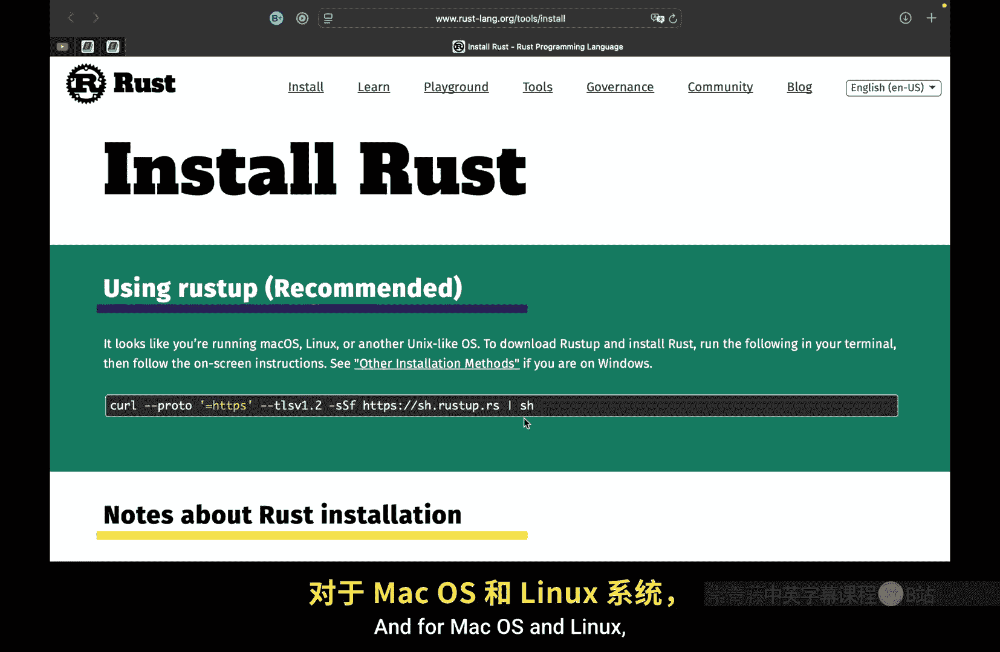
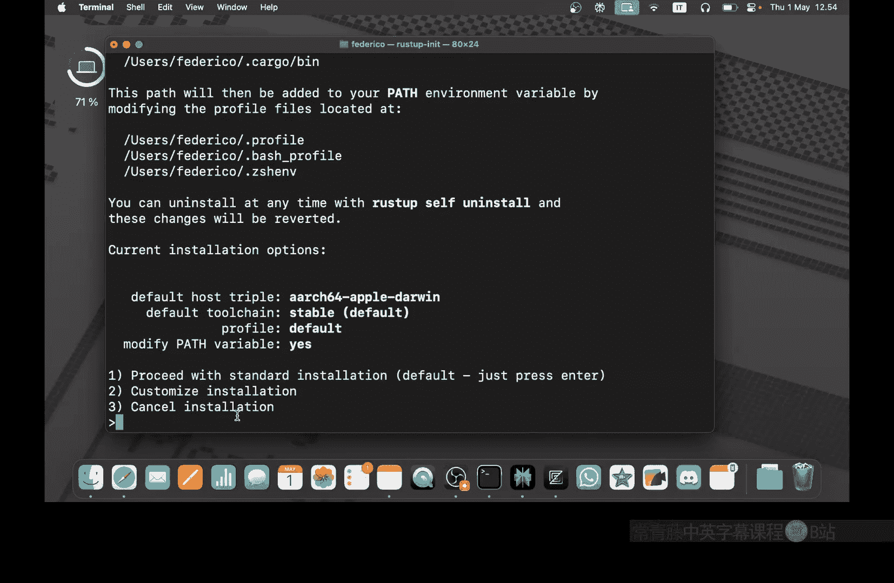
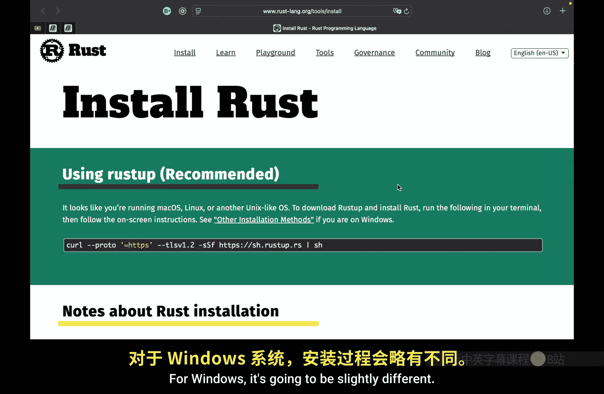
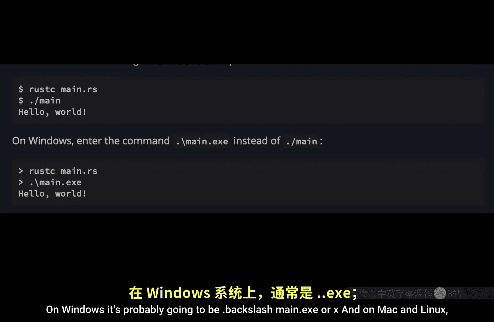

# Rustfully【中英⚡Rust 初学者教程（2025）｜Rust for beginners (2025)】 p01 P1 你的第一个Rust程序（如何安装Rust） -BV1eyAkzPEhj_p1-

How's it going everyone In today's video， we're going to be learning how we can install rust on our computer。

 and this is the very first step to actually programming in rust。

 So the very first thing you want to do is go to rustlaying org and make your way to the install section for convenience I'm going to be leaving a link to this page in the description box down below So all you need to do is click on that link Now the first thing you're going to notice when you land on this page is that there's a green area that says using rust up and this is the recommended approach to installing rust。

 and for MacOS and Linux， all we need to do is copy this command here and use it in terminal when we tap on En。

 it's going to download the installer and it's going to ask us some questions regarding rust。

 So here we have the option to proceed with the standard installation we can customized installation or we can even cancel installation。

And all I'm going to do here is tap on one or enter one and tap on En。 And if everything goes well。

 you should get this line that says rust is now installed for Windows。

 it's going to be slightly different。 you're going to have to tap on other installation methods。

 and unfortunately I do not have a Windows computer So you're going to have to do a bit of reading here but chances are you're going to want to tap on standalone installers and pick what's right for you anyway。

 once you've installed rust， it's important to verify that you actually installed it by typing in rust C and the version and this is going to retrieve the version number So in this case I have rust 1。

86。0。 and that's all we had to do to install rust。 Once you've installed rust。

 we can get started with creating our very first project。

 So now what I'm going to do is create a new folder and call it project and what you need to do is open up a code editor of your choice and open up that folder。

 and in this case I'm just going to use Z So I'm going to navigate to the desktop and open up my project。

This is my project folder。 All I have is a single folder here and the first thing we're going to do is create a new file inside the folder。

 which is going to be called main do R And just like that。

 we can get started with creating our very first script So what we're going to do is type in fn main which will define a main function and then open up a pair of curly brackets inside here we're going to type in print L for print line with an exclamation mark and all this means is that we're using a macro instead of a regular function I'm going to explain that in a future video and then we just need to type in hello or something along those lines and finally we just need to provide a semicollon to state that this is the end of the expression Now if you want to run this you're going to have to open up the terminal and use one of the following commands on Windows it's probably going to be do back main or X and on Mac and Linux is going to be do main here we can type in main and what we're going to get is an error because we did not compile this。

So we don't have this file actually but to compile it。

 we just need to use the command rust C and main do Rs and this is going to compile our file into something that we can actually run So once we tap on enter you're going to notice that inside the folder we're going to have our compiled code and now we can use that special command main to actually run the code and where we should get as an output is hello world but unfortunately at this point every time we want to run the code we're going to have to recompile it first because if we were to just code main all we're going to get back is the code we already compiled and this means that every time we want to run it we have to type in rust C main do Rs and that's going to recompile the code with the changes so that the next time we actually run this we're going to get the updated code being run and at this point you might be thinking that's a lot of effort for running a program they must be an easier way to compile and run the program at the exact same time and luckily there is in rust we have a。

called cargo and cargo is rust's build system and package manager。

 and thanks to cargo we can both compile the code and run the code at the exact same time。

 So inside our project I'm going to get rid of both of these files because we're going to be creating a new project using cargo and to do so inside the terminal what we're going to do is type in cargo new and the project name which in this case will be called hello world So the command is going to look like this and when we tap on enter we're going to get a new project here with some source code。

 a cargo Tomel which contains the project information and its dependencies and the source code which contains a premade hellello world script and at this point we're still located inside the project。

 So what we need to do is navigate to our new cargo folder by typing N C and the folder name For example here I have a folder called hellello world which is my project folder So I'm navigating to that folder now that we're inside the folder。

 we can use some cargo。Commands such as cargo built which is used to compile the code and the command to run this is actually quite long。

 So this approach to running the code is something that I will not be showing you in the video。

 or maybe I can just do it once。 So dot slash target slash。

Dbug slash hello world and if we tap on enter that should run the code。

 but again that command is awfully long， so I'm not going to be using that and on Windows as you can see it's different but what I will be showing you is the command that you will be using quite often and this one is called cargo run and what this does is compile the code and run it and what's nice about that approach is that we can change our code and then just type in cargo run。

And it's going to apply those changes because it's recompiling that code before executing it。

 although I must mention with the previous approach where we typed out target debug hellello world。

It doesn't have to compile the code， So it's going to run it immediately。

 and that's going to be much faster than having to recompile the code before running it。

 So if you're just running a program， this will be much faster。 And finally。

 the last thing I want to show you today is cargo check and this command will check whether the code will actually run before you try to compile it。

 So for example， if we have some bad syntax and we type in cargo check it's going to tell us what's wrong with it before we even try to compile it。

 and that can be quite nice to know in case your script has some errors。

 So yeah that's how you install rust on your computer but do let me know in the comment section down below whether you had any issues or if you are a Windows user and you have any tips for other Windows users on how to install this leave it in the comment section down below unfortunately。

 I'm using a Mac so I can't really help you guys out on Windows So any help in the comment section down below for others will be highly appreciated otherwise with all that being said as always thanks for watching and I'll see you in the next video。

