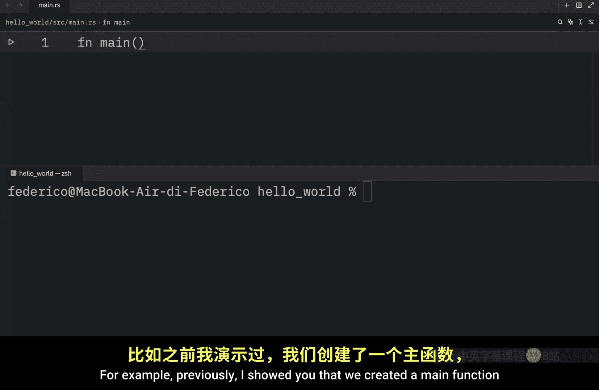
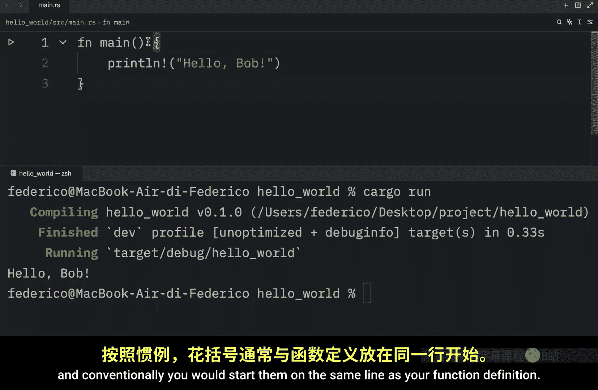
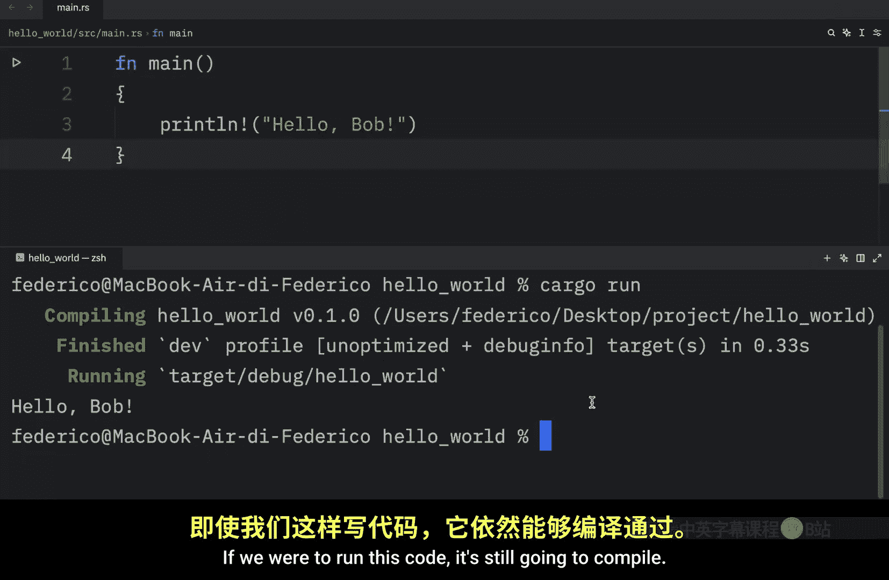
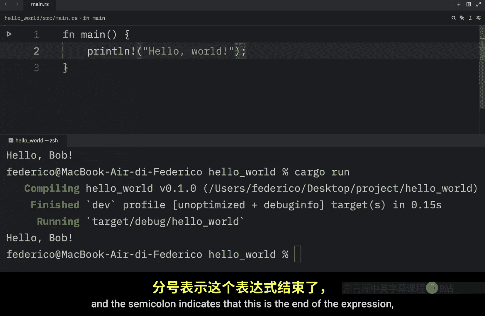
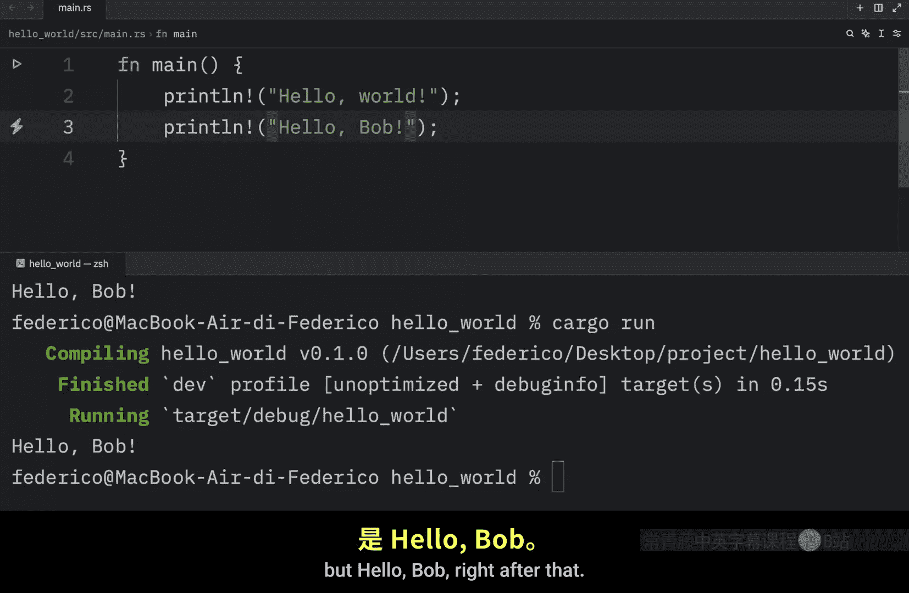
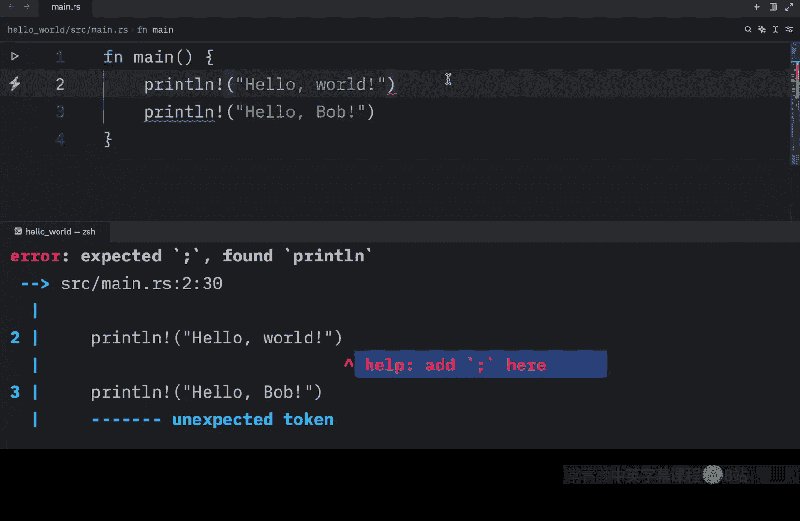
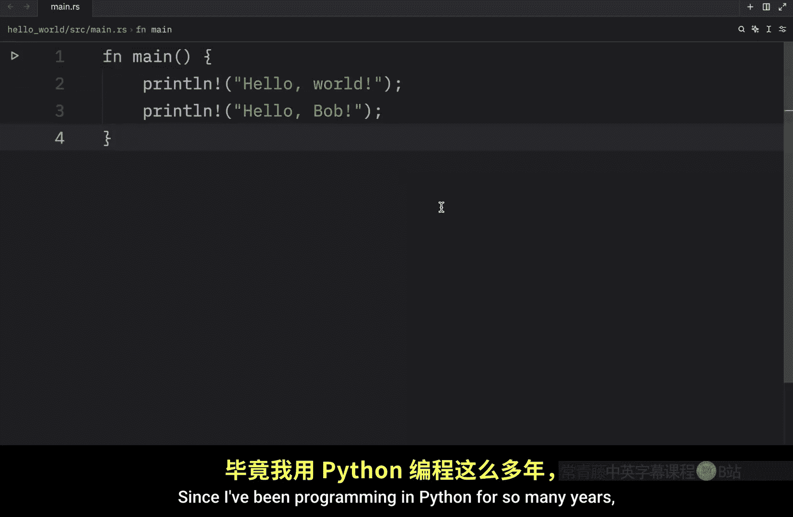
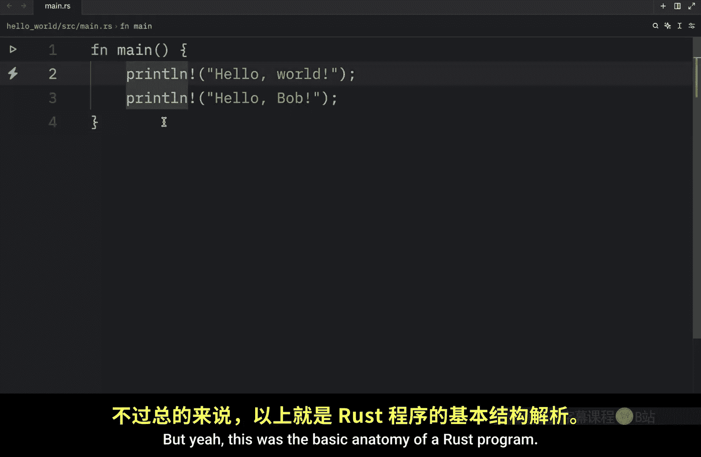
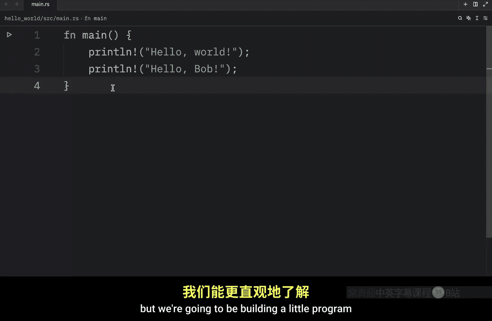

# Rustfully【中英⚡Rust 初学者教程（2025）｜Rust for beginners (2025)】 p02 P2 Rust入门 -BV1eyAkzPEhj_p2-

How's it going everyone In today's video， I'm going to be talking a bit about the anatomy of the code that we saw in the previous video。

 For example， previously I showed you that we created a main function and that we could open up a block of code using these curly braces and then I showed you that we could use the printline macro to print some information to the console and here we can print hello Bob and then all we need to do is coal cargo run in the current project and that's going to compile and run the code but what I want to do in this video is explain in a bit more detail what's going on here。

 So in rust we use fn to define a function and the main function is quite special because it always runs first Then once again we use the curly brackets to open up a code block and conventionally you would start them on the same line as your function definition but there's nothing that will stop you from doing something silly like this if we were to run this code。

 it's still going to compile  moving on we have the print line。

cro without this exclamation mark， it's going to be considered a regular function and macros are slightly different than functions。

 but that's something that we're going to be covering in the near future。

 For now all you need to know is that it prints this information to the console here we're defining a string using double quotation marks a lot of you probably know me from my Python tutorials and there I really enjoy using single quotes unfortunately here that does not work。

 we are forced to use double quotation marks and I'm sure a lot of you are going to see that as a relief using single quotation marks isn't something that common in programming languages when you are defining strings。

 Now what we're missing here is a semicolon and the semicolon indicates that this is the end of the expression and that we can begin with the next one。

 So if we want to add another printline statement， we can type in hellello Bob not boob but hello Bob right after that and then we can enter cargo run and that's going to print hello wel and hello Bob if we were to exclude those semicollins the program itself would not run。

s because we're missing the semicols it does not know that this is a separate statement。

 so we need the semicollonons here and that's going to be quite fun to get used to since I've been programming in Python for so many years I haven't had to deal with semicollons in a very long time but yeah this was the basic anatomy of a rust program I mean there are much more complex examples and of course the programs get much more convoluted and can contain much more logic but in its most basic form it's going to come down to this Now in the next video we're going to be building a little project that will give you an understanding on what a script should look like and I keep on Col Get a script bear with me I just came from Python so I might refer to these as scripts but we're going to be building a little program that will give us a better understanding on how rust actually looks and functions。

