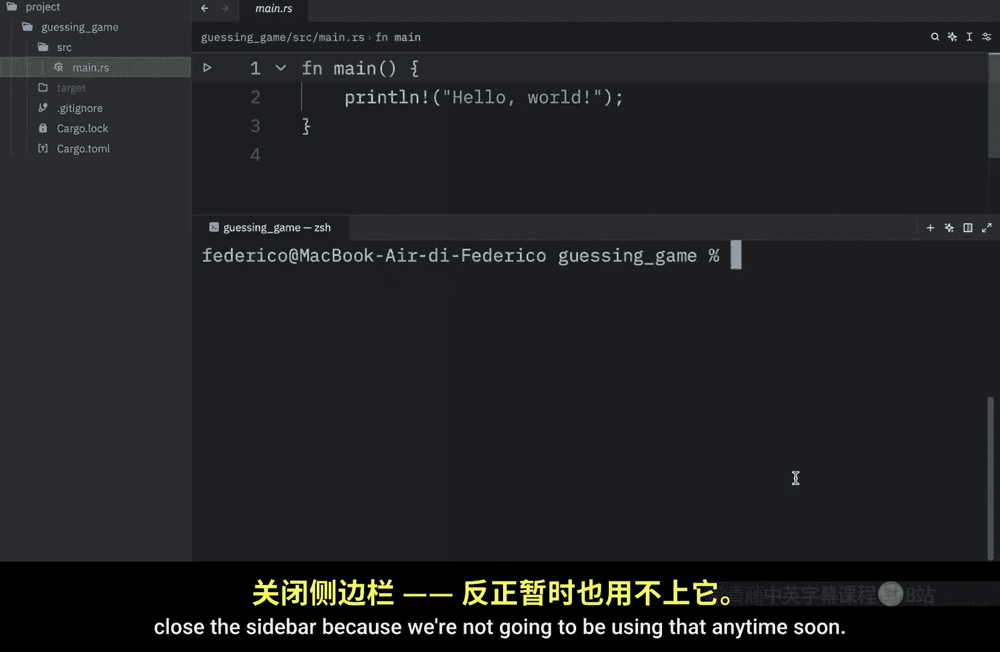
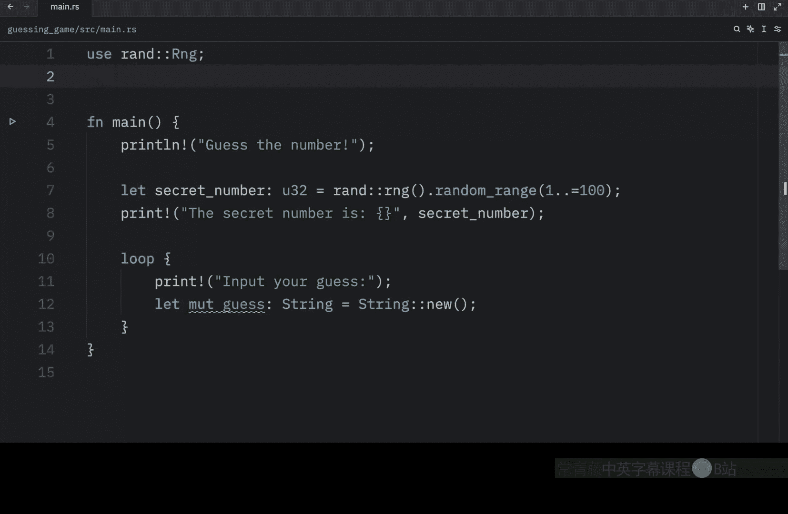
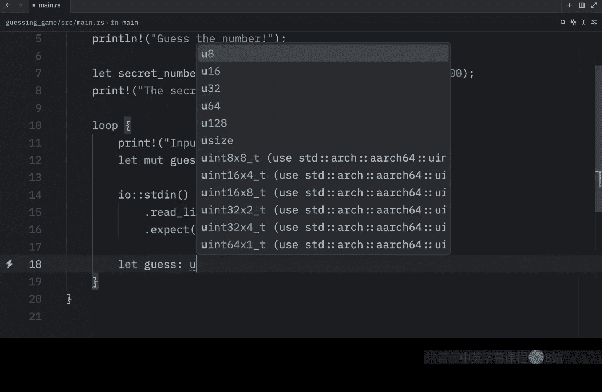
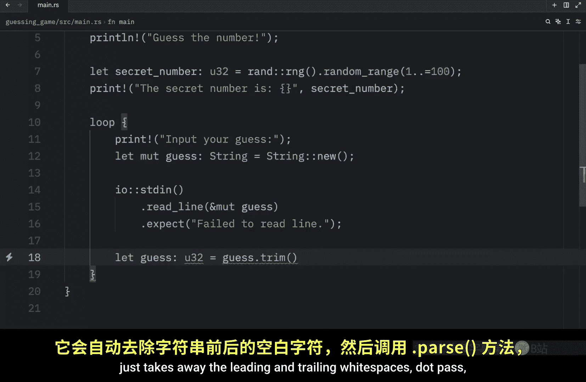
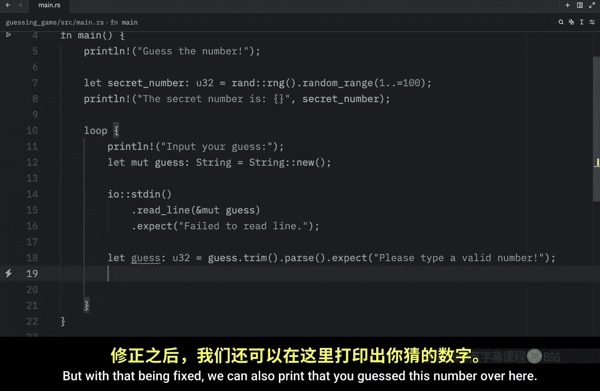
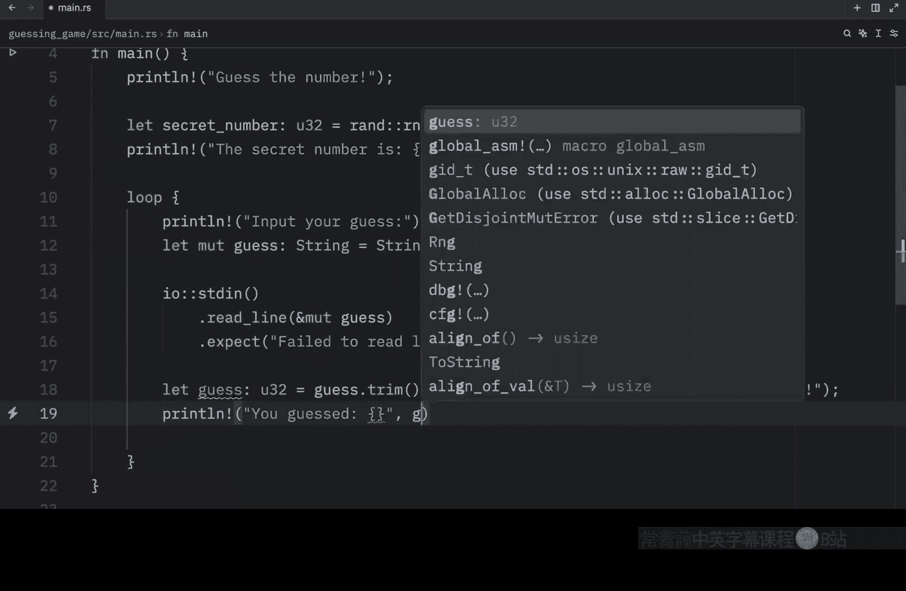
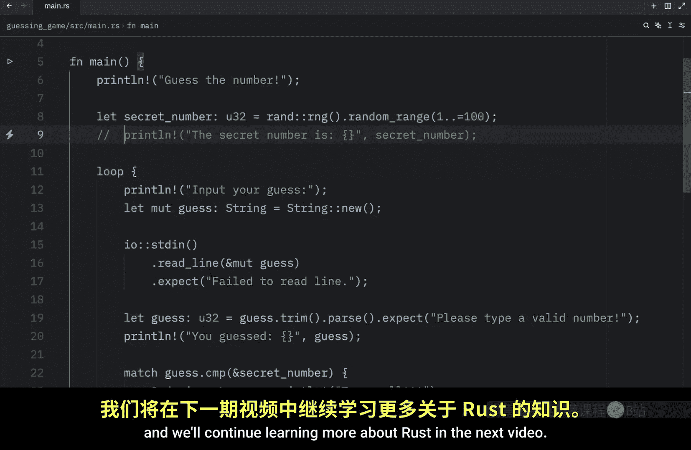

# Rustfully【中英⚡Rust 初学者教程（2025）｜Rust for beginners (2025)】 p03 P3 编写你的第一个Rust项目 -BV1eyAkzPEhj_p3-

How's it going， everyone In today's video， we're going to be building our very first project in rust。

 and this should give us a better understanding on how the language actually looks。

 and it's going to be a very simple project because we are just at the beginning of the language so to get started。

 we're going to create a new cargo project by typing in cargo new and we can call this guess game or guessing game。

And once that is created， we're going to want to navigate to that folder。

 so here I'm going to type in C guesssing game。And now that we're inside this folder。

 we can go to our main dot rust file and start modifying the code or in case you want to make sure everything's running correctly。

 you can type in cargo run And if it compiles and print hello world then everything is set up correctly。

 But for now I'm going to clear the console close the sidebar because we're not going to be using that anytime soon and I'm also going to close the terminal So the very first thing we're going to do is add a welcome message and here we're going to type in guess the number。

 Next we want to generate a random number between the range of one and 100 with both ends being inclusive So to do that we're going to have to import some functionality。

 and to import functionality， we're going to use the keyword use So we want to use random and that's going to come from this package or in rust。

 they call these crates and a crate is just a collection of rust source code files。

 Unfortunately this is an external crate so it doesn't really know what we're referring to there are some crates that are built in。

To rust， but this one is not one of them。 So to use this。

 we're going to have to open up the terminal and use the command cargo add Rand。

 And that's going to add it to our project。 And one thing I want to mention is that if you were to open up the sidebar and go to your cargo do Tommel file。

 you'll see that in the dependencies we're going to have that package or that crate。

 But let's go back to main Rs and continue coding here because we need to generate that secret number that the user should guess。

 So here I'm going to type in let secret number and this is going to be of type 32 B unsigned integer。

 So that's going to look like this。 then we're going to add the equal sign and insert a random。

Range and here we can type in random range and what we want to pass in is the range。 So to do that。

 we're going to add 1 to 100。 And again， this is inclusive。

 And here we're getting some syntax highlighting because this should be the other way around and that's all we have to do for that line of code and I should mention that we use the let keyword to define a variable an immutable variable but we're going to be going over that in more detail as we progress with the rust language and for debugging purposes。

 we're going to print the secret number So here we can print that the secret number is then right after the string。

 we need to insert the secret number and this will be placed inside the parentheses。

 Also one thing that's quite important， which I forgot is the semicolon up here。

 I just ran the program and it crashed or digital really compile because I forgot this semicolon So remember to add semicolonons。

 especially if you're coming from Python like me。 but next let's test out the program by running it。

 so I'm going to type in cargo run and what you should get as an output。

is that the secret number is 81。 Next， we're going to create a loop。

 which is going to allow the user to guess the number continuously until they get it right。

 So to do that， we're going to create a loop。 And here we can print。

Input your guess。 So next we need to grab that user input。 but before we do that。

 we're going to create a mutable string and to do that we need to type in let and then mute。

 which stands for mutable and the variableable name which will be if type string and that's going to equal string new and one thing to note in rust is that all variables are immutable by default。

 So if you want them to be mutable， you're going to have to use the mute keyword。

 which will allow us to change it later。 Now for the next part of the program。

 we're going to have to use some more external functionality。Which is part of the standard library。

 So here we can type in use ST TD I O， which is going to allow us to grab the user input。

 So inside the loop， we're going to type in I O。

And grab that input using STD in then right below that we can read the line and here we need to use the ampersand because it's going to tell the program that our variable guess is a reference and that's going to allow us to access information without having to copy it into memory several times but we'll dive deeper into references later then after that we're going to type in expect and this message is what we're going to get back if this doesn't go according to plan If something goes wrong。

 this message will appear。So here we can type in failed to read line and of course。

 we need a semicolon。 Now since this input gives us a string back。

 we're going to have to convert it or pass it to an integer because that's what we need to compare it to when we want to verify that the user has guessed the correct number So right below we're going to type in let guess of type unsigned integer of 32 bits equal guess dot trim trim just takes away the leading and trailing whitespaces dot pass so we can actually pass it to the data type we want and what the exception message should be if something goes wrong please type a valid number Also before we move on I need to fix a small error here and here I type in print instead of print line。

Those kind of things happen when you come directly from Python。 But with that being fixed。

 we can also print that you guessed this number over here。 So we're just going to pass in that guess。

 Now， before we actually compare the guess to the secret number。

 we're just going to run the script to make sure that everything's going according to plan。

 So let's open up that terminal。 clear it。

And run cargo。 So right now， the secret number is 89。 And if we pass in something such as 10。

 it's going to say you guess 10。 if you guess 20， it's going to say you guess 20。

 And this is going to repeat indefinitely because we don't have any logic to tell us that we won or guess the correct number。

 Also， watch what happens if we type in a word such as Bob。

 You'll notice that we're going to end up with an exception。 And here we have that message。

 please type a valid number。 Anyway， by this point。

 we only have one more block of functionality that we need to make this program work properly。

 And that block is going to compare what the user has entered to what the secret number is。

 so that we can tell the user whether they guess the correct number or not。 And for this part here。

 we're going to have to import some more functionality， which is also part of the standard library。

 So here we will type in use the standard library and C with ordering。

 So we're just going to use some comparison functionality。 Then below the guess。

 We're going to create a match statement。 And it's going to match the guess。

Dot comparison， because that's what we want to compare it to。 the reference of the secret number。

 Then we're going to use the ordering magic。 So we have ordering less。

 And this is what's going to happen， when guess is less than the secret number。

 And here we have to create this arrow for the functionality we want to execute and then print the line and we can type in something such as too small comma。

 And once again， I forgot the semicolon up here， then we have ordering greater。

 So what happens when guess is greater than the secret number， print line too big and finally。

 what happens when ordering is equal。 So when guess is equal to the secret number。

 And here we can either add a single statement or we can open up another block。

 But what we're going to type in here is that you guessed correctly。😊。

And then we're going to break out of the loop。 And that's going to be the end of the program。 Now。

 with that being done， let's open up the terminal， clear it and run our script。

 So right now we have to guess the number， which happens to be 61。

 but we're going to pretend that we don't know that so we can type in 50。

 It's going to tell us too small。 Then we're going to try 40。

 And I actually just forgot what the secret number was。 I'm actually playing the game at this point。

 I feel like I have Alzheimer's So I'm going to just cheat a bit。

 But now that I know what it is once again， I'm going to type in 61。 And by this point。

 your program should congratulate you or it didn't really congratulate you here。

 just said you guess correctly。 and then it's going to exit out of the script。 And obviously。

 if you want to make this a real guessing game。 just comment out the print line。

 then rerun the script。😊。

Or the program？And start playing this very fun game。42 small，50，60，70，69，65。64 and the number was 64。

 so that was the first project we created in rust。 Now if you're up for the challenge。

 I'm going to be giving you a small homework assignment。

 which is to add some functionality that tells the user how many guesses it took to guess the correct number For example。

 I guess this in maybe I don't know 78 tries。So once it says you guess correctly。

 add a statement that says you guessed in this many attempts。

 otherwise that's actually all I wanted to cover in today's video and we'll continue learning more about rust in the next video。

