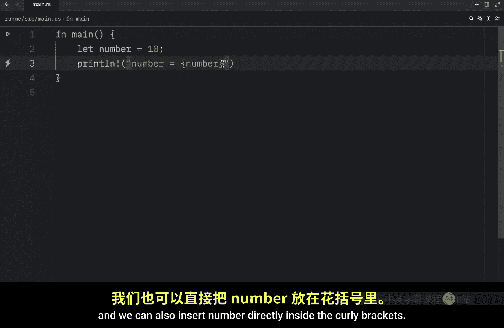
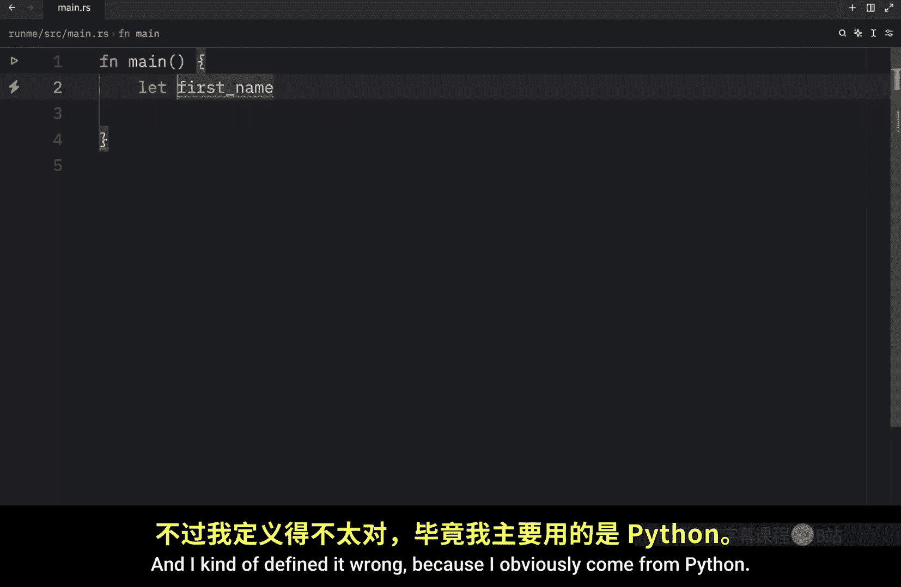
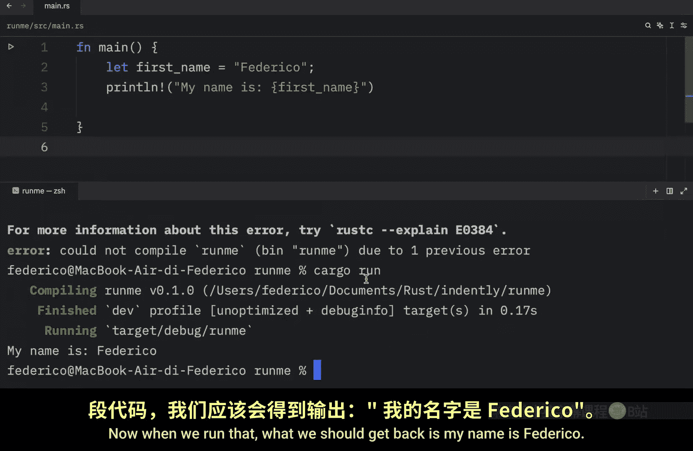
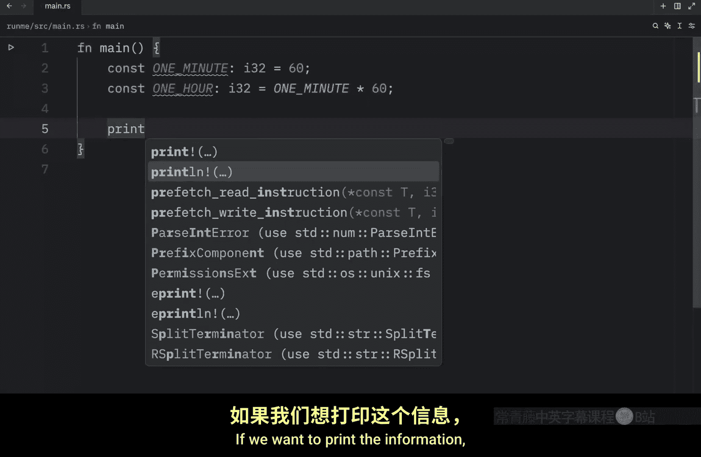

# Rustfully【中英⚡Rust 初学者教程（2025）｜Rust for beginners (2025)】 p04 P4 在Rust中创建变量 -BV1eyAkzPEhj_p4-

How's it going everyone in today's video we're going to be covering mutable variables。

 immutable variables and constants， and this is quite an important topic。😊。

Especially if you want to get very comfortable with programming in rust。 So first of all。

 I want to talk about immutable variables and every variable you create in rust is immutable by default。

 This means that once you assign a value to a variable。 It cannot be changed later。 For example。

 you might have something called number and you're going to assign a thevalue of 10 Here we used the let keyword to tell rust that we want to give this name the value of 10。

 And again by default， this is immutable， which means we can change it later。 But first of all。

 let's try to print it。 and here I'm going to be using this syntax to displayed information。

 So I'm just going to type in number is equal to curly brackets。

 and we can also insert number directly inside the curly brackets。 previously。

 I showed you that we could insert a variable into a string by using this syntax over here。

 that works as well number is going to go inside the placeholder。 but you can also do it directly。

 and I'm going to be going over this syntax in a。

Video， because there are some details you should know about regarding that。

 If you want to use this efficiently。 But for now， all you need to know is that you can insert a variable inside the curly bracket。

 and it's going to give us back the value of that variable。

 So right now what I'm going to do is type in cargo run。

 And what we should get back is that number is equal to 10。

 But now imagine that we want to change the number to something else， such as 20。

 We want to change the number  to 20。 Now， right below that。

 I'm going to print the number once again。 Then I'm going to open up the terminal and run the script。

And what you're going to notice is that we're going to get an error and that it was unable to compile the code。

 If we scroll up， you'll notice that rust is going to be quite explicit with the error。

 we cannot assign twice to an immutable variable to make this work we're going to have to define it to be mutable using the mute keyword。

 And this time if we open up the terminal and we run this code you'll see that it's going to change the number 220 without any problems。

 This also means that we can do something such as plus equals one to increment the number and once again。

 if we were to run this code。 it's going to increment that code by one。

 and then from that point forward， it's going to hold 11 as the new value。

 but if we were to keep this as let number， it's going to raise an exception。

 So if at any point in the future you think a value is going to change or you want to change it at any point in the future。

 Just remember to make your variable mutable and one last thing before we move on to constants。

 I just want to bring up the naming convention。For variables in rust， just like in Python in rust。

 we use snake case when we are defining variables。 For example。

 we might have a variable called first name。 As you can see。

 I'm using snake case here to define that。 And I kind of defined it wrong because I obviously come from Python。

And the first name is going to be Federico。 Then we can print line and print that first name。

 My name is。

And pass in the first name。 Now， when we run that， what we should get back is my name is Federico。

 But now let's move on to Consts。

And what you should know about constants is that constants are always immutable and must be annotated with a type when we are using the let keyword and we give the variable a name。

 you're going to notice that we're not forced to provide a type。 when we are creating that variable。

 But with constants， it's a different story。 So to create a constant。

 we use the constant keyword and the naming convention for constants is all uppercase characters combined with snake case。

 So one minute， for example， which will be an integer of 32 B is going to equal 60 seconds。

 And if we duplicate that， we can do something such as。1 hour， which is going to be one minutes。

 time 60。 Now， another very important piece of information is that constants cannot be calculated at runtime。

 They must be made in place。 as you can see here， I'm immediately assigning the value of 60 to one minute。

 And for one hour， I'm immediately assigning it the value of this expression。

 but we cannot run the program and assign it a value after we've run it。 Otherwise。

 using a constant is as simple as using any other variable。 If we want to print the information。

 we just print that line and type in one minute is and pass in one minute。

 Then we can duplicate this pass in one hour。

And say that one hour is one hour。 And I also want to pass in the seconds。 Otherwise。

 that's not going to make any sense。 And now we can clear the terminal and run this code。

 And what we should notice is that one minute is 60 seconds。 and that one hour is 3600 seconds。 Also。

 in case it's your first time creating a constant Con are used to create values that should never change。

 valuesue that are quite important。 For example， constant pi of type floats is going to equal 3。1415。

 This is a value that should never change。 It's always going to be the same。

 no matter where you use it。 It's not something that should ever be updated。

 It should remain constant， hence the name constant。

 And that means that we can always rely on that value being the value that it is。

 here we can print line and then say that pi is pi。 And when we run this， we should get that pi is 3。

1415。 Also， what makes。

Constant special in rust is that we can define them in any scope without any errors。 For example。

 we can even insert this into the global scope， and rust will be fine with that， as you can see。

If we were to run the script， there would be no issues there。

 if you were to do this with a regular variable， Rust is going to complain。 So let's run that cargo。

 And as you can see， Rus could not compile this program because let cannot be used for global variables。

 Anyway， that just about covers what you need to know about variables and constants in the next video。

 we're going to cover data types because throughout this video I've just been randomly typing out these data types。

 but I didn't really explain what they are and how they work。

 So that's what we're going to be learning in the next video。

