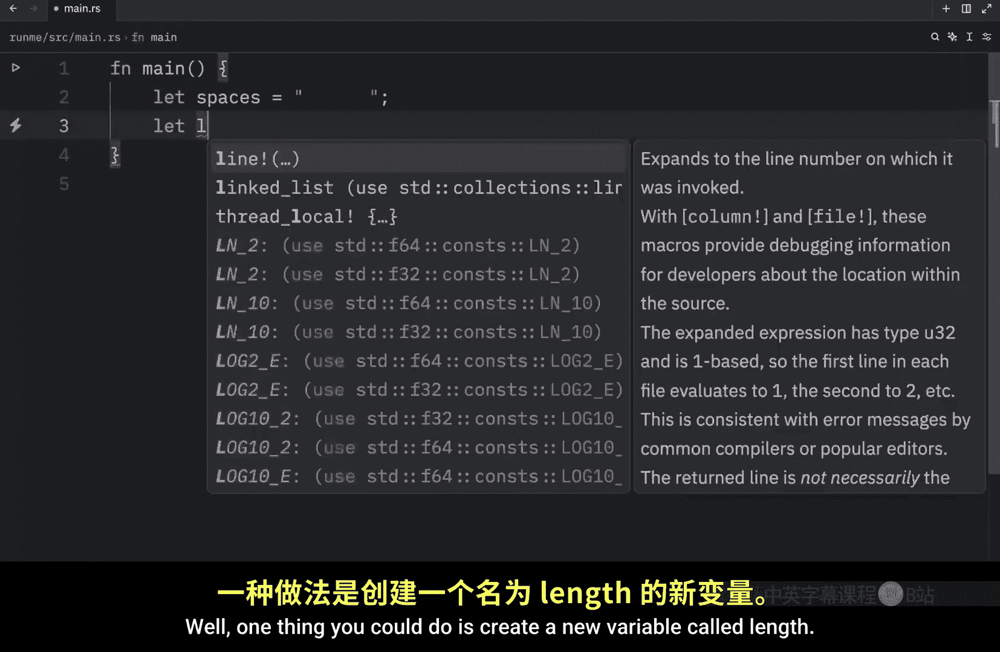

# Rustfully【中英⚡Rust 初学者教程（2025）｜Rust for beginners (2025)】 p05 P5 Rust中的变量遮蔽 -BV1eyAkzPEhj_p5-

How's it going， everyone In today's video， we're going to be talking about the concept of shadowing in rust。

 and I really should have covered it in the previous video Anyway。

 variable shadowing allows us to use the same variable name for either a different value or a different data type without having to write any extra code One place you'll see this being used is in different scopes for example。

 you might have a number， which we will just call n contain the value of5 and then we might have a different scope where n will be equal to 10。

 Now here what we can do is print what's inside the inner scope so we can print that inner n is n。

 and then we're going to copy this and paste it outside the scope and we can type in that Alta n is n Now if we were to run this What you're going to notice is that we're going to get back that inner n is 10 and out n is5 and that's because we are in different scopes。

 If we were to exclude this variable here。 it's going to use n from over here。

And you can verify that by running the script and you'll notice that inner an n is5 and that outer n is5 So the shadowed variable in the inner scope did not affect the variable on the outer scope and that just makes it easier to use the exact same variable name in two different places and that was the first example provided by the rust documentation Now let's move on to the second example and the second example should give you a better idea on how this can be used for example we might have something called spaces and that's going to equal this string here with six empty spaces12345 and6 Now imagine you want to count how many spaces this string contains well one thing you could do is create a new variable called length of spaces and then type in spaces length to get the length back and if you were to print this and pass in the length of spaces what you're going to get back is six spaces but in some cases this might be verbose or you might not really need that extra line because you'll never use this variable again especially if the end goal is just a calculate。

The number of spaces， something much more efficient would be to shadow the original one with the exact same name。

 so now we can let spaces equal the length of spaces and then we can just use it immediately under and thanks to this technique we can change the data type as well because originally spaces was a string and now it's an integer and what I'm going to do next is type in cargo dot run and use dash Q and this will run cargo in silent mode this is a quick trick that one of you showed me in the comments section down below so I'm going to be using that from now on but when we run this what you're going to notice is we're going to get six spaces back and as you notice running cargo in silent mode skips all of this or doesn't skip it。

 but it just hides it Now you might be thinking why didn't you just make spaces mutable so we could give it a new value let's try to do that let's let spaces be mutable and then we're just going to type in spaces equal spaces dot length Now if we were to run this you're going to notice that we're going to end up with an exception and this is because we expected a string but we ended up assigning it a different。

Data type。 so thanks to rust being a typea language。 This is not going to work。

 It's going to respect the fact that spaces was originally a string and that that could not change later。

 So the easiest way to change that is to create spaces as an immutable variable and then shadow it。

 So we're practically recreating that with a different value。 And now the next time we run this。

 What we're going to get as an output is exactly what we were looking for。

 The total amount of spaces。 But yeah， that's actually all I wanted to cover in today's video。

 do let me know in the comment section down below whether you have any more questions regarding variable shadowing in rust。

 But otherwise， with all that being said， as always。

 thanks for watching and I'll see on the next video。

