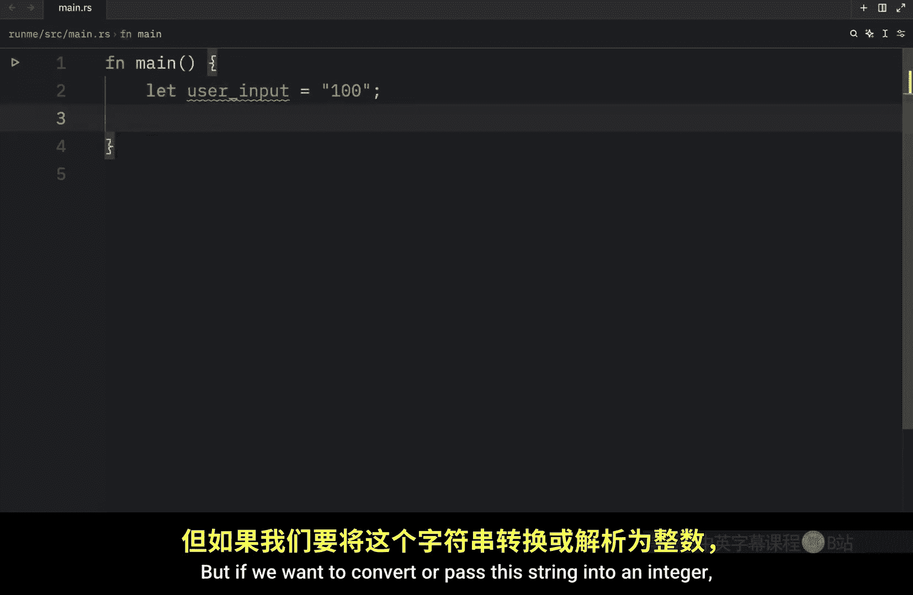
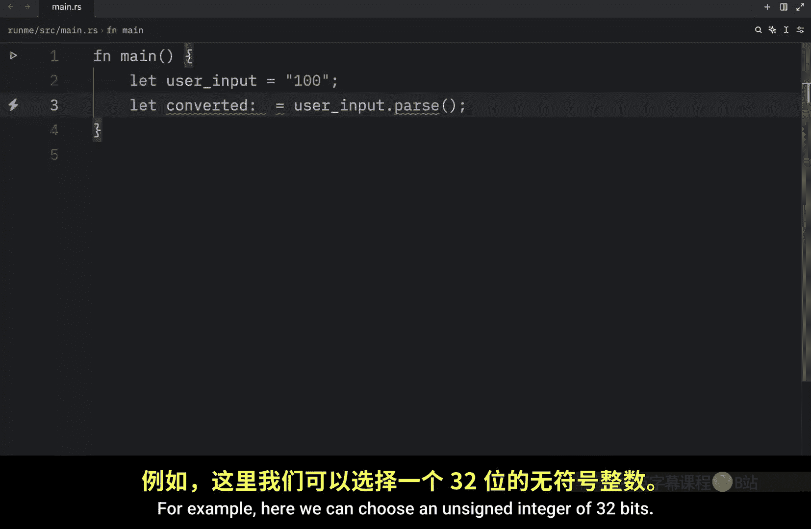
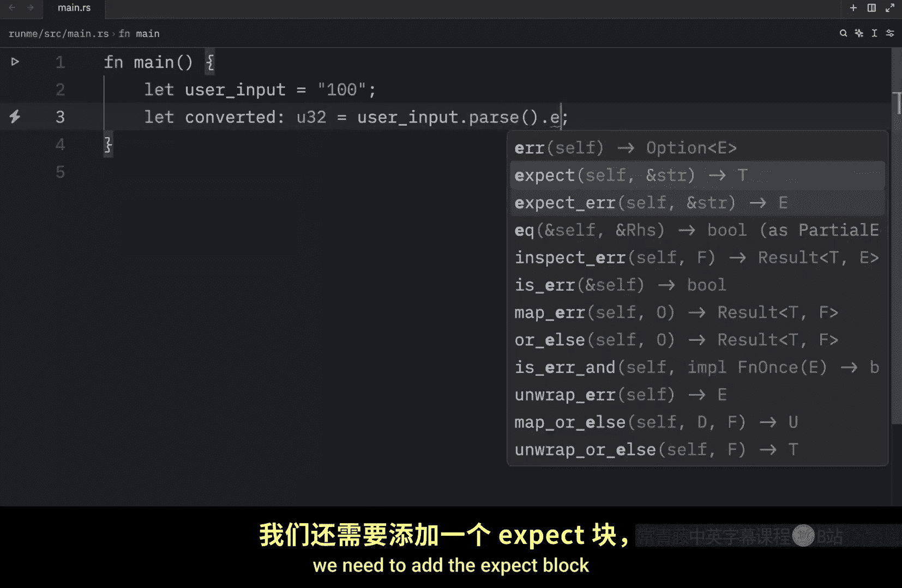
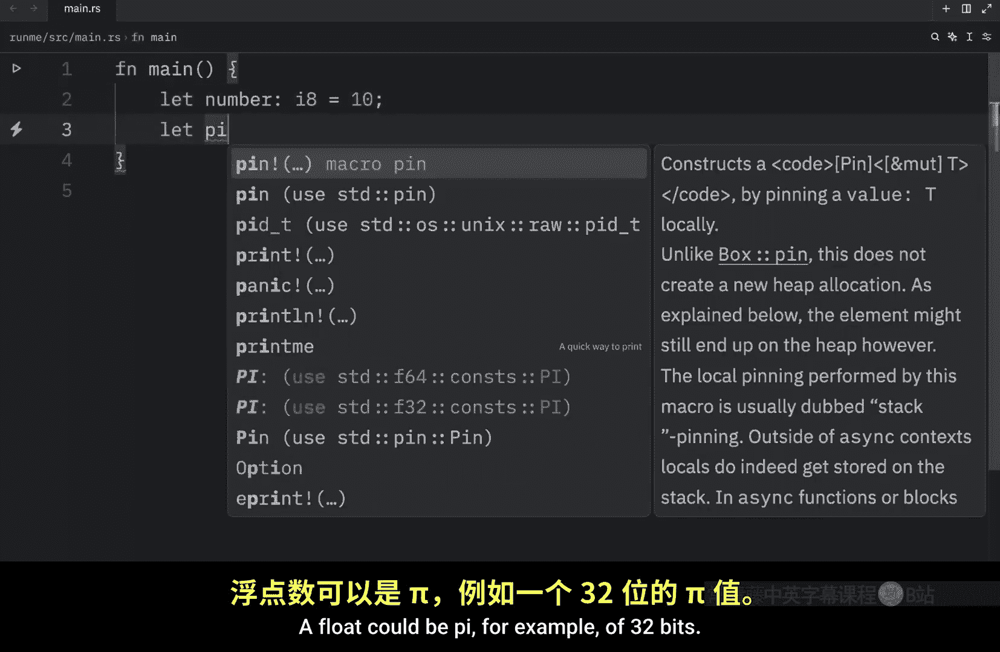
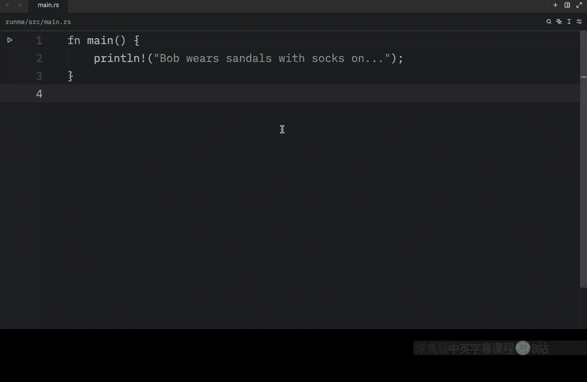

# Rustfully【中英⚡Rust 初学者教程（2025）｜Rust for beginners (2025)】 p06 P6 Rust中的数据类型 -BV1eyAkzPEhj_p6-

How's it going everyone In today's video， we're going to start by covering the data types that we have in rust。

 and this is quite an important concept to understand because rust is a statically typed language which means that it must know the types of all variables add compile time Now usually the compiler is going to be able to infer what type a variables going to be。

 but in some cases you're going to have to be more explicit。 For example。

 you might have a variable called user input and this will equal 100。

 if you hover over user input you'll notice that it's going to be of type string and this is something that rust knows based on the context。

 but if we want to convert or pass this string into an integer。

 we're going to have to be much more explicit。 We can't just type in let converted equal。

User input do pass because rust will have no idea what kind of type we want to turn it into so to make this work。

 we're going to have to choose a data type that works with 100。

 for example here we can choose an unsigned integer of 32 bits and of course we need to add the expect block for what message we should give back in case this passing fails so here we can say could not pass and now everything will work properly because we told rust that this is going to be an unsigned integer and we can now print that converted is equal to converted so that the next time we run this script。

 we will get that converted is equal to 100 as an output and since we converted the user input to an integer。

 we can also do some mathematical operations with it we can say converted plus 100 and the next time we run that we should get 200 back anyway in the next few videos we'll be looking at two data type subsets Scalar and compound。

Data types now scalar types represent a single value， such as integers， floats。

 Booles and characters。 and before we move on to compound types。

 I'm just going to show you one of each。 For example。

 an integer would look something like this so that can be of8 bits with a value of 10。

A float could be pi， for example。

Of 32 bits。And that's going to equal 3。1415。 and this is a float because it's a decimal number while an integer is any whole number。

 After that， let's create a boan。 so let's turned on。

This could be a variable you use for a lamp of T Boolean equal false。

 which means the lamp is turned off， and bulloles only have two states， either false or true。

 but as you can see so far， all of these are single values。 and finally。

 let's use some sort of characters we can say let delta。Of type character。

Equal and using single quotation marks we can define a character a single character。

 and then we can define delta， so these are scala data types， they all contain a single value。

 then we have the compound types。And these types group multiple values into a single type。

 For example， we might have some coordinates and this is going to be a tuple。

 so it's going to contain a value of float and another float， and that's going to equal 1。5 and 2。

5 As you can see we inserted two different values into this data type which is a tuple。

 another example of a compound data type is an array。

Here we can create an array by typing in let people and defining how their array should look like。

 so it's going to be of type string and it's going to contain three elements。

 then we just need to populate that array with Bob。Luiiz。And Ashley and once again。

 this is a compound data type because it contains multiple values。

 but is still referred to as a single type。 Now， in the next few videos。

 we will be exploring all of these data types in a bit more detail so that we can comfortably use them later。

 Today's video was just an introduction to what we're going to be looking at in the next few videos。

