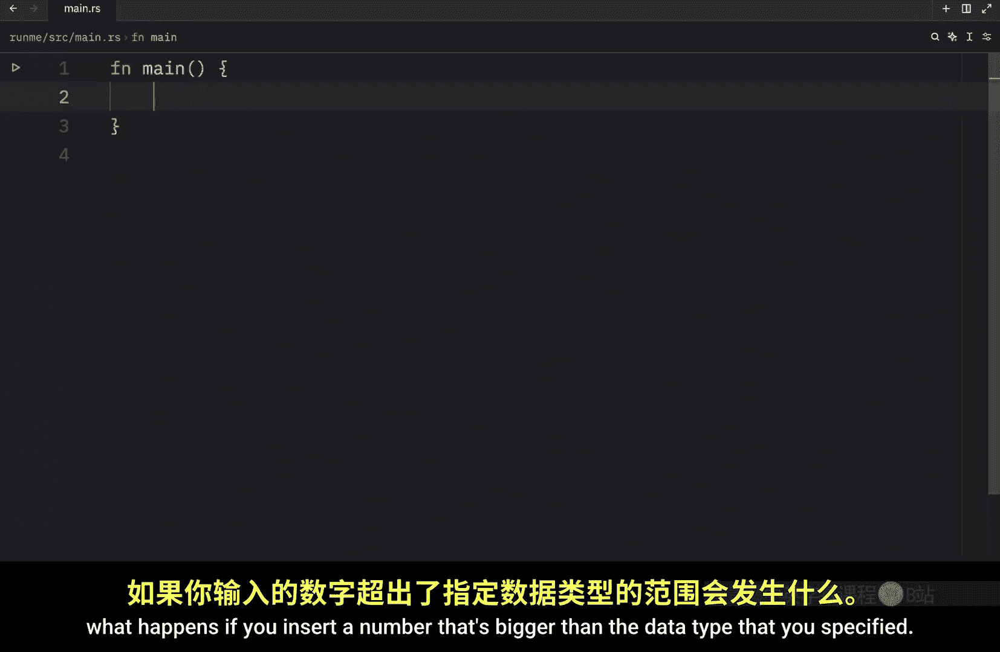
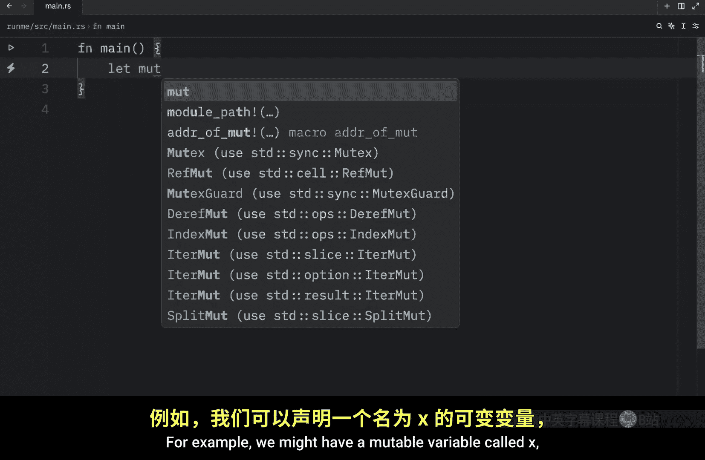
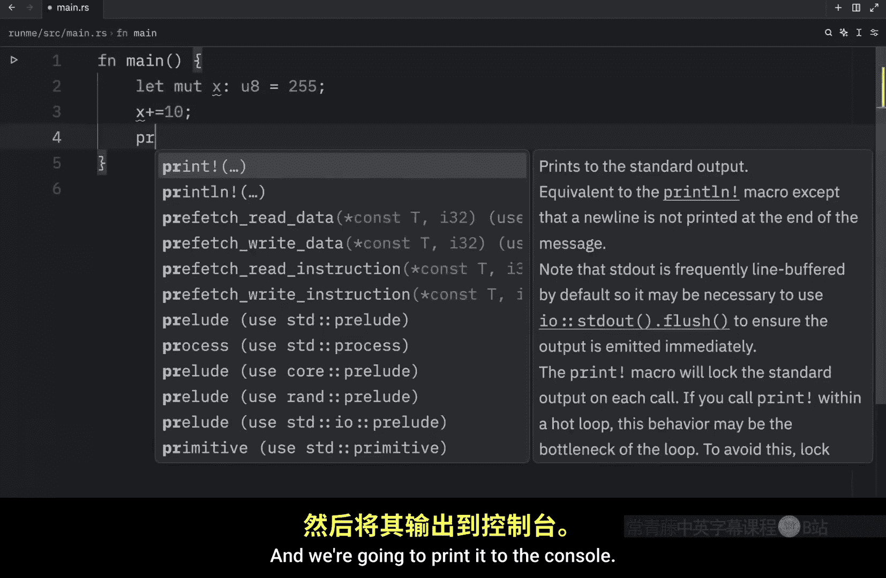
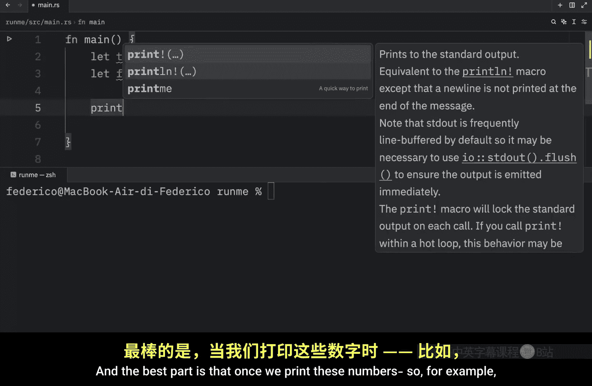

# Rustfully【中英⚡Rust 初学者教程（2025）｜Rust for beginners (2025)】 p07 P7 详解Rust中的整数 -BV1eyAkzPEhj_p7-

How's it going everyone In today's video， we're going to be covering the integer type in rust。

 and in rust， we have two types of integers signed and unsigned integers。

 So let's get started by creating one of each And here I'm going to let n1 be of type I 8 which is an integer of 8 bit。

 and that's going to equal 10 Then I'm going to create another integer， which is going to be of u 8。

 and that's also going to equal 10 or better yet we're going to change it to 200。

 Now what you're seeing here is a signed integer and an unsigned integer。

 And the only difference between these two is that a sine integer can be negative while an unsign integer will always be positive。

 but what's important to take from this is that both of these numbers can only be of 8 bit。

 So a signed integer can contain the values of 128 or what I meant to say was negative 128 to 127 while an unsigned integer can contain the values from 0 to 2。

55Both of these integers contain the same range of numbers。

 And by that I mean they both contain a range of 255 numbers。 in general。

 a signed integer can only go up to the number or the value of 127 while an unsigned integer can go all the way up to 255。

 and this is only because a signed integer also has to cover the negative part and it's very important we select the right integer type when we are creating an integer because if we create something that's too small such as an integer of 8 bit and we give it the value of 1000 which clearly doesn't fit in the range I showed you earlier。

 we're going to get an error， and this program won't even compile and we can verify that by typing in cargo run。

 what we're going to get as an output is that it could not compile because we have this error here。

 We have an error that says literal out of range for I8。

 Now with any modern code editor if you were to hover over the 1000 or whatever number you have you're probably going to get a message that will help。

Out with picking the correct data type。 So for this example。

 you would want to pick something of 16 bits。 It's something that can hold a higher value。

 If you choose to exclude the data type。 what you're going to end up with by default is an integer of 32 bit and just to type out what 32 bit looks like。

 Let's do it here。 that's going to be from the range of-2 trillion14748300 and 648 to make this even easy to read。

 I'm going to add some underscores。 So as you can see the range starts from an incredibly small number and that goes all the way to 2 trillion14748300 and 647 So a 32 bit integer has a huge range And if you ever decide to make this an unsigned integer by typing an U 32 it's going to range from0 to the double of this number over here which would end up being 4 trillion294967。

and 295 which is a really big number。 So in general。

 a 32 bit integer should be enough for most everyday operations。

 And this is what rust uses by default。 if you do not specify the data type Now here's a small chart of all the integer types that we have when it comes to specifying the amount of bits you want your integer to be and this is something I pulled directly from the rust documentation and at the bottom。

 you're going to notice that we're also going to have something called eye size and u size and these types depend on the architecture of the computer your program is running on。

 So if you were to type in eye size and give it this value here I size is going to use whatever architecture your computer is using。

 So if your computer uses a 64 bit architecture， I size is going to be of 64 bits。

 and we actually have a way to determine the maximum or minimum value of each one of these types。

 and that's by printing eye size。

Max， and this will retrieve the max value of this data type。 and we can also do min。 Now。

 the next time we run this script。 What we're going to get as a result is the max value of i size。

 And also the minimum value of I size。 and this works with any integer data type。 For example。

 we can also do this with i8。 and it will give us back the max and min value of each one of these。

 But of course， we need to run that。 So here we have 127 and-128 or negative 128。

 But going back to i size， you'll notice that because I'm on a 64 B architecture。

 we can just type in i 64 here and if we were to run this we're going to get back the exact same number because once again。

 this is determined by the architecture that our computer is using。 anyway， up next。

 I want to show you what happens if you insert a number that's bigger than the data type that you specified。

 For example， we might have a mutable variable called X which will。

An unsigned integer of 8 bit。 and that's going to equal 255。

 which is the max value that you can use with an unsigned integer。 Next。

 we're going to increment it by 10。 and we're going to print it to the console。

 So here we' going to type in that X is equal to X。

 Now if you were to type in cargo run you would end up with an error or that our main thread panicked。

 So it would not give us the output we were looking for。

 And this is what happens when you run it in debug mode。

 it still gives us the chance to fix this error。 but once you decide to run your program in release mode。

 you'll notice that it's going to compile and it's going to give us an answer which is quite unexpected。

 which in this case is x equals 9。 So what's happening here instead of crashing our program。

 it decided to start over。 So right after 255。 it continued with 0，1，2，34，5，6，7，8 and 9。

 It just ended up looping to avoid crashing our program and that's something we would like to。

Avoid whenever possible， because obviously， if you add 10 to 255。You would expect to get 265 back。

 but in this case， we specified the data type to be too small。

 So it had to perform some last minute magic to make it work in the program。

 which in this case was just to start over from 0。 Now， before we conclude this video。

 I'm just going to show you one very useful trick that I use all the time when I'm creating integers。

 So for this example， we're going to create a variable called trillion， which will be of type I 64。

 And as you might have guessed， it's going to contain the value of 1 trillion。 So 1，0，0，0，0，0，0。😊，0。

0，0 and 0，0，0。 Here we have 12 zeros。But as you might have noticed。

 I had to think really hard when creating this variable。 and worst of all。

 imagine I was tired and I missed a0。 I would never be able to spot that。

 I don't have the faculty or the capacity to actually spot that by looking at it。

 So something that I really like to do is to use the underscore to format my numbers。 For example。

 we can let format it。Of I 64， equal 1。Followed by the zeros I need to create 1 trillion。

 and this is much easier to keep track of because if I by accident added two zeros to a certain section。

 I'd be able to notice that immediately or it would be much easier for me to notice and to fix it。

And the best part is that once we print these numbers， so for example， if we were to print trillium。

And we to duplicate that and print formatted what we would get as an output is the number without the underscorecourse。

 and that's because rust ignores the underscorecourse。

 It is only used as a visual representation to make it easier on the developer and as you might have noticed here。

 this trillion actually contains an extra zero which is something that I did on accident。

 but if it wasn't for this number over here。 I would never know or noticed that this was in fact。

 10 trillion。 but yeah， that's one trick I find very useful because again。

 if you ever want to create a number such as n which is of 64 Bs。

 and that number ends up being very big using the underscorescourse can be a lightsaver and they don't have to be every three digits you can also do it every two digits or you can specify it to be every one digit。

You can make it as weird as you like。 They are just used as a visual representation for the developer to keep track of numbers。

 But yeah， that's really all I wanted to cover in today's video In the next video will'll be covering floats。

