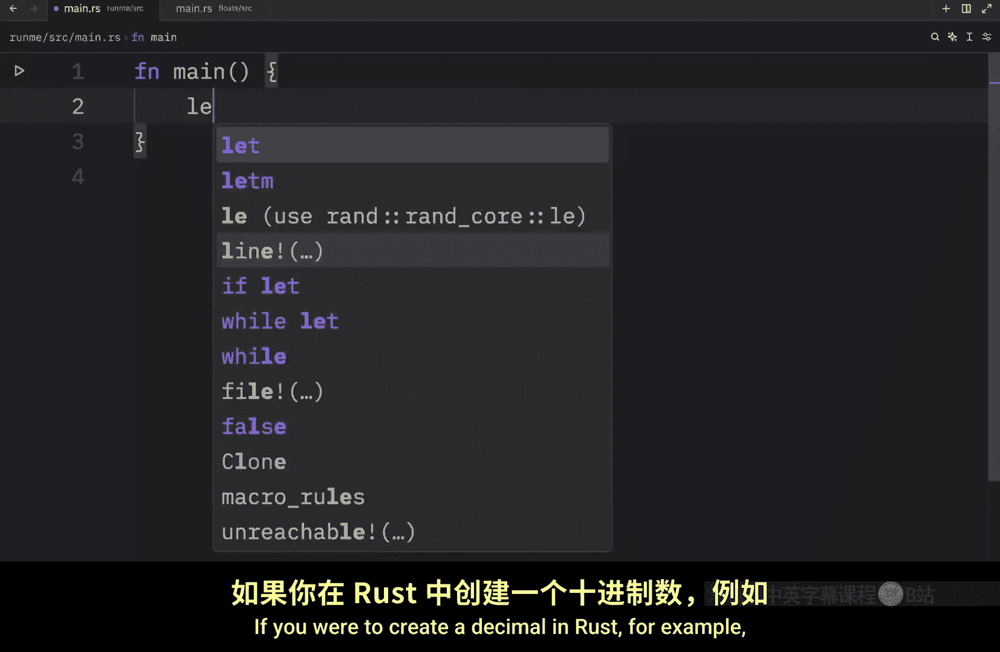
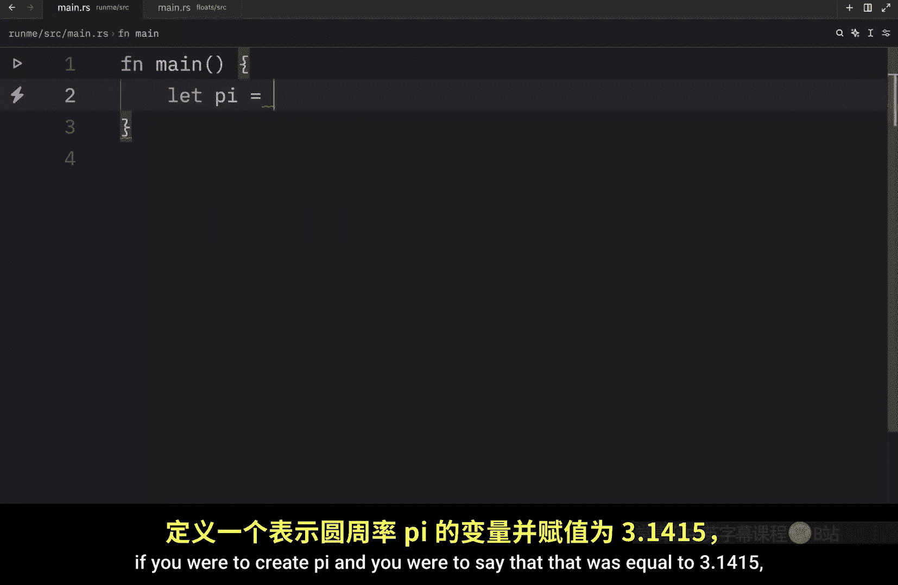
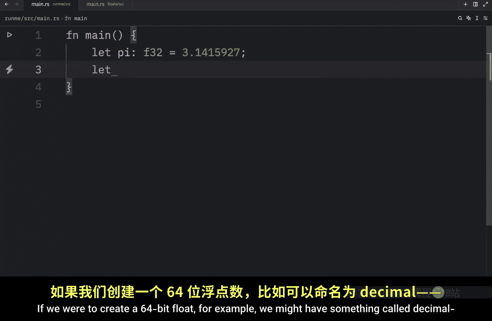
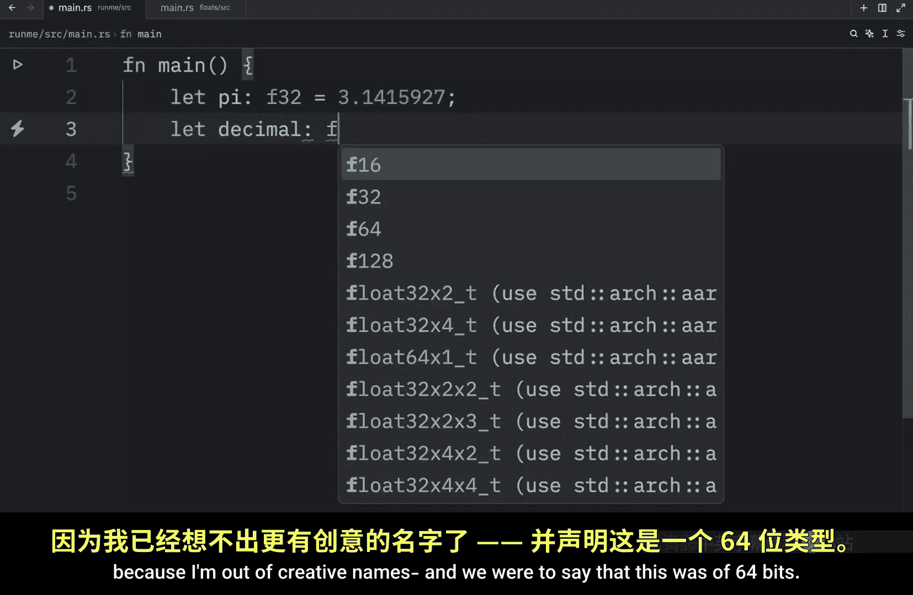
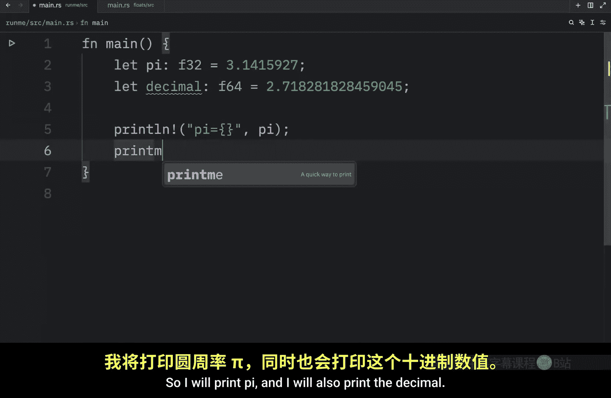
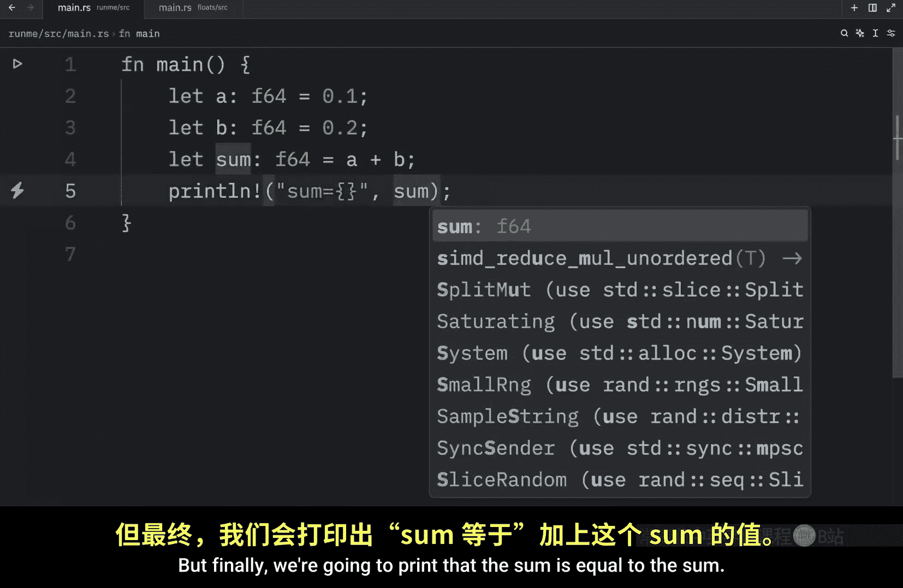
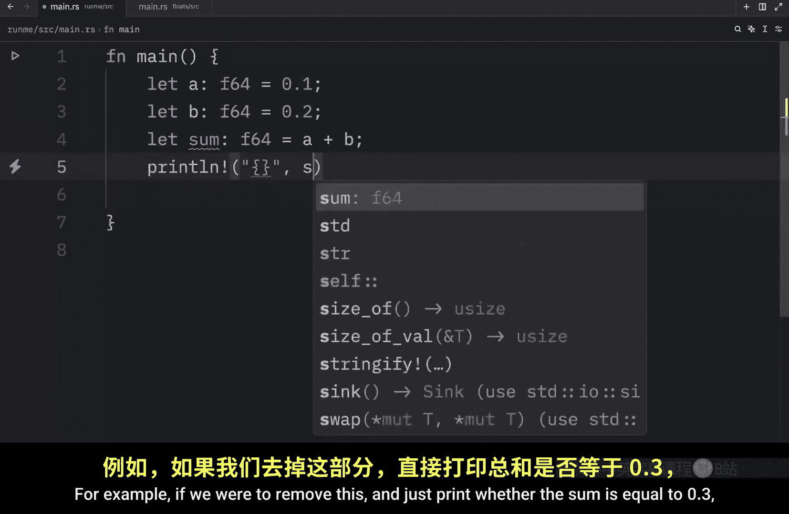
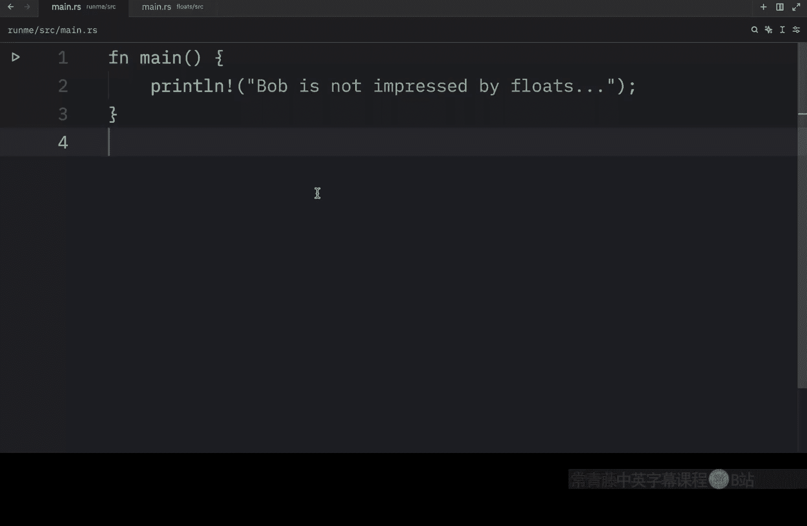

# Rustfully【中英⚡Rust 初学者教程（2025）｜Rust for beginners (2025)】 p08 P8 Rust中的浮点数也很奇怪 -BV1eyAkzPEhj_p8-

How's it going everyone in the previous video， we talked about integers。

 So in this video we're going to be covering floats and rust has two primitive types for floating point numbers。

 which are F 32 and F64 and those just stand for 32 bit floats and 64 B floats。

 If you were to create a decimal in rust， for example。

 if you were to create pi and you were to say that that was equal to 3。

1415 This would by default become a float of 64 Bs And the reason it default to 64 Bs instead of 32 is just because modern CPUus can handle it。

 It's roughly the same speed but has much more precision。

 And just to demonstrate what they look like side by side。

 we're going to create pi which will be of type F 32 and we're going to use the7 digits of precision So here we have 3。

1415 so we've used 4 digits so far and we can add 92。

And 7。 so here we have 7 decimals。 And that's all the 32 B float can contain。

 If we were to create a 64 B float。 For example， we might have something called decimal。

 because I'm out of creative names。 And we were to say that this was of 64 B。

 Then we can create something such as 2。718，2，8，1，8，2，8，4，5，9，0，4，5。

 And maybe it wasn't so obvious here。 But here we have 15 digits that come after the decimal。

 So the size of the float practically doubles。 But next。

 let's try to print both of these to the console。 So I will print pi。 And I will also print。

The decimal and once we run this， what we're going to end up with are these two floating point numbers。

 Now， if we were to add some more values to the decimal parts such as49s here and49s here and rerun our program。

You're going to notice that those parts are going to be truncated。

 or maybe that's not entirely true because as you can see over here for the second one。

 the decimal was rounded up， although for the 32 B float， it remained the same。

 So just like with integers， you should respect the limit of the type that you've specified。

 But moving on there one last thing I want to show you regarding floats。 And for this example。

 I'm going to create two variables， one called a， which will be of type float 64。

 And that's going to equal 0。1。 Then we're going to let B of type F 64 equal 0。2。

 And then we also want to create a sum， which will end up being the sum of a and B。

 which will also be of 64 B。 So a plus。

BAnd due to my habit of programming in Python， I haven't included a single semicolon。

 but finally we're going to print that the sum is equal to the sum and once we run this code。

 what you're going to notice is that we're going to get this crazy decimal number and the reason this happens is because decimal numbers are incredibly difficult to represent in binary So you can never really rely on perfect precision when performing calculations with floats without the help of external libraries and functionality and what really makes this a massive headache。

Is when you have to compare floats to other floats， for example， if we were to remove this。

And just print whether the sum is equal to 0。3， what we're going to get as an output is false because just like I showed you earlier。

 when we printed these sum what we got as an output was this crazy number over here and unfortunately computers do not consider these two floats to be the same or it's not really that unfortunately because the is equals to operator checks whether two objects are equal。

 So just to sum it up， we use floats to represent decimal numbers and fractions in programming Now in a future video。

 I will teach you how to properly perform calculations with floats。

 especially when it comes to calculations that rely heavily on precision but for today's video that's all I'm going to cover。

