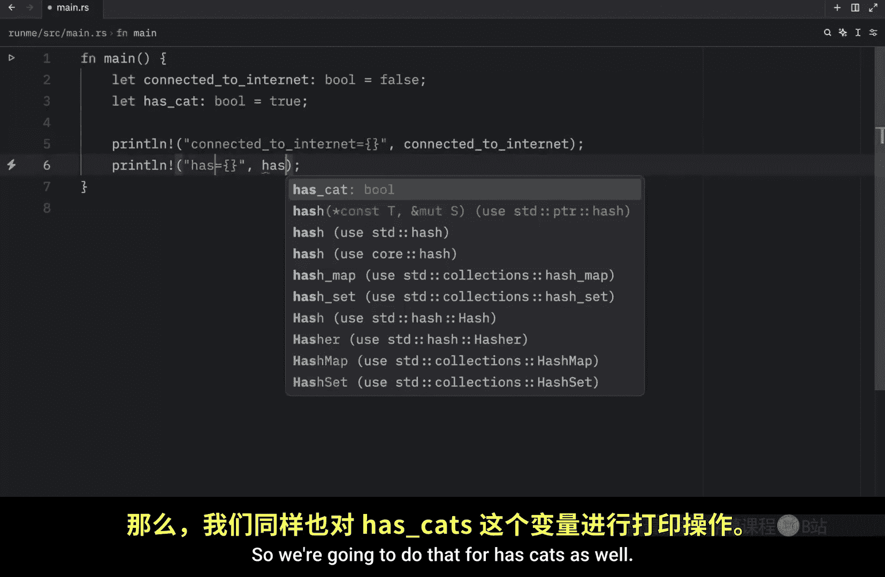
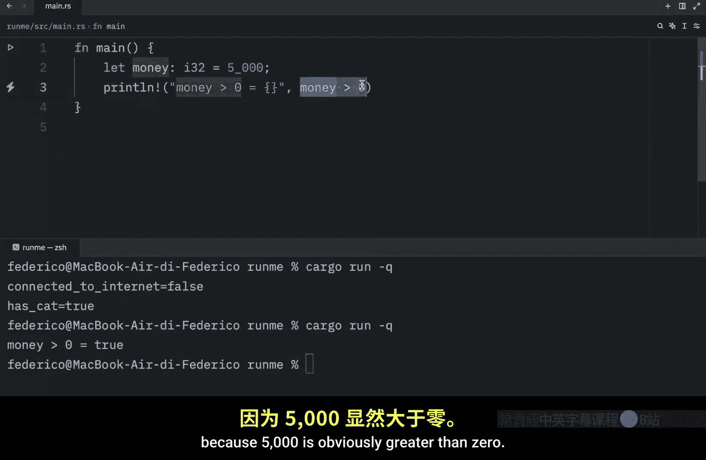
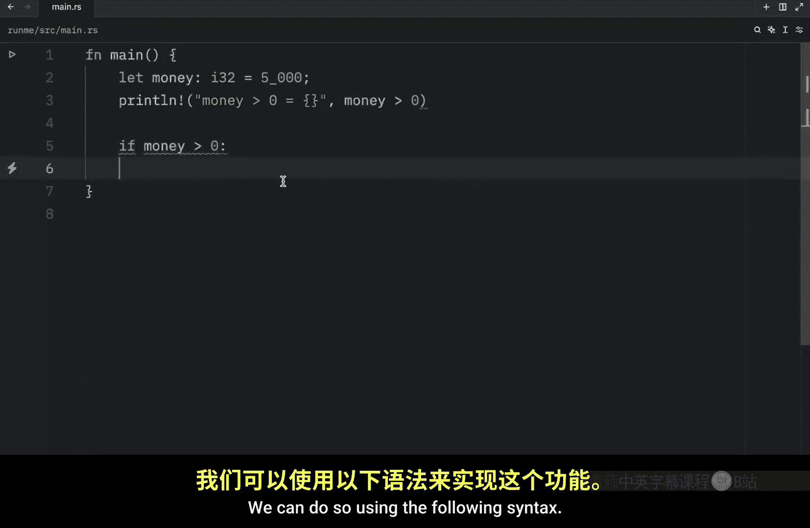
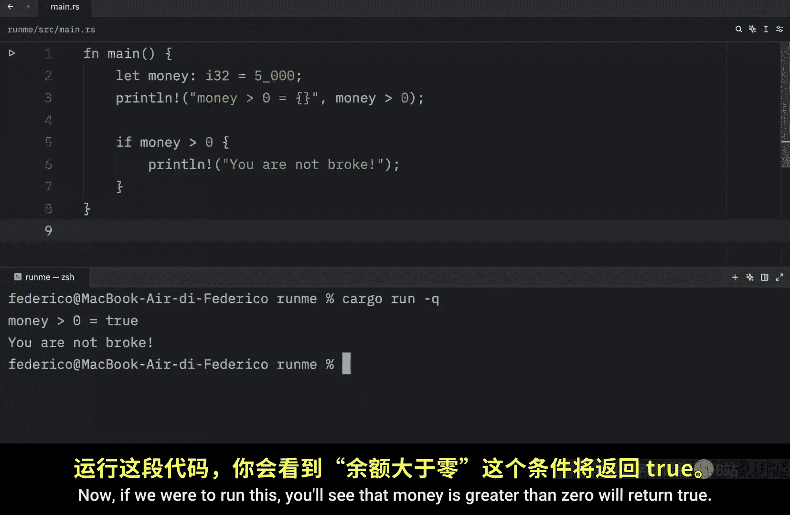
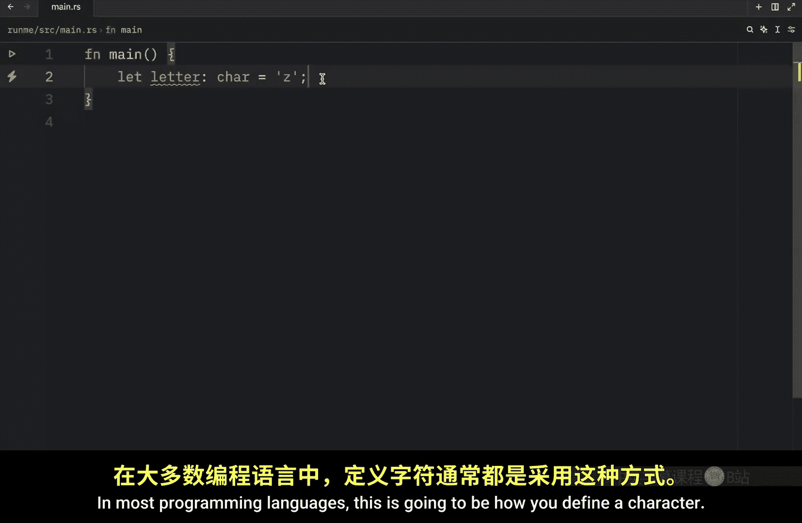
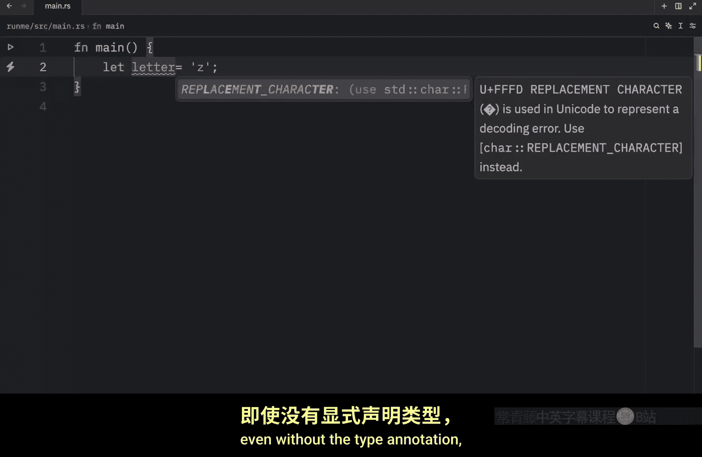
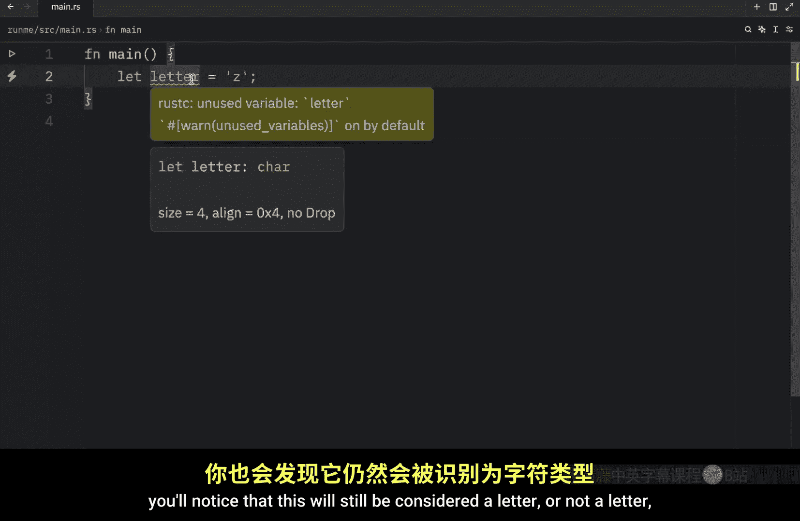
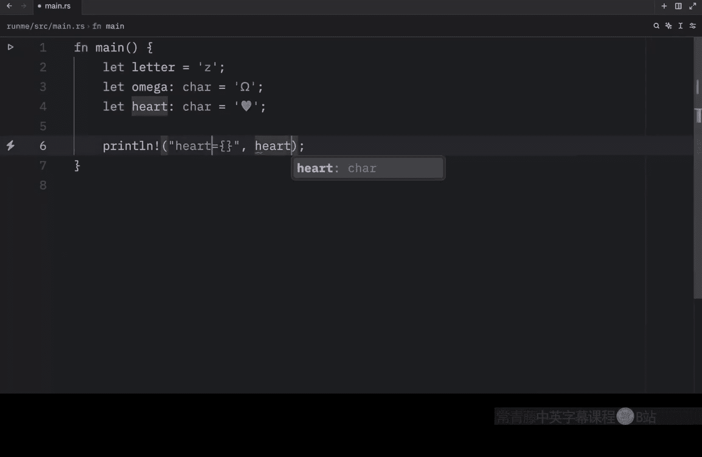
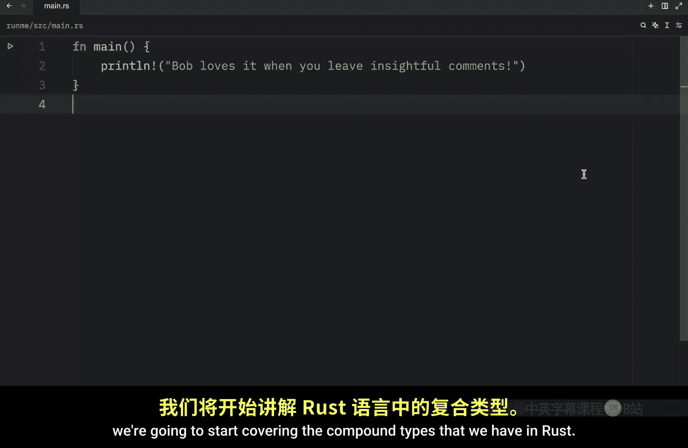

# Rustfully【中英⚡Rust 初学者教程（2025）｜Rust for beginners (2025)】 p09 P9 详解Rust中更重要的数据类型 -BV1eyAkzPEhj_p9-

How's it going everyone in today's video we're going to be covering two more primitive types that you'll see being used quite often in rust and the first one that we're going to cover today is the Boolean type and bulloleans only have two states true and false so to get started。

 let's create a few booleans onces going to be called connected to internet which will be a type Boolean and that's going to be set to false that means we do not have a valid internet connection another example of a Boolean can be whether the user has a cat and that's going to be set too true because the user has a cat and if you wanted to display this information we can print it to the console just to see what we would get as an output so we're going to do that for hasca as well。

Now all we have to do is open up the console and run this program So cargo run in Qui mode Now what we're going to get as an output is our variable with the value which is false and true a very common example of where you will see bulls being used is with if checks for example we might have some money which will be of type integer and that will contain 5000s Next we're going to print that the money is more than or greater than  zero and whether that's true or not So here we can just type in money is greater than zero and this is going to return to us a bullan because here we're asking the computer is money more or greater than the value of0 and if we run this you're going to get true back because 5000 is obviously greater than  zero and this becomes quite useful when you want to introduce logic to your program Imagine you have some sort of bank and you want to check whether the user has money we can do so using the following syntax and this requires curly brackets。

side here， if money is greater than zero， we're not going to kick the user out of our bank。

 you are not broke。 Now， if we were to run this， you'll see that money is greater than zero will return true and that we will also get this print statement executed because this condition was met and this only printed because this returned true and I'll be explaining more about this syntax in the near future for now all you need to know is that bulloles represent true and false in programming。

 and since explaining bulloles didn't take up much time。

 I'm also going to teach you about another type in this video。 The character type。

 So let's take a look at what a character in rust looks like。

 So here I'll type in letter of type car or character equal Z and you probably notice something quite fun here and that is that I had to use single quotation marks to define this character in most programming languages this is going to be how you define a character。

Even without the type annotation， you'll notice that this will still be considered a letter or not a letter。

 but a character。 Rus can recognize that from the single quotation marks。

 But let's create a few more examples， such as omega， which will be a type car。

 And that's going to equal omega。 And finally， we might have something such as a heart。

 And that's going to equal this unicode heart over here。

 And it's important that you note that these are all single characters。

 We can insert two different characters and hope that it's going to compile。

 It must be a single character。 That's the whole purpose of the character type。

 And we can just print one for the fun of it。 So I'm going to display the heart。

 And we can just forget about the rest。 And now we were to clear this。 And we were to run this。

 What we're going to get as an output is our character。 Anyway。

 that's really all I wanted to cover in today's lesson。 And in the next couple of videos。

 we're going to start covering the compound types that we have in rust。

