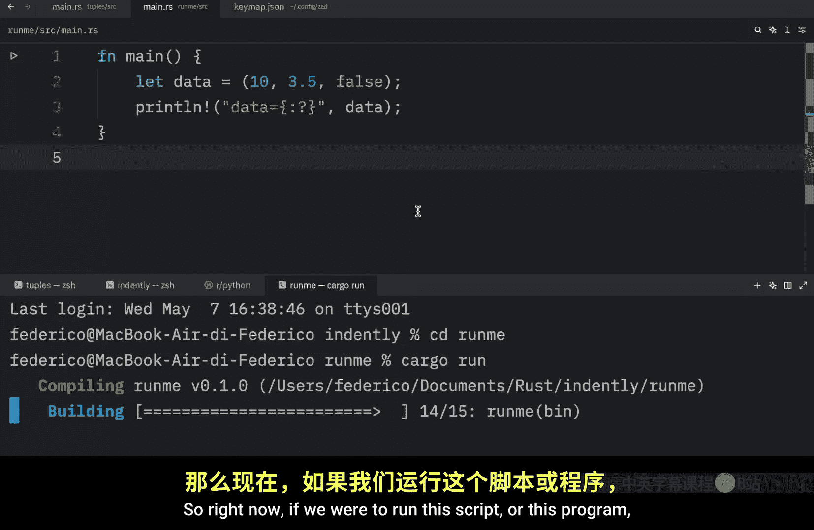
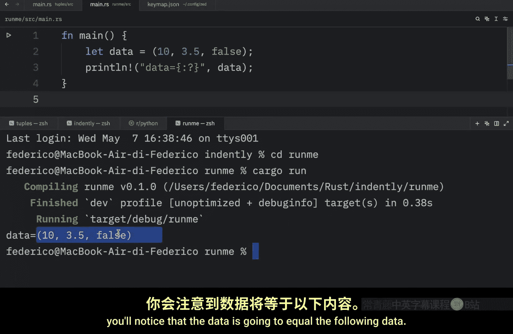
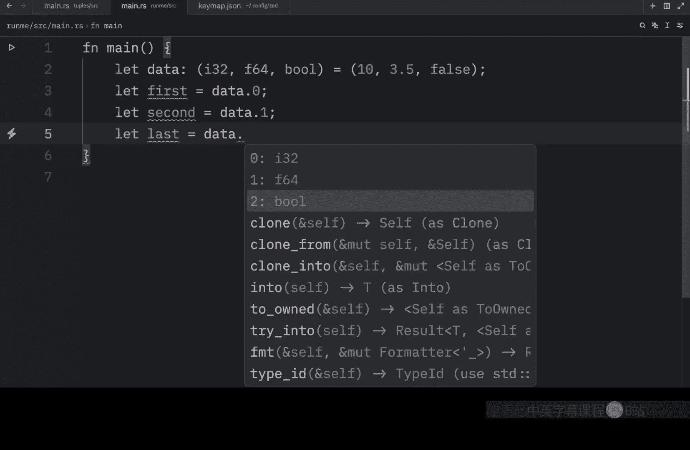
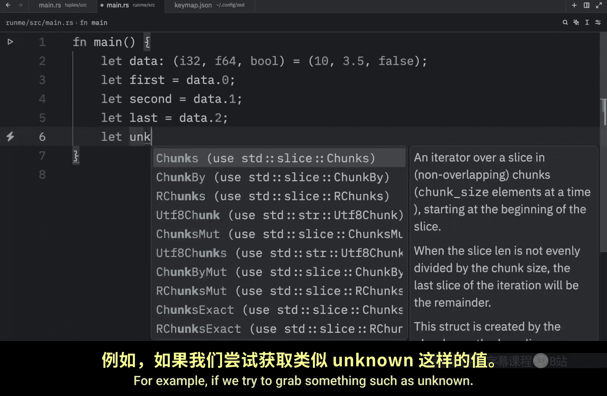
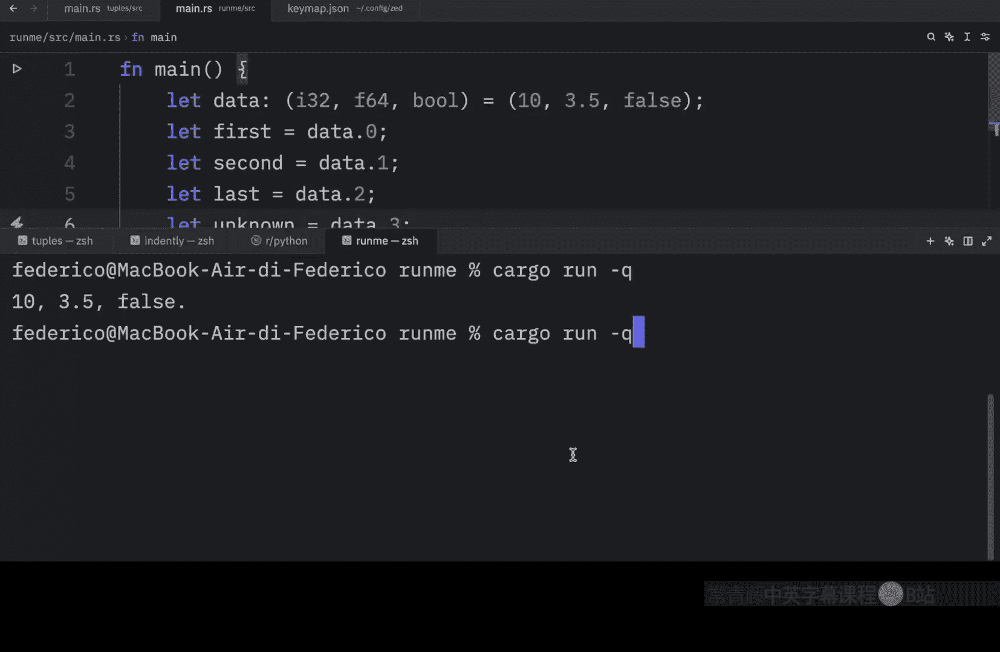
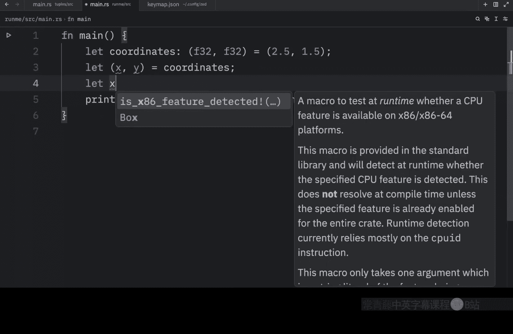
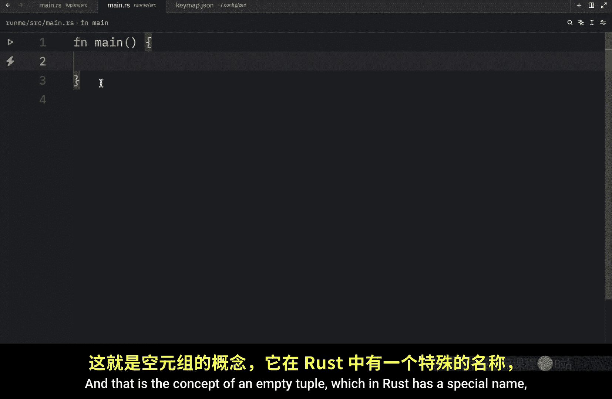
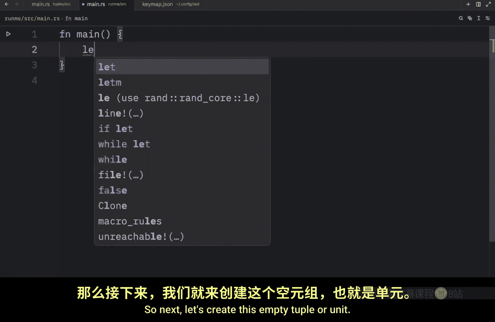
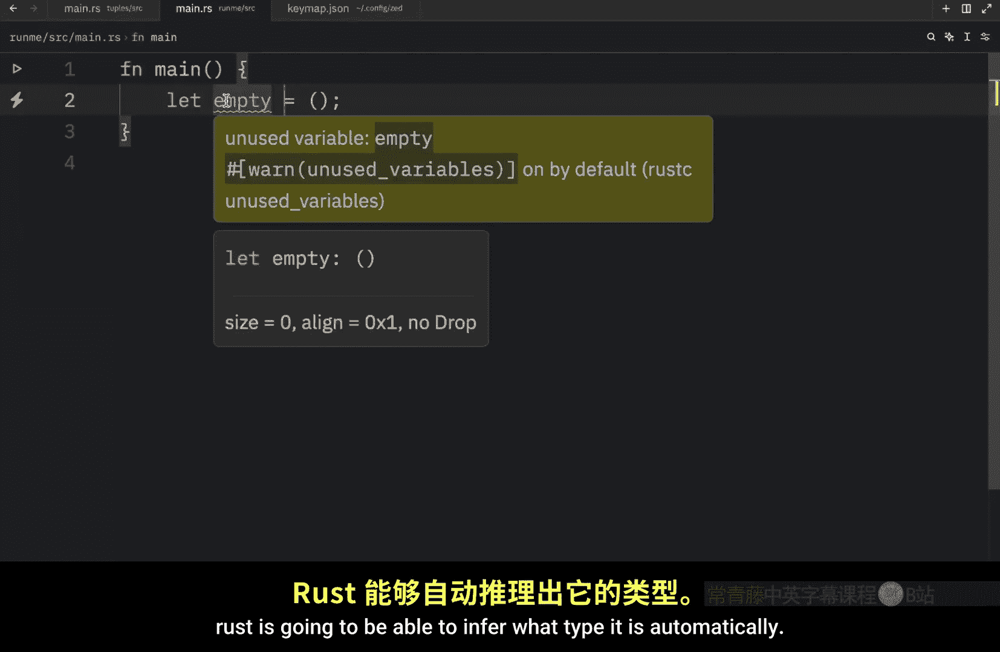

# Rustfully【中英⚡Rust 初学者教程（2025）｜Rust for beginners (2025)】 p10 P10 Rust中的元组很酷 -BV1eyAkzPEhj_p10-

How's it going everyone In today's video， we're going to learn about our first compound data type in rust。

 which is the tuple type and taken directly from the documentation。

 a tuple is a general way of grouping together a number of values with a variety of types into one compound type Ts have a fixed length Once declared they cannot grow or shrink in size。

 So that was ripped directly from the documentation because personally I wouldn't be able to describe it better myself。

 But next I'm going to show you how we can create a tuple。 and to create a tuple。

 we need to insert values inside parentheses。 and these values are going to be separated by commas。

 Now， each position in the tuple has a type and they do not all have to be of the same type。

 So just to get started with typing out some code because I've been talking a lot。

 we're going to create a variable called data。 and this is going to contain several different values such。

As 103。5 and a booleion， which will be set to false。 And as you can see。

 we've satisfied all of the criteria for creating a tuple。 The values are surrounded by parentheses。

And we have commas which separate each value， and these values can be of the same type。

 or they can be of different types。 And if we were to print this。

 we would have to do so in debug mode。 So the data is equal to the data but inside the placeholder。

 We need to add a colon and a question mark， which tells us that we want to display this information in debug mode。

 Otherwise it's not going to work。 So right now if we were to run this script or this program。

 you'll notice that the data is going to equal the following data。 Also。

 in the case that you would like to provide a type annotation for this data or for this tuple。

 it would look as follows。 So here we have some parentheses。

 the first integer is of I 32 or we can even put I 8 or U8 Since it's a small integer。

 which will never change， then we can do F 32 for the float and for the bulling we just type in bull and this would be the proper way to annotate。

Tupple， otherwise， if you're incredibly lazy and you still want to annotate this。

 you can just hover over the variable in practically any code editor and just copy it directly from that pop up。

 Anyway， now we understand how we can create a tuple。

 So what we're going to learn next is how we can access the data from that tuple。

 So instead of printing data is equal to whatever I put there we're going to type in let's number decimal。

And Boolean equal D data。 And this will grab all of the values from the tuple。 In other words。

 we are destructuring that tuple， which means now if we were to print any of this data， for example。

 we could write a string that contains N comma， D， comma B。

 And once we clear the console and run this。You'll see that we will be able to use each and every one of those variables individually。

 otherwise we have another option for accessing that data。

 so on this example we could type in first and first is going to equal the data at the index of 0 and this will grab the value of 10 then we can type in second equals data at the index of 1。

And last。Can equal data at the index of two and with most modern code editors。

 you should get this outercompte， which is very convenient because that will prevent us from trying to grab a value。

 which is out of range。 For example， if we try to grab something such as unknown and we say that's equal to the data at the index of three。

 This is going to raise an exception because we don't have a third element。

 or we don't have a fourth element。 there is no third field in this tuple。

 We only have three elements defined。 So once again， if we were to run this。

 we'd end up with this error。 but otherwise it's that simple to use this data。

 which just type in print line， we create some sort of string。

 we can say that the first element is Im passing data at the index of0。

We can just remove all of that， and then we can open up the terminal and run our script once again。

 And what we're going to get back is that the first element is 10。

 It was that simple to use the data from a tuple。 but once again。

 if you try to access an element which does not exist in the tuple。

You're going to end up with an error and tuples are quite a popular data type that you' will find in most programming languages。

 One very popular example of where you'll see a tuple is with coordinates and this can be of F32 and F 32 then we can insert 2。

5 and 1。5 as the coordinates and this would be a very beginner friendly example of a tuple Then we can print out something such as the treasure is located here。

 I will just add this in debug mode so that we can print the tuple directly。And pass in coordinates。

But this is backwards。And now if we were to run this。

 the treasure is located here at these coordinates。

 or obviously you can use each one of those values individually by either deuring the original tuple like this or referring to each one of them individually。

Let X equal coordinates。

At the index of0 and let y equal the coordinates at the index of one。 both of these approaches work。

 And finally， there's one more concept I want to share with you guys today。

 and that is the concept of an empty tuple which in rust has a special name and that special name is unit。

 So next let's create this empty tuple or unit。 And we can just call it empty。

 which will be an empty tuupple。 and that's going to equal this empty tuple。

 and you're not required to add this type annotation， because in most cases。

 rust is going to be able to infer what type it is automatically。 But if you do choose to do so。

 all you need to do is insert an empty pair of parentheses。 And in general。

 you're going to get this as a return for expressions that don't return any other value。

 but that's something to cover in a future video for now that's really all you need to know about tuples and we'll learn much more about them as we progress with the rust language。

