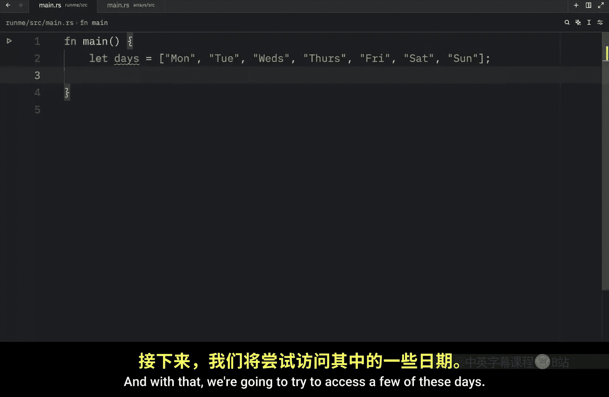
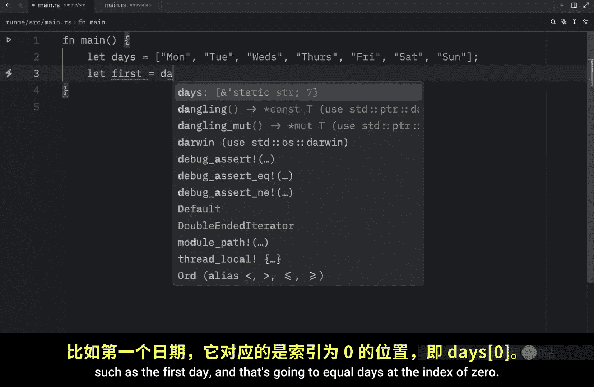
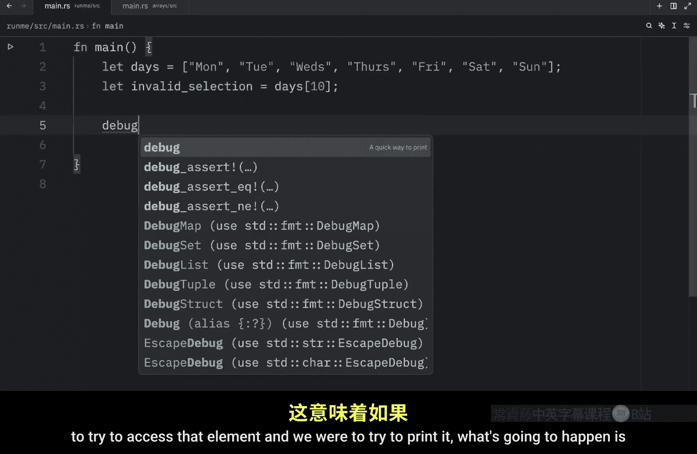
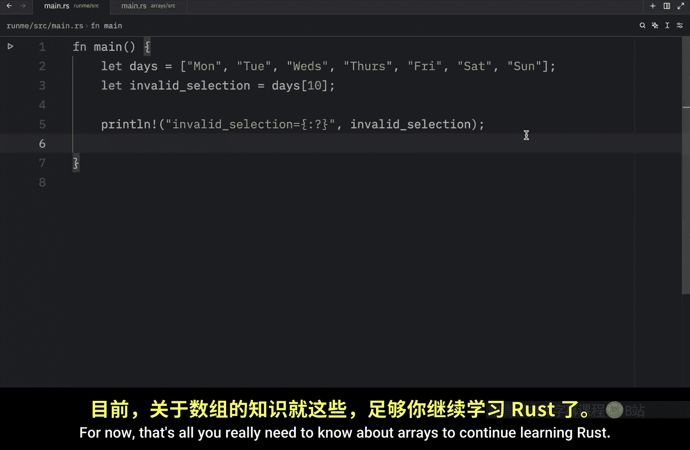

# Rustfully【中英⚡Rust 初学者教程（2025）｜Rust for beginners (2025)】 p11 P11 Rust中的数组很酷 -BV1eyAkzPEhj_p11-

How's it going， everyone。 In today's video， we're going to be covering the array type。

 And unlike with a tuple， an array must contain the same type of element for all of its values。 Also。

 unlike in some other languages， arrays in rust are always of a fixed length to create an array。

 All we need to do is create our variable name and assign it some values in square brackets。

 separated by commas。 that should be in equals。 So here we have an array。

 which contains five elements， and they are all of the integer type。

 if we were to insert something such as a boolean， This would not work。

 an array must contain the exact same element type for each one of its values。

 and arrays are quite useful when you want your data allocated on the stack rather than the heap and stack and heap are two distinct regions of memory used by programs to store data during execution。

 but we will cover this concept in a future video， do not worry about that in。This video。

 and it's good to use arrays when you know that the number of elements will not need to change。

 For example， you might have a variable called days。 and that can contain all of these days。 Monday。

 Tuesday， Wednesday， Thursday， Friday， Saturday and Sunday。

 This is always going to contain seven days。 It's not like new days get invented every week。

 So this is a perfect example of where you could use an array in Ru。

 we also have a similar data type called a vector， which allows you to add and remove elements。

 So that one's much more flexible than the array type。

 So we'll be covering that type in the near future。 So now， let's continue with the array type。

 because next， I want to show you how you can specify the type for an array。

 So let's recreate our numbers Let numbers of type， let's say unsigned integer of 8 bits。

And we want three of them。 and that will equal 1，2 and 3。 just like we specified in this type。

 we told Rus that we want to have an array that contains U 8。 and we want three of them。

 this has to be precise。 We cannot say1，2，3 and 4， because that's not what we specified in the type。

 We specified that they would be exactly three elements here and to print this。

 I'm going to type in debug， which is a quick shortcut I created in Z。

 And here we're going to print that the numbers equals the placeholder in debug mode。

 But let's run this and see what we get back。 And what you should get back is this array over here。

 Now something that's very interesting about arrays is that we can create them using some slightly different syntax。

 If we know that we only want one element。To be repeated several times。And in this example。

 we will let repeat equal bo semicolon 5。 And if we were to print this out。

 you'll notice that when we print this variable， we're going to have an array that contains Bob five times。

 and you can really do this with any number。 I mean， if you're crazy。

 you can even have 100 bobs in your program。

And there we go。 But next let's take a look at how we can access data or the elements from these arrays。

 So what I'm going to do is go back to my days's example where I had all of the days of the week and with that we're going to try to access a few of these days such as the first day and that's going to equal days at the index of zero and then we can also grab the last day so we can let last equal days at the index of six because this is at the index of six and the reason we can index it like this is because an array is a single chunk of memory of a known fixed size that can be allocated on the stack and that quote was ripped directly from the rust documentation but with that being done let's print this information So what we can do Yeah let's just do it manually print line first and last day R and you will pass in the first day and the last day。

Then let's clear this amazing console and run it。And what we should get back is that the first and last days are Monday and Sunday Now。

 one thing that you really need to be careful about is grabbing an element at an index that does not exist For example。

 we can let invalid selection equal days at the index of 10 here we only have seven elements which go up to the index of6 so 10 is out of this range and that just means that if we were to try to access that element and we were to try to print it What's going to happen is that we're going to get an error back because the index is out of bounce and this is something you really want to avoid and it's probably going to be more common if you have a program that's running which allows a user to select an option who knows the user might be able to select an option that's not in the range and that will cause your program to crash but later on we will learn how we can handle these errors appropriately for now that's all you really need to know about a to continue learning rust。

