# Rustfully【中英⚡Rust 初学者教程（2025）｜Rust for beginners (2025)】 p12 P12 Rust中的函数很棒 -BV1eyAkzPEhj_p12-

How's it going everyone In today's video we're going to be covering the topic of functions in rust because by this point。

 we've only been using the main function to execute code， which is this function over here。

 but as our program grows in complexity this slowly becomes a very bad idea and to demonstrate what I mean by that imagine you have repeating code that you want to use several times in your program such as this line of code over here。

 One option would be to copy and paste it everywhere that you want to use it in your program and that will work perfectly fine as you can see if we were to type in cargo run。

 it would compile and it would print hello Bob three times。

 but now imagine you need to update this code because something has changed maybe instead of saying hello Bob。

 you need to say goodbye Bob Now that's going to require us to change it in three places and we had to do this manually which opens us to the increased possibility of making typos and being sloppy。

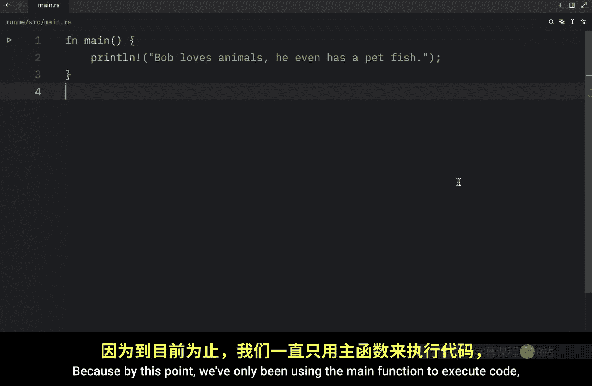

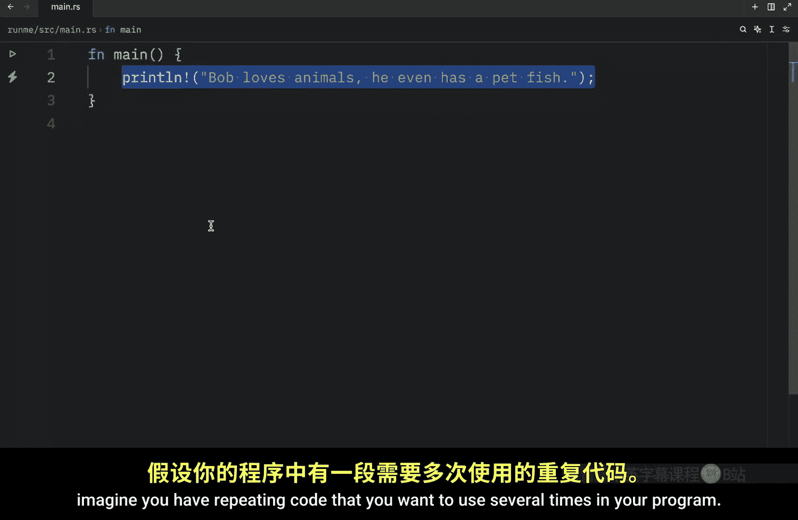

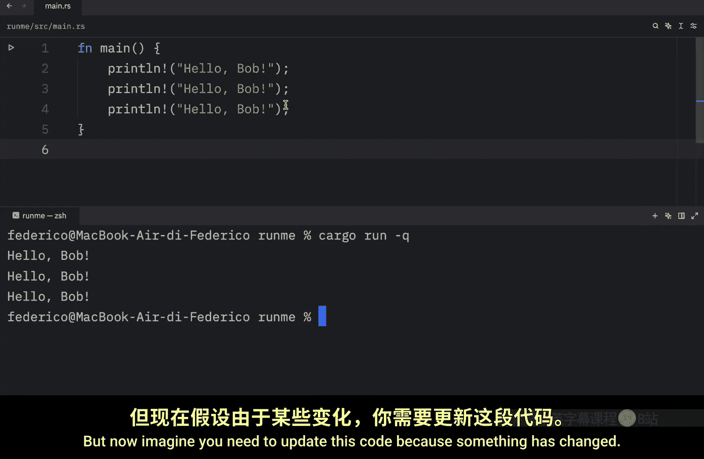

Our code with a simple program such as this one。 it's quite easy to see that I printed goodbye correctly three times。

 but when your program grows in complexity， it becomes harder to stay consistent。

 every now and then you're going to forget a character somewhere。

 especially if you have to do this manually。 And if this is located in a different file you're going to spend a lot of time debugging for no reason。

 Also， no experience program would ever copy and paste the exact snippet of code multiple times unless they hate it themselves their boss or life in general。

 and I'm not talking about copying code from stack overflow。

 I'm talking about copying code directly in your project like this。

 So what we're going to do next is create a function that we can use as many times as we like throughout our program。

 And to do this， we just need to use the F and keyword which stands for function followed by the function name which should follow the snake case convention。

 For example， we can create a function that says say。

Hello or even better print hello and then we can open up a block and insert our code inside that。

 So printline hello Bob， and now we can use this function anywhere we want in our program。

 but the call it we need to insert it inside our main function。

 So here I'm going to type in print hello and I'm going to duplicate that three times Now if we were to run this what we're going to get back is hello Bob printed three times to the console and you might be asking why is this any better than just printing hello Bob three times。

 Well the benefit of using a function is that we can apply quick changes to the functionality in only one place and that will be applied throughout our program。

 So instead of printing hello， we could also say hi and if we rerun our program you'll see that it's going to apply that change to all of the functions and most common code editors are also going to allow you to change the name of your function throughout your program with one simple edit instead I use shift command plus R to rename a function but every code editor is。

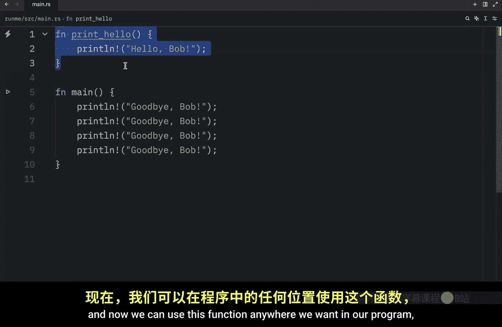

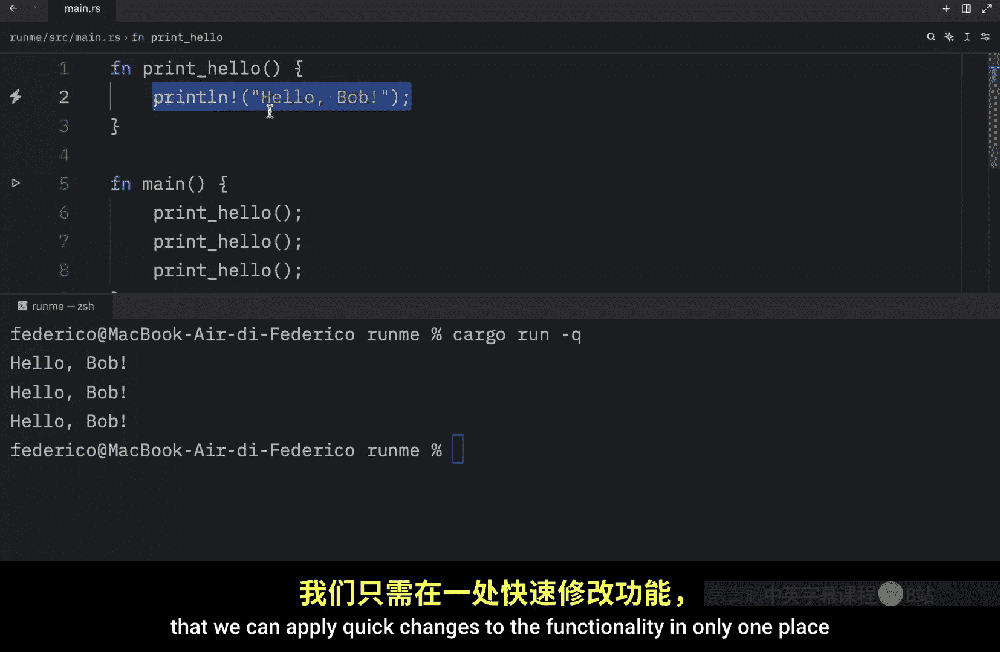

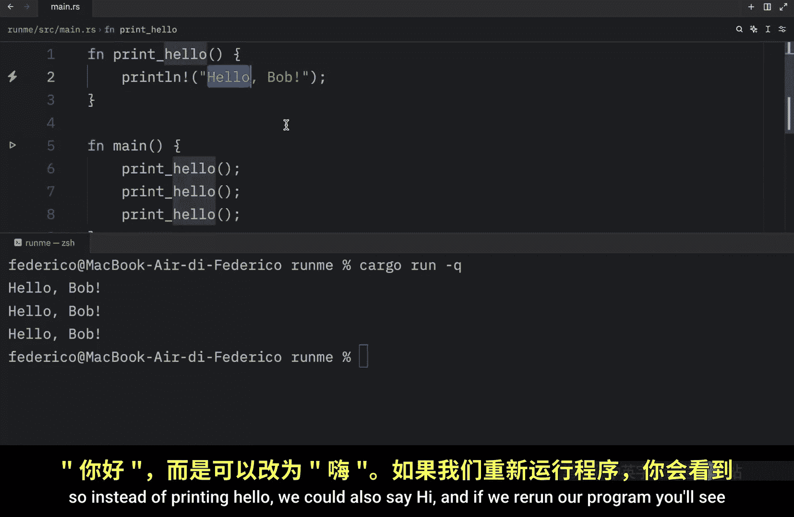

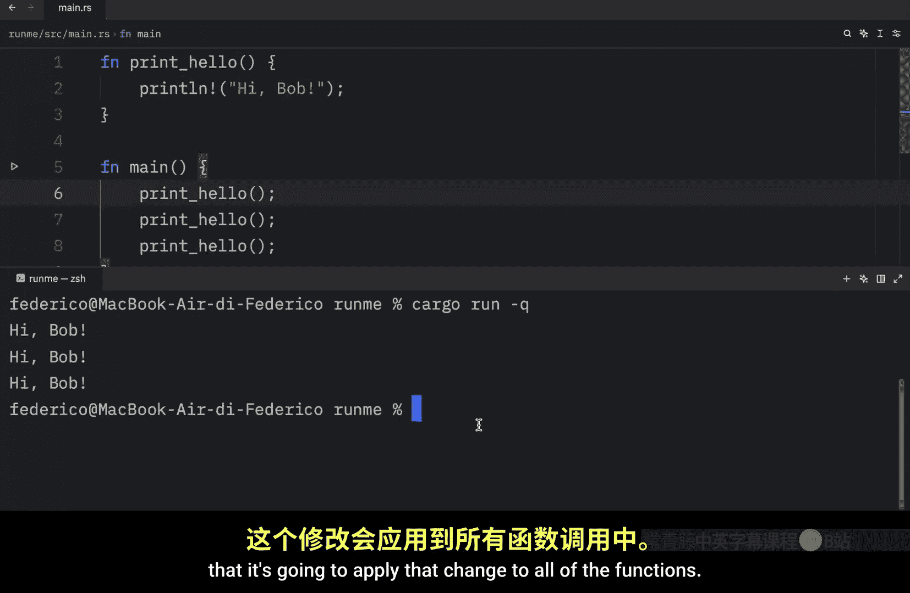

So now I can change this to print high just as an example。

 and that will update the function name throughout my code and you can add as much functionality as you want inside this code block。

 you can even type in print line and of function As you can see。

 I have two lines of code inside a single function。 So each time we call this function。

 It's going to execute these two lines of code。 we can verify that by running cargo。

 and youll get this as an output。 Now I'm just going to remove this statement over here。

 because I want to show you one last thing before we move on to the next lesson。

 And that is that in rust， you can place your functions either before or after the main function。

 So here we can type in function goodbye。 and obviously this is going to print goodbye Bob。

 And now we can call it directly in our main function。 and this will work perfectly fine。

 if we clear the terminal and we run cargo。

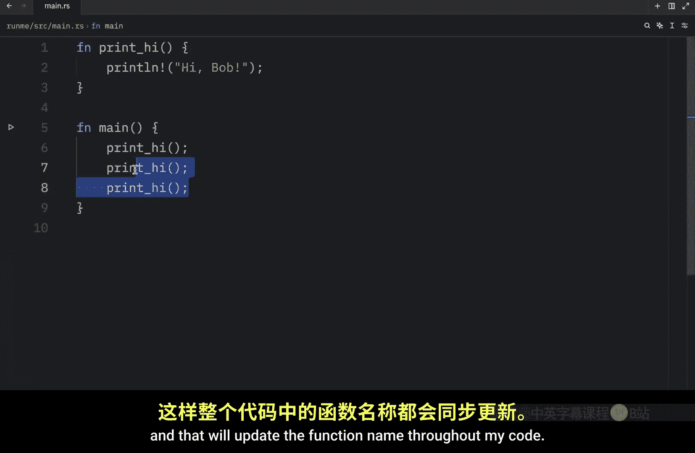

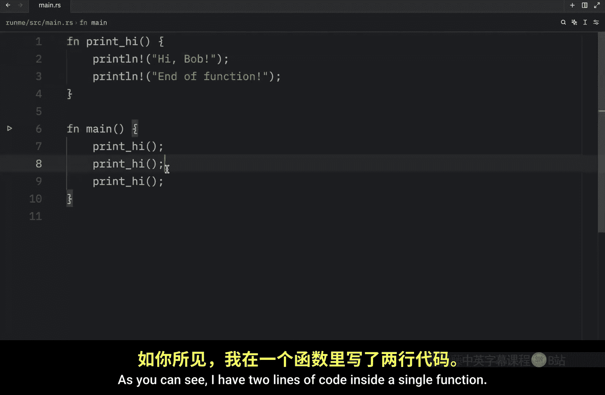

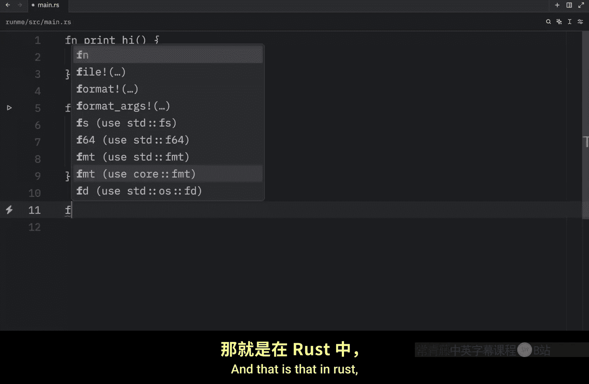

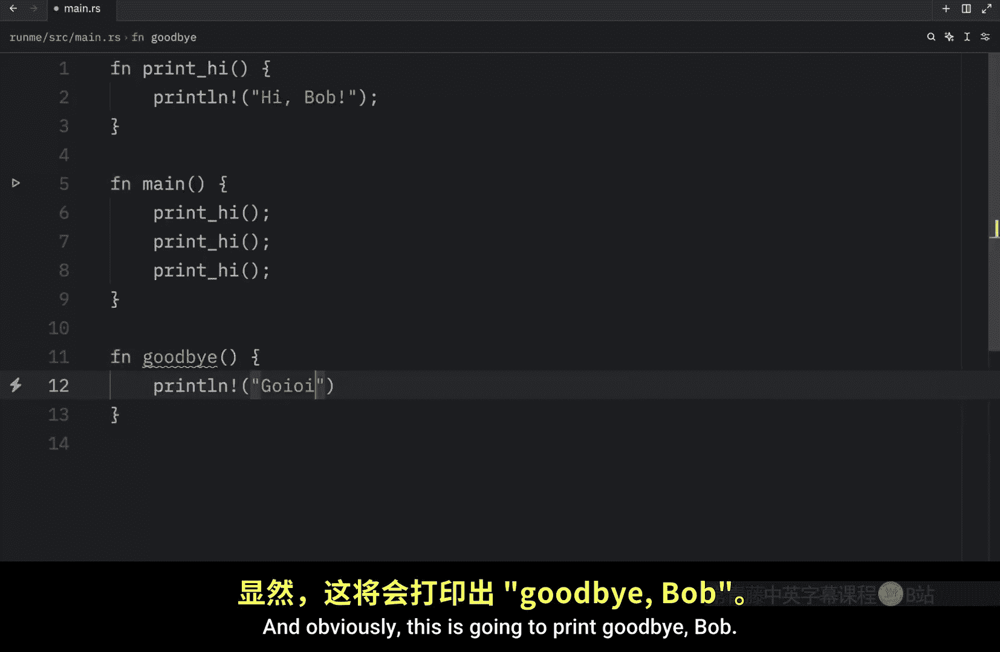

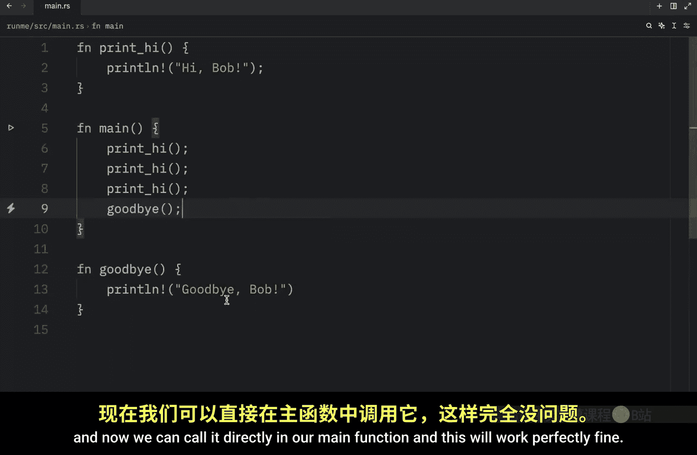

You'll see that it's going to call that line of code or this function without any problems。

 even if it was defined after the main function， and this is because main is a special function that always executes the code first so as you can see functions are quite useful when it comes to making your code reusable Now this was just an introduction to functions in the next few videos we're going to talk about how we can customize our functions to make them far more reusable。

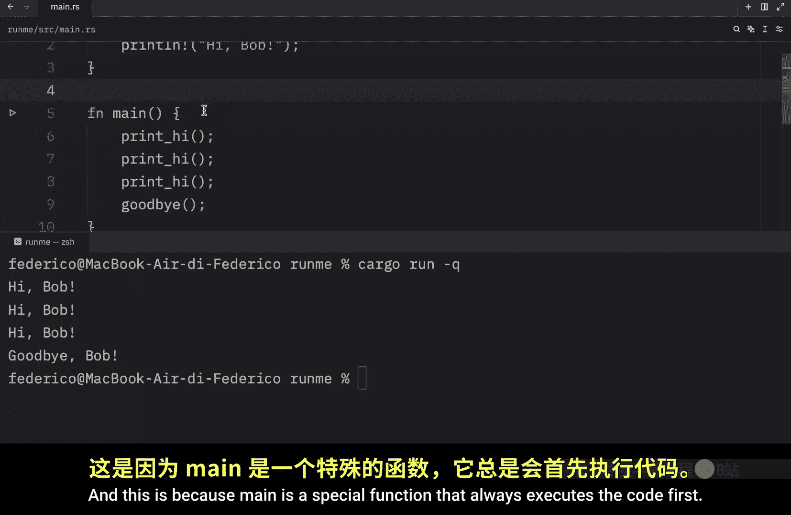

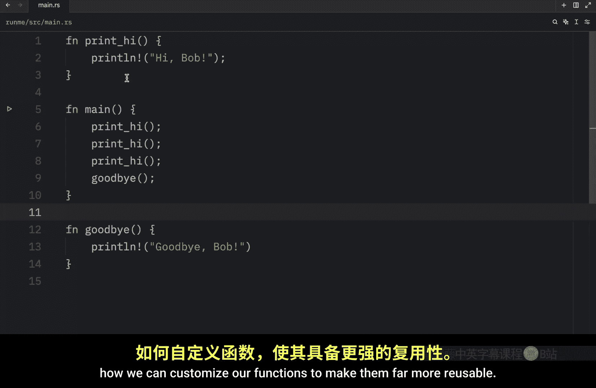