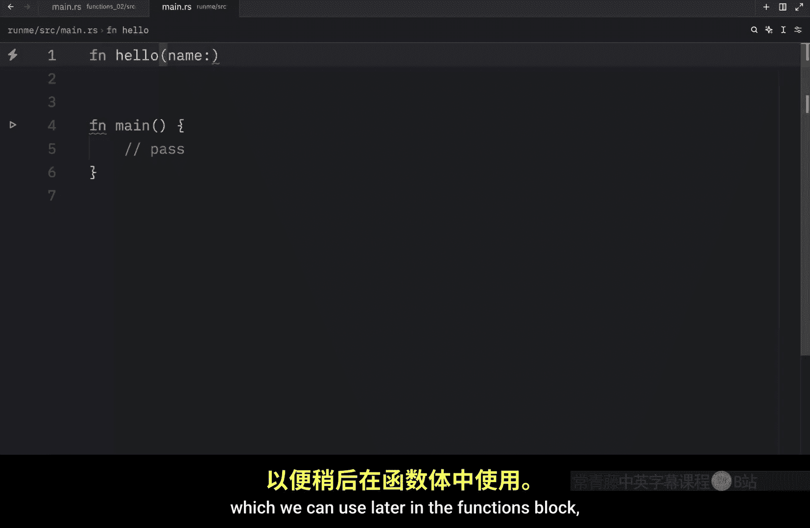
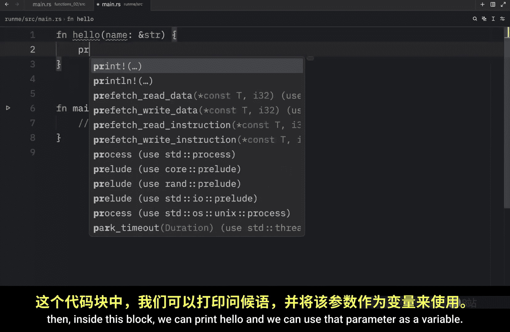
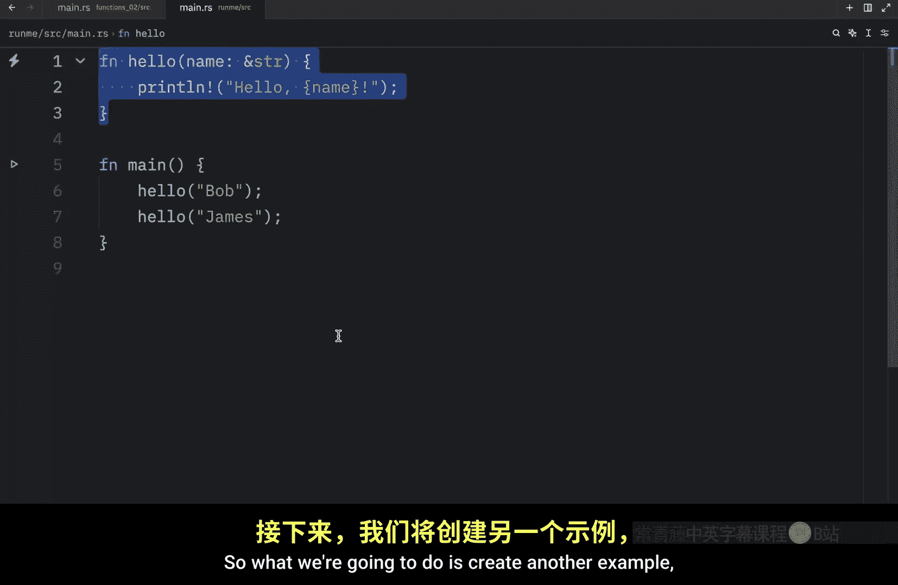
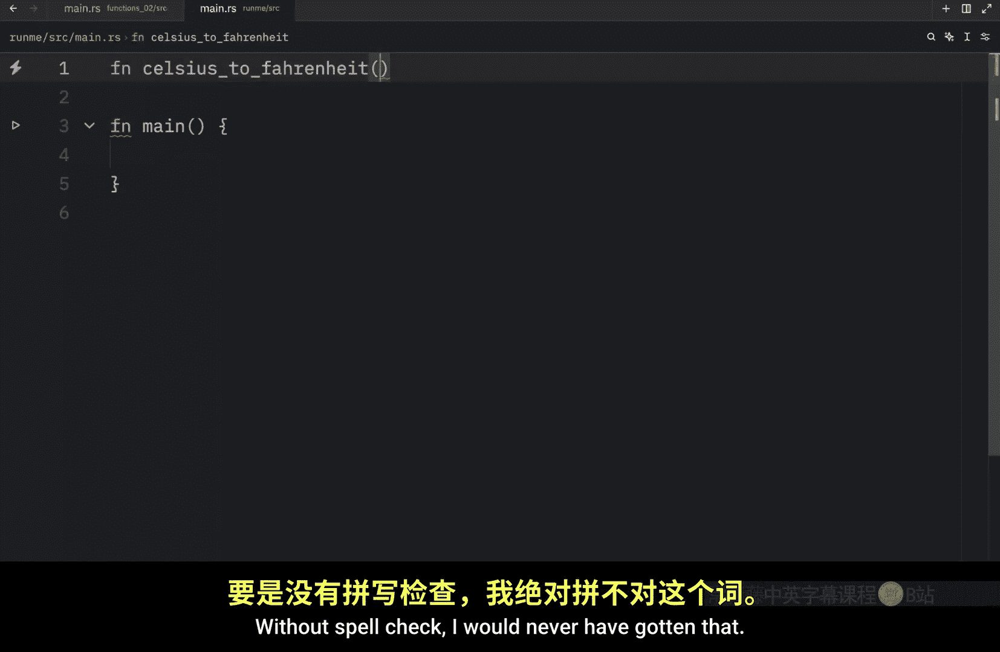
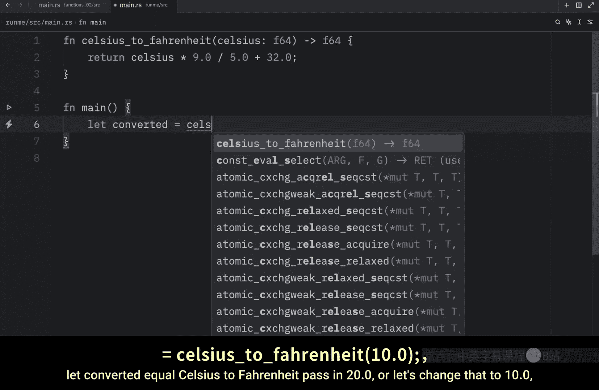
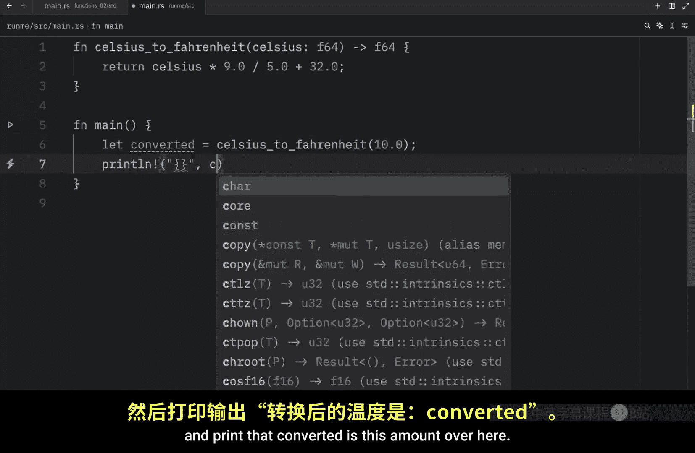
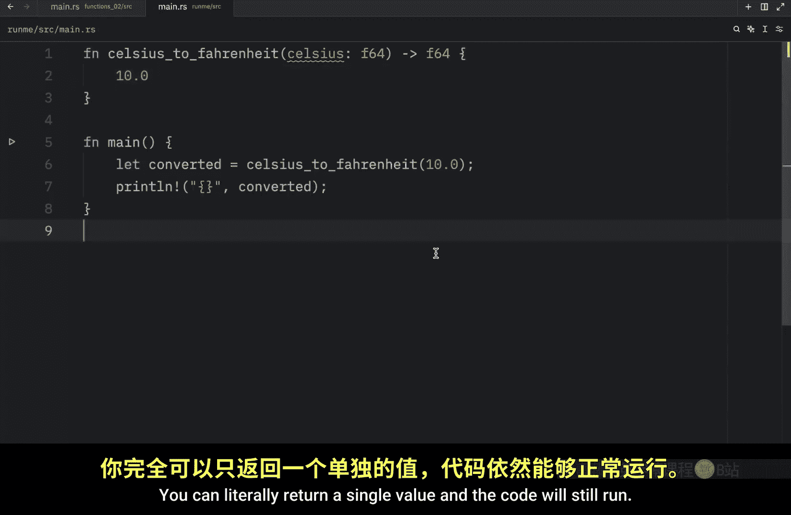
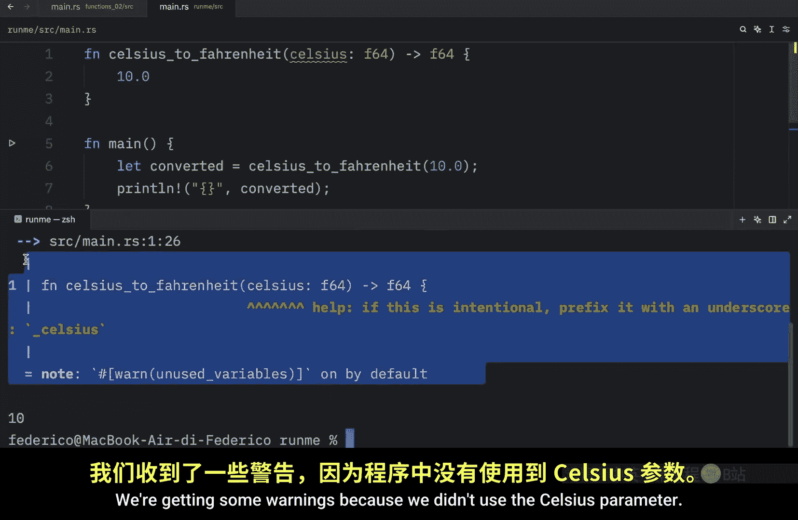
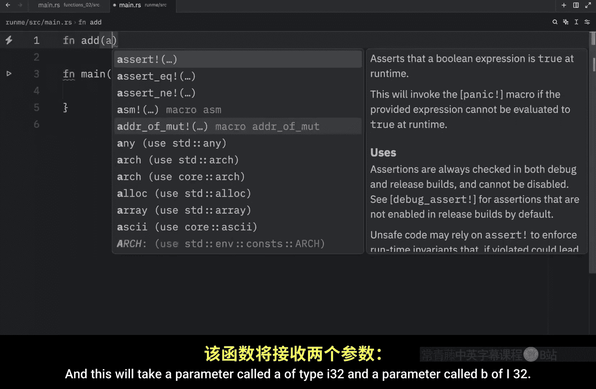
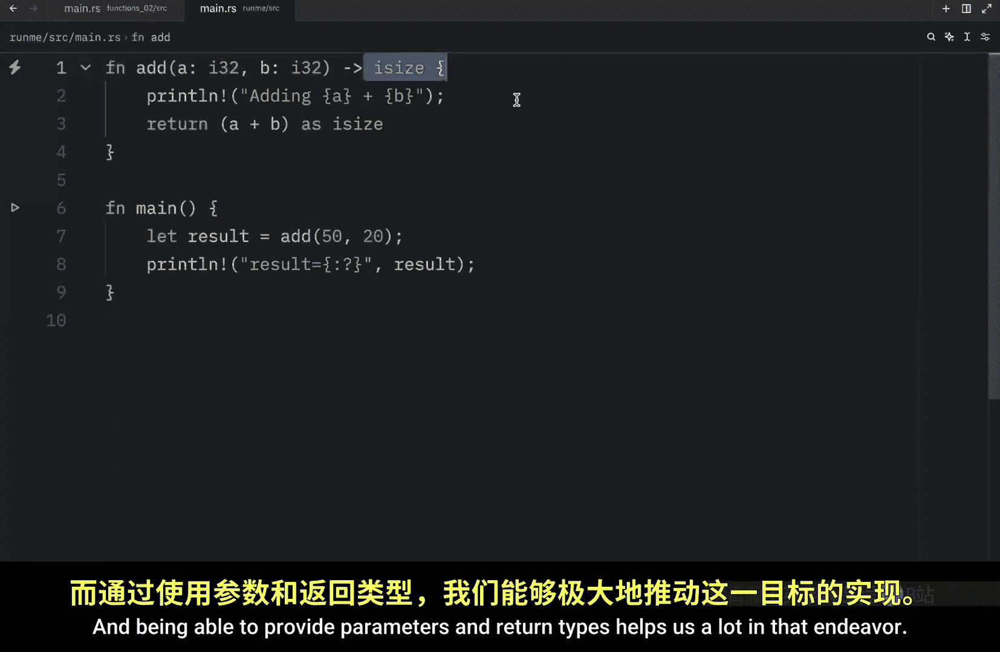

# Rustfully【中英⚡Rust 初学者教程（2025）｜Rust for beginners (2025)】 p13 P13 升级你的Rust函数 -BV1eyAkzPEhj_p13-

How's it going， everyone In today's video， we're going to learn how we can use parameters and return types in rust。

 and both of these are going to be a massive upgrade for our functions。

 So for our first example we will create a function that says hello to any name that we specify and to do so we will create another function which will say hello or which will be called hellello and it's going to take a parameter and this parameter is going to be called name and practically what we're doing here is creating a temporary variable inside the function signature。

 which we can use later in the functions block and we are required to specify the type that we are providing then inside this block we can print hello and we can use that parameter as a variable Now with this being done we can call a function by referring to the name and passing in an argument such as Bob then we can duplicate this line of code and insert James and as you can see it's very simple to use this function with different names。

If we were to clear the console and run this program。

 we're going to end up with hello Bob and hello James and that's really good for reusability because we don't have to create separate functions to perform this task otherwise we would have to create a function for hello Bob and a function for hello James。

 but that's quite silly， especially if we're only going to use those once throughout our program Also in this example。

 I used a single parameter but it's also possible to define several parameter for a single function So what we're going to do is create another example and this is going to be called repeat and it's going to take some text of type string slice and in another parameter called times of type U size what we're going to do is print line pass in our placeholder and then insert text repeat and pass in the times then to call this function which is type in repeat pass in Bob And for the times we will pass in three Now when we run this we should get Bob printed three times to the console。

Now we can do this with something else we can also pass in the letter Z and repeat that 10 times so that when we run this we get Z printed 10 times to the console so that's quite useful if you want to use a function with several different parameters but up next I want to teach you the concept of the return value because right now we only used functions to execute code but functions can also return values for example we might have a function that converts Celsius to Fahrenheit and Fahrenheit is seriously one of the craziest words to spell without spell check I would never have gotten that and it's going to take a parameter called Celsius of type float 64 and rust requires us to specify the return type if we are returning a value so here we need to use this arrow and provide F64 because that's the type that we're going to return then we can return Celsius times 9。

0 divided by 5。0 plus 32 and that's the magic。

Forula that we're going to be using to convert Celsius to Fahrenheit Now to call this function we just type in Celsius to Fahrenheit and pass in 20。

0 or any float that we want or actually since this returns a value。

 this isn't going to do anything we either have to assign it to a variable or print it directly so here we can type in or I'm just going to reset this and type in my usual debug statement which is printline and pass in Celsius to Frenheit which 20。

0。

So now when we run this， what we should get back is that Celsius to Fahrenheit with this argument gives us 68。

 otherwise you can also type in something such as lead converted equal Celsius to Fahrenheit Pass 20。

0 or let's change that to 1。0 and print that converted is this amount over here and we'll get 50 back Now in this example I used the return keyword and the semicolon but neither of these are required if you are returning a value This is one of those rare cases where you do not need to include a semicolon。

 and the code will still run。

And something even more crazy is that we don't even have to use the return keyword。

 We can literally just write a piece of code that returns a value as our final line of code in a function and rust will know that it should return this value。

 So now if we were to run this we were still get 50 back The only thing we cannot do here is add a semicolon because then Rus will have no idea that we're trying to return this value from the function so this must be omitted and this doesn't have to be an equation。

 you can literally return a single value and the code will still run。

 So if we were to type in cargo run。 we're going to get 10 back。

 we're getting some warnings because we didn't use the Celsius parameter but as you can see we're still getting 10 back because this is the return we specified and once again we can also type in return 10 or return 10 with a semicolon these are all acceptable ways of returning a value from a function but let's take a look at one more example before we conclude this video So I'm just going to empty this and create a new function called。

Had。And this will take a parameter called a of type I32 and a parameter called B。

Of I 32。 So we're going to be able to add two numbers together。 and the return is going to be I size。

 Then we can do something such as printing that we are adding the value of a plus B。😊。

And at the bottom we're going to return the result of a plus B in the form of I size。

 So once again this is the final line of code and it returns something so this is perfect now to use the function we can type in something such as result or let result equal add 10220 and I didn't show you this earlier but in rust we do have a special macro which we use for debugging and it's called DBG exclamation mark and with that we can pass in a variable or an expression and when we run this code what we're going to get back is some debugging information and you can easily use this as an alternative to what I do but for the majority of cases I'm going to use my premade print line function anyway。

 going back to our function as you could see we specified a return type here just by providing a line of code which returned something and optionally we can also insert the return keyword and our code will run exactly the same way and once again this makes our code very flexible because we can use this。

Fun as many times as we like with different arguments。 we can even insert 50 plus 20。

 And when we run this， we're going to get back 70。 But yeah。

 that's really all I wanted to cover in today's video。 As you can see。

 we have a lot of options when it comes to customizing our functions。

 and the goal is to make everything as reusable as possible。

 And being able to provide parameters and return types helps us a lot in that endeavor。😊。

