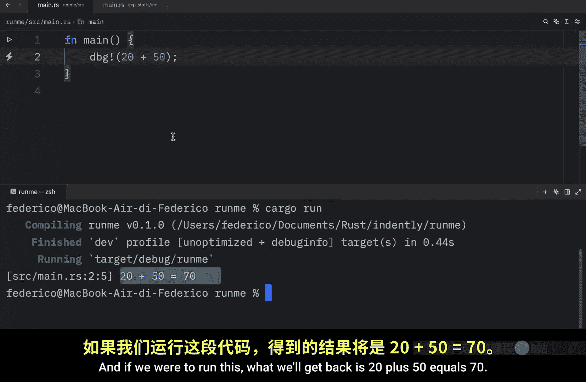
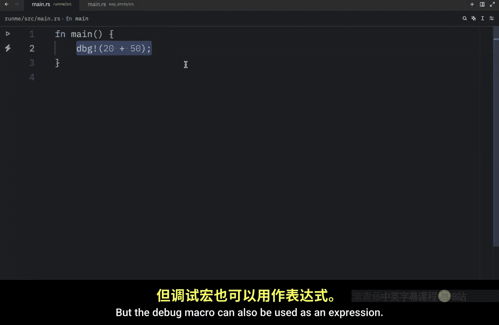
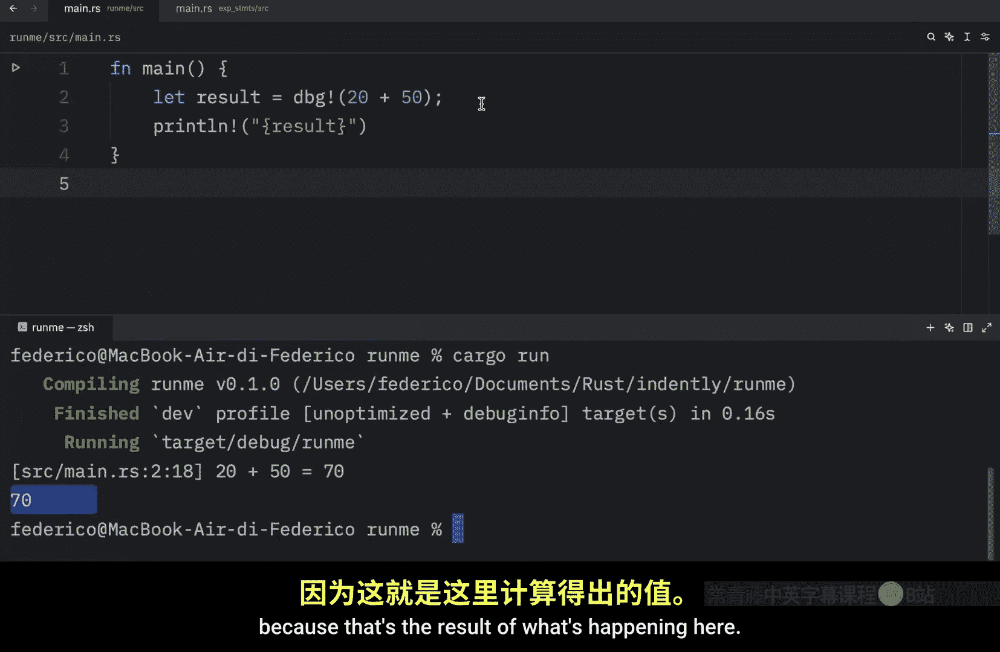
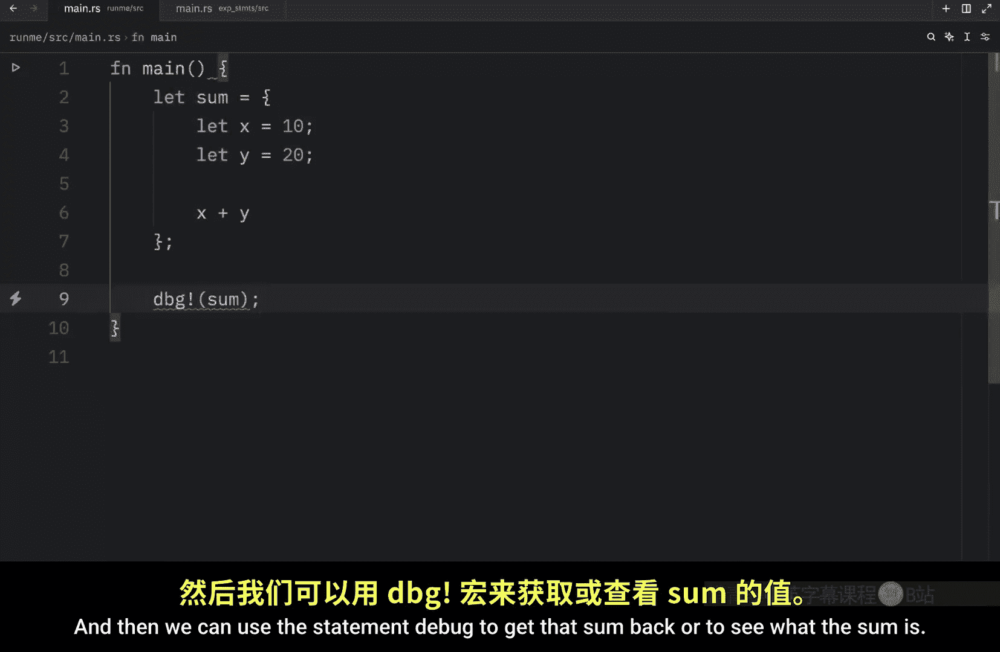
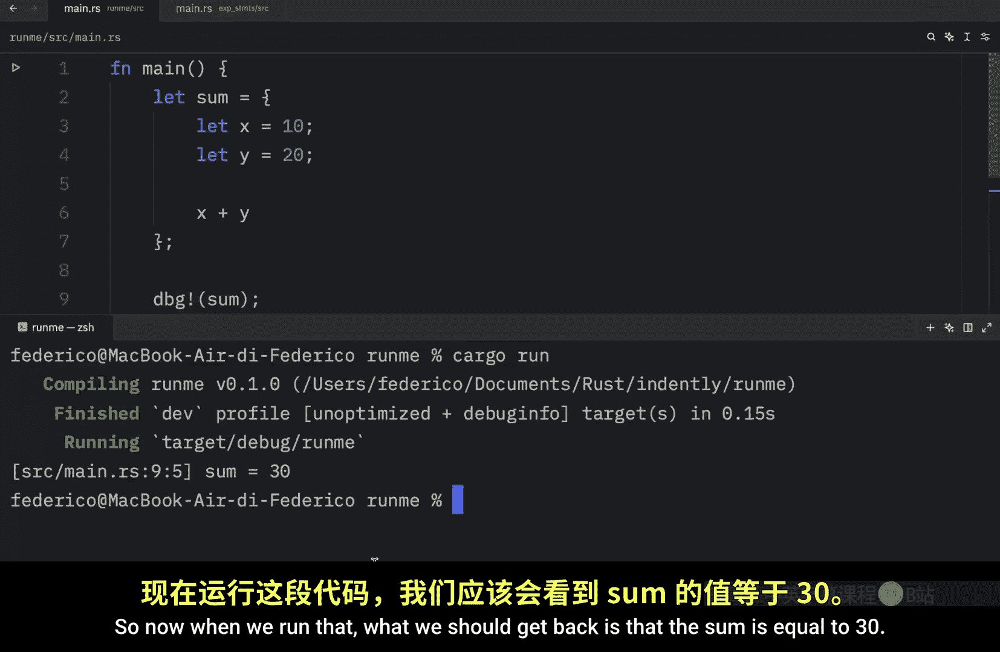
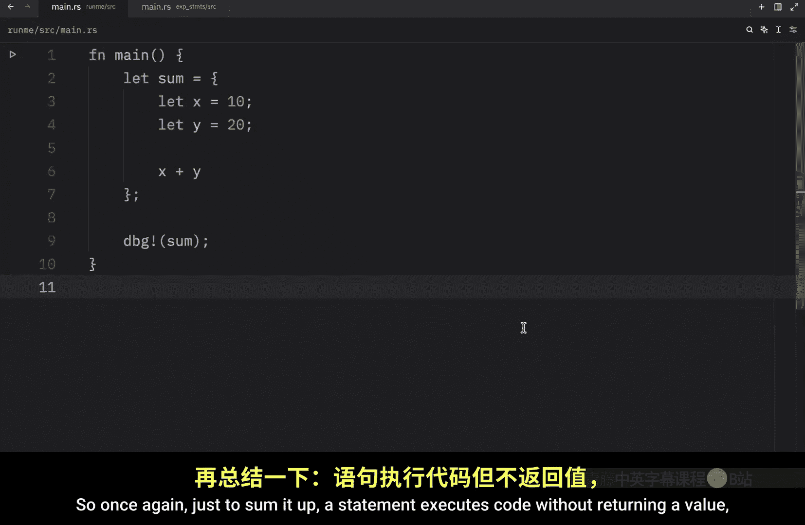

# Rustfully【中英⚡Rust 初学者教程（2025）｜Rust for beginners (2025)】 p14 P14 Rust中的语句与表达式 -BV1eyAkzPEhj_p14-

How's it going， everyone In today's video， we're going to be discussing the topic of statements and expressions。

 What is the difference。 And the reason we're covering this is because rust is an expressionbased language。

 So first I'm going to get started with the dry part explaining what they are verbally and then we'll move on to some examples。

 So statements are lines of code that perform an action without returning a value。

 While expressions are lines of code that evaluate to a result。 So code that returns a value。

 So let's look at an example of a statement here we're going to define a variable called name and that's going to equal Bob。

 this right here is a statement because it doesn't return anything。 It only executes code。

 another example of a statement is the printline macro here we can type in hello Bob or let's do hello name because we' already wasted that line of code and this would be considered a statement as well because it's executing code and not returning anything。

 And again， statements do not return values， which means that。We cannot use them as values。

 For example， we might create a variable， and that variable will equal another variable assignment in languages like C and Ruby。

 This would work because the assignment would also return the value， but in rust。

 this will not work because this is a statement that doesn't return anything。 It only executes code。

 and we cannot assign that to a variable。 we can only assign code that returns something to a variable。

 such as 10 plus 20。 This evaluates230， which we can then assign to the variable。

 So this entire line is a statement， but this part here is an expression because it returns a value。

 while this line of code returns nothing。 It doesn't return anything。 It only executes code。

 So now let's take a look at an example of an expression。

 One example would be if you were to use the debug macro。 and you were to type in 20 plus 50。

 This right here returns a value。 It returns the value of 70。

 So it evaluates to something which makes it。

An expression。 And if we were to run this， what we will get back is 20 plus 50 equals 70。

 This is what the expression evaluated to。 And in this scenario。

 this is a statement because it's executing the code that we provided。

 But the debug macro can also be used as an expression。 If you hover over the documentation。

 you'll read that it prints and returns the value of a given expression for quick and dirty debugging。

 And since it returns the value， that means that we can also use it as an expression。

 So here we can type in let result equal debug。 Then right under， we can print line。

And pass in that result。 And this will work just fine， because this is an expression。

 And if we run this， what you'll notice is that we will get 70 back because that's the result of what's happening here。

 And let's cover one more example。 So here I'm going to type in let sum equal curly brackets。

 And inside here， we're going to pass in some logic， such as let X equal 10。😊。

And let why。Equal20。Then at the bottom what we're going to do is return x plus y。

 and once again this is an expression because it returns a value which will then be assigned to the sum。

 while this part right here is a statement because it executes that code and doesn't return anything and then we can use the statement debug to get that sum back or to see what the sum is。

So now when we run that， what we should get back is that the sum is equal to 30。

 but that's just one of the many important concepts we have to cover。

 especially if you are new to programming， knowing the difference between a statement and an expression will save you a lot of time when you are reading through documentation because those terms get used a lot so once again just to sum it up a statement executes code without returning a value while an expression will always return a value。

