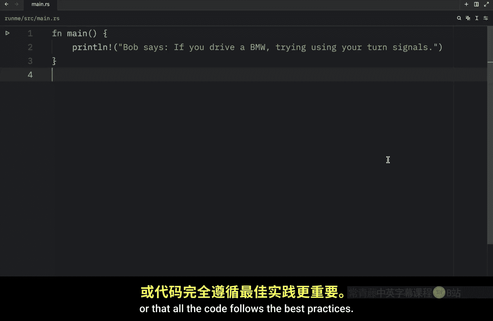
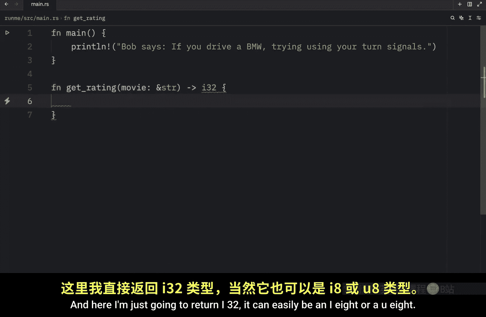
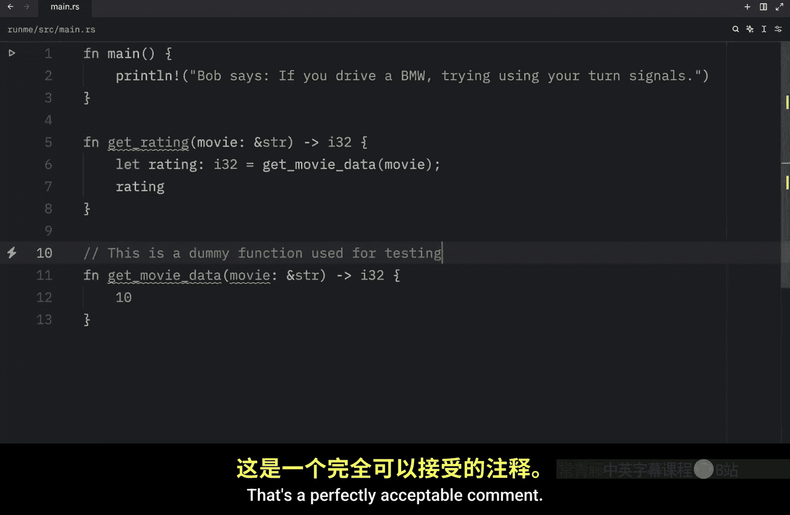
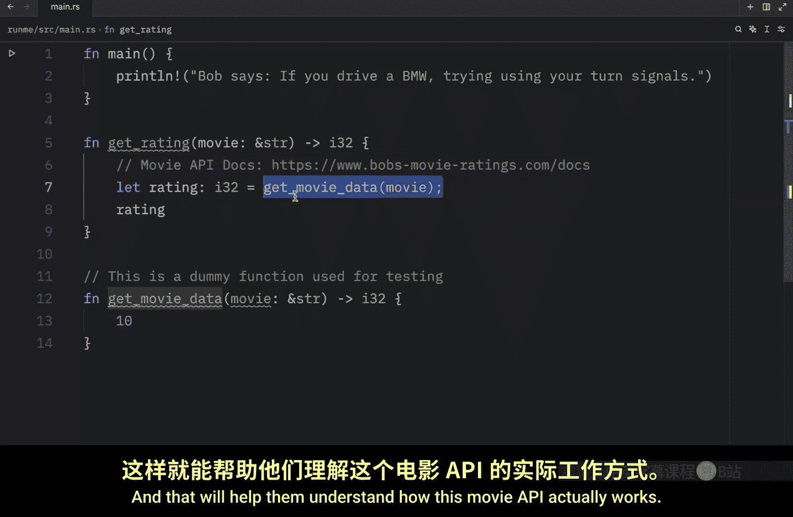
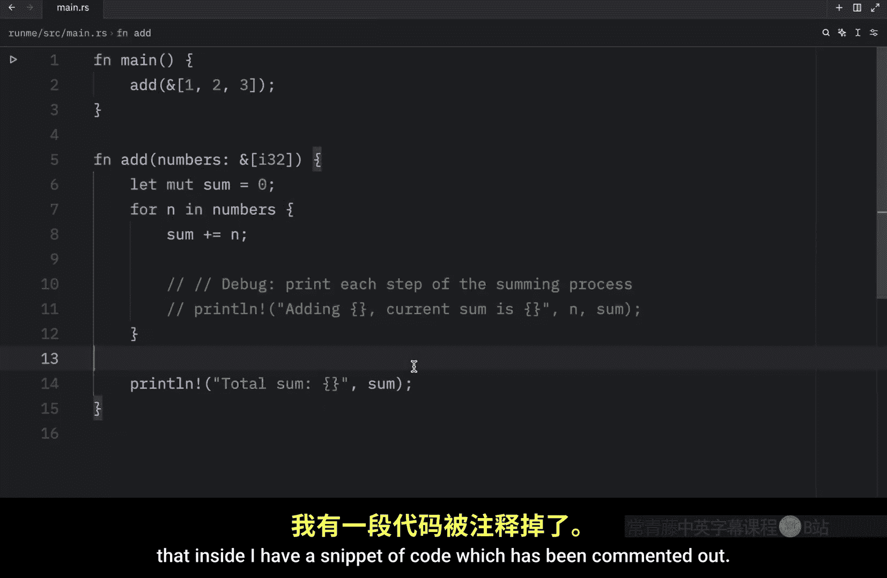
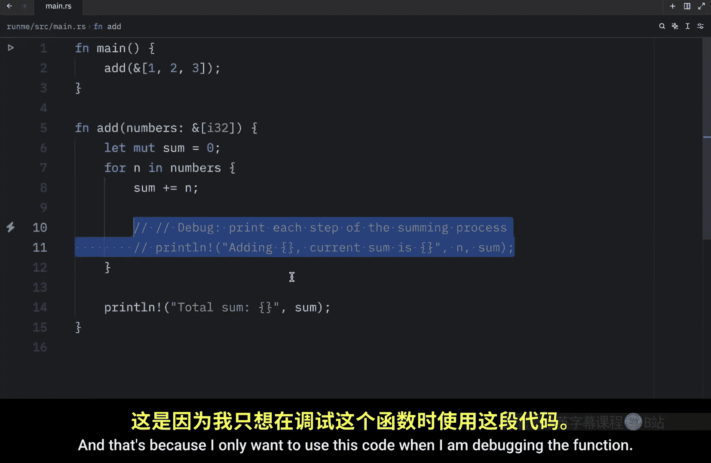
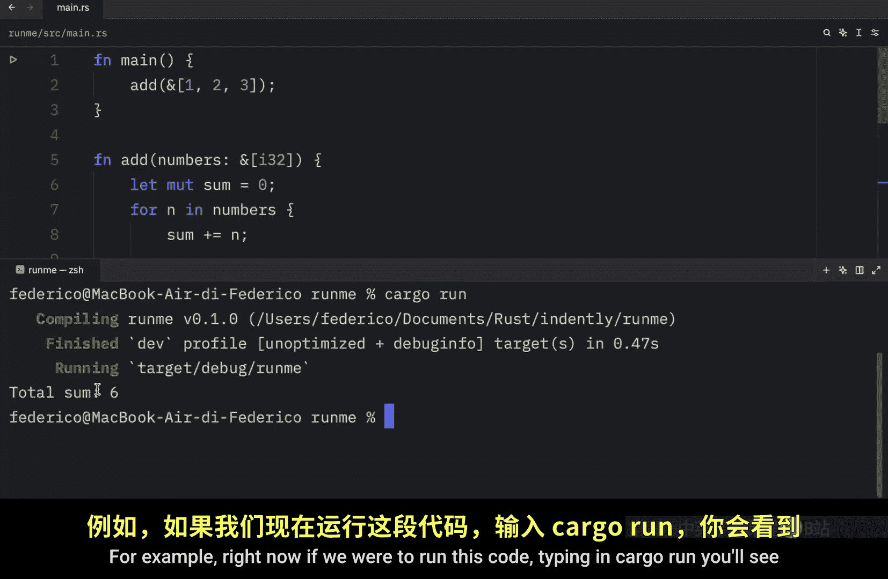
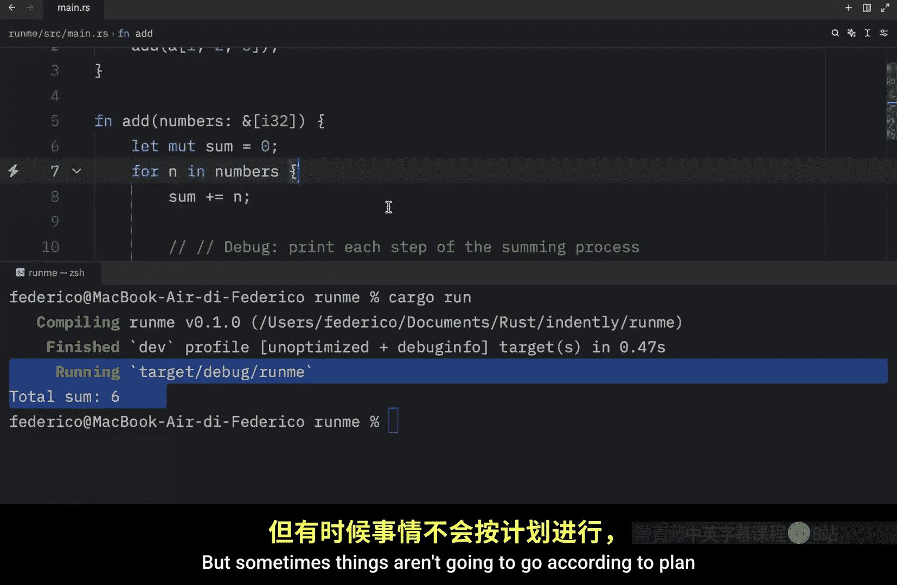
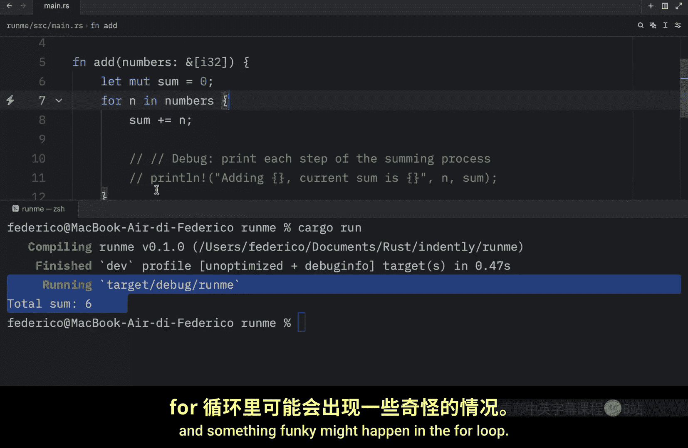
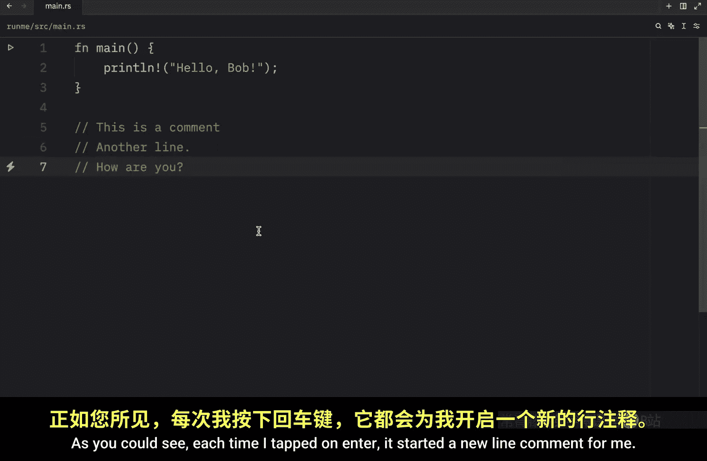

# Rustfully【中英⚡Rust 初学者教程（2025）｜Rust for beginners (2025)】 p15 P15 在Rust中添加注释 -BV1eyAkzPEhj_p15-

How's it going， everyone In today's video， we're going to cover the topic of comments in rust because sometimes you're going to be writing code that will require some extra context and the best way to provide that extra context will be with a quick comment。

 You will probably also hear the phrase that good code does not require comments in a perfect world that might be true。

 But in reality， good code isn't something you will come across that often。

 because for a lot of devs meeting deadlines will often matter much more than making sure everything follows the perfect naming conventions or that older code follows the best practices。

 So that's where a quick comment can be very useful。 For example。

 imagine you have a function called get rating。 And what this does is take a movie of type string slice and returns to us the rating for that movie。

 And here I'm just going to return I 32。 It can easily be an I 8 or a U8。

 Now we're going to let the rating。

Of type I 32， equal get movie。Data and that's going to pass in the movie Then we're going to return that rating and this function does not yet exist in our code。

 So what we're going to do is quickly create that right under get movie data and that will take a movie of type string slice and return to us I 32 and as dummy data we're going to return 10 as the code stands this doesn't really make any sense So let's add some comments that can be quite useful in these context。

 The first one I'm going to add is something that I use for tutorials for example this is a dummy function used for testing。

 That's a perfectly acceptable comment。 Otherwise if we go back up here we can add the comment that this uses this movie API and we can link the docs which will be Https colon double www bobs movie ratings co dos and that's a quick resource that we can comment into this function It's not exactly something that is necessary for this function to work。

Does give whoever is looking at this some extra context regarding the function because they might be reading this and if they ever want to edit this。

 they're going to have to do some research to find this API but thanks to this comment they can literally just look at that copy this URL and paste it into their web browser and that will help them understand how this movie API actually works a second example could be creating a quick note for example on top of function main we can type in this is our main entry point and that's great for noteta especially if you are new to programming adding comments everywhere can make it easier to remember what certain code does in a professional codebase you would want to exclude this because it is redundant function main is known as the main entry point this isn't something you have the comment but if you're new to rust or new to programming commenting everywhere can be ultra useful and there's actually another use case for comments which you will probably find yourself using quite often and to demonstrated I'm going to paste in this snippet of code。

Then I'm going to remove this。Type in addd and we're going to add in one。

2 and3 and all this function does is take a sum and then for each one of our integers in this function。

 it's going to add it to the sum and print the total sum but you might have noticed that inside I have a snippet of code which has been commented out and that's because I only want to use this code when I am debugging the function。

 For example， right now if we were to run this code。

Without being in cargo run， you'll see that we will get a total sum of six back because it performed that operation。

 but sometimes things aren't going to go according to plan and something funky might happen in the fall loop。

 So with this I'm going to quickly disable the comment and as you can see this line of code is now going to be active which means the next time we run this we're going to get these print statements included when we call our function and this tells us exactly what's going on on each iteration So that's something quite nice if you ever want to test out a line of code。

 you can quickly commented out and then uncommented out and every code editor should have a shortcut for that for me on Z it's command plus the question mark I doubt it's going to be the same on your computer you definitely have to do your own research on that shortcut but what's nice about that is that anytime you have a snippet of code that you want to comment out just use that shortcut and it will comment that block of code out for you and that's very useful for testing alternative approaches because if you have to。

Move this。Save it somewhere and then paste it back in every time you wanted to debug this function that can quickly become very annoying。

 And finally， there's one more comment type that I want to talk about today and that is the multiline comment and to create it you just have to type in slash and asterisk and that's going to open up a multiline comment block which allows you to freely type in this enclosed space you can type in this is a comment。

Written。By bo X equals x plus1 or1 plus1， you are free to write whatever you want inside here。

 and it's going to be ignored by rust when it compiles the code。Alternatively。

 most code editors should start a new line with the double slash every time you tap on enter so you might not always need to use a multiline comment in a lot of code bases。

 you'll just see double slash being used instead， For example。

 this is a comment enter another line enter。How are you as you could see each time I tapped on En it started a new line comment for me and I find that slightly more convenient than having to type in slash and asterisk but at the end of the day try to pick whatever you find most convenient and there are also other special comment types but we're going to be covering those in a future video。

