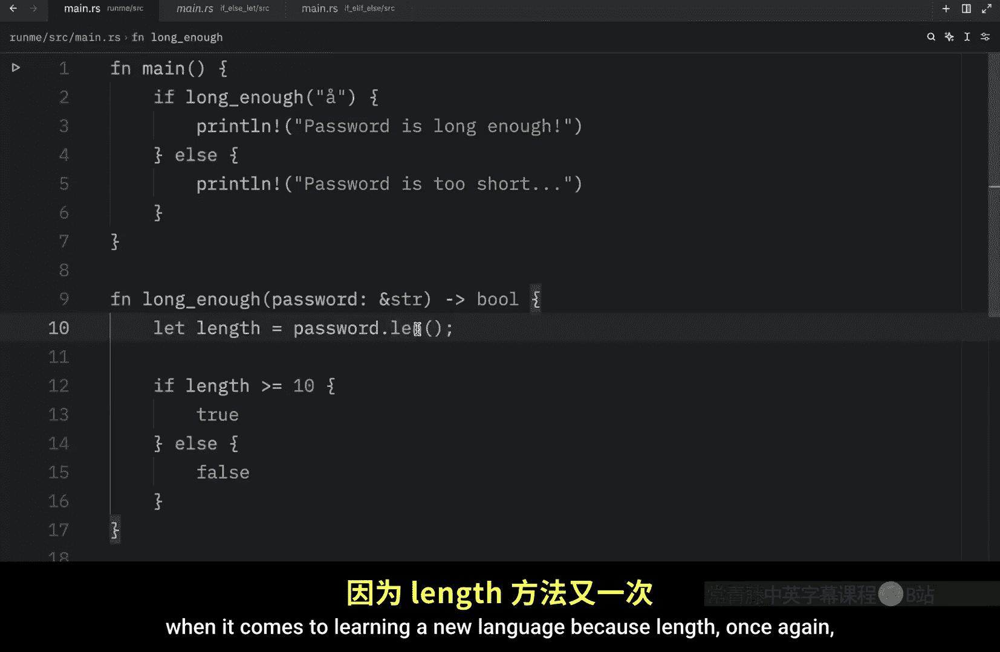
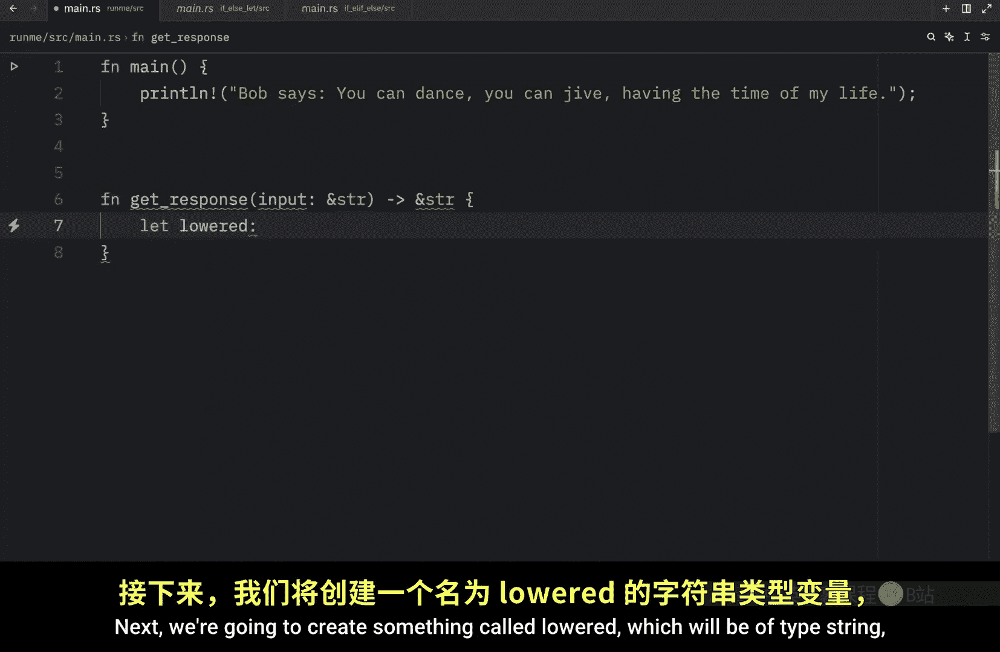
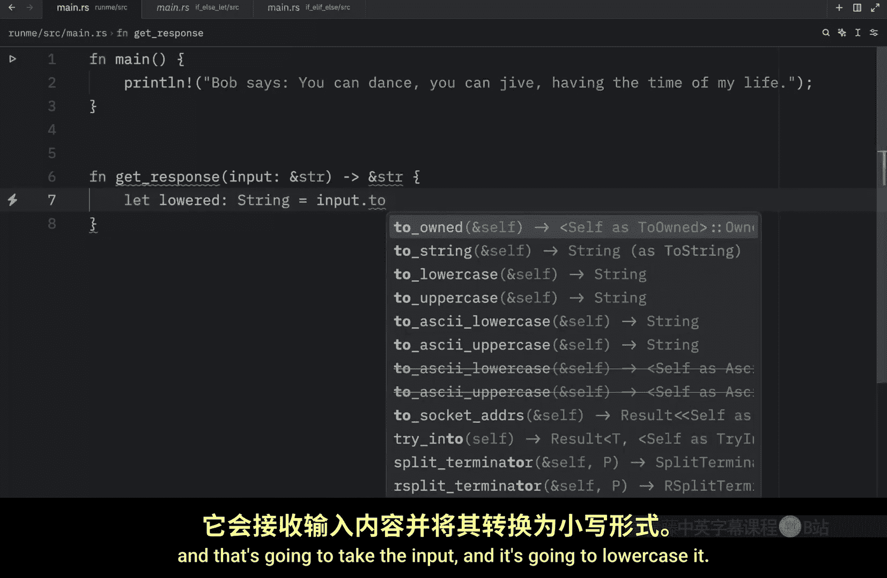
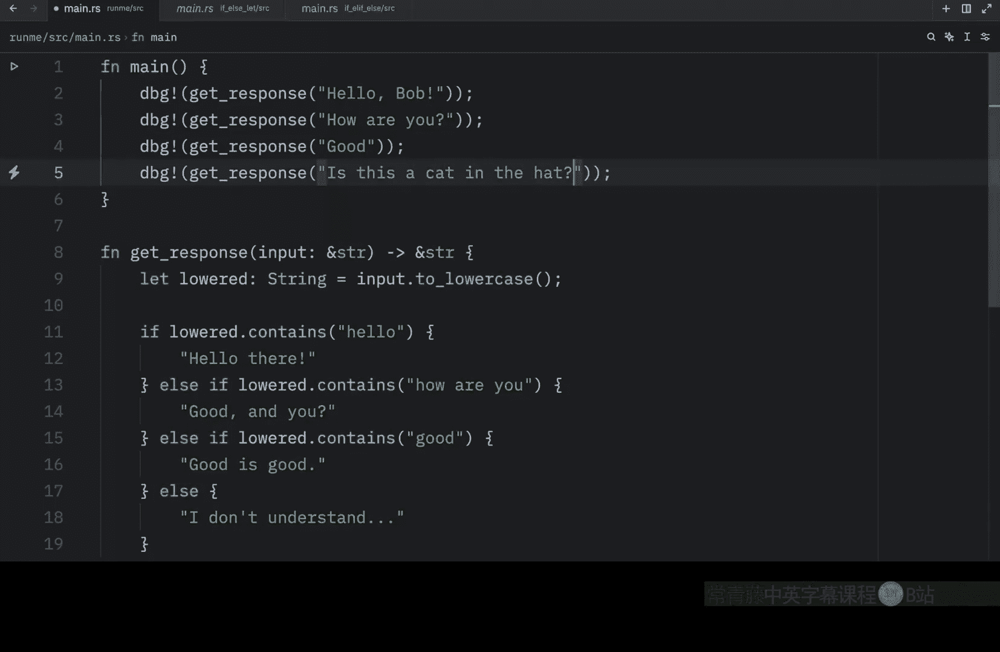
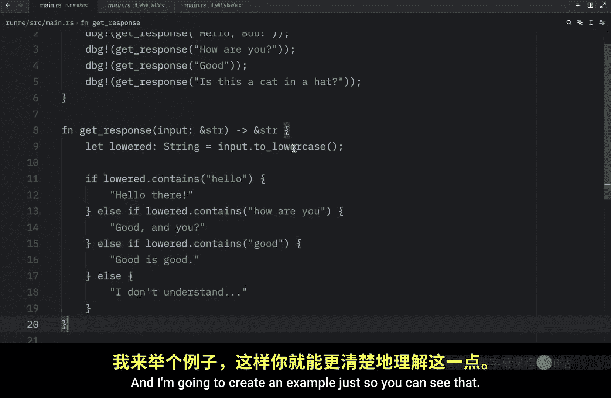
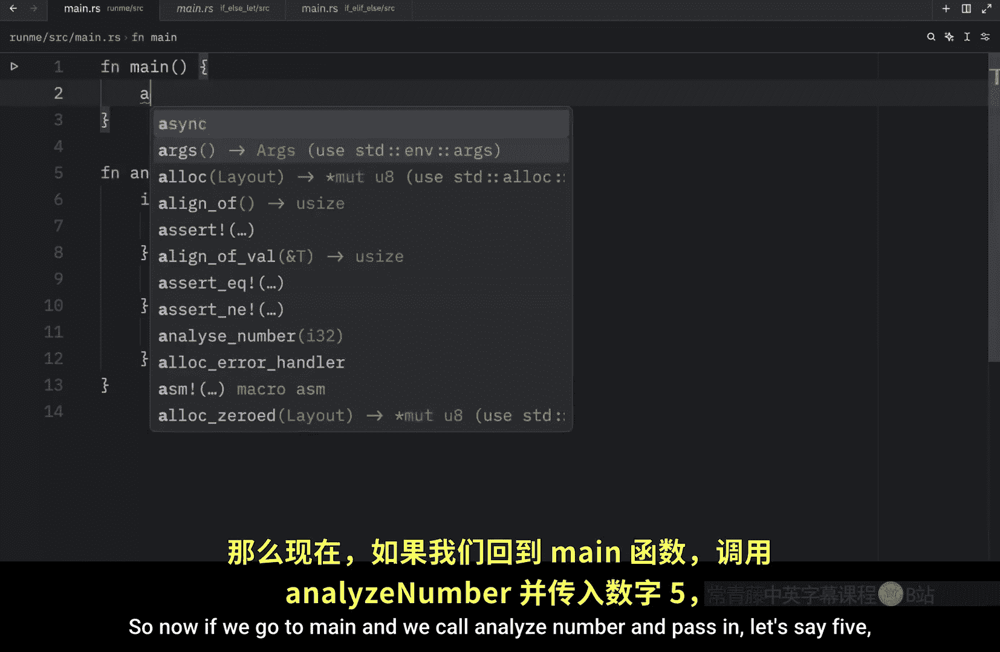
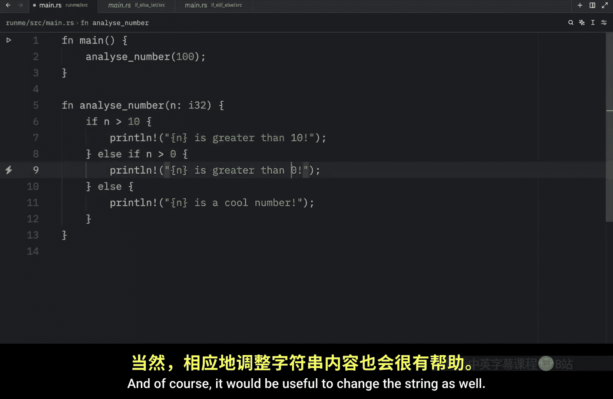
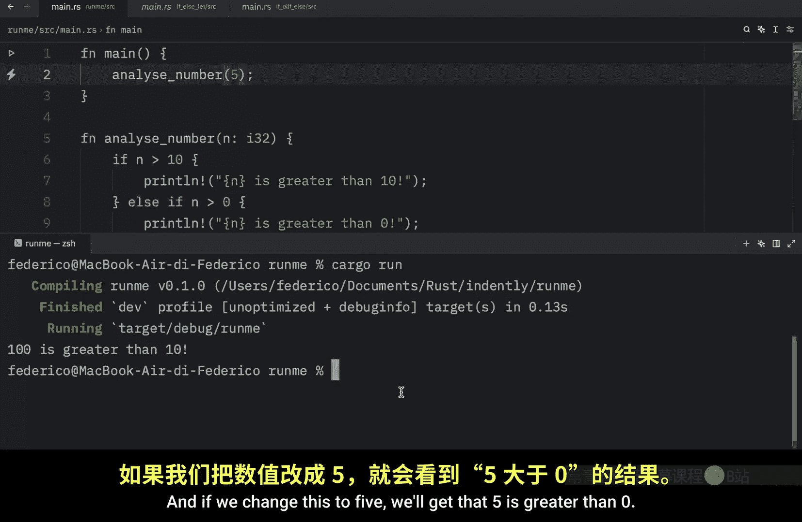
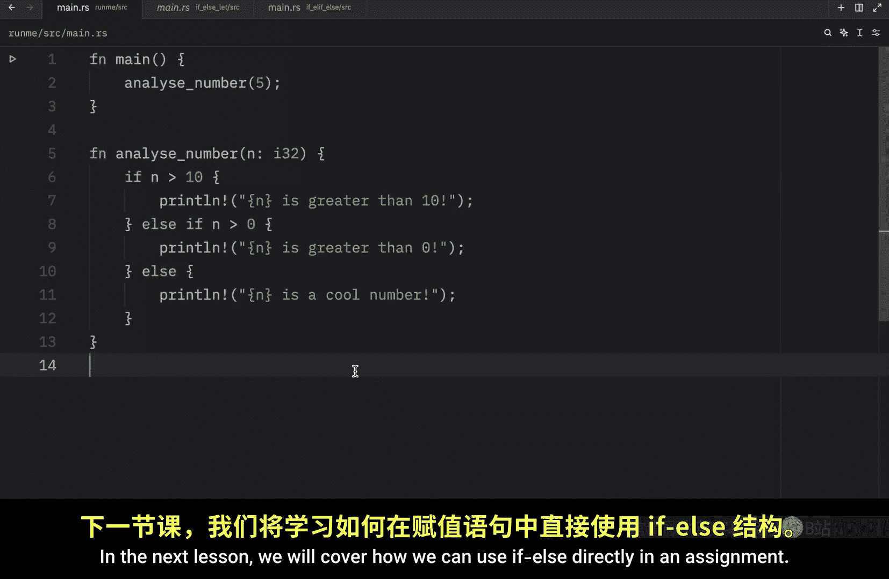

# Rustfully【中英⚡Rust 初学者教程（2025）｜Rust for beginners (2025)】 p17 P17 Rust中更多的控制流 -BV1eyAkzPEhj_p17-

How's it going everyone in the previous lesson we learned about if else in rust and how it could execute code based on a condition Now before we move on from that。

 I do want to clarify or bring up one thing and that is that the length method does not do what I thought it did coming from Python we can use this to count the characters of a string or the elements in a list that's how it works in Python。

 but in rust it works completely differently。 what length does here is return the length of this string in bytes and you can verify that by hovering over and reading the documentation to make this function accurate we're going to have to get the characters。

And then count those characters。 Now， the functions is going to do exactly what we wanted it to。

 And it's going to count these characters accurately。

 The problem with length is that there are some characters such as or。

 which is a Scandinavian character and this counts as two bytes。

 which means the length of this will return two instead of one。

 And that's something we wouldn't want in this case。

 So the moral of these stories to always read the docs。

 when it comes to learning a new language because length once again did not do what I expected it to。

 In Python， it does something completely different。 And I'm quite happy I made that mistake。

 because from now on， I'm going to be much more attentive with methods that have the same name as the ones in Python anyway。

 let's move on to what I originally had planned for today's lesson earlier。

 we learned that we could use if else to execute code based on a certain condition。

 But what if we wanted to handle multiple conditions。 So in this example。

 we're going to create a function， which we will later use to create a simple。😊。

ThatBut in rust。 and this function will be called get response。 And it's going to take some input。

 which will be the user input of type string slice。 And that will return to us a string slice。Next。

 we're going to create something called low。Which will be of type string。

 and that's going to take the input。

And it's going to lowercase it and that just makes it easier to compare a string to another string because hello with an uppercase H is not equal to hello with a lowercase H。

 but we want these to be recognized as the same So every time the user inputs hello。

 it's going to be lowercased to hello so that this condition will pass anyway。

 let's move on to our if else check so here we can type in if lowered contains hello。

 then we can return hello there else we're going to return I don't understand。

 So far this is what we learned in the previous lesson but it kind of sucks to only have one response So what we're going to do next is add multiple responses and to do this we're going to use the else if keyword or the combination of keywords。

And this is essentially a second if check。 So if this one fails， it moves on to this one。

 which means we can now check if lowered contains， how are you。

 then we can return good and you and we can even create one more so we can type in else if lowered contains。

Good， and usually I would not create this before the else block because it's quite complicated。

 as you can see to， to add these curly brackets and everything。 But it is what it is。

 So here we're just going to return good。Is good。 And just like that。

 we can handle what the user inputs in multiple ways。

 but let's test out this function by debugging it。 So we're going to type in DBg， get response。

 we're going to pass in first。 Hello， Bob， and I'm going to duplicate that Ask Bob， how Bob is doing。

 So how are you we're going to pass in good。 And finally。

 we're going to type in something strange such as is this。A cat in the hat。

Or in a hat。 and now when we run this， you'll see that we're going to get the appropriate response for each one of our inputs。

And you can insert as many else if expressions as you want。

 but there is something I want to mention and that is that the order in which you place these does matter because once one of these evaluates to true the rest is ignored and I'm going to create an example just so you can see that so let's remove all of that and create a new function called。

Analyze number， which will take a number of type I32。 and that's all it's going to do。

 Then we're going to check if n is greater than 0。We can print that。 N is greater。

T0 L I was going to type in L if， but that's Python else， if n is greater than 10。

 we can copy this and print that n is greater than 10 else n is a cool number。

 So now if we go to main and we call analyze number and pass in， let's say5。

And then run our script or run our program， you'll see that5 is greater than zero。

Now if we pass in 100， this should trigger this block over here。

 so n is greater than 10 is what we should get as an output according to our logic。

 but when we run this you'll notice that 100 is greater than 0 and once again that's because order matters this first check past which means it executed this line of code and ignored the rest。

Okay that was a dramatic scroll So if you want this to work。

 you're going to have to check whether n is greater than 10 before you check whether n is greater than 0 because this has a chance of failing before this and of course it would be useful to change the string as well but going back to the console we can type in cargo run。

And you'll notice that 100 is greater than 10。 And if we change this to5。

We'll get that5 is greater than zero and that worked nicely because it checked these in order since 5 was not greater than 10。

 it was able to move on to the next condition and since that returned true。

 it executed this line of code， but yeah that's actually all I wanted to cover in today's lesson and the next lesson we will cover how we can use if else directly in an assignment。

