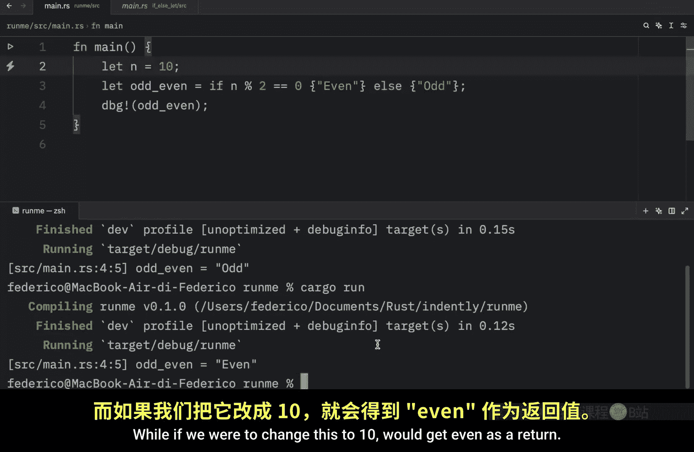
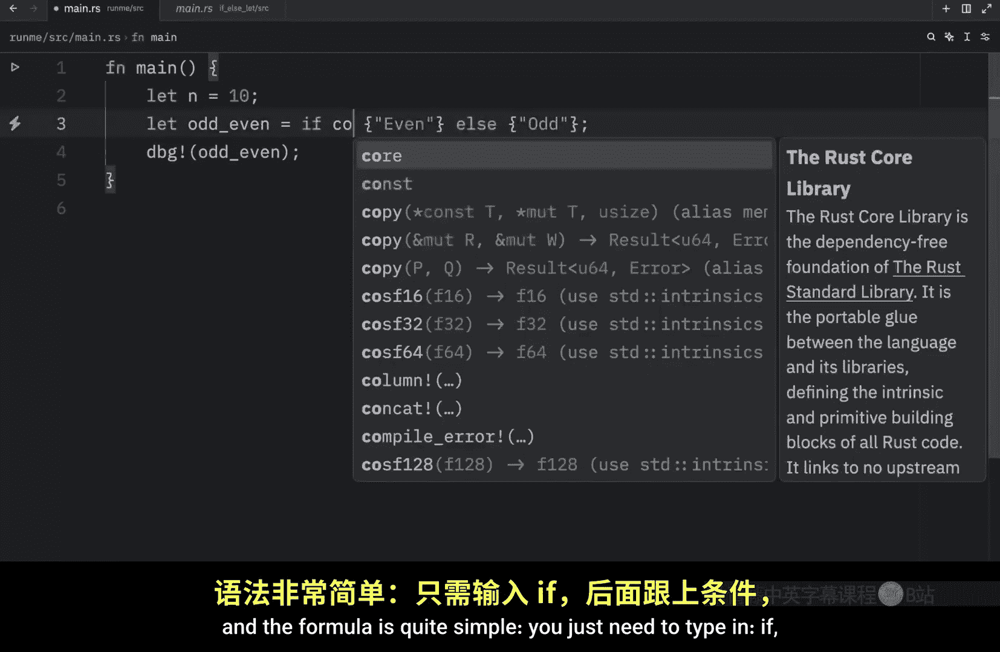

# Rustfully【中英⚡Rust 初学者教程（2025）｜Rust for beginners (2025)】 p18 P18 Rust中的let if..else真的很酷 -BV1eyAkzPEhj_p18-

There's one last thing I want to mention regarding if else in rust， since if is' an expression。

 we can also use it to assign a value directly to a variable。 For example。

 we might have something such as this that states that n is equal to 11 or that n contains the value of 11 and then we might want to create a variable that tells us whether it is odd or even so here we can type in odd even and that's going to equal if n modulus operator2 is equal to0。

 so if the remainder of n divided by 2 is equal to 0， then it's going to be an even number。Else。

 it's going to be an odd number and then we can debug this and just print odd even directly。

 Now if we were to run this， you'll notice that we're going to get back odd because 11 is an odd number。

11 divided by two has a remainder of one which leads us to the else block and that returns odd while if we were to change this to10。

 we would get even as a return。 but as you can see we were able to use if else on a single line and assign what it evaluated to to our variable and the formula is quite simple。

 you just need to type in if whatever your condition is passes it's going to return this else it will return this。

 Now it's important to note that both of the values that you are returning must be of the same type Otherwise rust will not compile that garbage For example we might have a boole called is connected that's going to be set two false and the result of the expression is going to check if is connected。

 we will return connected as a string。

Return negative 1 then we can debug the result and what we're going to learn is that rust in fact will not compile that garbage because both of these must be of the same type Even the exception here states that it expected a string slice but found an integer。

 but yet it's quite cool that we can do this on a single line and use it as an expression because it feels quite clean especially if it's simple logic。

