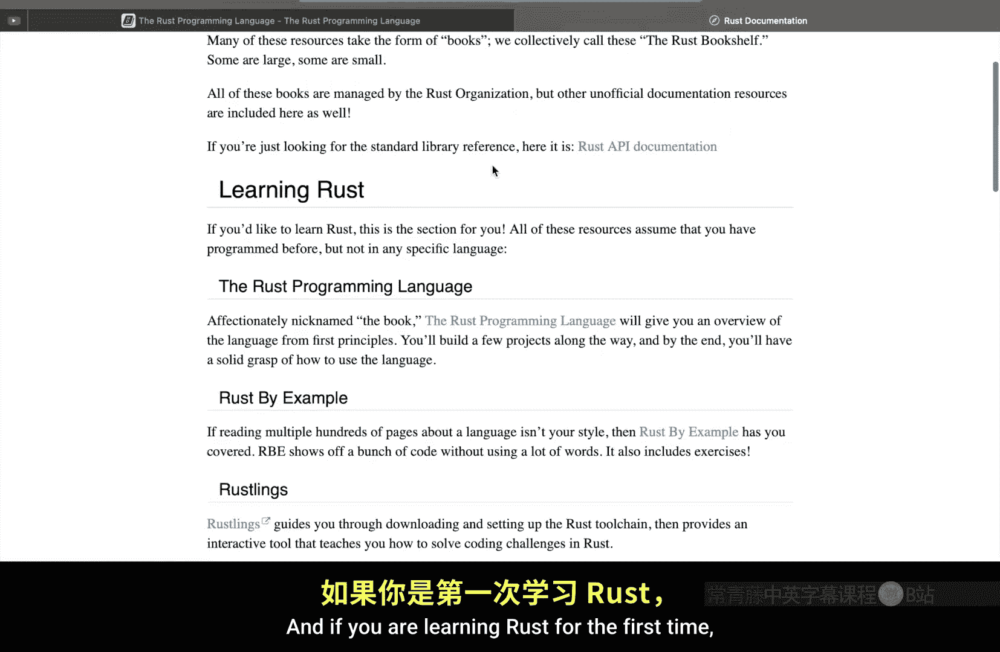
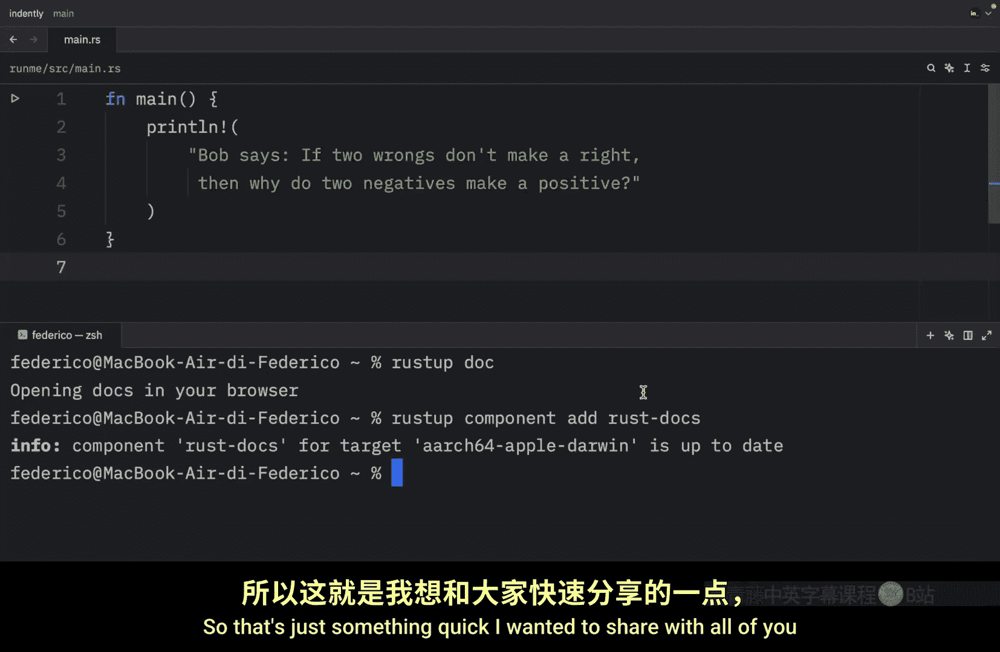

# Rustfully【中英⚡Rust 初学者教程（2025）｜Rust for beginners (2025)】 p19 P19 无需网络学习Rust -BV1eyAkzPEhj_p19-

How's it going everyone In today's video I wanted to bring up a lighter subject and that is how you can learn rust offline and the reason I'm making this video is because I found out that it was built into the language the docs were built into the language which is amazing I wish more languages did this or maybe they already do if you know of any other languages that do this please let me know in the comment section down below because I really appreciate languages that do this and what I'm talking about is in any terminal wherever you are you can type in rust up。

Dooc and this will open an offline version of the rust documentation so no internet is required to view these docs and if you are learning rust for the first time you can literally follow this link and it'll take you to the rustbook the same one that I'm following to teach all of these lessons So this is the online version which you'll find at doc do rustling。

 orgbook stitle page htm but for this one we have the offline version As you can see it hosted or located in this folder in my own computer and in case you don't have it installed for whatever reason you can use the command rust up components add and you can add the rust docs。

And if you don't have it， it will download it。 and if you do have it。

 it's going to make sure that everything is up to date。

 So that's just something quick I wanted to share with all of you because there will be times in your life you won't have internet and this is just good to know in that situation or maybe internet will be too slow and you might as well just use what's locally hosted and this contains a lot It contains the rust book。

 the cargo book， the rust Do book it contains a lot even the reference guide。

 So if you don't have internet this is a great place to explore rust。

 And yeah that's really all I wanted to share in today's video。

 just something quick and easy because we've been making a lot of progress with rust I thought we should have like a break episode but in the next video we will continue with the rust language and what we're going to be covering next are loops。

😊。

