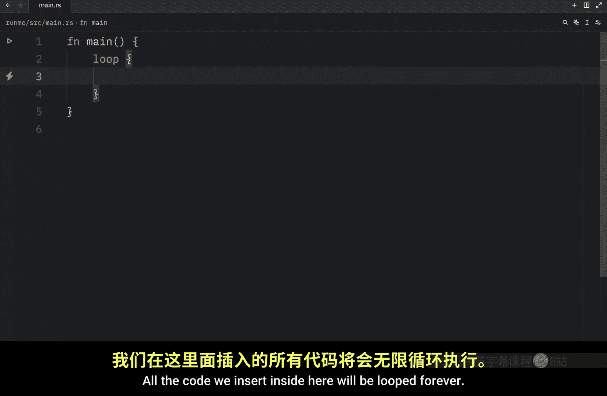
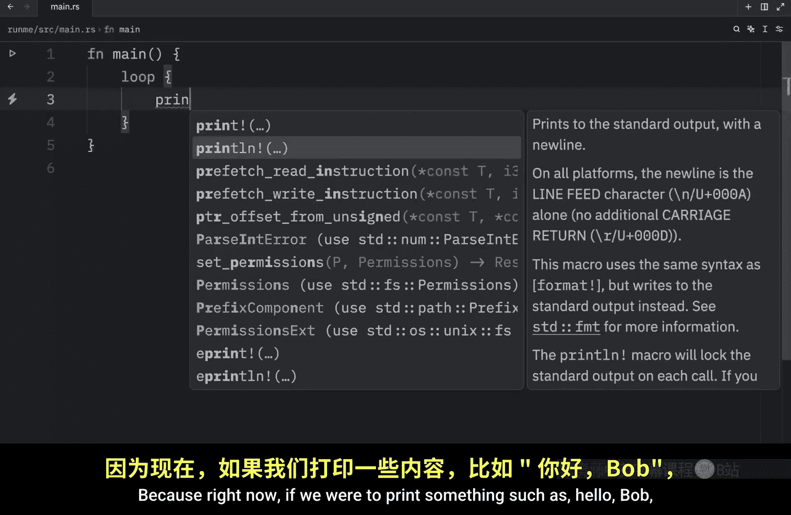
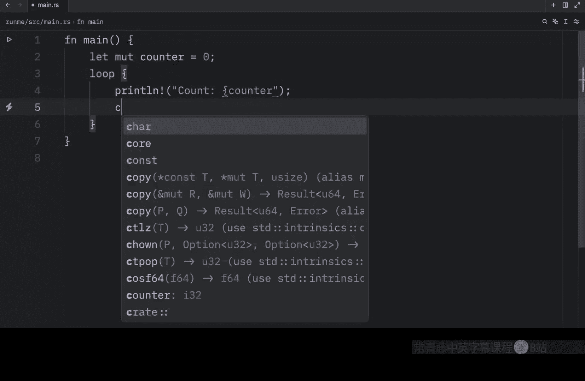
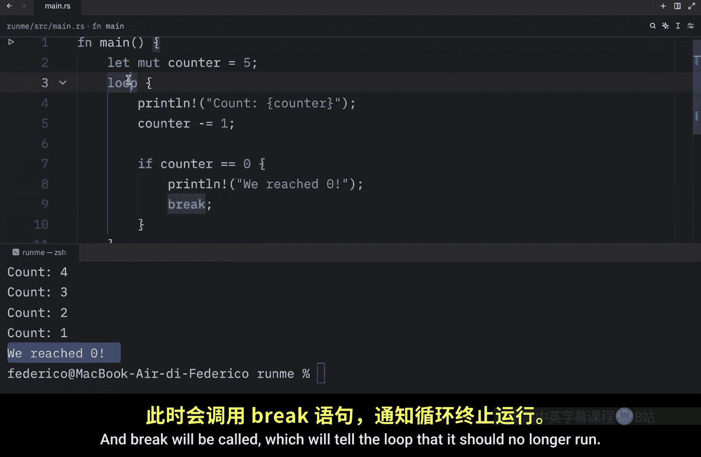
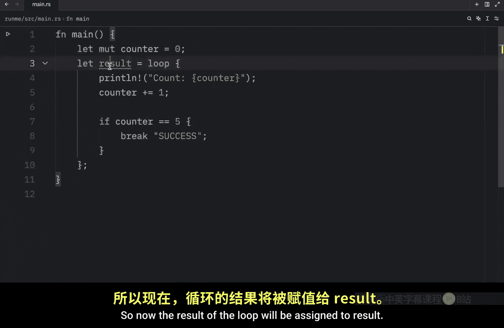
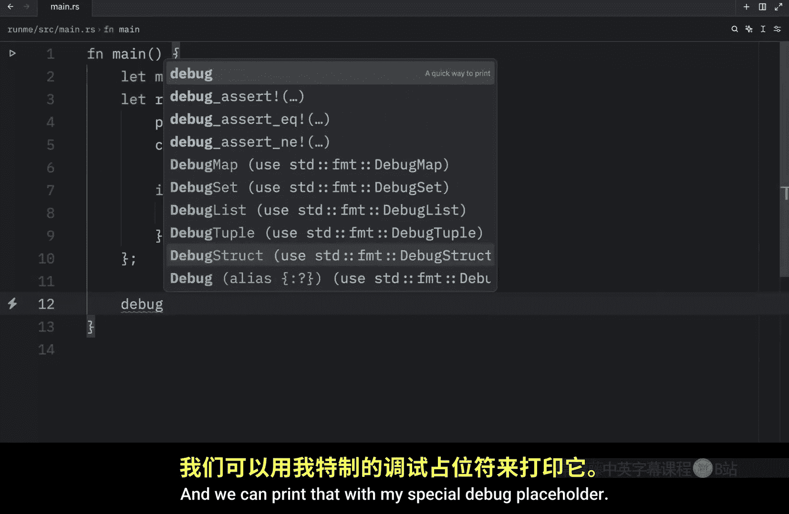

# Rustfully【中英⚡Rust 初学者教程（2025）｜Rust for beginners (2025)】 p20 P20 Rust中的loop循环很棒 -BV1eyAkzPEhj_p20-

Now that we learned about how we can use if else to run code that meets certain conditions。

 it's time we cover the concept of looping， which is another fundamental concept that you will find in nearly every programming language in rust we have three kinds of loops。

 One is just a regular loop then we have the while loop and the for loop over the next few lessons we will be covering each and every one of these。

 But first we will be taking a look at the regular loop。

 which allows us to loop through code forever until we explicitly tell it to stop to create a loop we use the loop keyword and then we open up a pair of curly brackets。

 All the code we insert inside here will be looped forever or indefinitely So be careful when you use this because right now if we were to print something such as hello Bob and then if we were to run this。

 you'll notice in the console that this is going to loop indefinitely and the only way to get out of this is to hold control C to stop your program。

 So that's just something you need to be aware of Or if you want to actually see it loop。

Because right here you didn't really see much looping。

 we could create a mutable variable called n which will equal zero initially and then for each iteration we can do n plus equals1 then we can debug with my special print line placeholder and just print n for each iteration Now if we clear the console and run this once again you'll see that it's going to continuously grow this will loop indefinitely and once again you can hold control plus C to stop it at any point but next it's time we discuss a super sexy ultra hidden secret keyword that will allow us to exit out of loops whenever we want and this keyword is called break and it allows us to break out of a loop whenever it is encountered for example I'm going to remove all of this and change n to counter then we're going to print line that dec count。

Is the current counter then we're going to decrement the counts by one on each iteration and it looks like I'm missing a semicolon here。

 Now if the counter is equal to0， we're going to print line that we reached0 and what we're going to do inside here is use the brake keyword and this finally gives us a way of exiting the loop so it doesn't loop forever and it would be useful to change this to5 so that we have a number to count down from because if we started add0 it's going to encounter this immediately and nothing's really going to happen but let's run the code that we have so far and what you should notice is that it's going to start the count from5 it's going to loop。

And on each loop， it's going to decrement by one until it reaches zero。

 and once the counter encounters this condition， which evaluates too true。

 it will execute the code within and break will be called。

 which will tell the loop that it should no longer run。 And at that point。

 it will resume with the code that comes after it。 So here we can type in code that comes after the loop。

 Now when we run this you'll see that once we reach0。

 it's going to execute that code that comes after the loop。 otherwise without a break condition。

 this code will never be reached and most code editors should warn you about this。

 Now there's one more thing I want to cover in today's lesson and that's how we can return a value from a loop。

 So I'm going to remove this print statement and I'm going to set the counter to0。

 and instead of decrementing we're going to increment。 And once the counter increments to5。

 we're going to execute the following code。 And instead of using this print line statement。

 we're going to just break。 although this time we can include a value after break。 and this is going。

To be the value that will be returned so here we can type in something such as success because we were able to reach5 and right now we're getting some syntax highlighting because it thinks we want to return this value out of main when what I meant to do is to create a result and assign it that loop So now the result of the loop will be assigned to result and we can print that。

With my special debug placeholder。 And you'll see that once we run this loop， or actually。

 I'm going to clear the console first and then try to run it again。

But what you'll see is that once it counts up to5 and encounters 5 it's going to break out of the loop and return this string as a value which we assigned to result and you could even just return the counter number itself So here we were to run this you'll notice that the result is going to equal 5 that was the last number we iterated through and that concludes our first video on looping in the next video we will be talking about the while loop and the continue keyword。

