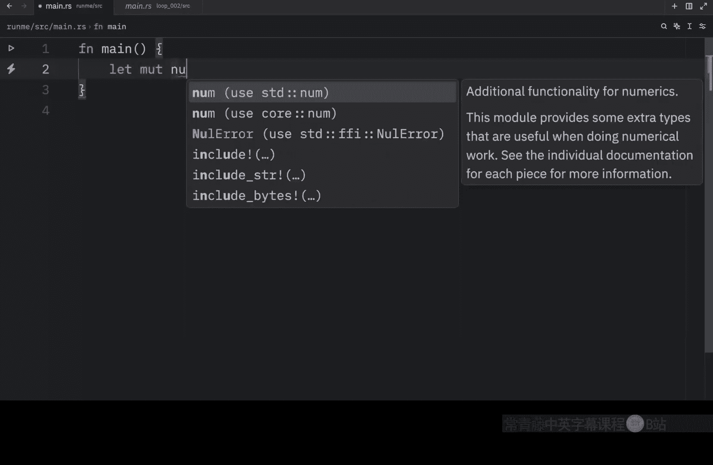
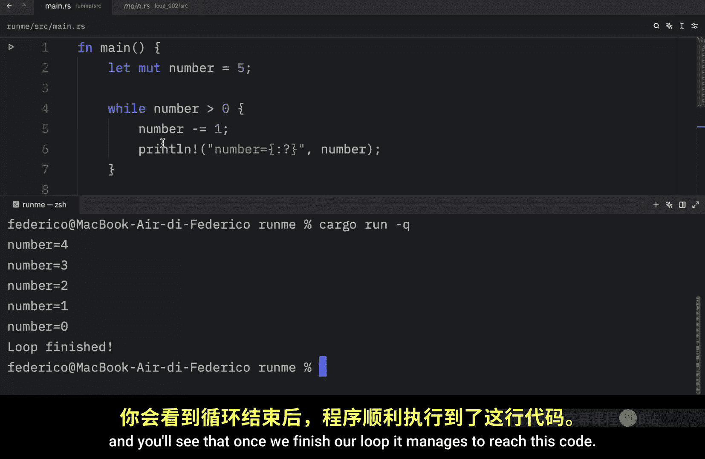
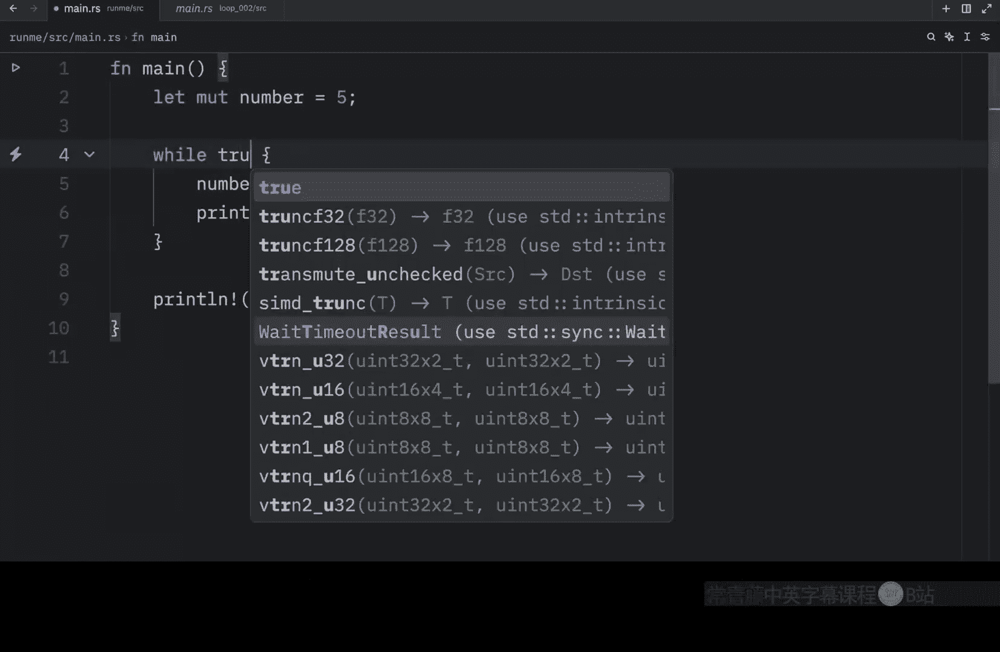
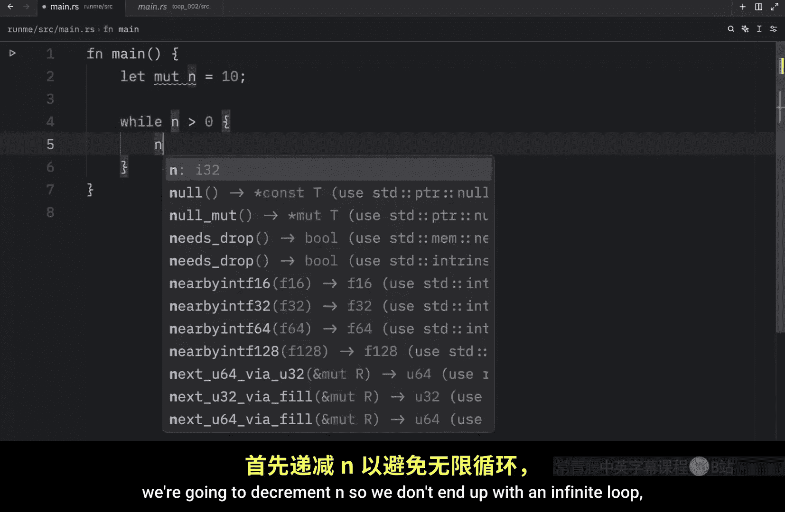

# Rustfully【中英⚡Rust 初学者教程（2025）｜Rust for beginners (2025)】 p21 P21 Rust中的while循环很酷 -BV1eyAkzPEhj_p21-

In today's video， we're going to learn about the while loop and how it works in rust。Previous。

 we learned that with the loop keyword， we could create a loop that only stopped when we explicitly told it to do so。

 The while loop behaves slightly differently。 It requires a condition that evaluates two true for each iteration to continue the loop once that condition evaluates to false the loop exits。

 So let's take a look at an example。 So what I'm going to do here is create a variable called number and I will give it the value of5。

 Now while the number is greater than0， we want this two loop。

 And right now if we were just to print that number So if we were to insert the number and run the script。

 You'll notice that we will get back an infinite loop。

 because this condition never evaluates two falses。 So once again。

 we're going to have to hold control plus C to stop our program。

 And that's why it's important to provide a condition that can eventually evaluate two false。

 So here to make sure we。

achieveve that we're going to add number minus equals 1 for each iteration and with that once we run our program。

 you'll notice that it will count down from 5 all the way to0 and once it hits 0 it is no longer greater than zero so this evaluates to false allowing us to exit out of the while loop。

 which means we can continue with whatever code is below it and just to demonstrate that we can type in loop finished。

Then we will run it once again and you'll see that once we finish our loop。

 it manages to reach this code and this can really be any condition you want。

 You can even insert while true， and that will work just fine。

 I mean P is an exaggeration kind of destroyed our program but as long as this is a condition that evaluate to either true a false it's going to run。

 but let's create one more example because I also want to introduce the continue keyword。

 So next we're going to create another mutable variable called n which will be set to 20 initially or that was actually supposed to be 10 and while n is greater than0。

 we're going to do the following we're going to decrement n so we don't end up with an infinite loop and then we're going to check if n is equal to 5。

 we will print。

That we are skipping5 and this is where we will use the continue keyword and right below that。

 we're going to print the current value， which is n to the console。

 So before I explain what continue does I'm going to run this program and what you should notice is that it starts to count from9。

 It goes down to5 and once it encounters 5。 it skips 5 as you can see we're not printing that n equals 5 anywhere and then it moves on to n equals 43 all the way down to0。

 So what's happening here is we're looping through this we're decrementing the number on each iteration and once n is equal to5。

 we decide to skip the rest of the code using continue So continue is used to skip to the next iteration directly。

 This means that all of the code that comes underneath it will not be executed。

 It literally just go straight back to the top as soon as this is encountered and we can also use this to only print even numbers or odd numbers just。

By changing the implementation details slightly， for example。

 we can type in if n modulus operator2 is equal to 0。Then we will continue。

 we will skip printing the even numbers， or at least that's what I think it will do。

And just like that， we will end up with odd numbers only because the continue keyword told Ru to skip to the next iteration each time we encountered an even number。

