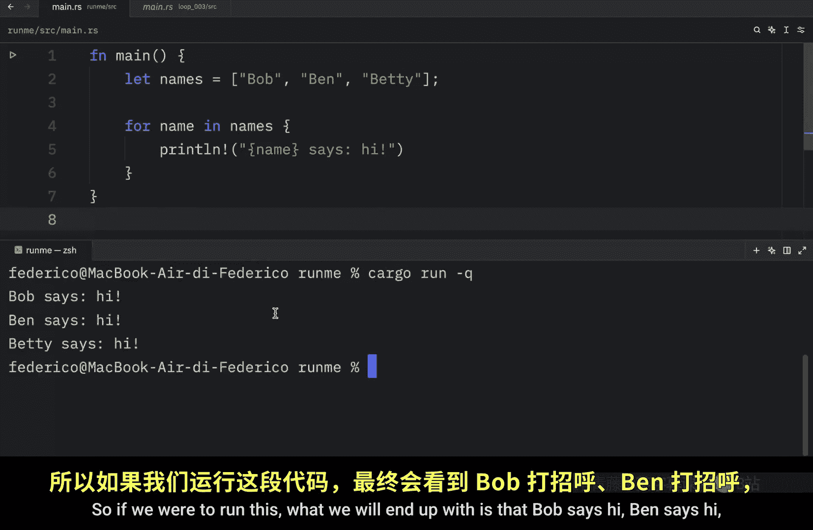
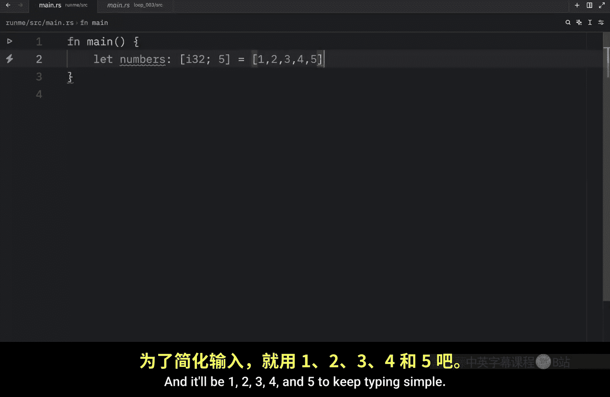
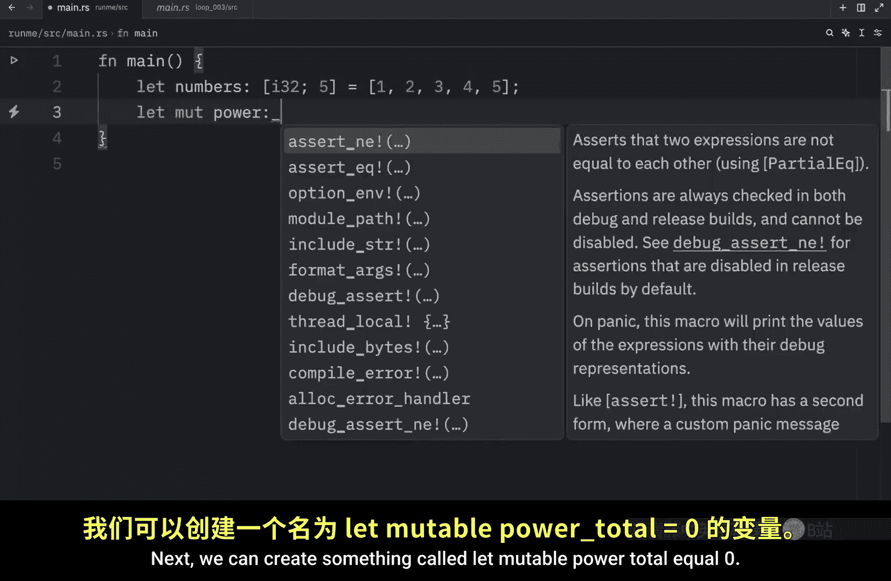
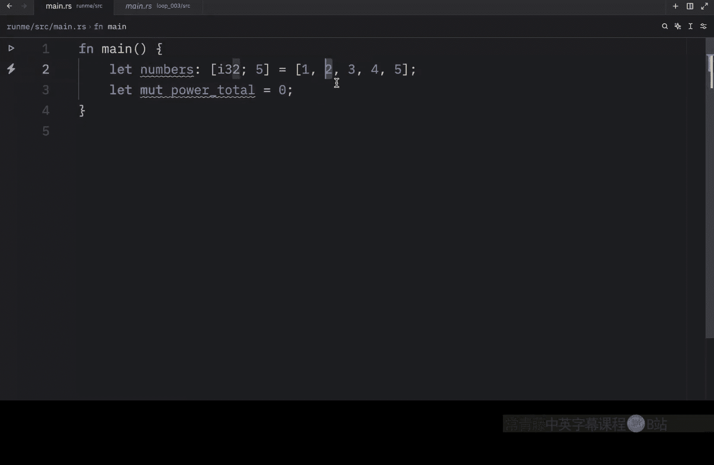
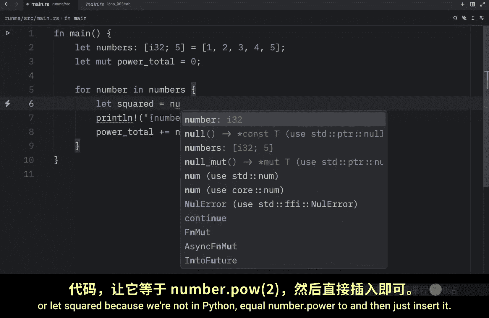
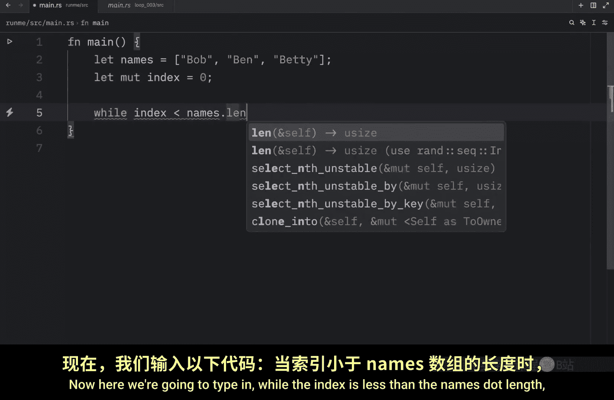
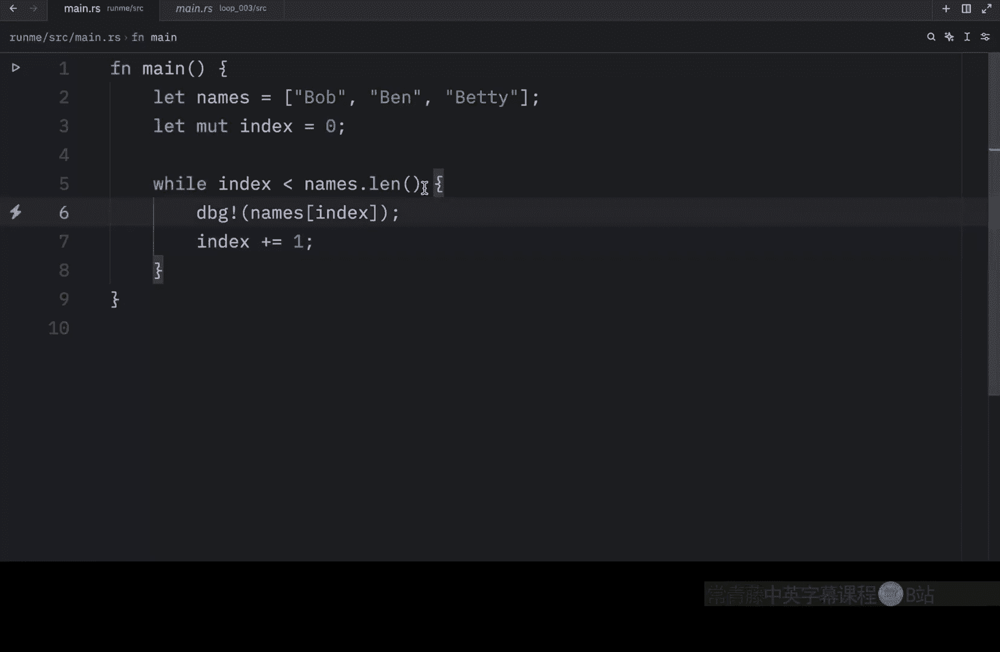
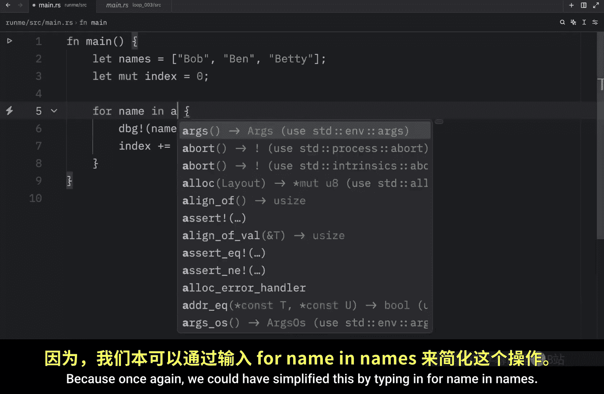

# Rustfully【中英⚡Rust 初学者教程（2025）｜Rust for beginners (2025)】 p22 P22 Rust中的for循环相当棒 -BV1eyAkzPEhj_p22-

In the previous video， we learned about wild loops。 Now。

 it's time we cover one more loop type that allows us to iterate through itables in a much more convenient way。

 What we're going to be exploring here is the for loop。

 So let's get started immediately by creating an array cold names。 and that will contain the values。

 Bob， Ben。😊，And Betty next we're going to iterate through each name and use each value on each iteration。

 So for name in names， we're going to print line and pass in that the name says hi So here we're iterating through this array of names and this is the variable name that we'll be using for each iteration。

 but you can name it anything you want。 It could even be n or person this is a temporary variable name that will be used for each iteration。

 So on the first iteration name is going to be equal to Bob then it's going to be equal to Ben and then finally it will be equal to Betty。

 So if we were to run this， what we will end up with is that Bob says hi bin says hi and Betty says hi but let's look at a second example where we have some numbers。

 and they will be of type I32 and we will have five of them and it' will be one23。

4 and 5 to keep typing simple Next we can create something called。

Let mutable power total equal 0。 because what we're going to do is get the power of each one of these numbers and add it to the total。

 So for number in numbers。

We're going to print line that the number and we will use the debugging syntax。

 So colon question mark is going to be equal to the number dot power of two。

 So this will square each number if you want to get the cube。

 you can also add three or another number。 It's a very convenient method that we can use on integers and the power total is going to plus equal number dot power to the second power and ideally you wouldn't duplicate these lines of code You would probably type in something such as squared or let's squared because we're not in Python equal number dot power2 and then just insert it and that just makes it easier to update later and finally at the bottom we're going to debug and print the power total Now when we run this。

What we should get back is the number itself and the result of it being squared on each iteration。

 Then at the bottom， we should get back the total， which is 55。

 So it's all of these values added together。 So as you can see。

 also here using the fall loop was ultra convenient。 Now。

 I do want to mention that you can use the regular loop and the while loop to achieve the same thing。

 But in general， that's considered a bad practice because it takes much more effort to achieve something very simple。

 which can lead to bugs and errors。 And just to demonstrate what I'm talking about。

 we're going to create another list of names。 or an array of names。

 which will have the same values as from earlier。 And with that， we're going to create an index。

Wwhichch will be set20。 Now here we're going to type in while the index is less than the names dot length。

 We can debug the names at the current index。 and then we need to remember to increment the index on each iteration。

 But next let's run this and see what happens And what you should notice is that we get all three names back and that's fine。

 I mean， this worked pretty well at the cost of having to write much more code which is slightly harder to read。

 But watch what happens if we were to accidentally add index ahead and after the debug statement。

 What's going to happen next is that we're going to end up with an error。

 The thread is going to panic because we are now out of bound because first we increment the index by one which allows us to print Ben。

Cause this is at the index of one。 Then we incremented once again by one。 So now we're at Betty。

 And on the second iteration， we now increment this2，3， but we have no third element。

 or we have a third element， but nothing at the index of 3。 We have Bob at the index of 0。

 and at the index of1， Betty at the index of 2。 But now we have index， which is set 2，3。

 So due to our poor incrementing。Our index is now out of range。

 which resulted in crashing our program， so it's much easier to make logic errors here and you're totally free to choose whether you want to use the while loop。

 the full loop or the regular loop to do this， but my recommendation is that you should always use the right tool for the right job。

 it will save you time， trouble and energy because once again we could have simplified this by typing in full name in names。

Debug name。And just like that， we would achieve the exact same thing， except this time。

 we did it in a simple and safe manner。

