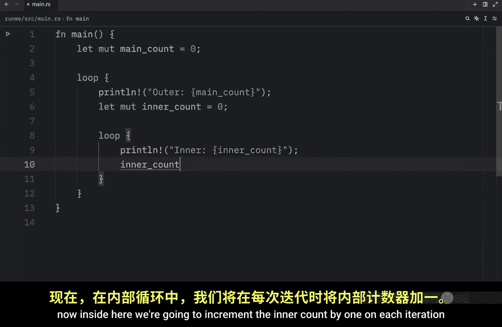
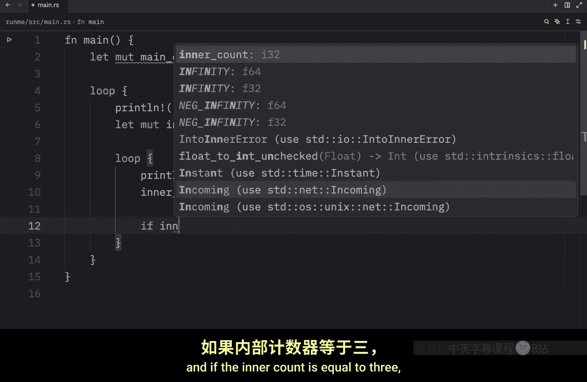
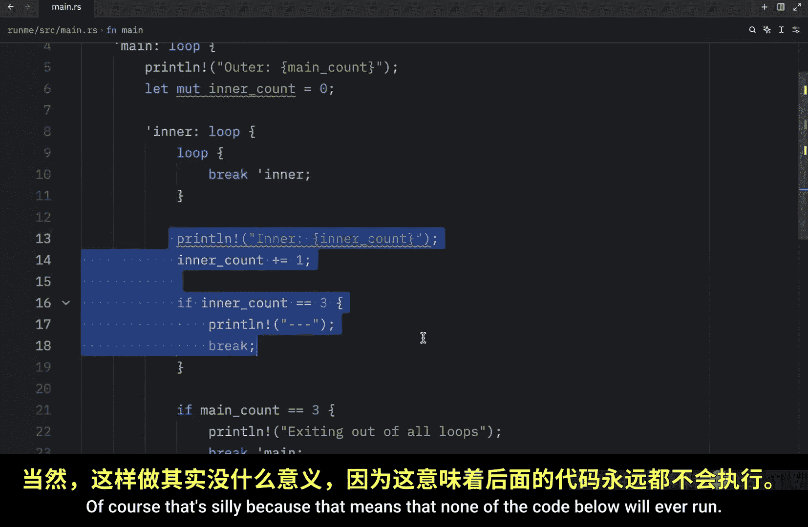

# Rustfully【中英⚡Rust 初学者教程（2025）｜Rust for beginners (2025)】 p23 P23 Rust中更好的循环控制 -BV1eyAkzPEhj_p23-

We've now covered all the loop types that we have in rust。

 but there's still one concept regarding loops that I'd like to teach you before we move on。

 This concept is called labels and labels are useful when you are working with nested loops and want to refer to a specific loop when you're using break or continue Now personally I absolutely hate using nested loops and whenever I nest loops。

 I tend to mess something up so if I can avoid it I will but there will be situations where I cannot avoid this because a nested loop will be the only solution and in case that happens it's just good to know about labels So what we're going to do is create a mutable variable called main count because we're going to have several different counts here and this one will just refer to the main one then we're going to create a loop and here we're going to print line that this is the outer loop and the outer loop is going to contain the main count then below that we're going to create another count and we're going to call this in count which will also be mutable and that will initially be set to zero and the reason we're doing that is because。

We're going to nest another loop。 So here we're going to type in loop， and we're going to print line。

Inner， which will refer to the in account。 Now inside here。

 we're going to increment the in account by one on each iteration and if the in account is equal to3。

 what we want to do is print line and create a divider and then break and something else you want to do is check if the main count is equal to3 we'll print exiting out of all loops and we'll add another brake statement and the goal here with the main count is to exit out of this loop which at the moment is not possible because regardless of what we do inside here if we call break for the in account or break for the main count is only going to exit out of the loop over here。

 So how can we exit out of the main loop from the inner loop and the answer to that is by using labels and to create a label you just need to use a single quotation mark followed by the name you want to use for that label and make sure to include this colon So this label is going to be called main and it's。

Iing to refer to the outer loop， which means that if we go down to break。

 we can now refer to that loop。By inserting our label。

 So we're going to break out of main when this condition evaluates too true。 And at the moment。

 we're in a bit of trouble because this will never evaluate the true since we did not include any logic to increment the main count。

 So what we're going to do under the loop is type in main count plus equal1。

 So now the outer loop will loop normally and will increment the main counts。

 And then our inner loop will also loop normally but inside here every time the inner count reaches3。

 it breaks out of the inner loop before starting again with the outer loop。

 And I hope you can see why I hate working with nested loops。 the logic does become a bit chaotic。

 especially if you don't handle it perfectly。 but just to show you what this does we're going to clear the console and type in cargo run in quiet mode。

And what we're going to get back is that it will start with the first iteration。

 then it will go inside the inner loop loop three times and then break and once it breaks。

 it's going to give control back to the outer loop where it will start with the next iteration and then loop three times once again inside the inner loop before continuing with the next iteration and once the main count reaches three break is called on our main label so that's going to exit out of all the loops。

 so as you can see it's quite useful if you want to refer to a specific loop in your nested loops and there might be cases where you'll even have three nested loops and if that ever happens you can provide multiple labels so here you can type in loop or not loop but label second or we'll just call it inner and this will be considered a valid label which means we can also create another loop inside here and once we reach this loop we can type in break inner of course that's silly because that means that none of the code below will ever run。

But all I wanted to show you here is that you could have as many loops as you like with as many labels as you like。

 and the important part is that you understand that with labels you can refer to specific loops。

 but now that we covered the final parts of loops in rust。

 we can finally get started with some more serious topics such as ownership。

