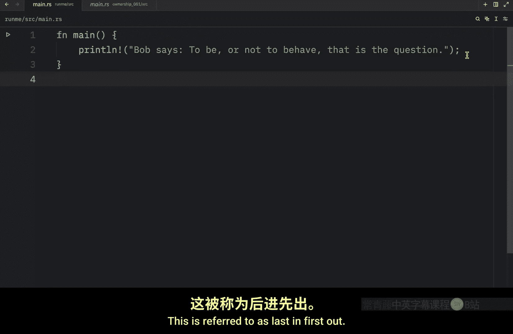
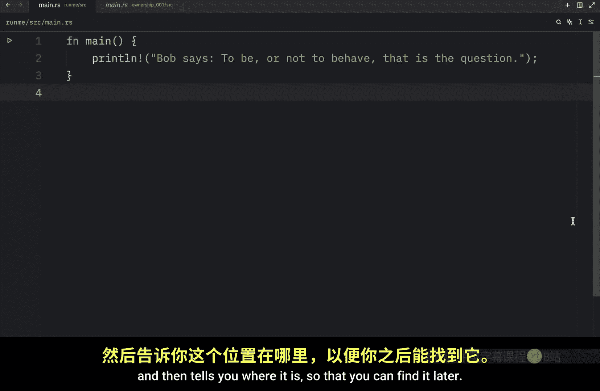
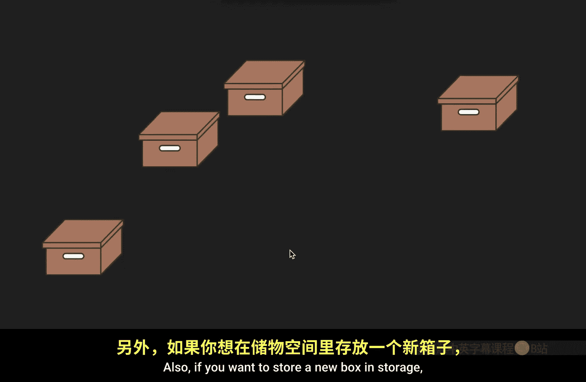
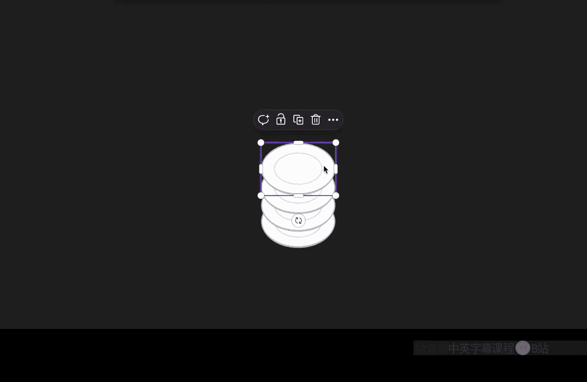
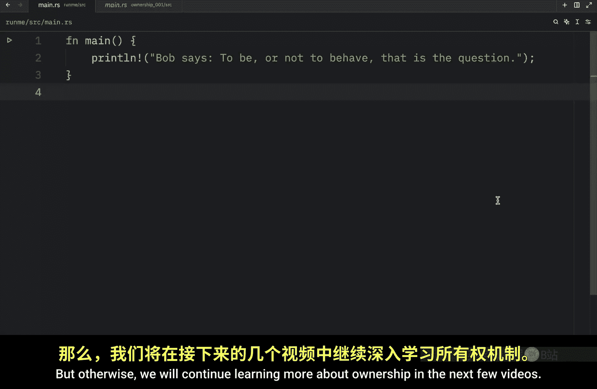

# Rustfully【中英⚡Rust 初学者教程（2025）｜Rust for beginners (2025)】 p24 P24 Rust所有权入门 -BV1eyAkzPEhj_p24-

It's time we talk about our first important rust concept ownership ownershipship is a set of rules that govern how a rust program manages memory and what you need to know is that rust is special because there are languages that use garbage collection and that's a system that looks for no longer used memory as the program runs then there are other languages where the programmer must explicitly allocate and free memory。

 but Ru uses its own approach memory is manage through a system of ownership which has its very own set of rules that we must follow what the program won't compile and I just want to put a little disclaimer that this lesson is going to be very textheavy so I'm going to speak a lot but I promise that in the next few lessons we will go through some more concrete example so you can really get a good understanding on how ownership works in rust but before we do any of that we must cover what the stack is and what the heap is when it comes to memory management in programming。

In a lot of high-level programming languages like Python， we never really have to think about this。

 but in rust， this is quite important because it can change how the language behaves。

 Now both the stack and the heap are part of memory available to your code to use at runtime。

 but they are structured in different ways。 The stack stores values in the order it gets them from and removes them in the opposite order。

 this is referred to as last in first out So imagine you stacking plates。

 When you add a plate to the stack plates get pushed down and when you retrieve a plate。

 you take it directly from the top which is far easier than trying to take a plate from the middle or even from the bottom all the data stored on the stack must have a known fixed size data with an unknown size at compile time or a size that might change must be stored on the heap instead but moving on to the heap the heap is less organized than the stack when you put data on the heap you request a certain amount of。

And then the memory allocator finds an empty spot in the heap that is big enough for the data you want to store。

 marks it as being in use and then returns a pointer to it。

 which is just the address of the location in memory being used the process of storing data on the heap is known as allocating on the heap because your computer searches for a spot to place your data in memory and then tells you where it is so that you can find it later and just to put that into context imagine you have a storage space and you have some boxes that you want to store that。

 you might label those boxes and place it inside that storage space and they can be randomly placed and each box can vary in size you don't really know what you put inside them you just know that they're being stored in storage every time you go to storage and you need to look for a certain box it takes time to find it even if there's a label you have to search for that box before you can pick it up and remove it from storage Also if you want to store a new box in storage you're going to have to find a place for it。

The stack is faster than the heap because it never has to search for a place to store that data The location's always going to be known and that's going to be at the top of the stack So why is all of this important while keeping track of what parts of code are using what data on the heap minimizing the amount of duplicate data on the he and cleaning up unused data on the heap so you don't run out of space our all problems that ownership addresses and once we understand ownership we won't have to think about the stack and the heap that often it just takes a bit of getting used to knowing that the main purpose of ownership is to manage heap data can help us understand what it works the way it does and I do want to mention that a lot of this explanation was borrowed directly from the rust documentation so in case you're curious about what that looks like I'm going to leave a link to it in the description box down below but otherwise we will continue learning more about ownership in the next few videos。

