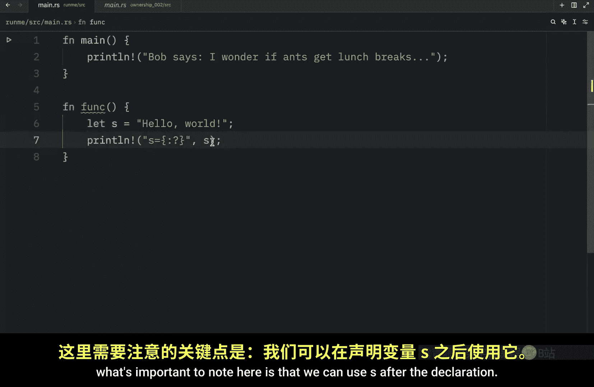
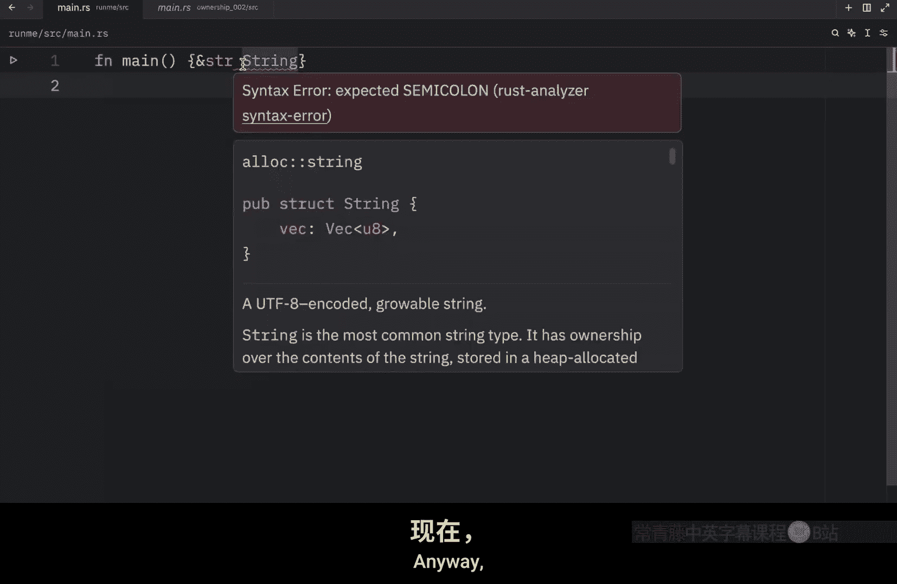
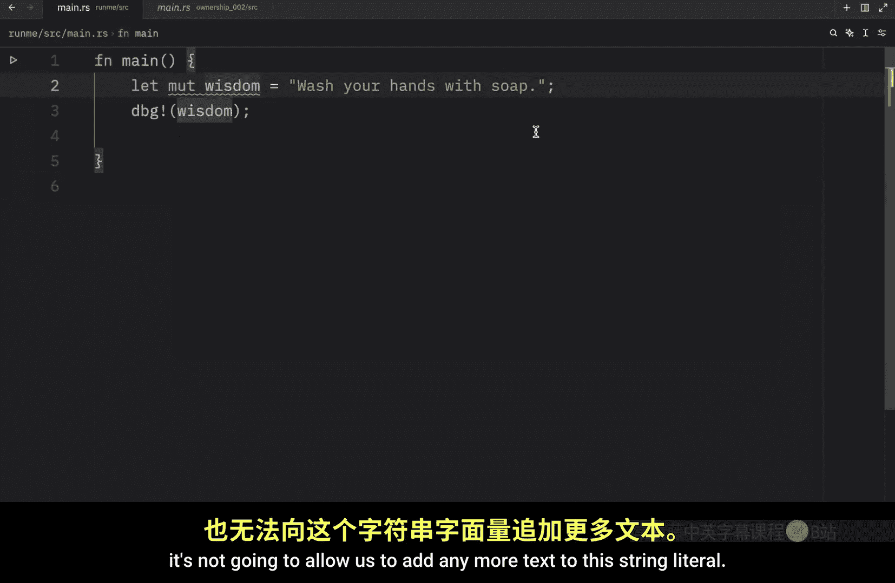

# Rustfully【中英⚡Rust 初学者教程（2025）｜Rust for beginners (2025)】 p25 P25 Rust中的String和&str -BV1eyAkzPEhj_p25-

In this video， we will continue learning the concept of ownership in rust。 First of all。

 there are some rules that we should keep in mind when working with ownership。 number one。

 each value in rust has an owner。 N two， there can only be one owner at a time。 N three。

 when the owner goes out of scope， the value will be dropped。

 The first thing we're going to cover is variable scope。

 and a scope is a range within a program for which an item is valid。 For example。

 when we create a function， which I'll just call function in this example。

 we're creating a scope that belongs to that function。

 everything inside these curly brackets are considered the scope of our function。

 and now that we are inside the function we can create a variable such as S and we can assign at the value of hello world。

 and after that we can print line， or I'm going to use my debug statement。

And pass in S And what's important to note T is that we can use as after the declaration。

 we cannot use as before it， so if we were to type in print line and pass in S。

 Ru would have no idea what we are referring to because we did not create that variable yet and S is valid until the end of the scope。

 which means once we leave the scope of this function， we can no longer use S。

 even if we were to place this function above main。

You'll notice that inside our main function， we cannot refer to s it does not know it exists。

 Rust will tell us that it cannot find this value in this scope Moving on you might have noticed in my previous videos that I was calling both the string slice and the string type a string and since we're just at the beginning of our rust journey that wasn't really a problem but now that we're jumping into the core concepts it's important to bring up that string slice and string are completely different in terms of how they work and we will cover both of those in the near future anyway。

 let's talk a bit about the string type and the parts of it that relate to ownership these aspects will also apply to other complex data types so it's not entirely string specific so far we've seen that we can create string literals with the following syntax lets wisdom equal wash your hands with soap this is a string literal and we can display that information using。

So we'll just debug the wisdom and run our program in quiet mode。

 what we should get as an output is that our wisdom is equal to wash your hands with soap。

 Now a string literal is immutable， which means we cannot edit this even if we add the mutable keyword it's not going to allow us to add any more text to this string literal For example if we were to type in wisdom plus equals clean hands are happy hands this will not work because you cannot modify a string literal and string literals are quite convenient and easy to use but they aren't suitable for every situation。

 for example， as I mentioned， the string we created here is immutable and cannot be changed。

 but what if we want to edit our string Well， in that case。

 rust has a second string type that allows us to modify it and since this type manages data located on the heap it is able to store an amount of text that is unknown to us at compile time to create this string we're going to have to type in letsmable S equal。

Strink。

from。Hello， and if you hover over S， you'll see that this is going to be of the string type。

 It's no longer of the string slice type， and this is a type that we can modify because it's stored on the heap Also these two colons here are known as the path separator and it allows us to access associated functions of a type or items in a module in this example we're calling the associated function from defined on the string type。

 but we will learn more about that in a future lesson for now。

 just know that we're working with a string that can be mutated So next we can try to type an S plus equals comma Bob。

 and if we were to print this value by passing in S you'll see that the next time we run this。

We're going to get that R string is equal to hellello， Bob。

 We were able to modify the original string。 So why were we able to modify our string here and why are literals so stubborn while string is down to earth and open to change。

 The difference lies in how these two types deal with memory。

 And that's what we're going to be covering in the next video。 massivessive gl anger。😊。

