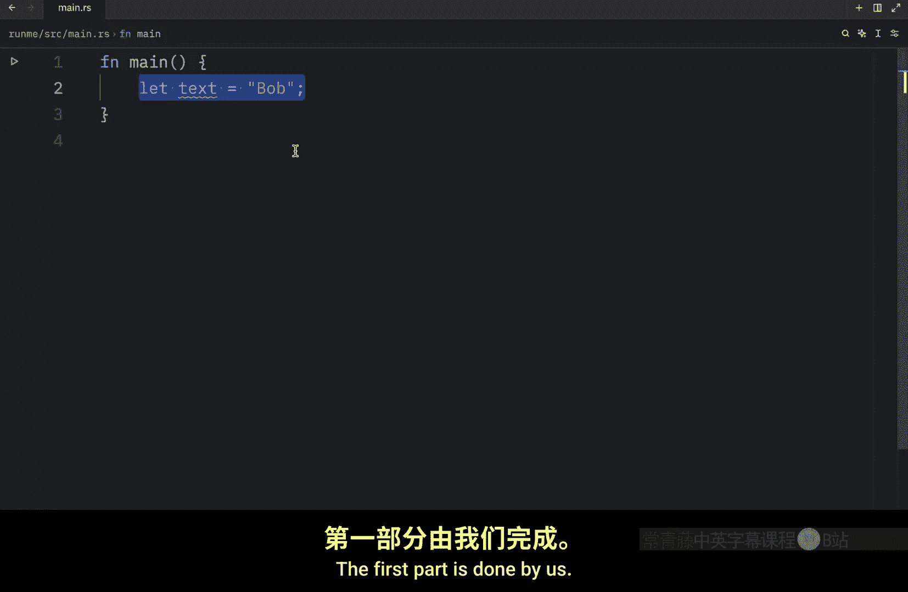
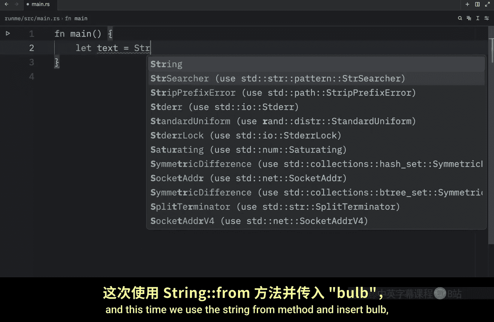
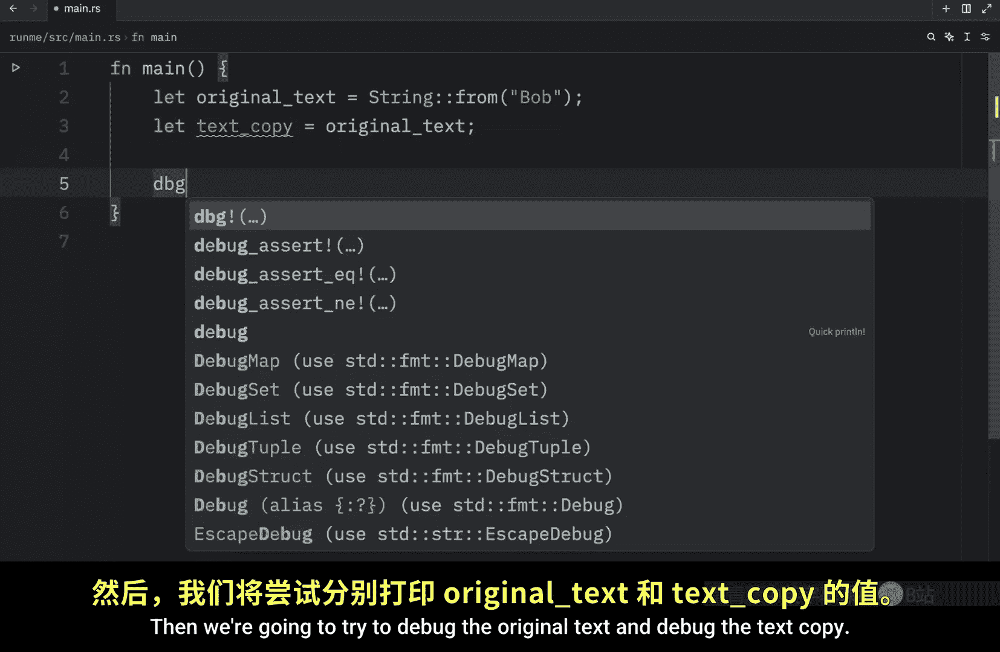
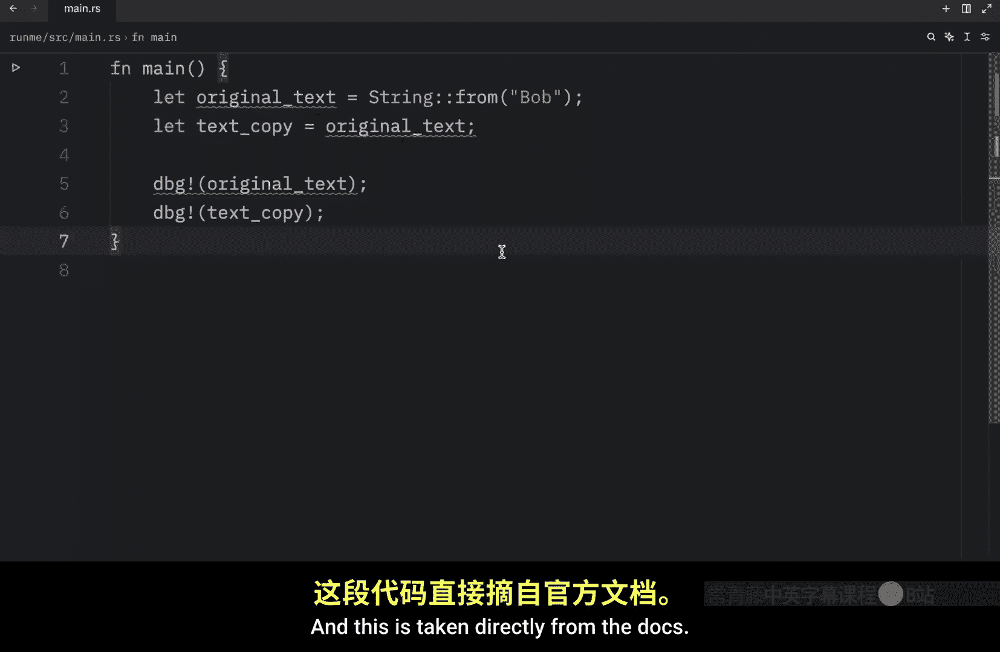
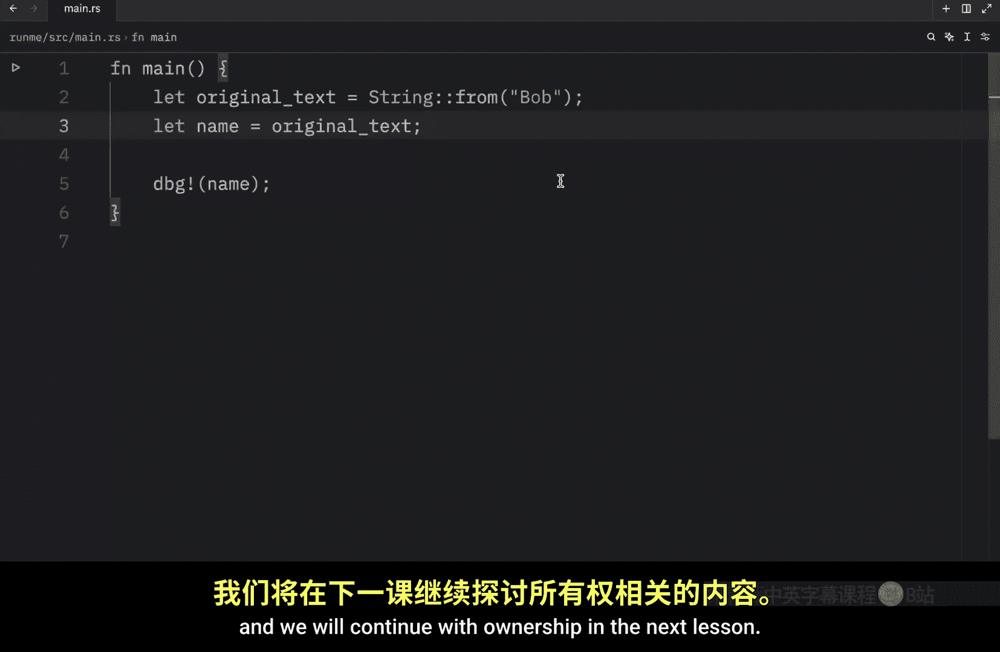

# Rustfully【中英⚡Rust 初学者教程（2025）｜Rust for beginners (2025)】 p26 P26 Rust中的所有权很奇怪 -BV1eyAkzPEhj_p26-

In today's video， we're going to be learning about why strings can be mutated and why string litals cannot and also how these two types deal with memory when you're creating a string literal Rust knows the contents of that string at compile time so the text is hardcoded directly into the final executable。

 This is why string litals are fast and efficient and these properties are a result of the strings literal immutability。

 For example， we might have some text which is equal to Bob Rust knows at compile time that this will be three characters。

 it's not going to change， making it incredibly efficient compared to anything that can change because anything that can change requires more processing。

 Now to create a mutable string we need to allocate an amount of memory on the he which will be unknown at compile time and that means that our computer is going to have to perform two operations number one。

 it's going to have to request the memory。

At runtime using the memory allocator and number two。

 it's going to have to return the memory to the allocator when we're done with that string。

 the first part is done by us。 for example， if we create some text once again and this time we use the string from method and instead Bob here we are requesting the memory that we need and the second part is done by rust as soon as we leave the current scope and here I can just create a simple scope inside so as soon as we leave this scope the memory is returned and this text variable is no longer valid once again if we were to try to use this variable outside of the scope you'll notice that rust cannot find the value text in this scope because this variable was dropped as soon as we left that scope and when a variable goes out of scope。

 rust calls a special function for us this function is called drop and it's where the author of string can put the code to release the memory。

Rust will coal drop automatically at the closing curly bracket。

 and this pattern hugely impacts the way rust code is written as simple as it may seem。

 the behavior of code can be unexpected in more complicated situations when we have multiple variables use the data。

 we've allocated on the heap。 So let's explore some of these situations。

 So here I'm going to create a variable called a which will equal1 then I'll create a variable called B。

 which will equal a and this is going to make a copy of the value and binded to B。

 And since integers are simple values with a known fixed size。

 this can easily be pushed onto the stack with no ugly surprises。

 And that also means that we can debug A and debug B。

 and when we open up our console and run the code， we will get the expected output。

 But now let's take a look at an example that uses string So here I'm going to type in let original text equal string from Bob then I'm going to create a。

Wwhichch is called text copy and that's going to equal the original text。

 Then we're going to try to debug the original text and debug the text copy。

 so that was pretty simple， except it wasn't。 if we try to run this you'll notice that we will get an error and that's because in this context it did not manage to make a copy。

 and this is taken directly from the docs。 a string is made up of three parts。

 a pointer to the memory that holds the contents of the string。 a length and a capacity。

 and this group of data is stored on the stack。 The length is how much memory in bys the contents of the string are currently using The capacity is the total amount of memory in bytes that the string has received from the allocator the difference between length and capacity matters but not in this context。

 So for now it's fine to ignore the capacity。 and I promise we will dive deeper into what all that means later but for now what you need to know is that when we are creating this copy。

We're not copying the actual data we are copying the string data， which once again is the pointer。

 the length and the capacity， not the actual data on the he that the pointer refers to and earlier we covered that when a variable goes out of scope Rut automatically calls the drop function and cleans up the heap memory for that variable if both original text and text copy where to point to the same location in memory we'd have a huge problem here when we reach the end of the scope because Rust would try to free both of them from memory and since they are both pointing to the same location and memory you could end up with what is known as a doublefr error and as good as that sounds it's not a good thing freeing memory twice can lead to memory corruption which can potentially lead to security vulnerabilities so to ensure memory safety Ru automatically invalidates the previous variable when a new variable copies its data so a more appropriate name for the second variable here would be literally anything。

Doesn't suggest it's a copy。 for example， here we can change text copy to name and then what we're going to do is debug name and that's it because this original text over here is no longer valid。

 we can refer to that。 And if we were to clear the console and run our script you'll see that we'll get our name as an output and what we did here is known as a move in rust because we're moving the data from one variable to another and invalidating the first variable and it's also good to know that by default rust will never create deep copies of your data。

 deep copies are practically full independent copies of a variable and this is usually very expensive since they have to copy every single piece of data inside a variable。

 So in general， if you copy anything in rust， you can assume it to be inexpensive in terms of runtime performance because it's not performing a deep copy but yeah I know that was another text heavyav lesson but as always I promise that we'll get very comfortable with this as we progress。

With the Ru language， So that's all I'm going to talk about in today's video。

 and we will continue with ownership in the next lesson。

