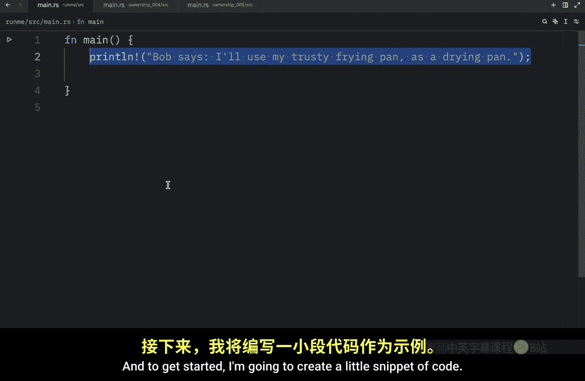
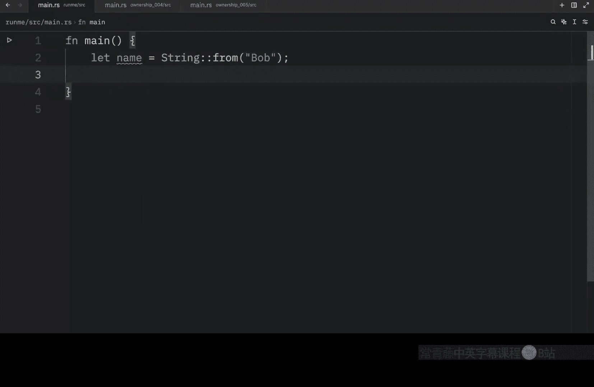
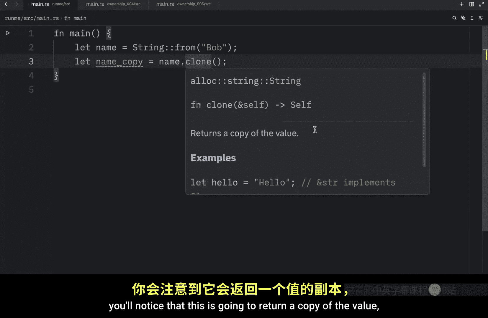
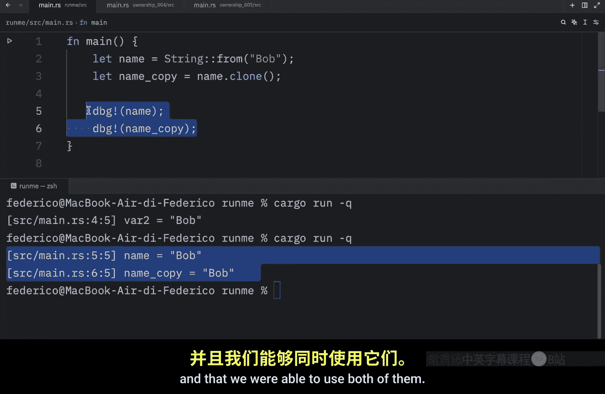
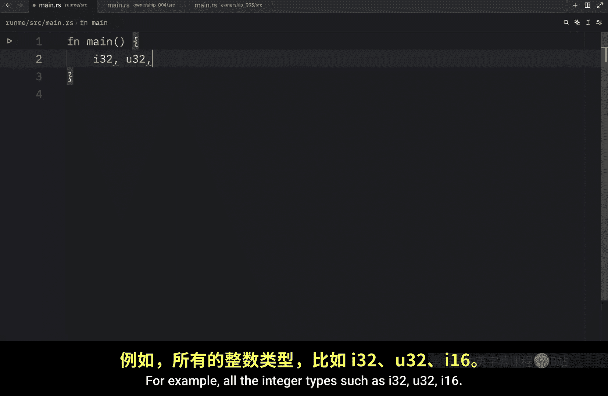
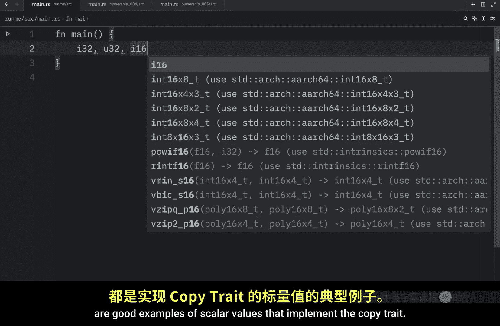
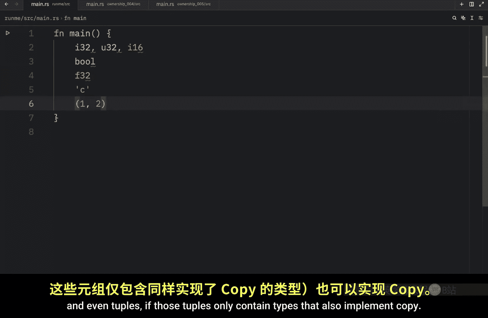
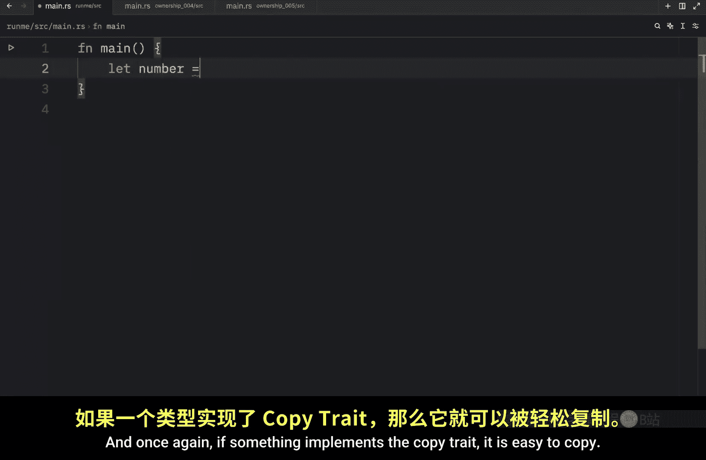
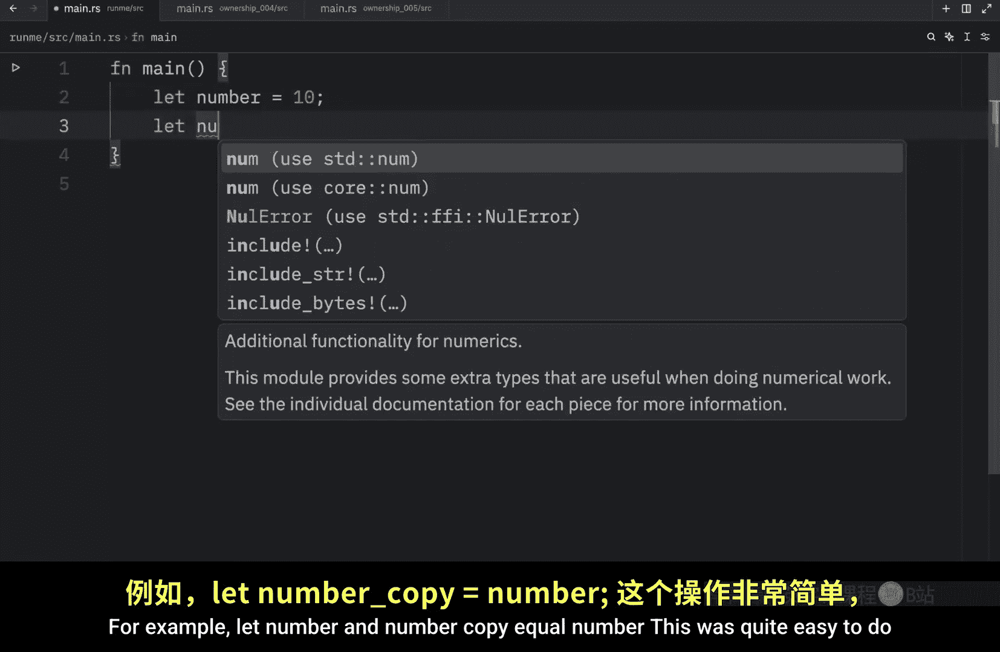
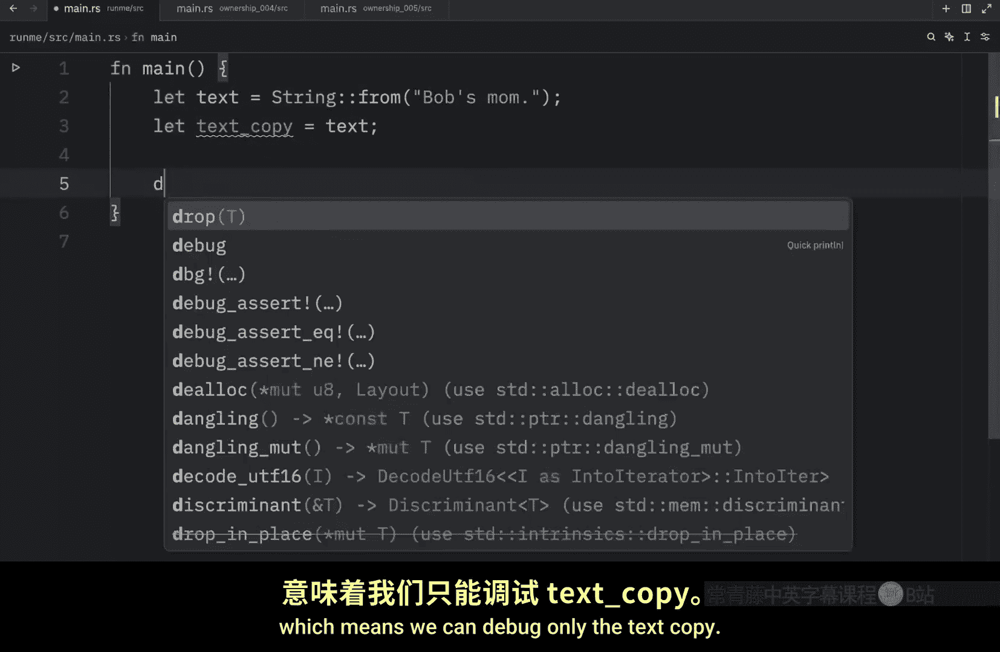

# Rustfully【中英⚡Rust 初学者教程（2025）｜Rust for beginners (2025)】 p27 P27 Rust中的克隆很酷 -BV1eyAkzPEhj_p27-

Continuing with ownership， there's still some very useful information we need to cover to get a better understanding on how the rust language works and to get started。

 I'm going to create a little snippet of code。 and here we're going to write let mutable variable equal string from Bob and immediately under it。

 we're going to type in variable equals string from bin and next we're going to print hello variable。

 Now when we open up the terminal and type in cargo run in quiet mode what we're going to end up with is hello Ben。

 we're also going to get that warning that we never really used the original variable as you can see value assigned of R is never red and that's a good warning to have because in theory this is quite useless on its own but I'm kind of digressing what I wanted to talk about here is that we initially declared this variable to contain the value of Bob。

 but immediately under that， we changed that to Ben And since nothing is referring to the original string of Bob It immediately goes out of scope。

ing graph to run drop and release it from memory immediately。

 And that's good to know since it would be a huge pain to have to manually keep track of each variable we created。

 even when it's no longer being used Now in the previous lesson I showed you that assigning an existing string to a new variable would not result in a copy for example。

 we might have a v which is equal to string from Bob and then we might have a copy so we can type in v2 equals the original variable。

 Now we were to try to refer to the original one we would end up with an error and that's because it moved the data to v 2 So this variable here is no longer valid and is released from memory if we want to see that information。

 we need to refer to variable2 which now contains the information a variable 1。

 So if we were to run that what we should end up with is that variable 2 contains Bob。

 But now let's take a look at how we'd make a copy if that's what we intended to do。

So what I'm going to do is remove this and rename this to something more meaningful。

 such as name Then we can let the name copy equal our original name do clone and hovering over this method you'll notice that this is going to return a copy of the value which also means that we can use both of these values independently so here we're going to debug the name and the name copy and in the terminal we can now run this and you'll notice that we will get the value back for both of them and that we were able to use both of them and that's because this time we manage to copy that he data。

 although you have to be careful with this because it can be an expensive operation depending on the size of the data that you are copying and you might be asking what about that code we wrote earlier that copied integers。

Here we had n1 equal to 100 and N2， which was equal to N1。

 Why did this work fine And here we can use both of them using the debug macro。

 and I didn't show you this earlier， but you can pass in multiple arguments here you can put n1 and N2 and it's going to debug both of those separately which is really cool As you can see it saved us one line of code。

 but we still got the same result but why does this work why isn't n1 released from memory as soon as we move the data onto N2。

 The reason is that types that have a known size at compile time such as integers are stored entirely on the stack So copies of the actual values are quick to make and don't require any further processing like when we use clone with the string type Also taken directly from the docs rust has a special annotation called the copy trait and we can place this on types that are stored on the stack as integers are what's important to know is that if。

Type implements the copy trait variables that are using it do not move， but are trivially copied。

 which makes them still valid after assignment to another variable， just like in this example。

 N1 was not moved to n2 it was trivially copied and we'll learn more about the copy trait in a future lesson but for now we will cover what types can actually implement the copy trait as a general rule。

 any of the simple scalar values can implement copy and nothing that requires allocation or is of some form of resource can implement copy for example。

 all the integer types such as I32 U32 I16 all of these integer types are good examples of scalar values that implement the copy trait。

 otherwise also the boolean type and floating point types and the character type and even tuples if those tuples only contain types that also implement copy for example。

I 32 and I 32 while I 32 and string would not work because string does not implement that copy trait。

 and once again， if something implements the copy trait， it is easy to copy， for example。

 let number and number copy， equal number。

This was quite easy to do because the integer implements the copy trait and that means that we can use both of these variables without having to worry about moves。

 so if we were to clear the console， run the code， you'll see that we'll get both of our variables displaying their data in the console but if we were to create a string from Bob's small and we were to copy that by typing in let text copy equal text since text does not implement the copy trait。

 this is going to move the data onto the text copy which means we can debug only the text copy and that will work fine。

But as soon as we try to debug or use text， that's not going to work anymore because it does not exist anymore。

 it was released from memory， but that's really all I wanted to cover in today's video in the next video we will continue with the final video on ownership。

