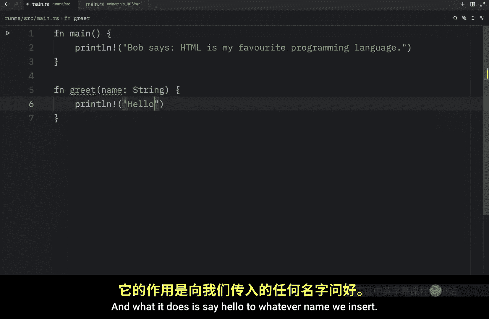
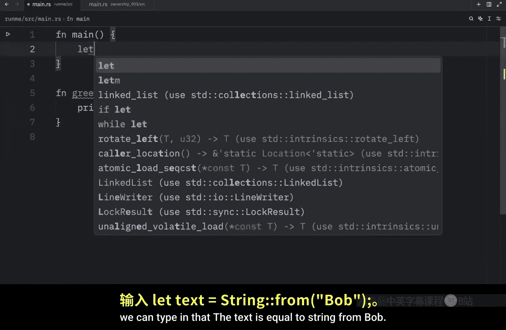
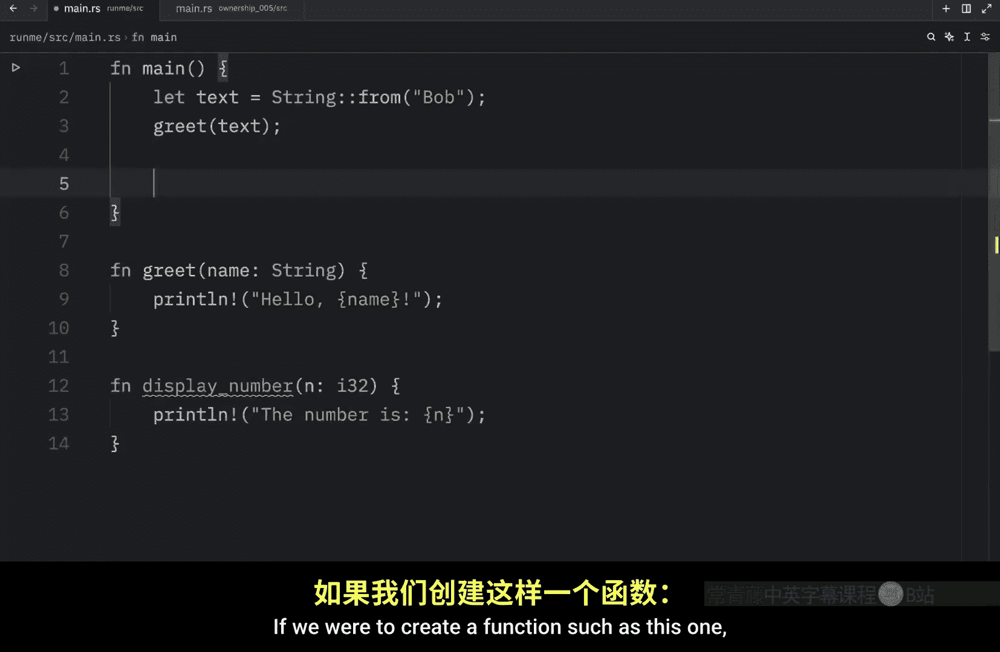
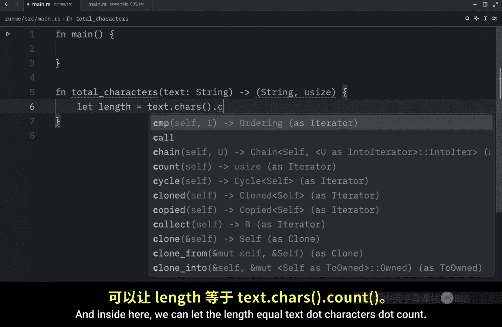
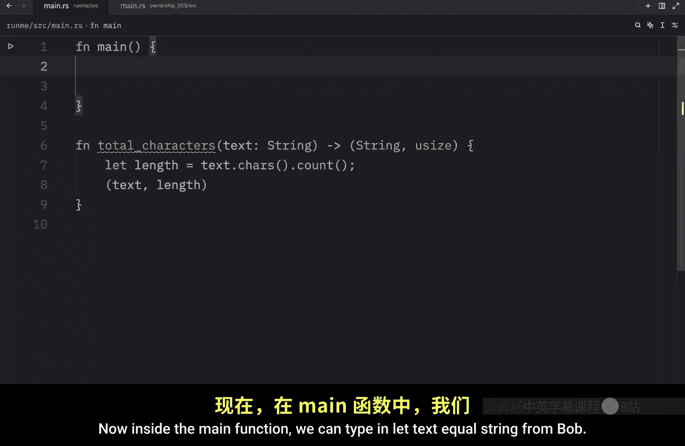
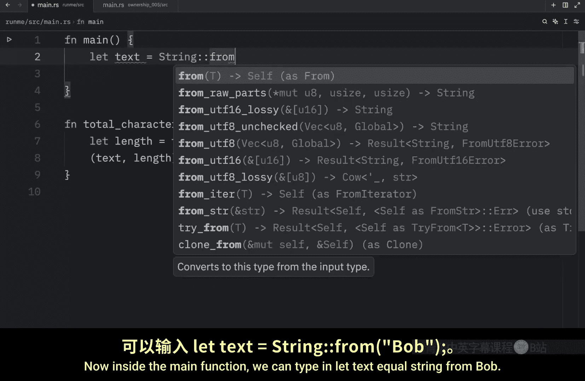
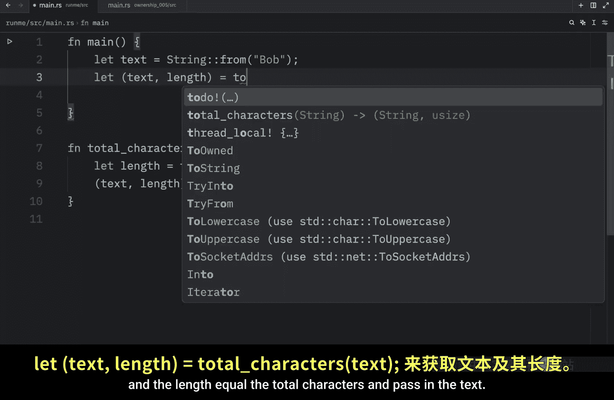

# Rustfully【中英⚡Rust 初学者教程（2025）｜Rust for beginners (2025)】 p28 P28 Rust中的所有权很酷 -BV1eyAkzPEhj_p28-

In today's video， we will talk about ownership and functions。 Now。

 the mechanics of passing a value to a function are quite similar to those when assigning a value to a variable。

 And what I mean by that is that passing a variable to a function will either move it or copy it。

 just like with assignment。 For example， we might have a function called greet。

 which takes a name of type string and what it does is say hello to whatever name we insert Now up here。

 we can create that variable， we can type in that the text is equal to string from Bob。

 and then we can greet this variable。 Now， if we were to open up the terminal and we were to run this。

 you would notice that we would get hello Bob back。

 One thing you might find quite unexpected is that this function takes ownership and the value of text is moved onto the function text is no longer valid after this function。

 How crazy is that even if we were to try to print it。

For example we can say the text is equal to the text。

 You'll notice that rust will not allow us to do this and if you hover over text。

 we're going to learn that text was moved and this is why ownership is very important to understand because as a regular developer you'd think okay I created some text I used it in a function。

 I should be able to still use it later when the reality is some data types are going to behave differently because of ownership Now if we were to create a different function called display number which takes n of type I32 and all it does is display the number with the text the number is N。

 if we were to create a function such as this one。

Create a variable called n with the value of 200 and use this function and insert n。

 It would run just fine。 And once again， since this implements the copy trait。

 we can still use n afterwards。 so we can say second attempt。

That using n and pass in n and the code would compile and allow us to do that。

 But let's move on to the next example because I also want to show you that return values can also transfer ownership。

 So for this example， we need to create a function called create string。

 That's going to return to us a string。 And all we're going to do inside here is return string from Bob。

 Now in our main function we can let S1 equal create string and we can let S 2 also equal create string。

 Now we can use Dbug to display that information。 and you'll notice。

That both of these contain the value of bo。 So this is a function that moves its return onto a different variable。

 Also， I did not mention this earlier， but debug is a macro that takes ownership。

 which means as soon as we use debug on types that do not implement the copy trade。

 we can no longer use them afterwards。 For example， if we want it to print S1。

 this would no longer work because debug took ownership and released both of these from memory afterwards。

 So I'm going to remove both of these because I want to show you how we can create a function that both takes ownership and returns it so that we can continue working with the variable afterwards。

 and this function is going to be called process string So it's going to process a string in some way and we can actually call it process text to make it more user friendlyly and this should also return a string Now outside here we're going to type in text to upper case。

 and I need to stop adding the semicolon because it is a return。

All we're doing here is upper casing whatever string we insert and returning ownership back to the variable that we're using。

 So here， for example， we can type in let S3 equal process text and we want to process text from S1 next we can debug and pass in S3 and what you should notice is that when we run this we're going to get bob uppercase。

 even though unfortunately this destroyed S1 in the process or released S1 from memory。

 what's important to know is that the ownership of a variable will follow the same pattern every time assigning a value to another variable moves it for example。

 assigning S1 to S2 moves S1 otherwise using S1 in process text moves S1 to process text and when a variable that includes data on the heap goes out of scope the value will be cleaned up by drop unless ownership of the data has been moved to another variable。

In this case， when S1 is being passed into process text， we are using it inside the function。

 If we did not return this text， it would be dropped because next we would encounter the closing curly bracket which tells string to call drop But since we return this text we were able to save that information and continue using it。

 But what if we want to let a function use a value without taking ownership。

 It's so damn annoying that we always need to think about how to pass something back after we pass something in and even worse what if we want to return different information regarding the variable that we are using Well。

 one option is to return multiple values using a tuple。

 So let's remove all of this and create that example and we're going to call this function total characters which takes some text of type string and returns to us a tuupple of string and u size the string is going to be the original string we used and the use size is going to be the length of that string and inside here。

 we can let。

leength equalal text do characters do count and that will return to us the total amount of characters of the text as I mentioned earlier。

 using length is going to return the length of the text in bytes and that's not the same thing because a special character for example might contain two bytes for example or contains two bytes while a contains one byte so this would return a length of three if we use this length method but we want that to return two so we're going to use characters do count then we're going to return the original text and the length now inside the main function we can type in let text equal string from bar and we can also let the text and the length equal the total characters and pass in the text now we can use both the text and the length as regular variables so print line just kiddding of course it should be printline。

The text has a total length of。Length， and with that， we can clear the console， run our script。

 and it will say that Bob has a total length of three。 We can also change this to Apple。

 and that will count the total characters of Apple， which contains five characters。

 And just like that， we managed to transfer ownership back and forth from a function so that we could continue using the information。

 But still， this was far too much work for what we wanted to do。Luckily。

 Rust has a feature that allows us to use a value without transferring ownership。

 And this feature is called a reference。😊。

