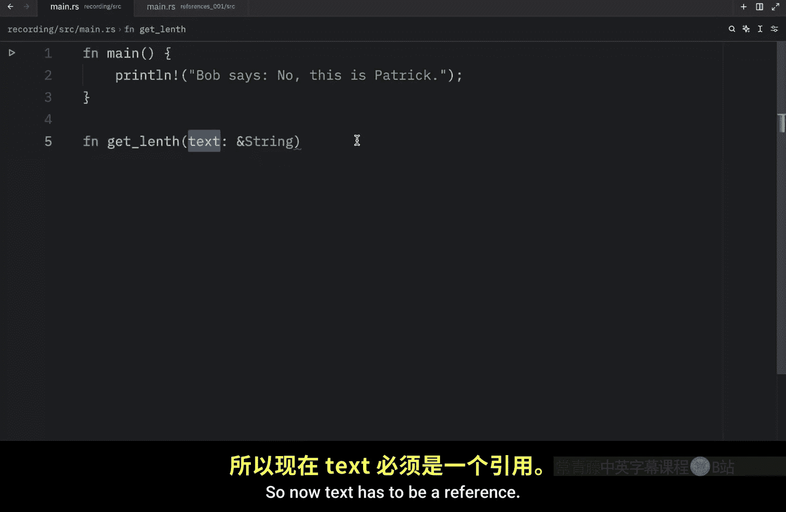
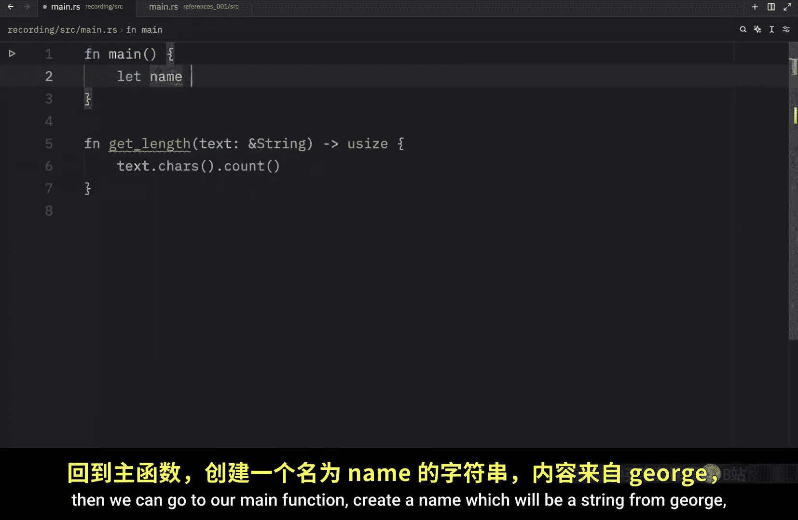
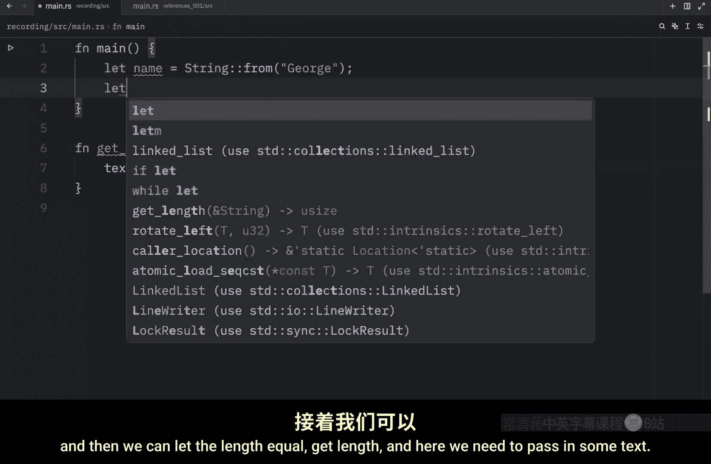
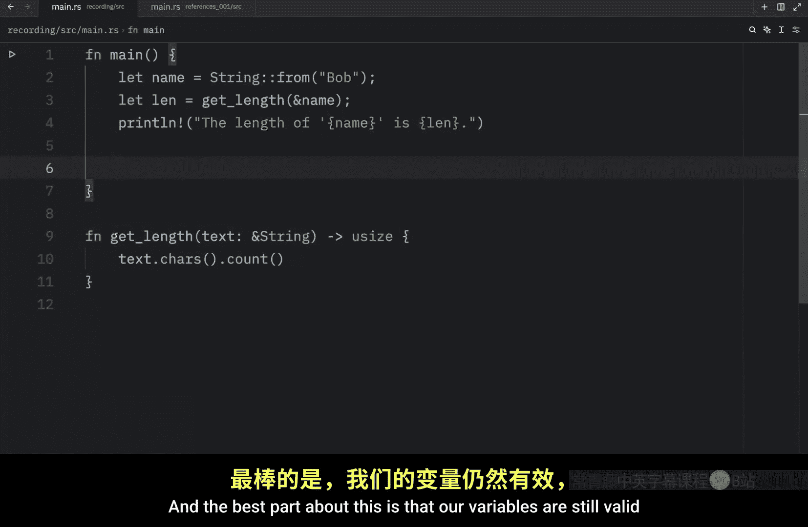
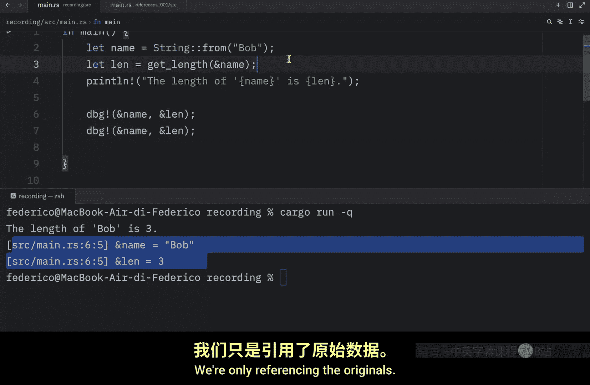
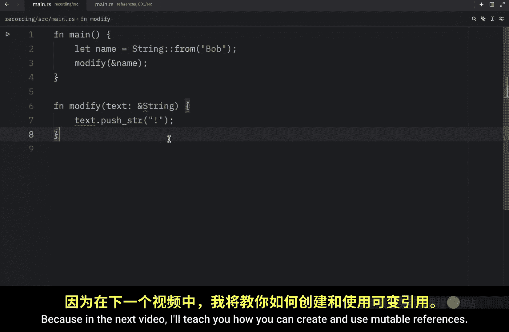

# Rustfully【中英⚡Rust 初学者教程（2025）｜Rust for beginners (2025)】 p29 P29 Rust中的引用是什么？ -BV1eyAkzPEhj_p29-

Previously we learned about ownership and the last thing we covered was how we could return a tuple to maintain ownership so that we could still use our variable Now there's nothing wrong with returning a tuple。

 but in our case it was unnecessarily convoluted for what we were trying to do a better approach would have been to provide a reference to our string value and a reference is like a pointer in that it's an address we can follow to access the data stored at that address which is owned by another variable but unlike a pointer a reference is guaranteed to point to a valid value of a particular type for the lifetime of that reference so this time we're going to create the same function as in the last video except we're going to use a reference which will help us avoid the need to return a tuple so he will type in get length and then as a parameter will create that text and notice here how I'm going to use an ampersand in front of the data type this am。

And is used to represent a reference So now text has to be a reference and this function is going to return u size Now inside here we can type in text。

characters。 count Then we can go to our main function。

Create a name which will be a string from George and then we can let the length equal get length。

 and here we need to pass in some text。 So what we're going to do is use the ampersand once again and pass in our name and here we use an ampersand once again which allows us to refer to a value without taking ownership And since this is a reference。

 the value that it's pointing to will not be dropped after we're done using it。

 So what we're going to do next is print line and passing at the length of。

Name is the length and if we were to run this in quiet mode。

 you'll notice that the length of George is6， and we can also change that to Bob。

 which is a much more comfortable name and that's going to return three to us and the best part about this is that our variables are still valid because we did not take ownership which means we can still use them later。

So here we can pass in the name and the length and this will work just fine as long as I add the semicolon on the print line。

 but when we run this， you'll see that we'll get both name and length printed to the console although after this name was consumed we took ownership here and we used it so it's no longer valid after this debug statement if we were to pass in a reference to each then we would be able to get the value back and continue using these values because we are not taking ownership we're only referencing the originals Also we call the action of creating a reference borrowing just like in real life if you borrow something from someone you can use it but you don't own it and you will eventually have to give it back So what happens if we try to modify a borrowed variable and for our next example I'm going to create a new function called modify which will take some text。

And that will be of this reference type。 And what we want to do inside here is type in text。

 push string and append and exclamation mark to the text。 Now we can go back here and type in modify。

Ampersand name so we're passing in a reference and that satisfies the first part because this is a reference of type string。

 but once again。Rust will not compile that garbage because we're trying to mutate an immutable variable。

 references are immutable by default， but it's not the end of the world because in the next video I'll teach you how you can create and use mutable references。

