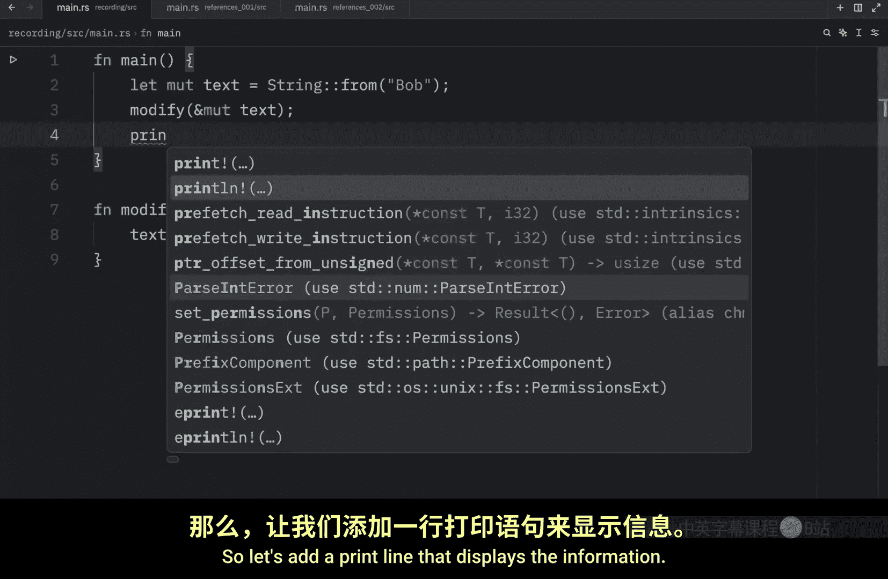
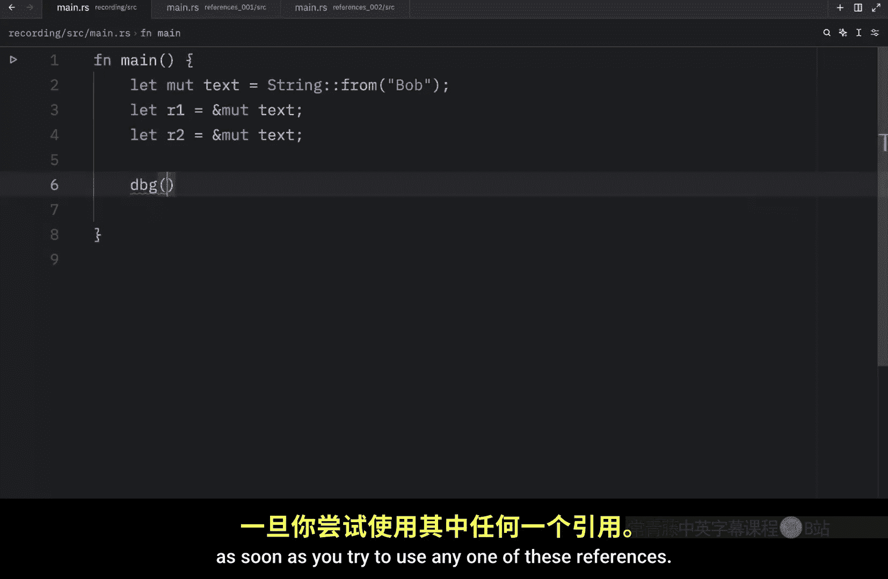
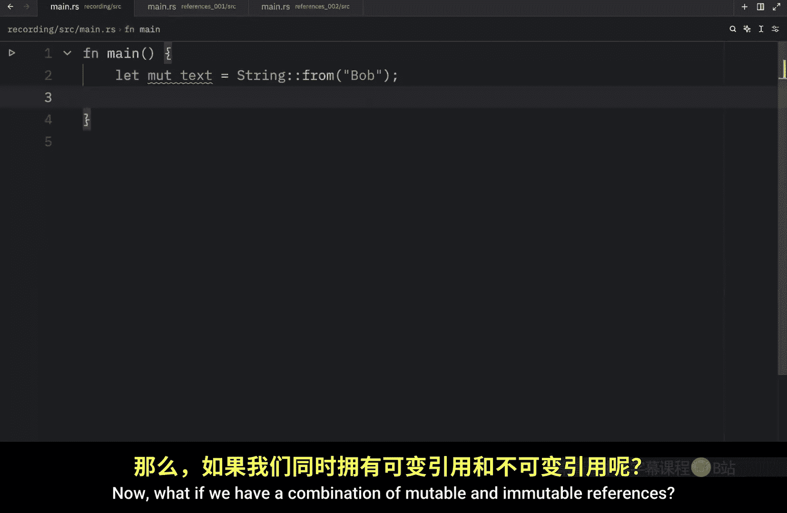
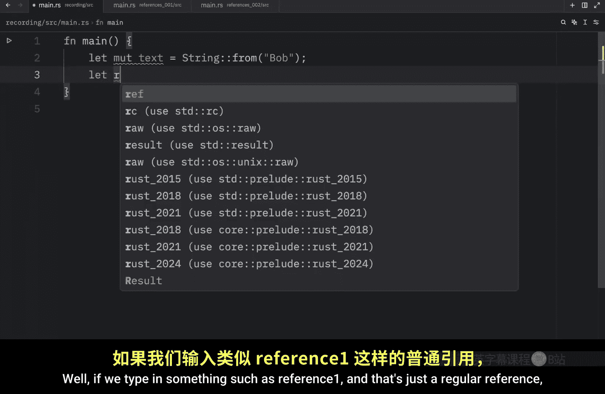
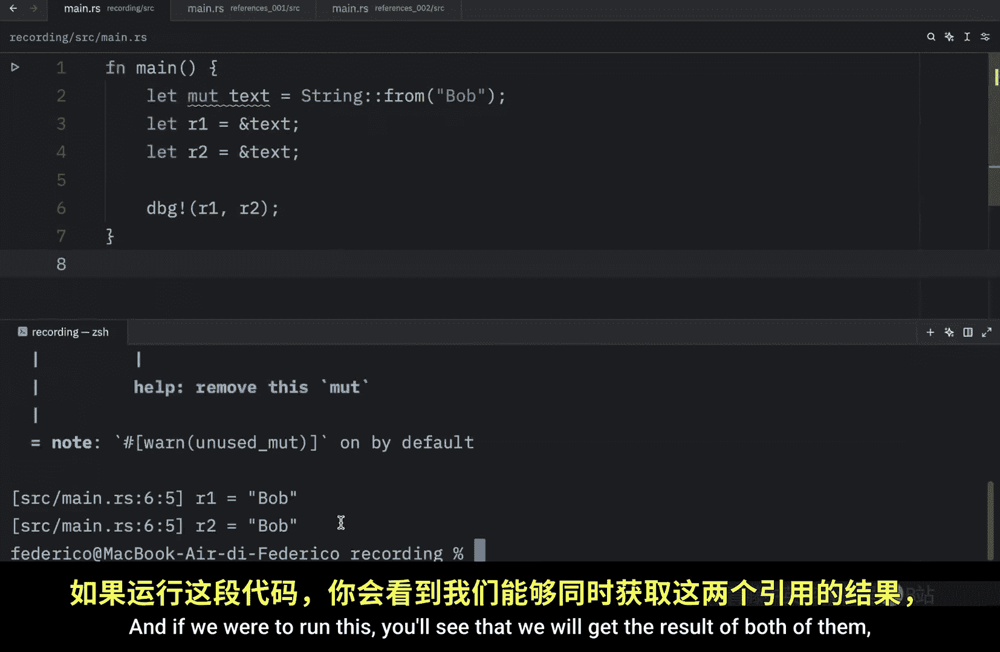
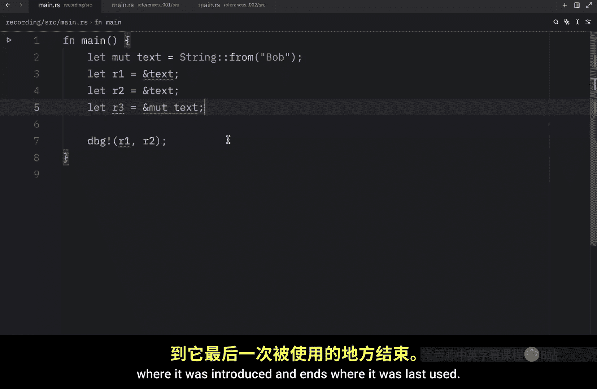
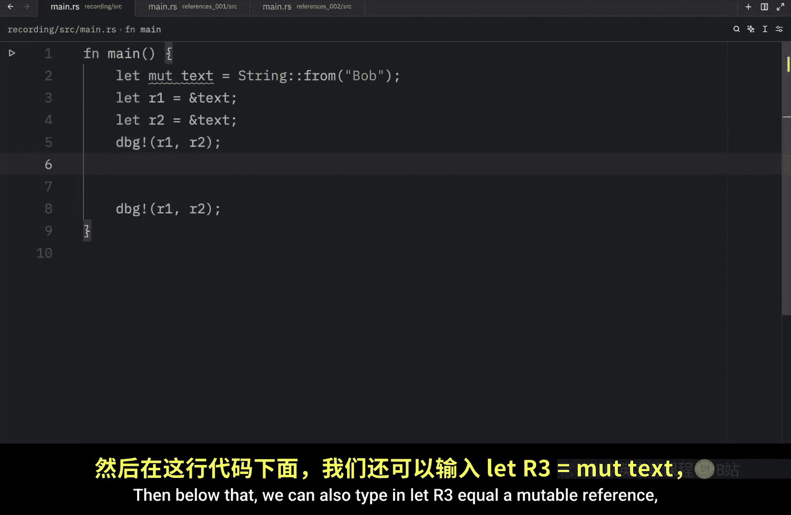
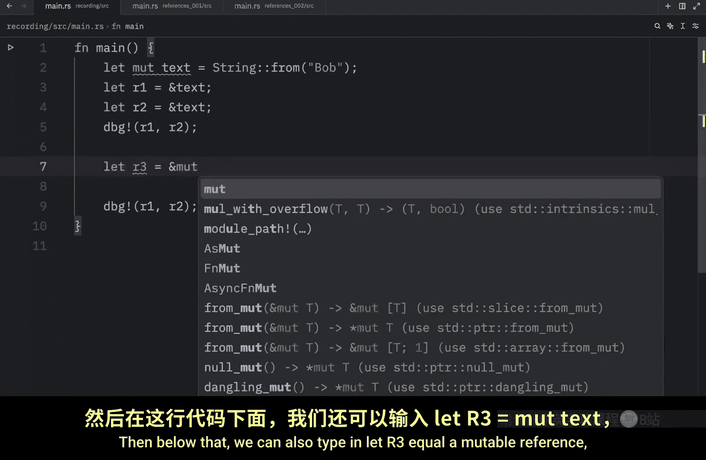
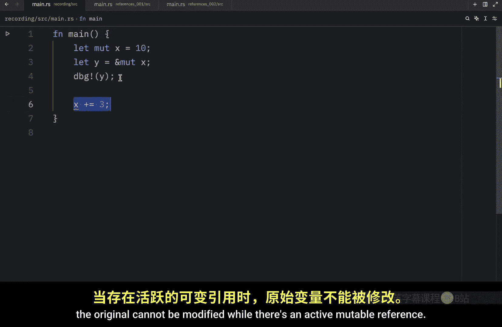

# Rustfully【中英⚡Rust 初学者教程（2025）｜Rust for beginners (2025)】 p30 P30 Rust中的可变引用很酷 -BV1eyAkzPEhj_p30-

In today's video we will learn about mutable references in rust。

 previously we tried to do the following， but unfortunately it didn't work because we learned that references are immutable by default。

 so let's now try to fix this code by introducing a few minute tweaks so to fix our code we need to tell rust that we want our text to be a mutable reference we need to explicitly tell rust that we want to do that and we can do that by including the mute keyword which stands formable and we need to include this anywhere we want to use it as a mutable reference so instead of modify text it's going to be modifying a mutable reference of the text。

And this should be a mutable string。 So everywhere we want our string to be mutable。

 we need to explicitly tell rust that we want to do so。 And this time if we were to run our script。

 we'd get nothing as an output because there's no print statement anywhere。

 So let's add a print line that displays the information and here we can type in that the text is text and this time when we run it we should get that de text is Bob with an exclamation mark。

 So this time we were able to mutate this string without transferring ownership。

 We did all of this through a mutable reference。 mutable references do have one big restriction though。

 if you have a mutable reference to a value， you can have no other mutable references to that value For example。

 we have this text which is a string from Bob and then we want to create a reference。

 we type in let r1 equal mutable reference to the text。

This works perfectly fine Now let's create another mutable reference。

 which will be called R2 which also refers to our text Now this is going to be a problem because we're attempting to borrow text at the same time as r1 and you will notice the error immediately as soon as you try to use any one of these references so using this Dbug macro will type in r1 and r2 because we want to refer to both of them once again as soon as we run this。

 we're going to get an error and this restriction is a good thing because it prevents data races at compile time and a data race is similar to a race condition and happens when these three behaviors occur number one two or more pointers access the same data at the same time number two at least one of the pointers is being used to write to the data number three there is no mechanism being used to synchronize access to the data and the reason we want this to raise an error is because data races can cause undefined be。

That can be incredibly difficult to find and fix when you're trying to track them down at runtime。

 although I do want to mention that different scopes can allow us to use multiple multiple references。

 the restriction makes it so we just can't use them simultaneously。 For example， using this code。

 we could create a new scope。And pass the first reference inside here。

And then we could debug that and pass R1 inside here and on the outside we'll just pass in R2。

 This works fine because we' are using mutable references in different scopes。

 So they are not referring to the same data simultaneously。 Now。

 what if we have a combination of mutable and immutable references。 Well。

 if we type in something such as reference one and that's just a regular reference and we do that with R2。

This will work just fine。 We can debug and pass in both of these R1 and r2。

 We don't have to worry about data eras because both of these are read only and if we were to run this you'll see that we will get the result of both of them or the value of both of them what we cannot do is create a mutable reference at the same time。

 so if we type in r3 and we let that equal。

A mut reference， this will create some problems。If you hover over the error or the syntax highlighting。

 you'll see that we cannot borrow text as mutable because it's also borrowed as immutable。

 So once again， we cannot have mutable references and immutable references at the same time because this will lead to confusing and unexpected behavior later down the line I mean by creating an immutable reference。

 you should be able to rely on the data of that reference So if you were to create an immutable reference at the same time。

 you're throwing that reliability directly out the window and onto poor Bob who was just taking a morning stroll note that the scope of the reference starts from where it was introduced and ends where it was last used So here we have two references and what we're going to do next is debug both of them1 and R2 then below that we can also type in let。

R3 equal a mutable reference， which we will call text and then we can pass in r3 this time the code will compile because the last usage of our immutable references。

 where in this debug statement， which means we can safely move on to creating a mutable reference and there's one last thing I want to mention before I forget once you have a reference which is active。

 you cannot modify the original variable until that reference goes out of scope。 For example。

 you might have mutable x which is equal to 10 and then you might have y which is equal to themutable reference of X now down below。

 you might attempt to change x or modify x by introducing a change such as incrementing x by3。

 what you're going to notice unfortunately， is that this is not going to be a good idea because we have a mutable reference which is active and we cannot modify the original until this goes out of scope。

 So once again to solve this， we're going to have to use。

First we're going to have to make sure that y goes out of scope and one way to do this is to place the debug statement above X。

 you just have to make sure that y goes out of scope before you continue with using X。

 because once again， the original cannot be modified while there is an active mutable reference。

