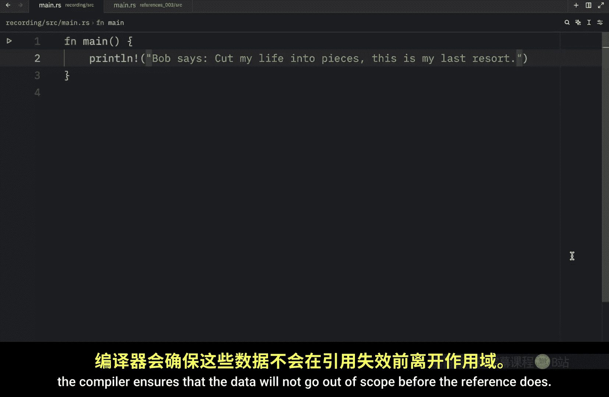
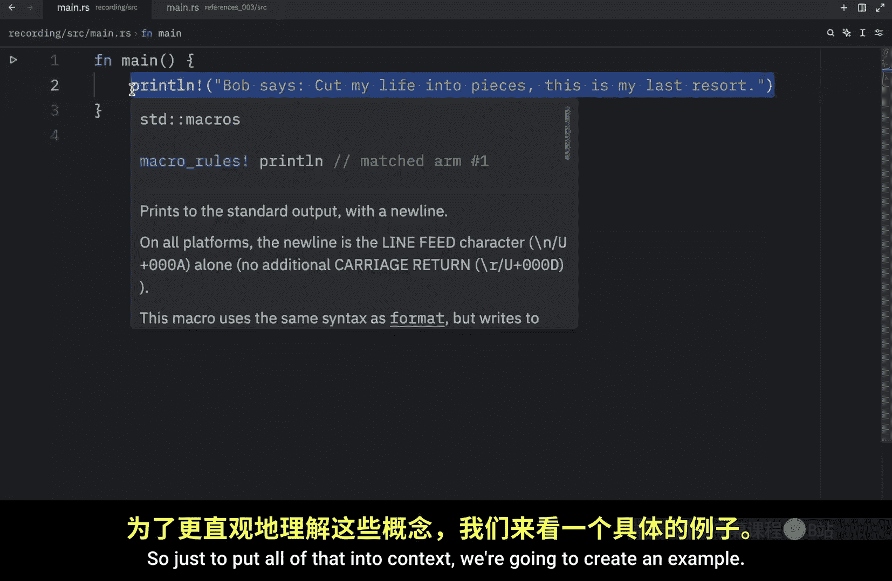
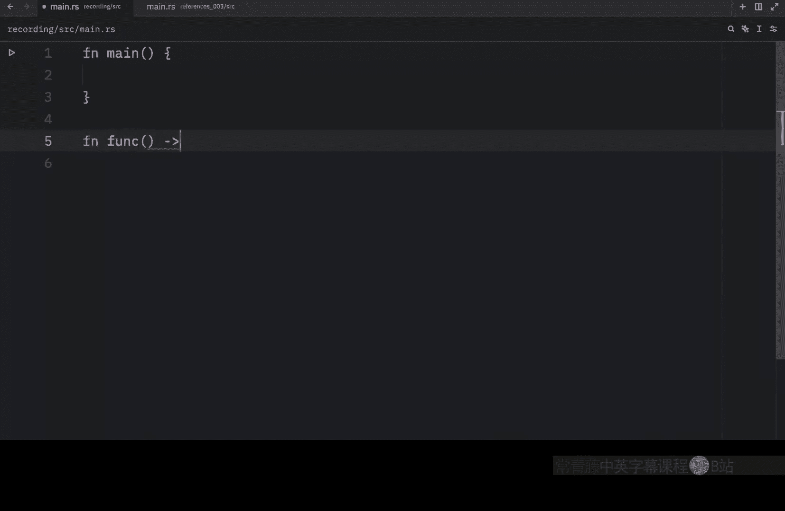
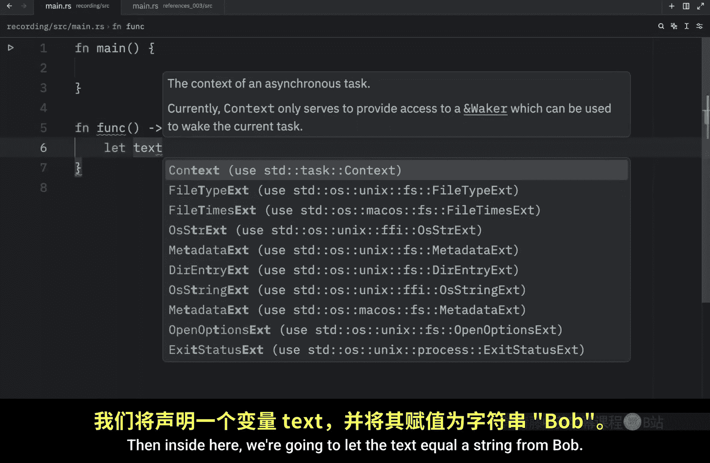
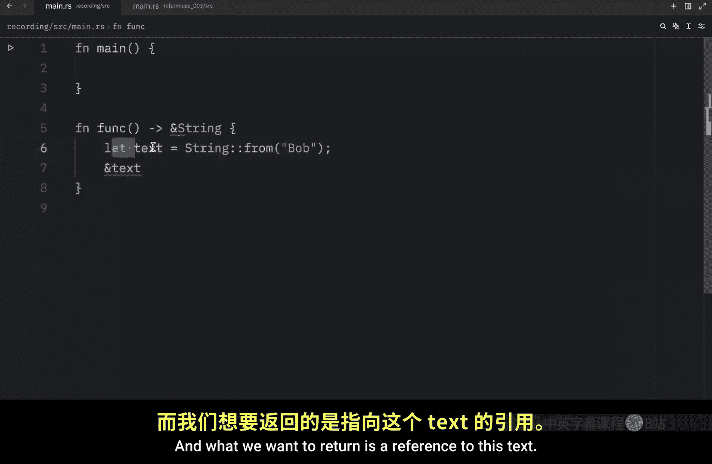

# Rustfully【中英⚡Rust 初学者教程（2025）｜Rust for beginners (2025)】 p31 P31 Rust中的悬垂引用让我反感 -BV1eyAkzPEhj_p31-

Up next we're going to cover dangling references in rust in languages with pointers。

 it's easy to accidentally slash wrongly create a dangling pointer by freeing some memory while preserving a pointer to that memory a dangling pointer is a pointer that references a location in memory that may have already been reallocated or freed。

Luckiily rust's compiler guarantees that references will never be dangling if you have a reference to some data。

 the compiler ensures that the data will not go out of scope before the reference us。

 So just to put all of that into context， we're going to create an example and here we're going to create a function called function which is a creative name and that's going to return to us a reference type Then inside here we're going to let the text equal a string from Bob。

 it would be silly to return any other string or create any other string and what we want to return is a reference to this text Now inside our main function we're going to let this reference equal。

Result of this function。 So what we're doing here is creating a dangling reference。

 or at least we're attempting to do so because rust does not allow us to create dangling references。

 And if we try to run this code or to compile this code。

 it will result in an error because this functions return type contains a borrowed value。

 but there is no value for to borrowed from here we specified that we want to return a reference。

 then right below， we create a new string that we will later try to return。 And finally。

 we try to return that reference right here。 but by the time we reach the closing bracket。

 text goes out of scope and is dropped and its memory is freed。

 but we told Ru that we wanted to return a reference to text。

 and this means that our reference would be pointing to data that no longer exists。

 which is why rust gives us a little slap on the wrist and prevents us from running that garbage。

 We shouldn't be allowed to reference data that no longer exists。

That would create a lot of problems in our code。 So next let's look at the solution to this problem and essentially the solution is just making sure you use references in the right place because here we will not required to use the reference type and doing so ruined our program All we had to do is return a regular string and return the text as normal then our program would be error free and we can verify that by running the program in the terminal and what we should get as an output is that R is equal to Bob and just to recap what we discussed about references at any given time you can have either one mutable reference or any number of immutable references and references must always be valid。

