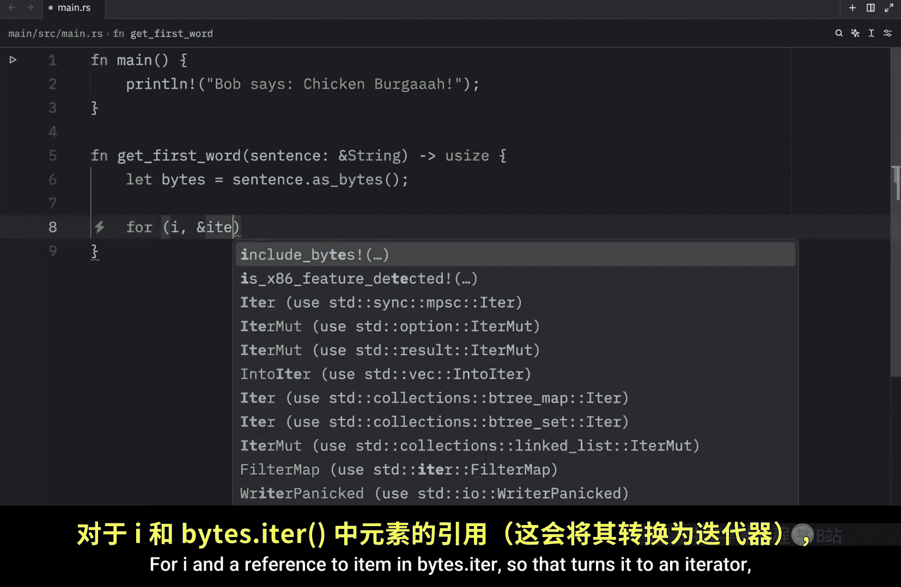
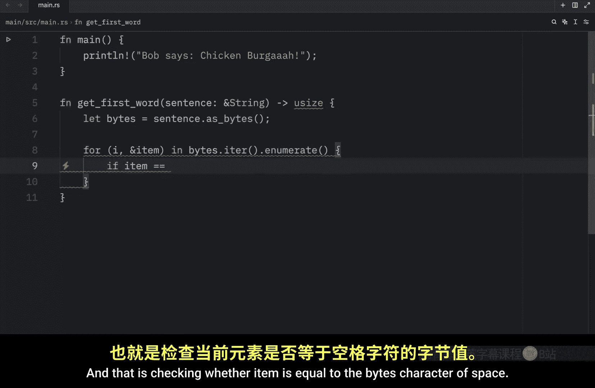
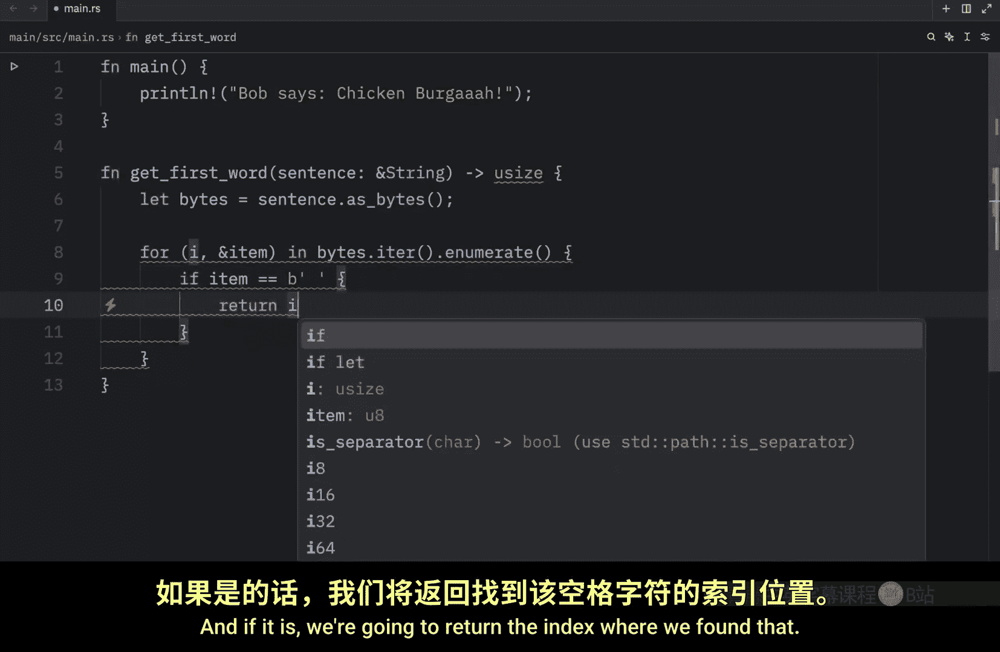
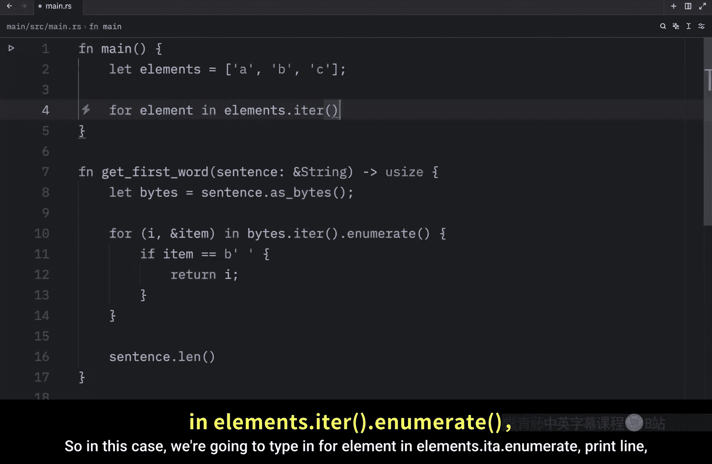
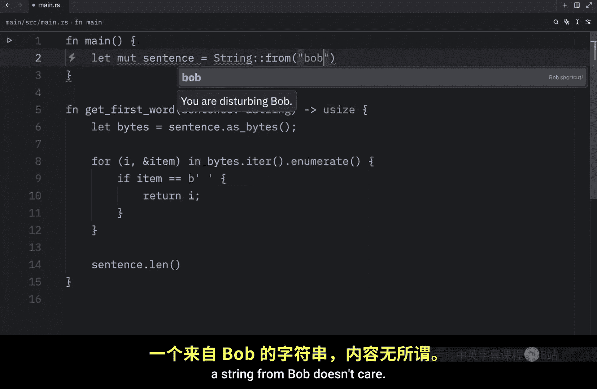
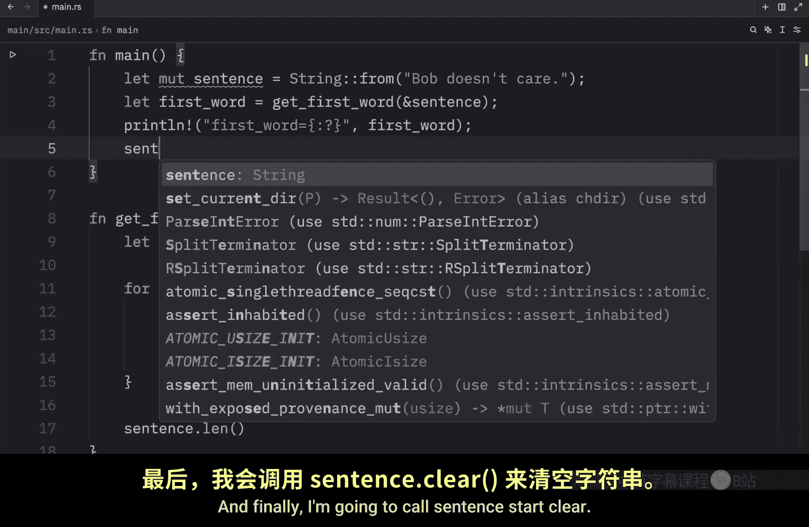
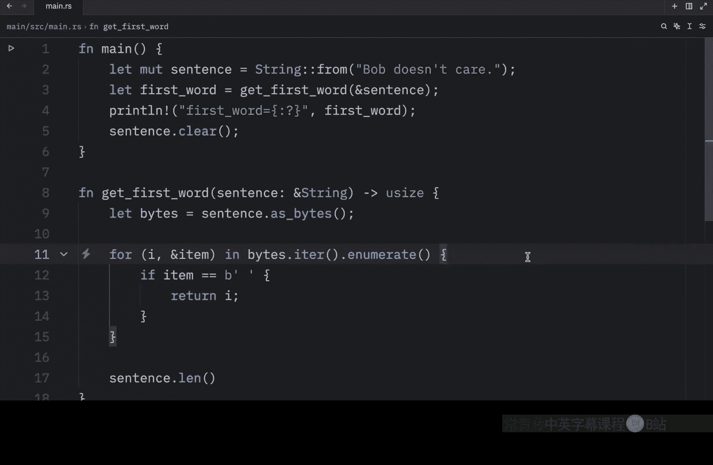

# Rustfully【中英⚡Rust 初学者教程（2025）｜Rust for beginners (2025)】 p32 P32 准备学习Rust中的字符串切片 -BV1eyAkzPEhj_p32-

In today's video， we're going to start learning about the slice type in more detail in rust。

 Slics let you reference a contiguous sequence of elements in a collection rather than the whole collection。

 a slice is a kind of reference So it does not have ownership and that was taken directly from the rust docs。

 but to get started with learning about slices we're going to be looking at a problem in the official rust book and the problem starts with us creating a function that takes a string of words separated by spaces and then it's going to return the first word that is found in that string。

 Otherwise we're going to return the entire string since it must be one word So first of all。

 we're going to create a function which is going to be called get first word and in here we're going to provide a sentence。

Wwhich will be of type string and we're passing a reference since we do not require ownership here and finally what we want to return is an unsigned integer。

 This integer is going to be the index of the space that separates the last character of the first word from the second word Now the first thing we're going to do inside here is convert our string to bytes so that we can iterate over it element by element until we find a space So let the bytes equal sentence dot as bytes。

And next we're going to create an iterator and don't worry。

 we'll discuss iterators in more detail in a future lesson。

 but for now all you need to know is that it allows us to access each element in a collection。

 so it's going to look something like this for I and a reference to item in bytes do iter so that turns it to an iterator。

Dot enumerate because we also want to enumerate our data。

 We're going to do the following and that is checking whether item is equal to the byte character of space。

 and if it is we're going to return the index where we found that Otherwise we have to return the sentence dot length which is the entire string Also I didn't really explain what enumerate does but to keep it simple all it does is create an enumeration of our data and so we don't cover so much information we don't understand。

 I'm going to give you a couple examples of enumerations So inside the main function I'm going to create an array of elements。

Which are going to equal。A， B and C。Now again， enumerate allows us to create enums of elements。

 which in simple terms is just grouping items in a listlike structure starting from the index of zero。

 so in this case we're going to type in four elements in elements。 Itta。 enumerate print line。

Formatted string with the element。

And now when we run this。What you'll notice is that we're going to get a tuple back with the enumeration。

 so we get an enumeration of 0 and a， then 1 and B and 2 and C。

 and since enumerate returns a tuple of elements， we can destructure it using the following syntax。

 So instead of element in elements we can do something like I and reference two elements。In elements。

 and now that means that we can use each one of those separately so we can say that I contains this element so that the next time we run our script。

 we'll get 0， a1 B and 2 and C。 So that's what enumerate helps us with。 Anyway。

 let's go back to what we were doing。 And that was creating a function that gets the first word in a string that the user specifies。

 So let's try to do that in our main function。 we're going to type in let's mutable sentence equal a string。

From Bob doesn't care。 Then we will let the first word。

Equal get first word and we'll pass in a reference to our sentence。 After that。

 I'm going to create a print statement that just prints the first word and finally I'm going to call sentence start clear Next I'm going to open up the terminal and run this code。

And what you will notice is that our first word is going to contain the value of three because our function encounters a space at the index of three。

 so that marks the end of the first word， So the program compiles just fine but since first word isn't connected to the state of sentence that value can become absolutely meaningless at any point in the future。

 such as after we call sentence do clear， because right after we call sentence do clear first word refers to a value。

 which isn't useful for anything anymore， So having to worry about the index of first word getting out of sync with the data of sentence is tedious and error prone and only gets more complicated when you want to find even more indices。

 For example， maybe you want to find the first and the last word of a sentence。

 that would lead us to having to keep track of two unrelated variables that we need to make sure stay in sync for our program to work。

So this approach was far from ideal， but rust has a little solution to this problem。

 which are called string slices， so in the next lesson we'll take a look at how we can use them to solve this issue。

