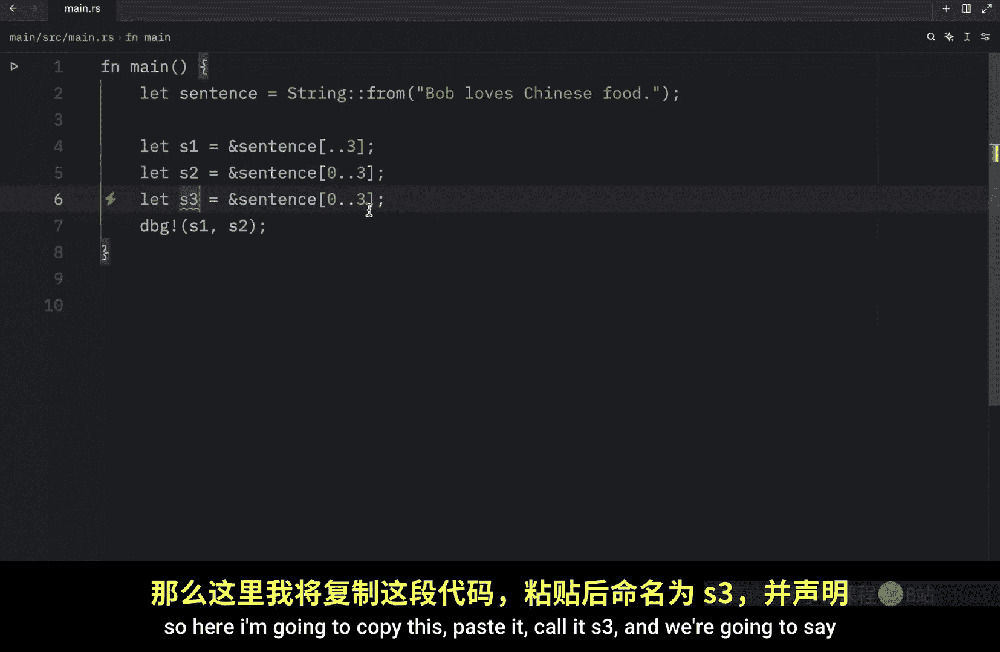
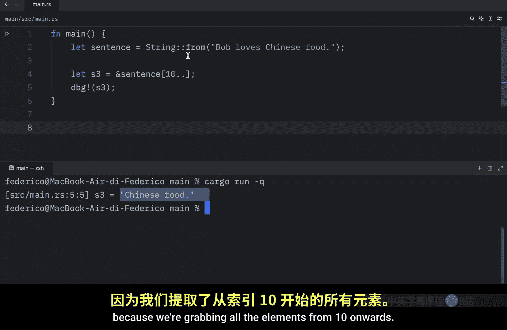
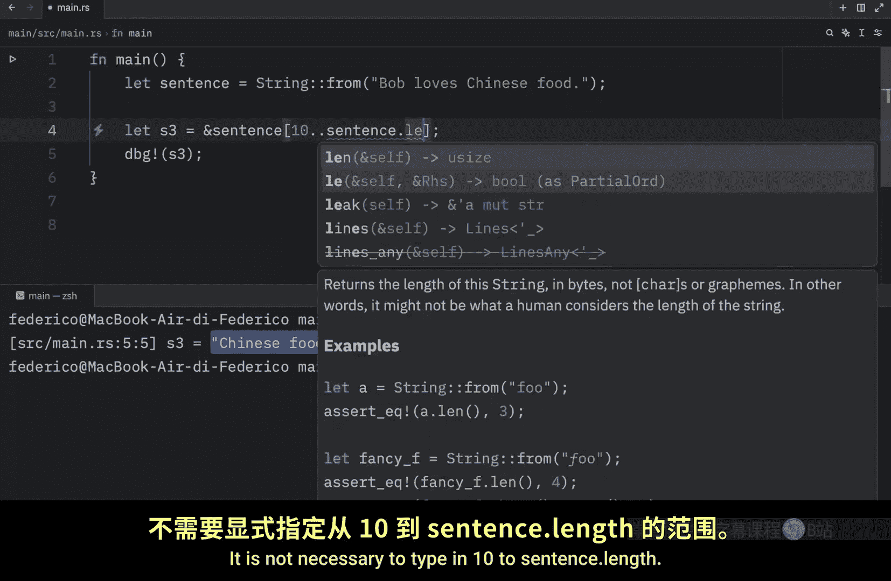
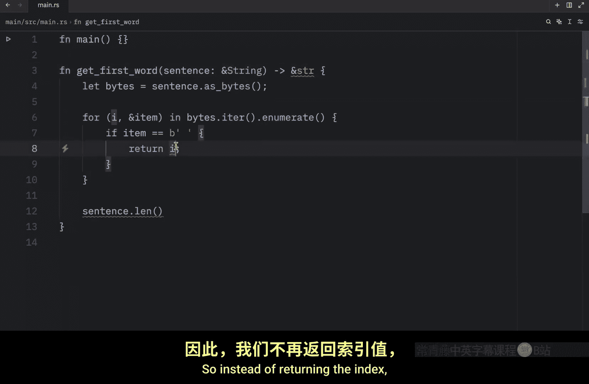
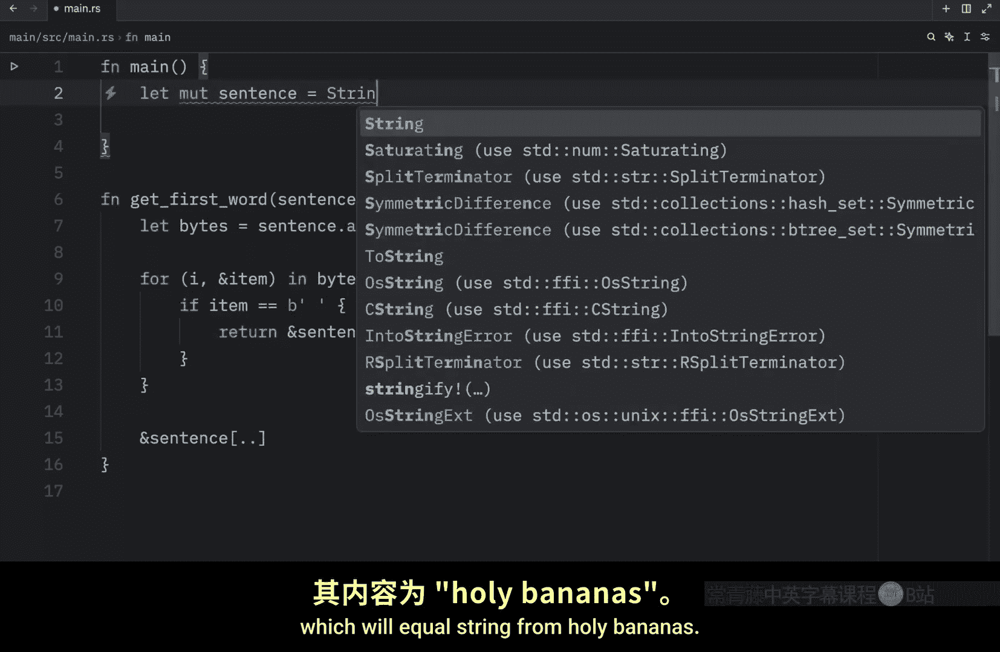
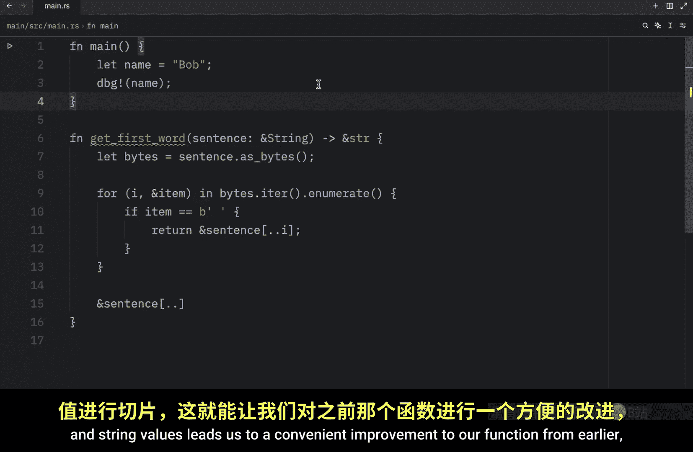
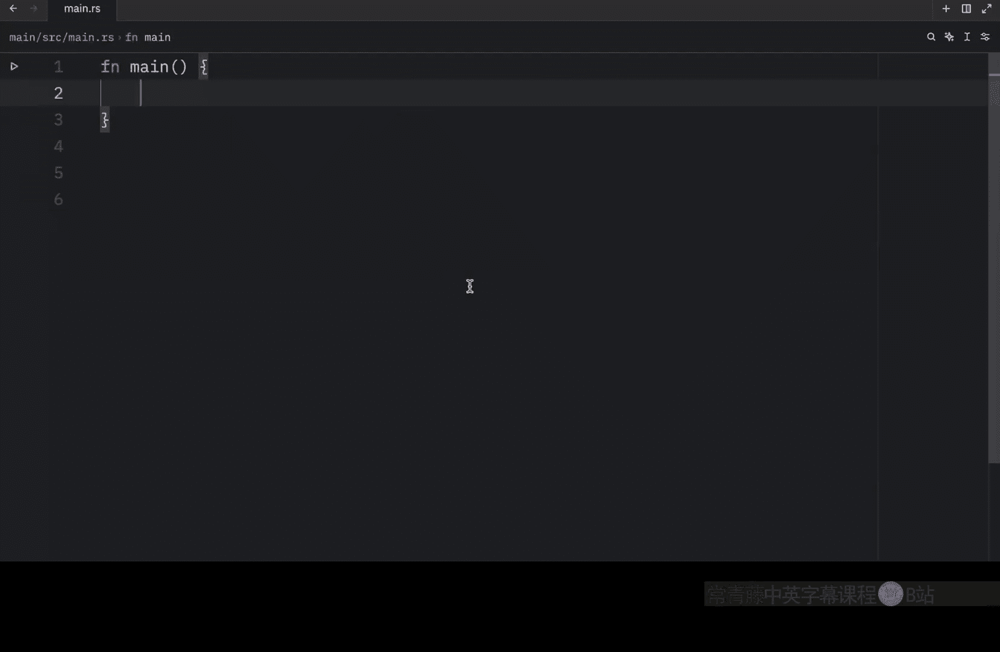
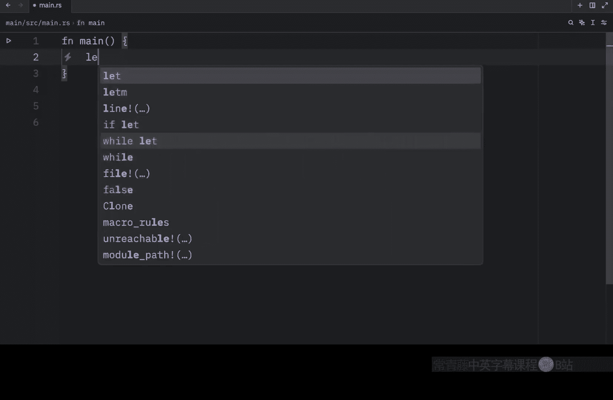
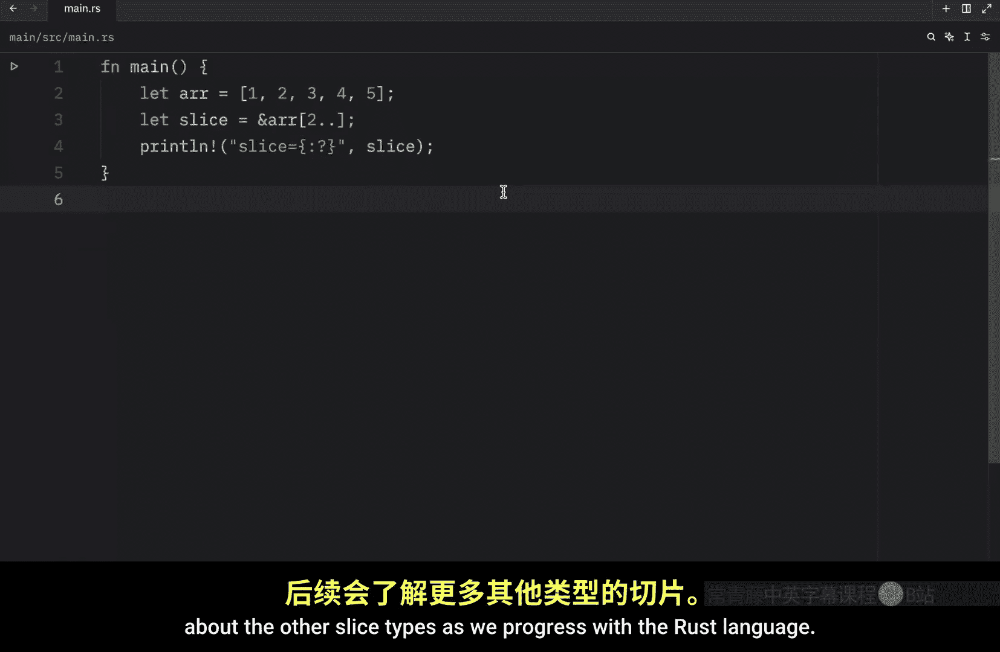

# Rustfully【中英⚡Rust 初学者教程（2025）｜Rust for beginners (2025)】 p33 P33 Rust中的&str真的很酷 -BV1eyAkzPEhj_p33-

In this video we will continue learning about string slices in rust In the previous video。

 we didn't really get to see a solid example of a string slice。

 so in this video we'll get started with some real examples So once again a string slice is a reference to a part of a string and looks like this and I'm not referring to this print line So to get started we'll create a sentence once again and that's going to equal a string from Bob loves Chinese food。

Now， imagine we want to refer to the name of Bob or to the word Chinese To do that we're going to type in let name equal。

A reference to our sentence。 And we're going to use this slice notation to grab the characters from the index of 0 to the index of 3。

 So here we can type in0 dot dot 3 and to grab Chinese。 We're going to type in let food equal。

Sentence from the index of 10 to 17 So this starts at the index of 10 and ends at the index of 17 Since 17 is not inclusive In reality we have 10111213。

14，15 and 16 but since 17 is not inclusive we have to specify 17。

 we do have some syntax that allows us to include 16 and we can do that by typing in dot dot equals and that will make 16 inclusive。

 but this is beyond the scope of today's video so we will not be discussing that For now we're just going to use the upper bound of 17 to make sure we grab Chinese Next we can debug and pass name and food and as soon as we run this。

 what we should get back is that name contains the string slice of Bob and that food contains the string slice of Chinese So what we did here was create a reference to a portion of a string and we were able to do that by using slice notation to select the portion。

Of the string and internally the slice data structure stores the starting position and the length of the slice。

 So in the case of let food， food would be a slice that contains a pointer to the byte at the index of 10 with a length value of7 Now before we move on it could be very useful to learn about the ranged syntax used for slicing for example。

 here we're going to use the same sentence and we're going to say that string1 equals the reference to sentence from the index of 02。

3 at any point， if you want to start a string slice from the index of0。

 you can use this notation over here it's not necessary to explicitly type that you want the slice to start from  zero this。

And this。Are equivalent and you can verify that by debugging S1 and S2。

 and when you run that in the console， you'll see that both of them will refer to the same string。

 You can also choose to reference a string from a start index。 So here I'm going to copy this。

 paste it called S3。 and we're going to say that from the index of 10 onwards we want to grab all of those characters。

 and we're going to debug S3。 and I'll remove the other two。

And what you're going to notice once we run this is that we're going to get the string slice of Chinese food back because we're grabbing all the elements from 10 onwards。

 it is not necessary to type in 10 to sentence dot length that is redundant。 And finally。

 if you want to return an entire string you can do so by omitting the start index and the end index。

 So all you have to do is add two dots and when you run this。

 what you're going to get back is the entire string slice。 Bob loves Chinese food。

 Also there's one incredibly important concept or detail that you should be aware of when you are creating a slice And that is that a slice must end on a valid by or else the program will panic。

 For example， if you have a name such as Brn and will' change that to name just make sure everything makes sense。

And then you try to debug the name， or it should be the reference of the name from the index of 0，2。

3。 this will not work。You'll notice that if we run our script that it's going to panic and that's because this special character contains two bytes so we can't slice that in half here we told the program that we want to end at the index of two so here we have0。

1 and2， but this is only halfway through that byte if we want this to actually work we need to insert four。

And then it will work just fine。 So you just need to make sure that you're careful when it comes to multibte characters。

 you cannot slice those like regular characters。 But now with all that being kept in mind。

 let's fix the function we created in the previous video and our previous function looked like this。

 So what we're going to do here is instead of returning U size。

 we're going to return a string slice and by doing that。

 we also need to make sure that the return types are correct。

 So instead of returning the index we can return a string slice。😊。

Of the sentence up until the index where we found that space。

Otherwise， we're just going to return the entire sentence as a slice。 And with that being done。

 we can create a mutable string。

Inside our main function， which will equal string。

From。Holy。Bananas。We can let the word equal。Get first word and then pass in a reference to our sentence。

 Now， we can debug the word and what we should get as an output。

Is the word holy and this is great because now we cannot type in sentence do clear before we use our word。

 we don't have to worry anymore about word being associated with something that has changed completely。

 If we want to use sentence do clear。 We need to make sure we do it in the correct order and this will save us from having to waste our time debugging  moving on。

 I wanted to talk about string literals as slices。 if we were to create a name and say that this name is Bob and we were to use that value in a debug statement。

 what you'll notice is that we're going to get bo as an output。

 although that was not the point I wanted to make。 what I wanted to show you was that the name here is of type string slice it's a slice pointing to that specific point of the binary and this is also why string literals are immutable。

 a string slice is just an immutable reference Now you might notice that its says static here。

 This is beyond the scope of the video do not worry about this just。

We will cover that in a future lesson what's important to OT is that we have a string slice now knowing that you can take slices of literals and string values leads us to a convenient improvement to our function from earlier which has to do with the type we are specifying right here instead of writing this。

 we can literally just insert the string slice type and what's nice about this is that we can create a sentence。

Which is a string from。Hello， Bob。And now we can type in let word equal。

 get first word and pass in a string slice， such as the sentence。From 0。2，5， or we can just say2，5。

 and that will work just fine。As you can see， this works as an argument。 Otherwise。

 we can pass in a reference directly， And finally， you can also use a string literal。

 such as let sentence to equal。 Bob says， hi， you can pass this in directly with no problems。

Which is very convenient because now our get first word function can accept both of these types Earl。

 if we were to type in ampaand string， this would not work。 It's expecting a reference of string。

 but we found a reference of string slice。 So that's just one of the reasons you would want to use a string slice here。

 It allows you to accept more types of strings。 Now with that being covered。

 I just want to mention one last thing。 And that is that there are other types of slices in rust string slices。

 as you might imagine， a specific two strings。 But there are also more general slice types。

 such as a slices。 So here we can create an array called array， and it will contain the values of 1。

2，3，4 and 5。😊。

Next， we can create a slice， which will be a reference to the array。

 and we will grab all of the values from the index of two onwards。

 Then we can debug this and say that the slice is equal to the slice。 Now。

 the next time that we run this， what we're going to get as an output is a slice of our array。

 And if you hover over our slice variable， you'll see that we will have this slice type as the type specified for this slice。

 and it works the same way as string slices do by storing a reference to the first element and length。

 but we're going to be learning more about the other slice types as we progress with the rust language。

 But for now that's really all you need to know regarding string slices。

