# Rustfully【中英⚡Rust 初学者教程（2025）｜Rust for beginners (2025)】 p34 P34 Rust中的结构体很棒 -BV1eyAkzPEhj_p34-

It's time that we coverstructs or structures in rust。

 Astruct is a custom data type that lets you package together and name multiple related values to make up a meaningful group。

 and that was taken directly from the rust dos。 Now。

structs are similar to tuples in that they both hold related values。

 butstructs can be considered to be more structured， because unlike with tuples。

 you'll be able to name each piece of data， making it easier to use it to define astruct。

 we have to use thestruct keyword。 and astruct's name should be relevant to the data it holds。 So。

 for example， we might have astruct called fruit， And inside the curly brackets。

 we define the names and the types of the pieces of data， which are also referred to as fields。😊。

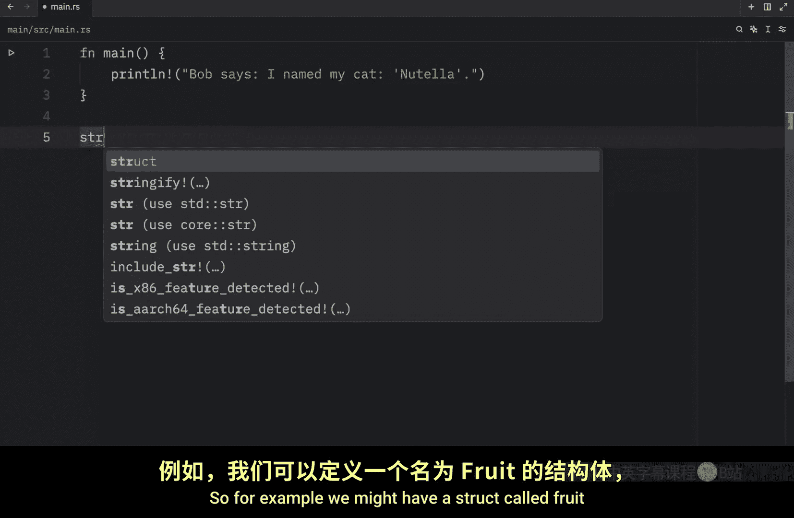

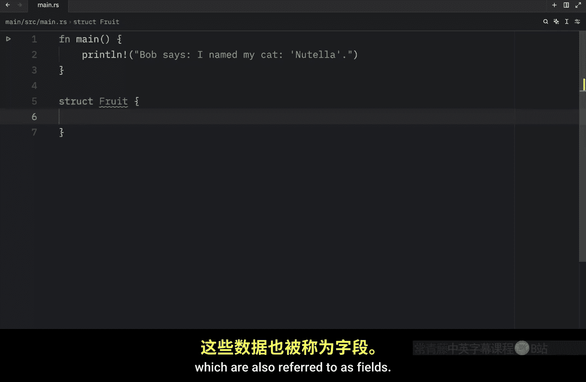

For example， this fruit might have a name， which will be of type string。

 otherwise it might have a collar。

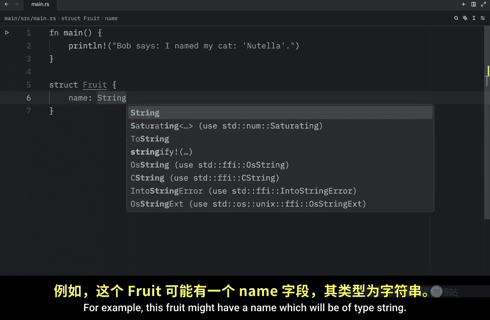

Of type string， we might want to know the grams regarding the fruits。 This could be of type integer。

And the price。 And since we care about the sense we're going to use a float here。 I mean。

 theoretically you could also specify grams to be of type float。

 but I'm going to pretend that we only care about whole grams here。

 So this is how we define astruct we use the keyword followed by a meaningful name that gives us an idea of the information that it contains。

 So next let's take a look at how we can use this struct and to use a struct。

 we first must create an instance of it by specifying values for each of the fields。 For example。

 we might have an apple and this is going to be our first instance of this fruit Then inside the curly brackets we need to refer to the name。

And create a string to fill that value。 So in this example。

 it's going to contain the string of Apple。 Then we need to specify a collar。

 which is also of type string。 and that's going to equal a string from green。

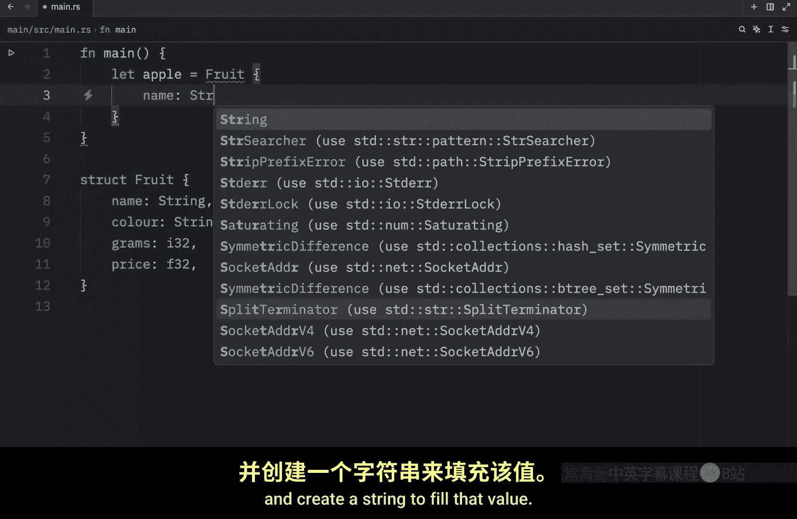

Then for the grams， we'll say that it's 100 gra and the price will be $5。5。

 So this apple is going to weigh 100 gra， and it's going to cost $5。5。 in a more serious program。

 you will probably name this to something such as price per kilo or you would give this the name of total price。

 But for now， I just want to show you how we can instantiate this object。

 And something else I want to mention is that you can specify the values for these fields in any order。

 It does not have to follow how we define it in thestruct。

 Thestruct definition is essentially just a template for the information it requires And what that means is that we can put price at the top。

 if that's what we want。 And that's perfectly legal。

 As long as we fill out all the information that's required by thestruct。 Now， with this instance。

 we can refer to these values using dot notation。 For example， if we want to grab the name。

 we can create a variable called name and say that's equal to Apple dot name and that will。

The value of name from Apple。 And we can also do that with grams。

 We can say grams is equal to Apple dot grams。 Then we can print that the name weighs grams grams。

 Now， when we open up the terminal and we run this。

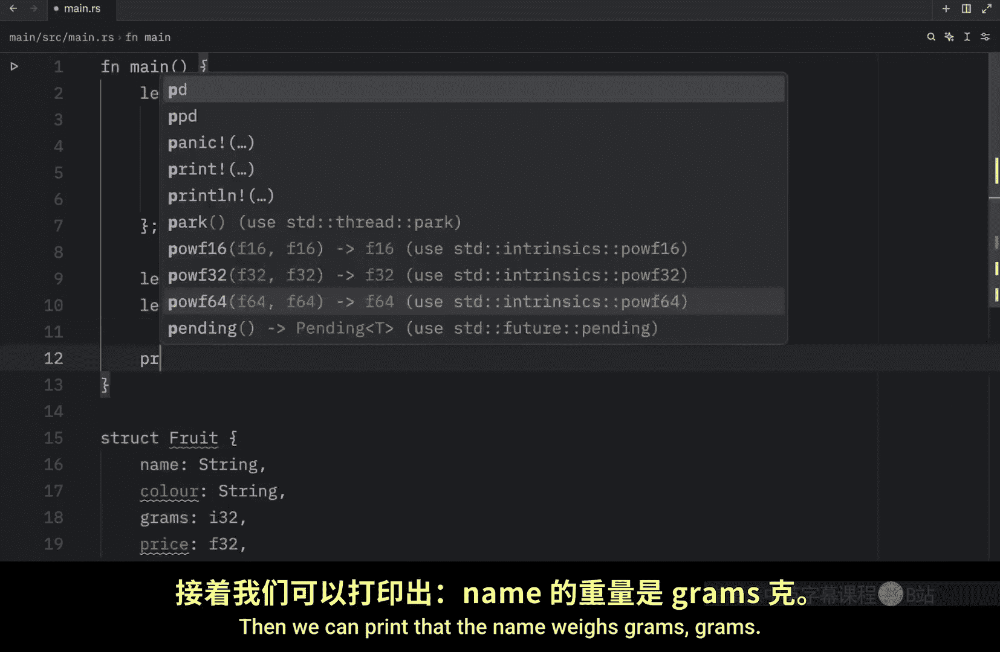

You'll see that the apple weigh 100 gra， even if I tried to spell weigh 100 gra。

So it should look like this Apple weighs 100 grams Also if we want to change the value of a field。

 we can do so by making our instance mutable so we can type in let mutable apple equal this fruit one thing you should note is that once we make our instance mutable everything becomes mutable we cannot specify specific fields to be mutable either the entirestruct is mutable or it isn't but with this we can do something such as Apple do grams equals。

200 and what I'm going to do next is debug Apple。 gras before we changed it。

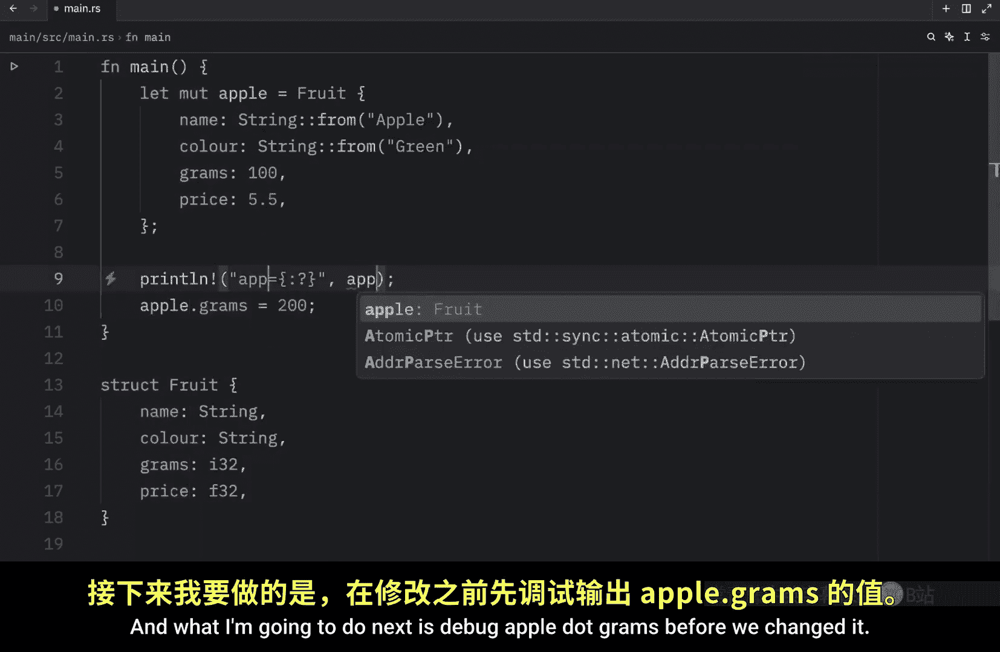

And after we changed it， just to show you that we actually changed it。

 So now when we run our program， you'll notice that Apple do grams was once 100 when we instantiated the object。

 and after we changed it， it became 200。 And you can do this with any one of the fields。 Also。

 you might consider this to be too much work for creating a fruit。 And in that case。

 we can also create functions that returnstructs to simplify the creation。 So for our next example。

 I'm going to remove all of that and remove the collar。 because we're not going to be using that。

 And instead under our struct， we're going to create a function called create fruit。

 which will take a name of type string slice and grams。😊，Of type I 32。

 and that's going to return a fruit。Now inside here， we want to return that fruit， obviously。

And we want the name to be associated with string from the name。

 And that's already one immediate benefit。 We were able to insert a string sliced without having to type or create an entire string using this syntax。

 Then we can do something such as grams and say that that's equal to the grams。 And finally。

 the price is going to equal0。02 times grams。😊。

As a float， because grams right now is an integer and the only way to multiply a float by an integer is to cast it to a float。

 So this simplifies the creation of our fruits by a lot。 And now to use this function。

 all we need to do is create an instance by creating a variable name and then using our create fruit function。

 So here well pass in orange and the grams。

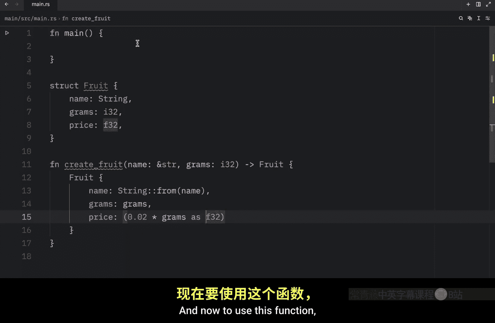

Are going to be 156。 Then we can use the print line statement。To print that G of placeholder costs。

 dollars placeholder formatted to two decimal places and none of that makes sense because I didn't insert the variables just yet。

 so next I'm going to specify orange dot gras， which will be inserted into the first placeholder。

 then orange dot name。

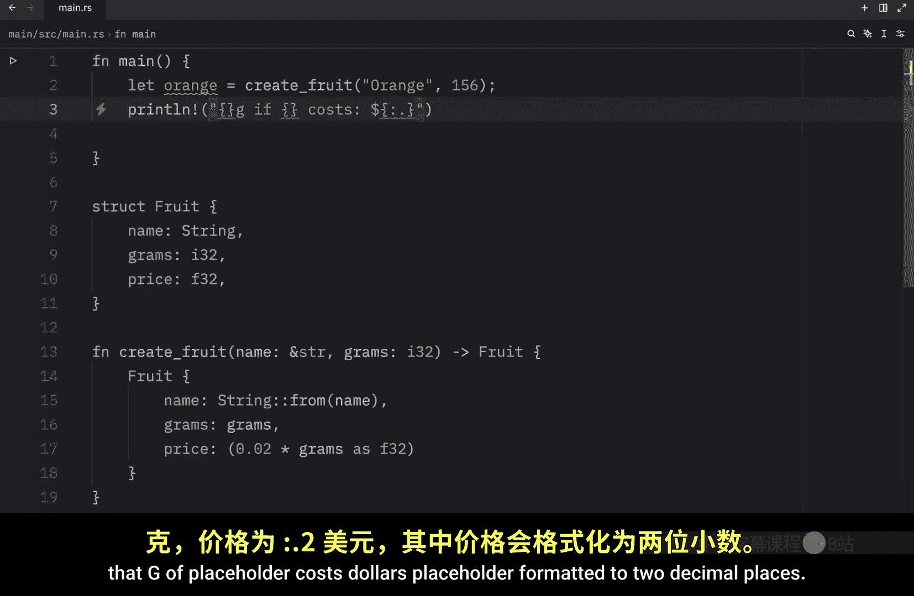

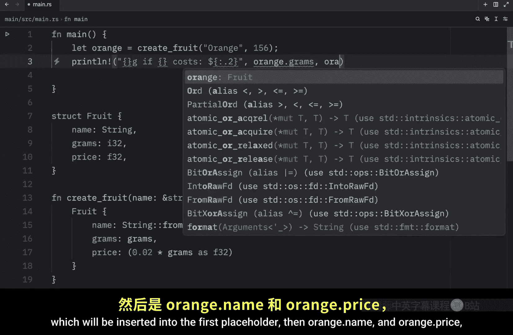

And orange dot price， which will respectfully be inserted in each one of these placeholders。

 Now all that's left for us to do is to run our script or run our program and what you should notice is that 156 grams of orange costs 312。

 We can change this to be 350。And now the next time we run this， we will get an updated value。

 So it was very easy to create a fruit using our fruit function。 Now。

 there's one last thing I want to mention before I conclude today's video。

 and that is that rust has a special feature called field in it shorthand syntax that helps us reduce redundant code in our strs。

 For example here we have a name which will be of type string this time， and we have the grams。

 which will still be of type integer。 Now， when we create a fruit。😊。

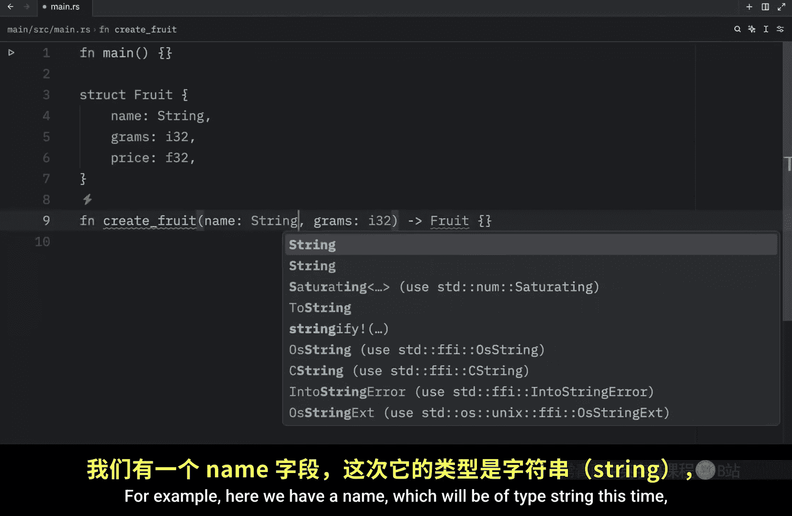

All we need to do is type in name equals name grams。Equals grams。It doesn't have to equal。

 it's actually supposed to be a colon， and the price equals 0。02 times grams as F2 or F32。

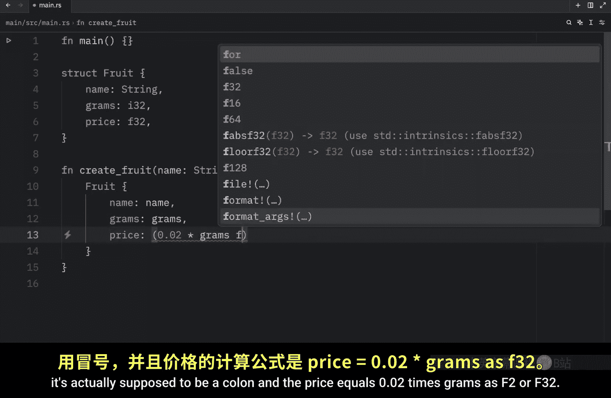

And that will work perfectly fine， but this is not the shorthand syntax I was talking about。

Because what you might have noticed is that name has the exact same name as the field of name and in that case we can exclude that completely。

 we can say name pen grams and Rus will know exactly what we're trying to do because the name we have here has the exact same name as the name we have in our fruit struct and name was probably the worst example I could have used I should have gone with grams as you can see grams has the exact same name as the one defined in our fruit struct so Rus will know that once we insert those grams into fruit that we are referring to this field over here。

 we are not required to type in name equals name or grams equals grams and that is much more convenient than repeating the same name for each one of them。

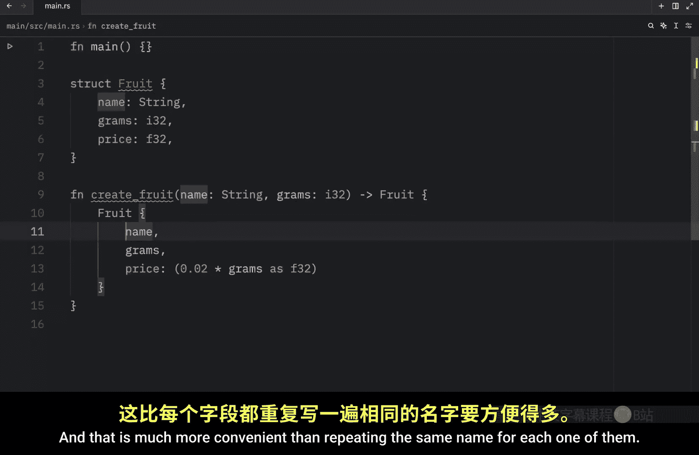