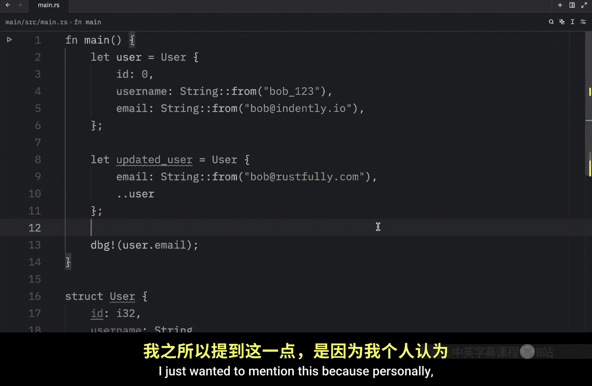

# Rustfully【中英⚡Rust 初学者教程（2025）｜Rust for beginners (2025)】 p35 P35 Rust中很酷的move语法 -BV1eyAkzPEhj_p35-

Previously we talked about how we could create a struct and then how we could create an instance from that struct by providing values for each field。

 but now I'm going to show you something else that can be quite useful and that's how we can create a new instance of a struct using values from an existing struct so for this example we're actually going to change up the struct from earlier to something called user and that's going to contain a user ID of type I32 a username of type string。

And an email address of type string so that's what our user is going to consist of next we're going to create our very first instance of this user so we will type in let user equal this user over here and for the fields we're going to give it the ID of zero followed by a username which will be a string from Bob。

1，2，3。 And then we just need to provide the email， which will equal a string。From。Bob。

At Indently dotIO。Next we're going to create another instance that uses a lot of the existing information from the previous instance。

 so to do so we'll type in let updated user equal。The following user and inside here we'll type in I is equal to user dot Id。

 then username。Is equal to user dot username And finally， the email is going to be something new。

 And here we're going to provide the email of Bob at rusttfully do co as you could see we had to use a lot of the information from the previous user when we were creating this updated user and this is far from ideal especially if we only wanted to change one field So what we're going to do instead is remove all of this since as you can see user ID matches the ID here and user do username matches the field of username We don't need to do this。

 We can remove that and directly under that we can use this syntax2 dots and the original user and this is going to tell rust to remove the remaining fields with the values from user and this part must come last we cannot put it in front of email for example this will not work and that's not because I have two defined even if I only had one there this would not work it must be the last。

Detail provided in this instance。 Otherwise everything else remains the same。

 If you have other fields， you can provide them in any order。 Now with this being done。

 it should contain the new information。 We can refer to updated user and type in user do email。

And when we run this， what we should get as an output is the updated user as you can see the new user now contains the email of bo@russtfully。

com Also it's important to note that thestruct update syntax uses the equals like an assignment because it moves the data all of these fields are being moved and because of that once we do this we can no longer use user as astruct because once again the fields were moved and personally I found this to be ultra- confusinging because in the docs it says that we can use user anymore but when I decided to try to use some of the data from our user I noticed that I could in fact to refer to things such as the ID and Rust would not complain about that even if we moved the data here as you can see if we were to run the script。

We can still use the original user so personally I think this was a very poor example provided by the Rubook。

 I had to ask around on my Discord server what was going on here because as you can see it's strange that the docs would state that we could no longer use user if we actually can。

 but the docs weren't wrong they were just poorly worded because in this example。

 some of the fields are going to remain valid， especially the ones that can implement the copy trait。

 but the other fields which have been moved will no longer work。 For example。

 if we want to use username this will not work， we can go down here and type in debug。

User do username and rust is going to complain that username was moved。

 and that's because we moved it using this syntax， but we can still use user do email because we did not touch that information we did not move that。

 we literally created a new string from scratch inside the updated user so that was not moved from the original struct。

 meaning we can still use that piece of information so just to keep it short and simple。

 the original struct is no longer valid as astruct。

 but some of the data might still be valid or in other words the data was partially moved。

 Now if we didn't move anything from our original user。

 we would still be able to use it as a properstruct but we're going to talk about all of this in much further detail in a future lesson I just wanted to mention this because personally I think that the rustbook worded this very poorly。

